# API Contract - Argus MVP (April 2026)

**Complete reference for all endpoints, flows, and data relationships.**

---

## 1. All Endpoints at a Glance

### 🔐 Authentication & Identity

| Method | Endpoint               | Purpose                                  | Response                                       |
| ------ | ---------------------- | ---------------------------------------- | ---------------------------------------------- |
| GET    | `/api/v1/auth/session` | Get current user + quota + flags         | UserResponse (id, email, quota, feature_flags) |
| POST   | `/api/v1/auth/sso`     | OAuth redirect (Google, Apple, Facebook) | {auth_url: "https://..."}                      |
| PATCH  | `/api/v1/auth/profile` | Update theme/lang preferences            | {theme, lang}                                  |
| POST   | `/api/v1/auth/logout`  | Clear session                            | 204 No Content                                 |

### 📊 Market Assets

| Method | Endpoint         | Purpose              | Response              |
| ------ | ---------------- | -------------------- | --------------------- |
| GET    | `/api/v1/assets` | Search valid symbols | [symbol, symbol, ...] |

### 📈 Strategies (CRUD)

| Method | Endpoint                  | Purpose                      | Response                         | Guards                        |
| ------ | ------------------------- | ---------------------------- | -------------------------------- | ----------------------------- |
| POST   | `/api/v1/strategies`      | Save new draft strategy      | {id, name}                       | None                          |
| GET    | `/api/v1/strategies`      | List user's draft strategies | {strategies: [...], next_cursor} | Cursor pagination             |
| GET    | `/api/v1/strategies/{id}` | Load strategy for editing    | Full Strategy object             | None                          |
| PUT    | `/api/v1/strategies/{id}` | Update draft strategy        | {id, name}                       | **403 if executed_at is set** |
| DELETE | `/api/v1/strategies/{id}` | Delete draft strategy        | 204 No Content                   | **403 if executed_at is set** |

### ⚡ Backtesting (Sync, <3s)

| Method | Endpoint                 | Purpose             | Response                             | Errors                                       |
| ------ | ------------------------ | ------------------- | ------------------------------------ | -------------------------------------------- |
| POST   | `/api/v1/backtests`      | Run backtest (sync) | BacktestResponse {id, results}       | 402 (quota), 422 (invalid), 429 (rate limit) |
| GET    | `/api/v1/backtests/{id}` | Get full results    | BacktestResponse + full_result JSONB | None                                         |

### 📋 History & Feedback

| Method | Endpoint           | Purpose                    | Response                          |
| ------ | ------------------ | -------------------------- | --------------------------------- |
| GET    | `/api/v1/history`  | List past backtests        | {simulations: [...], next_cursor} |
| POST   | `/api/v1/feedback` | Report bug/suggest feature | 201 Created                       |

### 🏥 Health & Dev

| Method | Endpoint                  | Purpose        | Response                | Auth Required              |
| ------ | ------------------------- | -------------- | ----------------------- | -------------------------- |
| GET    | `/api/v1/health`          | Service health | {status: "ok", version} | ❌ No                      |
| GET    | `/api/v1/_mocks/backtest` | Dev mock data  | Fake BacktestResponse   | ❌ No (feature flag gated) |

---

## 2. User Journey (Happy Path)

```
┌─────────────────────────────────────────────────────────────────────────┐
│                         DISCOVERY PHASE                                 │
├─────────────────────────────────────────────────────────────────────────┤
│ 1. User lands on app                                                    │
│ 2. User clicks "Sign Up with Google"                                    │
│    → POST /auth/sso {provider: "google"}                                │
│    → Redirect to Google OAuth                                           │
│    → Receive JWT in httpOnly cookie                                     │
└─────────────────────────────────────────────────────────────────────────┘
                                    ↓
┌─────────────────────────────────────────────────────────────────────────┐
│                         SESSION PHASE                                   │
├─────────────────────────────────────────────────────────────────────────┤
│ 3. App initializes                                                      │
│    → GET /auth/session                                                  │
│    → Returns: {id, email, quota: 50, remaining_quota: 50, flags}       │
│    → Frontend caches, displays quota                                    │
└─────────────────────────────────────────────────────────────────────────┘
                                    ↓
┌─────────────────────────────────────────────────────────────────────────┐
│                         BUILDER PHASE                                   │
├─────────────────────────────────────────────────────────────────────────┤
│ 4. User searches for asset                                              │
│    → GET /assets?search=BTC&timeframe=1h                                │
│    → Returns: ["BTC/USDT", "BTC/USD"]                                   │
│                                                                          │
│ 5. User creates strategy draft                                          │
│    → POST /strategies {name, symbol, timeframe, patterns, ...}         │
│    → Returns: {id: "uuid-123", name: "Golden Cross"}                   │
│                                                                          │
│ 6. User edits strategy (multiple times)                                │
│    → PUT /strategies/uuid-123 {...updated fields...}                   │
│    → Returns: {id, name} (updated)                                      │
└─────────────────────────────────────────────────────────────────────────┘
                                    ↓
┌─────────────────────────────────────────────────────────────────────────┐
│                         EXECUTION PHASE                                 │
├─────────────────────────────────────────────────────────────────────────┤
│ 7. User clicks "Run Backtest"                                           │
│    → POST /backtests {strategy_id: "uuid-123"}                         │
│    → (OR inline: {name, symbol, timeframe, patterns, ...})             │
│                                                                          │
│    REQUEST PROCESSING:                                                  │
│    → Validate strategy (422 if invalid)                                │
│    → Check quota (402 if 0)                                            │
│    → Check rate limit (429 if exceeded)                                │
│    → Run engine (<3 seconds)                                           │
│    → Save to DB                                                         │
│    → Decrement quota (50 → 49)                                         │
│    → Emit PostHog event                                                │
│                                                                          │
│    RESPONSE:                                                            │
│    → HTTP 200 + BacktestResponse                                       │
│    → Headers: X-RateLimit-Limit: 50, X-RateLimit-Remaining: 49        │
│    → Body: {id, config_snapshot, results}                              │
│      ├─ total_return_pct: 14.5                                         │
│      ├─ equity_curve: [100, 101.5, 100.2, ...]                        │
│      ├─ trades: [{...}, {...}] (first 5 only)                         │
│      ├─ pattern_breakdown: {gartley: 4, butterfly: 2}                 │
│      └─ reality_gap_metrics: {slippage: 1.2%, fees: 0.4%}             │
│                                                                          │
│ 8. Strategy becomes IMMUTABLE (executed_at timestamp set)              │
│    → Any attempt to PUT/DELETE now returns 403 Forbidden               │
└─────────────────────────────────────────────────────────────────────────┘
                                    ↓
┌─────────────────────────────────────────────────────────────────────────┐
│                         RESULTS PHASE                                   │
├─────────────────────────────────────────────────────────────────────────┤
│ 9. User views backtest results                                          │
│    → Equity curve chart rendered (100 → final value)                   │
│    → First 5 trades displayed in snippet                               │
│    → Pattern breakdown shown                                            │
│    → "View Full Trades" link available                                 │
│                                                                          │
│ 10. User clicks "View Full Trades"                                     │
│     → GET /backtests/uuid-456                                          │
│     → Returns: Full BacktestResponse with full_result (all trades)    │
└─────────────────────────────────────────────────────────────────────────┘
                                    ↓
┌─────────────────────────────────────────────────────────────────────────┐
│                         HISTORY PHASE                                   │
├─────────────────────────────────────────────────────────────────────────┤
│ 11. User navigates to History page                                      │
│     → GET /history?limit=10                                            │
│     → Returns: {simulations: [...], next_cursor: "base64-..."}        │
│                                                                          │
│     Simulations list shows:                                             │
│     ├─ id: uuid                                                         │
│     ├─ symbol: "BTC/USDT"                                               │
│     ├─ total_return_pct: 14.5                                           │
│     ├─ sparkline: [100, 101, 100.5, ...] (15 points)                  │
│     └─ created_at: "2026-04-07T13:15:00Z"                              │
│                                                                          │
│ 12. User clicks a simulation from history                               │
│     → GET /backtests/uuid-456 (full details)                           │
│     → All trades, full equity curve displayed                           │
│                                                                          │
│ 13. User clicks "Load Strategy"                                        │
│     → GET /strategies/uuid-123 (if draft still exists)                 │
│     → Returns strategy for editing                                      │
│     → User can create new backtest from this base                      │
└─────────────────────────────────────────────────────────────────────────┘
```

---

## 3. Authentication & Session Flow

```
┌─────────────────────────────────┐
│      Browser/PWA                │
└──────────────┬──────────────────┘
               │
               │ 1. POST /auth/sso {provider, redirect_to}
               ↓
┌──────────────────────────────────┐
│      FastAPI Backend             │
│      /auth/sso endpoint          │
└──────────────┬───────────────────┘
               │
               │ 2. Generate Supabase auth URL
               ↓
┌──────────────────────────────────┐
│      Supabase OAuth              │
│      (Google/Apple/Facebook)     │
└──────────────┬───────────────────┘
               │
               │ 3. User authenticates, grants permission
               ↓
┌──────────────────────────────────┐
│      Browser                     │
│      Receives JWT in httpOnly    │
│      cookie (from Supabase)      │
└──────────────┬───────────────────┘
               │
               │ 4. GET /auth/session (JWT auto-sent in cookie)
               ↓
┌──────────────────────────────────┐
│      FastAPI Backend             │
│      /auth/session endpoint      │
│      Reads JWT from cookie       │
└──────────────┬───────────────────┘
               │
               │ 5. Return UserResponse
               │    {id, email, quota: 50, remaining_quota: 50, flags}
               ↓
┌──────────────────────────────────┐
│      Browser                     │
│      Caches user state           │
│      Shows quota: 50/month       │
└──────────────────────────────────┘

NOTE: All subsequent requests automatically include JWT in httpOnly cookie.
      No manual header needed (browser handles it).

LOGOUT FLOW:
  1. User clicks logout
  2. POST /auth/logout (JWT sent automatically)
  3. Backend clears session in Supabase
  4. Browser clears httpOnly cookie
  5. Redirect to login page
```

---

## 4. Strategy Lifecycle (Immutability)

```
┌──────────────────────┐
│  Draft Strategy      │  ← Created via POST /strategies
│  executed_at: NULL   │
└──────────┬───────────┘
           │
           │ Can edit repeatedly
           │ PUT /strategies/{id} ← Returns updated {id, name}
           │
           ↓
┌──────────────────────┐
│  Draft (Updated)     │
│  executed_at: NULL   │
└──────────┬───────────┘
           │
           │ User reviews and clicks "Run Backtest"
           │ POST /backtests {strategy_id: "..."}
           │
           ↓
┌──────────────────────┐          ┌─────────────────────────┐
│  Backtest Runs       │ Engine   │ Returns BacktestResult  │
│  <3 seconds          │←─────────┤ {return, trades, etc}   │
└──────────┬───────────┘          └─────────────────────────┘
           │
           │ API saves to DB, sets executed_at = NOW()
           │
           ↓
┌──────────────────────┐
│  FINALIZED Strategy  │
│  executed_at: "2026" │
│  (IMMUTABLE)         │
└──────────┬───────────┘
           │
           │ Attempt to edit?
           │ PUT /strategies/{id} ← 403 Forbidden
           │
           │ Attempt to delete?
           │ DELETE /strategies/{id} ← 403 Forbidden
           │
           │ Can still view?
           │ GET /strategies/{id} ← YES, returns read-only
           │
           ↓
┌──────────────────────┐
│  Simulation Record   │
│  strategy_id: ".."   │
│  config_snapshot: {..}   Store exact config at execution time
│  results: {...}      │ (if strategy base changes, snapshot remains)
└──────────────────────┘
```

---

## 5. Backtest Execution Flow (Sync, <3s)

```
CLIENT SENDS REQUEST:
┌────────────────────────────────────────────┐
│ POST /api/v1/backtests                     │
│ {                                          │
│   "strategy_id": "uuid-123"                │
│   // OR inline full StrategyCreate object  │
│ }                                          │
│ Headers: Authorization: Bearer <JWT>      │
└────────────────────┬───────────────────────┘
                     │
                     ↓
BACKEND VALIDATION:
┌────────────────────────────────────────────┐
│ 1. Parse + validate request                │
│    └─ If invalid: return 422 error         │
│                                            │
│ 2. Check user quota                        │
│    └─ If 0 remaining: return 402 error     │
│                                            │
│ 3. Check rate limit (per minute)           │
│    └─ If exceeded: return 429 error        │
│       (include Retry-After header)         │
│                                            │
│ 4. Freeze strategy config                  │
│    └─ Create immutable snapshot            │
└────────────────────┬───────────────────────┘
                     │
                     ↓
ENGINE EXECUTION:
┌────────────────────────────────────────────┐
│ 1. Load market data (Alpaca)               │
│ 2. Generate entry/exit signals             │
│    ├─ Pattern analysis (harmonics, etc)    │
│    ├─ Indicator confluence (RSI, EMA)      │
│    └─ Rules-based logic (XOR/AND)          │
│                                            │
│ 3. Vectorized backtest (Numba JIT)         │
│    ├─ Simulate broker orders               │
│    ├─ Apply slippage + fees                │
│    ├─ Track equity curve                   │
│    ├─ Record every trade                   │
│    └─ Calculate metrics                    │
│                                            │
│ ⏱️  Total time: < 3 seconds                 │
└────────────────────┬───────────────────────┘
                     │
                     ↓ BacktestResult
RESPONSE GENERATION:
┌────────────────────────────────────────────┐
│ BacktestResponse {                         │
│   "id": "sim-uuid-456",                    │
│   "config_snapshot": {frozen strategy},    │
│   "results": {                             │
│     "total_return_pct": 14.5,              │
│     "win_rate": 0.62,                      │
│     "max_drawdown_pct": 0.05,              │
│     "equity_curve": [100, 101.5, ...],     │
│     "trades": [{first 5 trades}],          │
│     "pattern_breakdown": {...},            │
│     "reality_gap_metrics": {               │
│       "slippage_impact": 1.2%,             │
│       "fee_impact": 0.4%                   │
│     }                                      │
│   }                                        │
│ }                                          │
└────────────────────┬───────────────────────┘
                     │
                     ↓
PARALLEL DB & TRACKING:
┌──────────────────────────────────────────────────────────────┐
│ 1. INSERT into simulations                                  │
│    ├─ id, user_id, strategy_id                              │
│    ├─ config_snapshot (full strategy clone)                 │
│    ├─ summary (sparkline + basic metrics for history list) │
│    ├─ full_result (all trades + complete equity curve)      │
│    └─ created_at timestamp                                  │
│                                                              │
│ 2. UPDATE profiles                                          │
│    └─ SET remaining_quota = remaining_quota - 1            │
│        (50 → 49)                                            │
│                                                              │
│ 3. Mark strategy as executed (if POST backtest)            │
│    └─ SET executed_at = NOW()                              │
│        (strategy is now immutable)                          │
│                                                              │
│ 4. Emit PostHog event                                       │
│    └─ backtest_run {symbol, patterns, return, duration}   │
│       (skipped if is_admin = true)                          │
│                                                              │
│ ⏱️  All happens in parallel < 100ms                          │
└──────────────────────────────────────────────────────────────┘
                     │
                     ↓
RESPONSE SENT TO CLIENT:
┌────────────────────────────────────────────┐
│ HTTP 200 OK                                │
│                                            │
│ Headers:                                   │
│   X-RateLimit-Limit: 50                    │
│   X-RateLimit-Remaining: 49 ← NEW          │
│   X-RateLimit-Reset: 1712520000 (Unix ts)  │
│   X-Correlation-ID: <request_id>           │
│                                            │
│ Body: BacktestResponse (JSON)              │
└────────────────────────────────────────────┘
```

---

## 6. Database Schema

```
PROFILES TABLE
┌──────────────────────────────────────────┐
│ id (UUID, PK)                            │
│ email (string, unique)                   │
│ subscription_tier (enum: free/pro/max)   │
│ is_admin (boolean, default: false)       │ ← Founder bypass
│ theme (enum: light/dark)                 │
│ lang (enum: en/es/...)                   │
│ backtest_quota (integer: 50 for free)    │
│ remaining_quota (integer, current)       │
│ last_quota_reset (timestamp)             │
│ feature_flags (JSONB)                    │
│   → {multi_asset_beta: false, ...}       │
│ created_at (timestamp)                   │
│ updated_at (timestamp)                   │
└──────────────────────────────────────────┘

STRATEGIES TABLE
┌──────────────────────────────────────────┐
│ id (UUID, PK)                            │
│ user_id (UUID, FK → profiles)            │
│ name (string: "Golden Cross DR")         │
│ symbol (string: "BTC/USDT")              │
│ timeframe (string: "1h", "15m")          │
│ entry_criteria (JSONB array)             │
│ exit_criteria (JSONB object)             │
│ indicators_config (JSONB)                │
│ patterns (text array)                    │
│   → ["gartley", "butterfly", ...]        │
│ executed_at (timestamp, nullable)        │
│   → NULL if draft                        │
│   → Set to NOW() when backtest runs      │
│ created_at (timestamp)                   │
│ updated_at (timestamp)                   │
└──────────────────────────────────────────┘

SIMULATIONS TABLE
┌──────────────────────────────────────────┐
│ id (UUID, PK)                            │
│ user_id (UUID, FK → profiles)            │
│ strategy_id (UUID, FK → strategies)      │
│ config_snapshot (JSONB)                  │
│   → Full frozen StrategyConfig clone     │
│   → If strategy changes later, this      │
│     snapshot remains unchanged           │
│ summary (JSONB)                          │
│   → {total_return, win_rate, drawdown,   │
│     sparkline: [15 points], ...}         │
│ reality_gap_metrics (JSONB)              │
│   → {slippage_impact, fee_impact}        │
│ full_result (JSONB, <10MB limit)         │
│   → {all trades, full equity curve}      │
│ created_at (timestamp)                   │
└──────────────────────────────────────────┘

FEATURES TABLE
┌──────────────────────────────────────────┐
│ id (string, PK: "multi_asset_beta")      │
│ is_enabled (boolean)                     │
│ created_at (timestamp)                   │
│ updated_at (timestamp)                   │
└──────────────────────────────────────────┘

RLS POLICIES:
  - Users see only their own profiles/strategies/simulations
  - is_admin = true → bypasses RLS (sees all rows)
  - Public can access GET /health + /_mocks (no auth)
```

---

## 7. Rate Limiting (4 Tiers)

```
TIER 1: BACKTEST QUOTA (per calendar month)
┌───────────────────────────────────────────────────────────┐
│ Free:  50 backtests/month                                 │
│ Pro:   500 backtests/month                                │
│ Max:   unlimited                                          │
│ Admin: unlimited (is_admin = true bypasses)               │
│                                                            │
│ Error if exceeded: 402 Quota Exceeded                     │
│ {error: "QUOTA_EXCEEDED", message: "...", ...}            │
│                                                            │
│ Reset: Supabase Edge Function (monthly cron, UTC)         │
└───────────────────────────────────────────────────────────┘

TIER 2: API RATE LIMITS (per user, per minute)
┌───────────────────────────────────────────────────────────┐
│ GET /assets:                  100 req/min                  │
│ POST/PUT /strategies:         30 req/min                   │
│ GET /strategies:              100 req/min                  │
│ GET /history:                 100 req/min                  │
│ GET /backtests/{id}:          100 req/min                  │
│ POST /feedback:               10 req/min                   │
│                                                            │
│ Error if exceeded: 429 Too Many Requests                  │
│ {error: "RATE_LIMIT", message: "...", ...}                │
│                                                            │
│ Response headers:                                          │
│   X-RateLimit-Limit: 100                                   │
│   X-RateLimit-Remaining: 87                                │
│   X-RateLimit-Reset: 1712520060 (Unix timestamp)          │
│   Retry-After: 5 (seconds to wait)                         │
│                                                            │
│ Bypass: is_admin = true                                   │
└───────────────────────────────────────────────────────────┘

TIER 3: AUTH RATE LIMITS (per IP address, per minute)
┌───────────────────────────────────────────────────────────┐
│ POST /auth/login:             5 req/min  (brute force)    │
│ POST /auth/sso:               20 req/min (OAuth spam)     │
│                                                            │
│ Error if exceeded: 429 Too Many Requests                  │
│                                                            │
│ Bypass: N/A (IP-based, not user-based)                    │
└───────────────────────────────────────────────────────────┘

TIER 4: ECOSYSTEM DDoS (per user, per hour)
┌───────────────────────────────────────────────────────────┐
│ All endpoints combined:       1000 req/hour                │
│                                                            │
│ Error if exceeded: 429 Too Many Requests                  │
│                                                            │
│ Bypass: is_admin = true                                   │
└───────────────────────────────────────────────────────────┘

HEADERS ON EVERY RESPONSE:
  X-RateLimit-Limit:     N (hard limit)
  X-RateLimit-Remaining: M (requests left in window)
  X-RateLimit-Reset:     1712520060 (Unix timestamp when limit resets)
  Retry-After:           5 (if 429, seconds to wait before retry)
```

---

## 8. Error Responses (Unified Format)

```
ALL ERRORS use the same format:

{
  "error": "ERROR_CODE",
  "message": "Human-readable message",
  "details": {
    "...context-specific fields..."
  }
}

EXAMPLES:

402 QUOTA_EXCEEDED
{
  "error": "QUOTA_EXCEEDED",
  "message": "You have 0 backtests remaining this month.",
  "details": {
    "next_reset": "2026-05-01T00:00:00Z",
    "tier": "free"
  }
}

422 INVALID_STRATEGY
{
  "error": "INVALID_STRATEGY",
  "message": "Invalid entry criteria",
  "details": {
    "field": "entry_criteria",
    "issue": "period must be between 2 and 200",
    "value": 300
  }
}

429 RATE_LIMIT
{
  "error": "RATE_LIMIT",
  "message": "Too many requests. Please try again in 5 seconds.",
  "details": {
    "limit": 100,
    "window": "minute",
    "retry_after": 5
  }
}

403 FEATURE_DISABLED
{
  "error": "FEATURE_DISABLED",
  "message": "Multi-asset backtesting is not enabled for your tier.",
  "details": {
    "feature": "multi_asset_beta",
    "available_in": "pro_tier"
  }
}

403 STRATEGY_IMMUTABLE
{
  "error": "STRATEGY_IMMUTABLE",
  "message": "Cannot edit strategy after execution.",
  "details": {
    "executed_at": "2026-04-07T10:00:00Z",
    "strategy_id": "uuid-123"
  }
}

409 IDENTITY_CONFLICT
{
  "error": "IDENTITY_CONFLICT",
  "message": "Email already linked to another account.",
  "details": {
    "existing_account": "uuid-999"
  }
}
```

---

## 9. Data Flow: Request → Processing → Response

```
CLIENT INITIATES BACKTEST:
1. User clicks "Run Backtest" button
2. Frontend shows spinner/loading state
3. Frontend sends:

   POST /api/v1/backtests
   Authorization: Bearer <JWT_TOKEN>
   Content-Type: application/json

   {
     "strategy_id": "uuid-123"
     // OR full inline object if ad-hoc:
     // {
     //   "name": "Quick Test",
     //   "symbol": "BTC/USDT",
     //   "timeframe": "1h",
     //   "entry_criteria": [...],
     //   "exit_criteria": {...},
     //   "patterns": ["gartley"]
     // }
   }

━━━━━━━━━━━━━━━━━━━━━━━━━━━━━━━━━━━━━━━━━━━━━━━━━━━━━━━━━━━━━━━━

BACKEND PROCESSES:

A. VALIDATION
   ✓ Strategy exists?
   ✓ User owns strategy?
   ✓ Symbol valid?
   ✓ Timeframe >= 15m?
   ✗ Invalid → return 422

B. AUTHORIZATION
   ✓ User authenticated?
   ✗ No → return 401

C. QUOTA CHECK
   ✓ remaining_quota > 0?
   ✗ No → return 402 (include next_reset date)

D. RATE LIMIT CHECK
   ✓ Less than 100 requests this minute?
   ✗ No → return 429 (include Retry-After)

E. FREEZE CONFIG
   → Create immutable snapshot of strategy

F. RUN ENGINE
   → Load market data
   → Generate signals
   → Vectorized backtest
   → Calculate metrics
   ⏱️  < 3 seconds

G. PARALLEL OPERATIONS
   → INSERT simulation record
      {id, user_id, strategy_id, config_snapshot, summary, full_result}

   → UPDATE profile quota
      remaining_quota: 50 → 49

   → UPDATE strategy
      executed_at: NULL → NOW() (makes immutable)

   → EMIT PostHog event
      {user_id, symbol, patterns, return%, duration_ms}
      (skipped if is_admin=true)

━━━━━━━━━━━━━━━━━━━━━━━━━━━━━━━━━━━━━━━━━━━━━━━━━━━━━━━━━━━━━━━━

HTTP 200 RESPONSE:

Headers:
  X-RateLimit-Limit: 50
  X-RateLimit-Remaining: 49 ← UPDATED
  X-RateLimit-Reset: 1712520000
  X-Correlation-ID: req-abc123
  Content-Type: application/json

Body (JSON):
{
  "id": "sim-uuid-456",
  "config_snapshot": {
    "name": "Golden Cross",
    "symbol": "BTC/USDT",
    "timeframe": "1h",
    "patterns": ["gartley"],
    "entry_criteria": [...],
    "exit_criteria": {...}
  },
  "results": {
    "total_return_pct": 14.5,
    "win_rate": 0.62,
    "max_drawdown_pct": 0.05,
    "sharpe_ratio": 1.2,
    "equity_curve": [
      100,       ← starts here
      101.5,
      100.2,
      102.8,
      ...
      114.5      ← ends here (+14.5%)
    ],
    "trades": [
      {
        "entry_time": "2024-01-15T10:00:00Z",
        "entry_price": 65000,
        "exit_time": "2024-01-15T14:00:00Z",
        "exit_price": 67000,
        "pnl_pct": 3.08
      },
      { ... } × 4 more ← total 5 trades (snippet)
    ],
    "pattern_breakdown": {
      "gartley": 4,
      "butterfly": 0
    },
    "reality_gap_metrics": {
      "slippage_impact_pct": 1.2,
      "fee_impact_pct": 0.4
    }
  }
}

━━━━━━━━━━━━━━━━━━━━━━━━━━━━━━━━━━━━━━━━━━━━━━━━━━━━━━━━━━━━━━━━

FRONTEND HANDLES RESPONSE:

1. Parse BacktestResponse
2. Plot equity curve (100 → 114.5)
3. Display metrics:
   - Total Return: +14.5%
   - Win Rate: 62%
   - Max Drawdown: -5%
4. Show first 5 trades in table
5. Display pattern breakdown
6. Show slippage/fee impact
7. Hide spinner/loading state
8. Enable "View Full Trades" button
9. Update quota display (50 → 49)
```

---

## 10. Cursor Pagination Pattern

```
PAGE 1: Get first batch

  Client: GET /api/v1/history?limit=10

  Backend:
    - Fetch 11 rows (1 extra to detect if more exist)
    - Order by created_at DESC
    - Return first 10
    - Encode cursor = base64(created_at + id of row 10)

  Response:
  {
    "simulations": [
      {id: "sim-1", symbol: "BTC", return: 14.5, sparkline: [...], created_at: "2026-04-07T..."},
      {id: "sim-2", symbol: "ETH", return: 8.2, sparkline: [...], created_at: "2026-04-06T..."},
      ... 10 items total ...
    ],
    "next_cursor": "WzE3MTIzNDU2MDApIiwiYWUtZGQzYiJd"  ← Base64 encoded
  }

━━━━━━━━━━━━━━━━━━━━━━━━━━━━━━━━━━━━━━━━━━━━━━━━━━━━━━━━━━━━

PAGE 2: Get next batch

  Client: GET /api/v1/history?limit=10&cursor=WzE3MTIzNDU2MDApIiwiYWUtZGQzYiJd

  Backend:
    - Decode cursor → (created_at, id)
    - Fetch rows WHERE (created_at, id) < (decoded values)
    - Fetch 11 rows (1 extra)
    - Order by created_at DESC
    - Return first 10
    - Encode new cursor from row 10

  Response:
  {
    "simulations": [
      ... 10 more items (rows 11-20) ...
    ],
    "next_cursor": "WzE3MTIzNDU1NDApIiwiZWUtMGZmMCJd"
  }

━━━━━━━━━━━━━━━━━━━━━━━━━━━━━━━━━━━━━━━━━━━━━━━━━━━━━━━━━━━━

PAGE 3 (LAST): Last batch

  Client: GET /api/v1/history?limit=10&cursor=WzE3MTIzNDU1NDApIiwiZWUtMGZmMCJd

  Backend:
    - Decode cursor → (created_at, id)
    - Fetch rows WHERE (created_at, id) < (decoded values)
    - Only 5 rows returned (fewer than limit=10)
    - No encode cursor (null)

  Response:
  {
    "simulations": [
      ... 5 final items (rows 21-25) ...
    ],
    "next_cursor": null  ← No more pages
  }

BENEFITS:
✓ No OFFSET (no N+1 problem as data grows)
✓ Consistent results even if data inserted/deleted mid-pagination
✓ Opaque cursor hides implementation details
```

---

## 11. Feature Flag Guard (403 Decision Tree)

```
User requests multi-asset backtest:
POST /api/v1/backtests {symbol: ["BTC/USDT", "ETH/USDT"], ...}

┌─ STEP 1: Check if user is admin
│  │
│  ├─ is_admin = true?
│  │  └─→ ✅ SKIP flag check, allow everything
│  │
│  └─ is_admin = false?
│     └─→ Continue to STEP 2

├─ STEP 2: Check if feature is enabled
│  │
│  ├─ feature_flags.multi_asset_beta = true?
│  │  └─→ ✅ Continue
│  │
│  └─ feature_flags.multi_asset_beta = false?
│     └─→ ❌ Return 403 Forbidden

403 RESPONSE:
{
  "error": "FEATURE_DISABLED",
  "message": "Multi-asset backtesting is not enabled for your tier.",
  "details": {
    "feature": "multi_asset_beta",
    "available_in": "pro_tier"
  }
}
```

---

## 12. Backend Build Dependency Order

```
DAY 1: DATABASE
┌─────────────────────────────────────────┐
│ • Create Supabase migrations            │
│   - profiles (with is_admin column)     │
│   - strategies                          │
│   - simulations                         │
│   - features                            │
│ • Set up RLS policies                   │
│   - Users see only own data             │
│   - Admin exception (is_admin=true)     │
│ • Create quota reset cron (monthly)     │
└─────────────────────────────────────────┘

DAY 2: AUTHENTICATION
┌─────────────────────────────────────────┐
│ ✓ GET /auth/session                     │
│   (returns user + quota + flags)        │
│ ✓ POST /auth/sso                        │
│   (Supabase OAuth redirect)             │
│ ✓ POST /auth/logout                    │
│   (revoke session)                      │
│ ✓ PATCH /auth/profile                   │
│   (update theme/lang)                   │
└─────────────────────────────────────────┘

DAY 3: MARKET DATA
┌─────────────────────────────────────────┐
│ ✓ GET /assets                           │
│   (Alpaca symbol validation)            │
└─────────────────────────────────────────┘

DAY 4: STRATEGY CRUD
┌─────────────────────────────────────────┐
│ ✓ POST /strategies (create draft)       │
│ ✓ GET /strategies (list pagination)     │
│ ✓ GET /strategies/{id} (load)           │
│ ✓ PUT /strategies/{id} (update)         │
│ ✓ DELETE /strategies/{id} (delete)      │
│   (All with immutability guard)         │
└─────────────────────────────────────────┘

DAY 5: BACKTEST CORE
┌─────────────────────────────────────────┐
│ ✓ POST /backtests (validate → engine    │
│   → save → quota decrement)             │
│ ✓ GET /backtests/{id} (full results)    │
│ ✓ Integrate PostHog tracking            │
└─────────────────────────────────────────┘

DAY 6: HISTORY & EXTRAS
┌─────────────────────────────────────────┐
│ ✓ GET /history (pagination)             │
│ ✓ POST /feedback (insert)               │
│ ✓ GET /health (service status)          │
│ ✓ GET /_mocks/backtest (dev only)       │
└─────────────────────────────────────────┘
```

---

## 13. Sparkline Definition

```
Sparkline: Downsampled equity curve for history list preview

Definition:
  - Exactly 15 portfolio-value points
  - Evenly space across full equity curve
  - No min/max bands (just the values)
  - Starts at 100, ends at final portfolio value

Example equity_curve: [100, 100.5, 101, 99.8, 100.2, ...]  (1000+ points)

Downsampling:
  step = len(equity_curve) // 15
  sparkline = [equity_curve[i] for i in range(0, len(equity_curve), step)]
  sparkline = sparkline[:15]  # Ensure exactly 15 points

Result: [100, 100.7, 101.2, 99.9, 100.5, ...] (15 points)

Frontend renders as tiny line chart in history list row
(useful for quick visual scan of performance)
```

---

## Summary

✅ All 13 endpoints documented
✅ Clear request/response formats
✅ Error codes standardized
✅ Rate limiting tiers specified
✅ Database schema provided
✅ Dependency order clear
✅ Ready for agent task assignment

---

## 2. User Journey Flow (Happy Path)

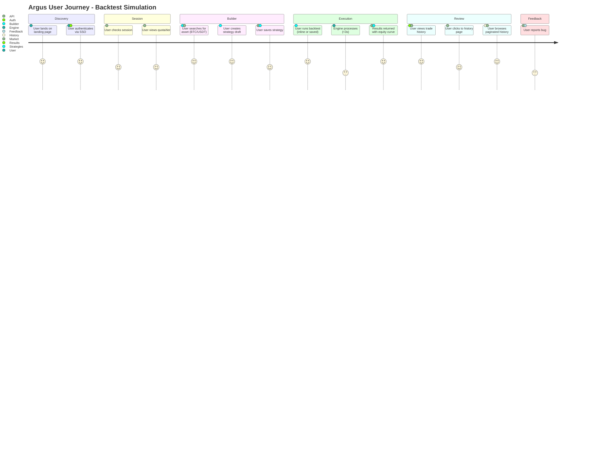

---

## 3. Authentication & Session Flow

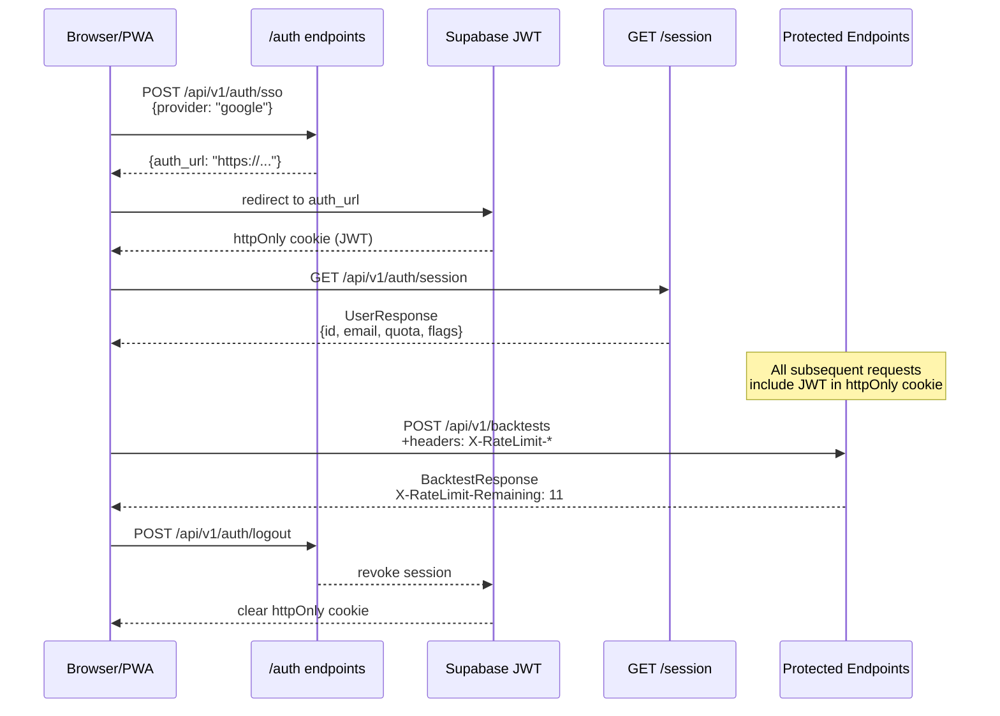

---

## 4. Strategy Lifecycle (Immutability Pattern)

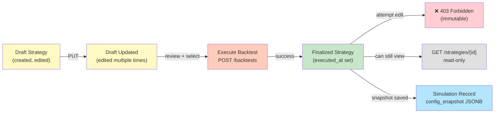

---

## 5. Backtest Execution (Sync, <3s)

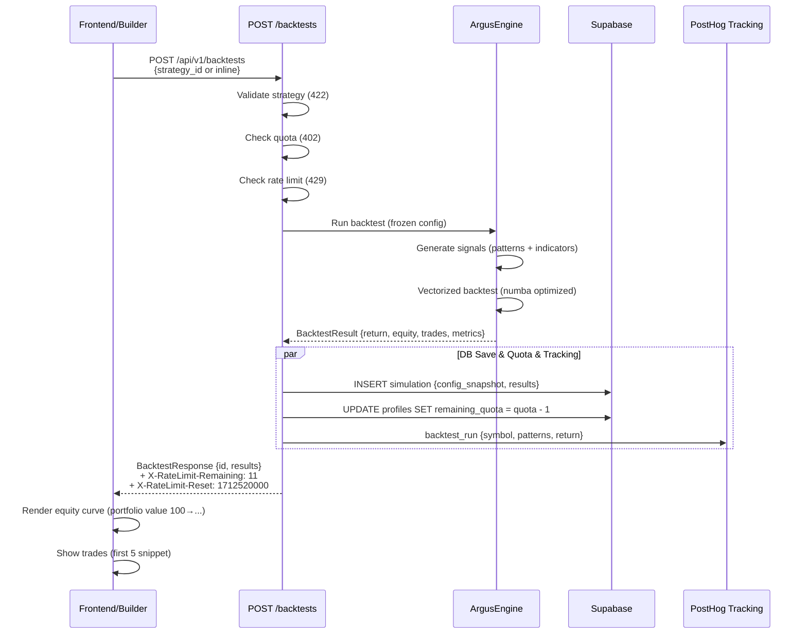

---

## 6. Data Flow: Request → Response Examples

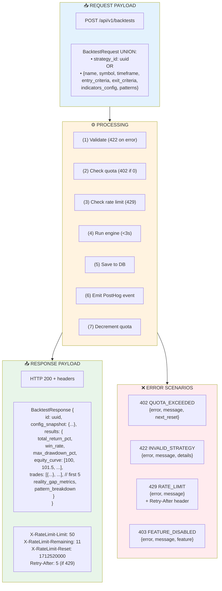

---

## 7. Database Schema Relationships

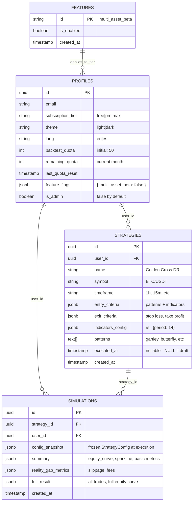

---

## 8. Pagination Pattern (Cursor-Based)

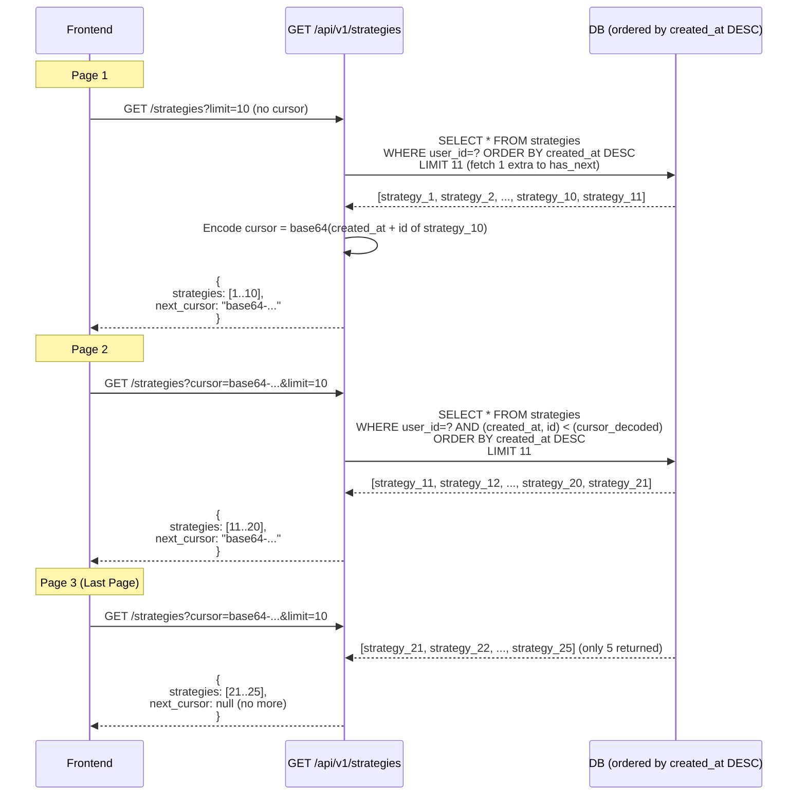

---

## 9. Rate Limiting Tiers

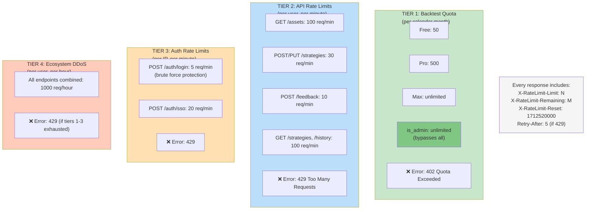

---

## 10. Error Handling Matrix

```mermaid
graph LR
    subgraph HTTP["HTTP Status"]
        H200["200 OK"]
        H204["204 No Content"]
        H402["402 Payment Required"]
        H403["403 Forbidden"]
        H409["409 Conflict"]
        H422["422 Unprocessable"]
        H429["429 Too Many Requests"]
    end

    subgraph Scenario["Scenario → Error"]
        S1["Quota exhausted → 402"]
        S2["Invalid strategy/symbol → 422"]
        S3["Attempt edit executed strategy → 403"]
        S4["SSO link conflict → 409"]
        S5["Rate limit hit → 429"]
        S6["Feature flag disabled → 403"]
        S7["Logout/Delete success → 204"]
    end

    subgraph Format["Error Response Format<br/>(all use same)"]
        F["<br/>{<br/>  error: 'QUOTA_EXCEEDED',<br/>  message: 'string',<br/>  details: {...}<br/>}"]
    end

    Scenario --> HTTP
    HTTP --> Format

    style Scenario fill:#ffebee
    style HTTP fill:#ffcdd2
    style Format fill:#ef9a9a
```

---

## 11. Feature Flags Guard (403 Response)

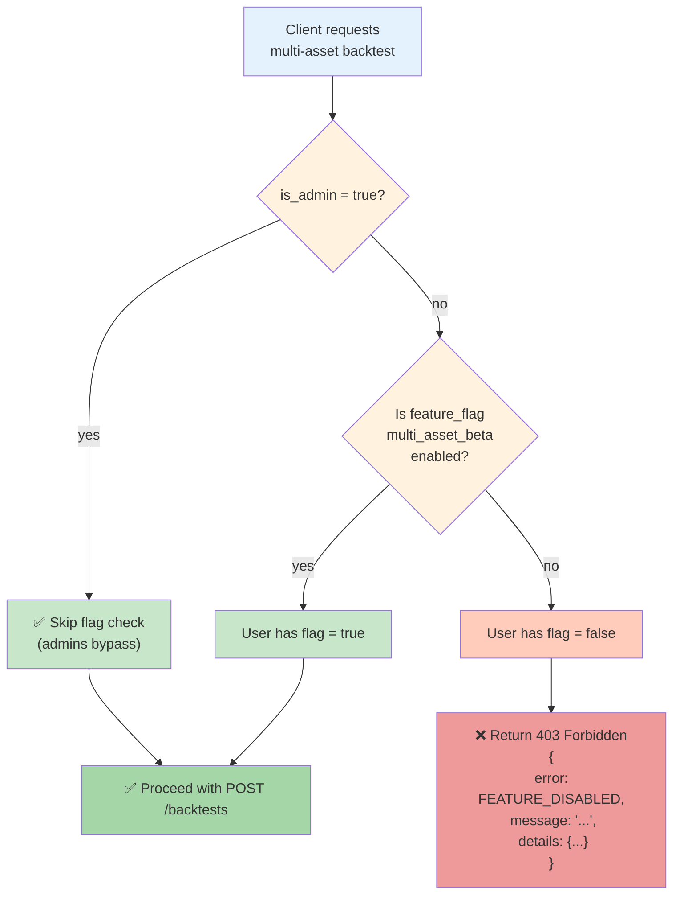

---

## 12. Frontend Integration Checklist

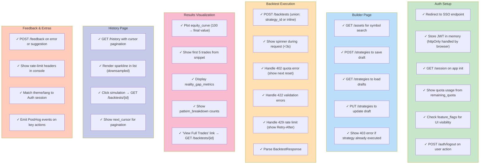

---

## 13. Backend Build Dependency Order

```mermaid
graph TB
    subgraph DB["Database Layer (Day 1)"]
        D1["✓ Supabase migrations<br/>(profiles, strategies, simulations, features)"]
        D1-->|creates tables| D2["✓ RLS policies<br/>(users see only own data)"]
    end

    subgraph Auth["Auth Layer (Day 2)"]
        D2 --> A1["✓ GET /auth/session<br/>(fetch user + quota + flags)"]
        A1 --> A2["✓ POST /auth/sso<br/>(Supabase JWT redirect)"]
        A2 --> A3["✓ POST /auth/logout<br/>(revoke session)"]
    end

    subgraph Market["Market Data (Day 2)"]
        A3 --> M1["✓ GET /assets<br/>(Alpaca symbol validation)"]
    end

    subgraph Strategies["Strategy CRUD (Day 3)"]
        M1 --> S1["✓ POST /strategies<br/>(insert + return id)"]
        S1 --> S2["✓ GET /strategies<br/>(cursor paginated list)"]
        S2 --> S3["✓ GET /strategies/{id}<br/>(full load for edit)"]
        S3 --> S4["✓ PUT /strategies/{id}<br/>(403 if executed_at)"]
        S4 --> S5["✓ DELETE /strategies/{id}<br/>(403 if executed_at)"]
    end

    subgraph Backtest["Backtest Core (Day 4)"]
        S5 --> B1["✓ POST /backtests<br/>Validate → Check quota → Run engine<br/>→ Save → Emit PostHog"]
        B1 --> B2["✓ GET /backtests/{id}<br/>(return full results with trades)"]
    end

    subgraph History["History & Feedback (Day 5)"]
        B2 --> H1["✓ GET /history<br/>(cursor pagination + sparklines)"]
        H1 --> H2["✓ POST /feedback<br/>(simple insert)"]
        H2 --> H3["✓ GET /health + /_mocks<br/>(dev endpoints)"]
    end

    style DB fill:#e0f2f1
    style Auth fill:#c8e6c9
    style Market fill:#bbdefb
    style Strategies fill:#fff9c4
    style Backtest fill:#ffccbc
    style History fill:#f8bbd0
```

---

## Summary Table

| Component             | Status          | Notes                                                                       |
| --------------------- | --------------- | --------------------------------------------------------------------------- |
| **Endpoints**         | 13 total        | Auth (4), Market (1), Strategies (5), Backtest (2), History (2), Health (2) |
| **Error Formats**     | Unified         | Single error object format + HTTP codes                                     |
| **Rate Limiting**     | 4 Tiers         | Quota + per-minute API + per-minute auth + hourly ecosystem                 |
| **Pagination**        | Cursor-based    | Opaque base64 strings for all lists                                         |
| **Execution**         | Sync            | <3s backtest runs, no async/polling                                         |
| **Data Immutability** | Post-execution  | Strategies lock once executed_at is set                                     |
| **Authentication**    | Supabase JWT    | httpOnly cookies + RLS on tables                                            |
| **Feature Flags**     | 403 semantics   | Disabled features return 403 Forbidden                                      |
| **Admin Bypass**      | is_admin column | Founder gets unlimited quota + all features                                 |
| **Tracking**          | PostHog events  | Skipped entirely when is_admin = true                                       |
