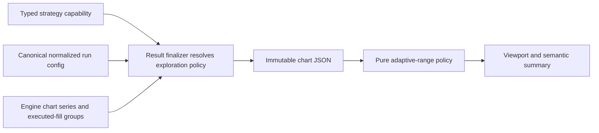

# Adaptive Result-Chart Range Design

> [!NOTE]
> Archived 2026-07-23 after issue #250 / PR #264 completed and landed on
> `codex/private-alpha-next`. Retained as the locked design and acceptance
> record. Current execution source:
> `docs/specs/private-alpha-interim-roadmap.md`.

Status: **COMPLETE — merged through PR #264; historical design record**

Date: 2026-07-19

Authoritative roadmap outcome: **Graphs have range switching**

Historical tracking issue: [#250](https://github.com/lagarcess/argus/issues/250)

Verified integration baseline: `codex/private-alpha-next` at
`390d57294cf9911becdb14ced126770d0124e4cb`

Accepted integration slice:
`0c0d481`

Integration merge evidence:
PR #264, represented in the accepted integration lineage at `bbd1d2b`

Read-only donor audited for leverage: `claude/argus-alpha-audit-c2d919` at
`f1d03a1d847628e6a8d681b22337ad5fc6c5ebfd`

## Outcome

A user viewing a completed Argus backtest can change the visible chart period,
choose a custom calendar range, restore the full tested period, and understand
the visible peak, low, and executed-fill evidence without rerunning or changing
the backtest.

The controls adapt to the supplied observations and to generic exploration
hints resolved from the strategy capability. They must not encode current
strategy names, timeframe allowlists, English phrases, provider names, or
display-label matching. New strategies and future timeframes must gain safe
default behavior without edits to the chart component.

## Current Product Truth

At the verified integration baseline:

- `ResultEquityChart` receives the complete persisted `chart.series`, creates
  one TradingView Lightweight Chart, and calls `fitContent()`.
- No preset, custom-range, reset, or semantic visible-range controls exist.
- The existing chart already supports daily and intraday timestamp rendering,
  tooltips, responsive resizing, localized dates/currency, and progressively
  disclosed executed-fill markers.
- The engine caps the persisted marker list at 80 but does not expose whether
  the list was capped or how many pre-cap event groups existed.
- The complete run metrics and result-card headline describe the entire
  effective backtest window. They are not viewport metrics.

The executable data timeframes are `1h`, `2h`, `4h`, `6h`, `12h`, and `1D`.
No timeframe below `1h` is currently executable. Equities and Alpaca-backed
crypto use the complete set. Currency pairs and the Kraken crypto fallback use
`1h`, `4h`, or `1D` and are bounded by Kraken's latest-720-candle window.

These are execution facts, not a frontend range allowlist. Range eligibility
comes from actual chart timestamps, so a future supported timeframe does not
require a chart-control change.

## Donor Audit And Salvage Boundary

The donor is evidence and optional code leverage, not an implementation
candidate. At the pinned donor SHA:

- `web/components/chat/ResultEquityChart.tsx` is byte-identical to integration;
- `web/components/chat/StrategyResultCard.tsx` is byte-identical to integration;
- no range-control implementation or range-specific chart test exists to
  cherry-pick;
- donor changes in auth, usage, lifecycle, interpreter, and database surfaces
  are unrelated and forbidden for this slice.

The implementation owner must repeat the narrow comparison against the exact
integration base it receives. If the result remains identical, record “no
reusable donor hunk” and proceed from integration. Never merge or broadly
cherry-pick the donor.

## Definitions

- **Data timeframe**: the interval represented by one observation, such as
  `1h`, `4h`, or `1D`.
- **Effective series**: the immutable `chart.series` produced for the effective
  tested window and persisted with the completed run.
- **Visible range**: the calendar window currently displayed inside that
  effective series.
- **Full-run metrics**: the result headline, total return, benchmark delta,
  drawdown, assumptions, and other metrics computed for the complete run.
- **Visible-range summary**: derived presentation facts for only the points and
  supplied markers currently visible. It never replaces full-run metrics.

## Product Decisions

1. The initial viewport is **ALL**, preserving today's result-card behavior.
2. Candidate presets are `1D`, `1W`, `1M`, `3M`, `YTD`, `1Y`, and `ALL`.
3. At most four non-ALL presets are shown, followed by ALL. Custom range is a
   separate control.
4. Presets and custom ranges change only the chart viewport and visible-range
   summary. They do not refetch, resample, reinterpret, persist, or rerun.
5. Full-run metrics and the result-card date label remain unchanged while the
   viewport changes.
6. Viewport selection is session-local presentation state. Reload starts at
   ALL; it does not create durable user or run state.
7. YTD is anchored to the latest supplied observation, not the wall clock.
8. Calendar arithmetic uses UTC and real calendar boundaries. A month is not a
   fixed number of milliseconds.
9. Custom range uses calendar dates. Intraday observations inside the selected
   UTC dates remain at their original resolution; this slice does not add a
   trading-terminal hour picker.
10. The accessible event list describes supplied executed-fill marker groups,
    never raw signals or an implied complete execution ledger.

## Extensible Capability Contract

### Why a typed hint is required

Actual series timestamps can prove whether a window is renderable, but they
cannot know whether it is meaningful for a monthly contribution strategy, an
event-driven strategy, or a future capability. Frontend switches over current
template names would repeat the same brittleness Argus avoids in its
language-agnostic runtime spine.

The strategy capability registry therefore owns an optional typed exploration
spec. The result finalizer resolves that spec against canonical run parameters
and persists only generic presentation hints in the existing chart JSON.

### Internal capability shape

The exact Python type name may follow repository conventions, but it must carry
these semantics:

```text
minimum_visible_observations: positive integer, default 6
minimum_meaningful_duration: optional ISO-8601 calendar duration
cycle_parameter: optional canonical parameter key
minimum_visible_cycles: positive integer, default 2 when a cycle exists
```

Rules:

- A non-periodic strategy can declare a fixed minimum meaningful duration or
  rely only on the observation default.
- A periodic strategy may name its canonical cadence parameter. The finalizer
  resolves the cadence and cycle count to a duration; the frontend never sees
  the parameter key or strategy name.
- A new executable capability must either declare exploration semantics or
  intentionally inherit the safe observation-only default.
- Unknown or malformed optional hints degrade to the observation-only policy;
  they never hide ALL or prevent the result card from rendering.

### Current capability resolution

This table defines current registry inputs. It must not become frontend logic.

| Capability behavior | Resolved minimum meaningful duration |
| --- | --- |
| Buy and hold | `P1M` |
| Daily recurring contribution | two cadence cycles: `P2D` |
| Weekly recurring contribution | two cadence cycles: `P2W` |
| Biweekly recurring contribution | two cadence cycles: `P4W` |
| Monthly recurring contribution | two cadence cycles: `P2M` |
| Quarterly recurring contribution | two cadence cycles: `P6M` |
| Buy-the-dip, RSI threshold, moving-average crossover, and generic signal execution | no fixed duration beyond the observation minimum |

If a completed run is shorter than its resolved meaningful duration, the
frontend falls back to observation-qualified shorter presets. This preserves
useful exploration for intentionally short buy-and-hold or periodic tests.

### Persisted chart additions

The existing chart JSON receives two optional, backward-compatible objects:

```json
{
  "exploration_policy": {
    "minimum_visible_observations": 6,
    "minimum_meaningful_duration": "P1M"
  },
  "marker_summary": {
    "total_groups": 124,
    "included_groups": 80,
    "sampled": true
  }
}
```

`minimum_meaningful_duration` may be null or omitted. `total_groups` counts
typed executed-fill marker groups before the existing backend cap;
`included_groups` is the persisted marker count. `sampled` is true exactly
when `included_groups < total_groups`.

These fields require additive updates to `API_CONTRACT.md`, `DATA_MODEL.md`,
frontend types, fixtures, and contract tests. They require no new endpoint,
table, column, migration, provider, LLM call, or public strategy taxonomy.
Legacy persisted cards omit both fields and remain readable.

## Generic Range Policy

The policy is a pure function outside the React/chart orchestration component.
Its inputs are the supplied series timestamps and the optional resolved
`exploration_policy`. It does not receive a strategy name, asset class,
provider, localized label, or engine timeframe allowlist.

### Normalize the series

1. Parse valid supplied timestamps using the chart's existing UTC semantics.
2. Sort them ascending and remove exact duplicate timestamps for policy math.
3. Preserve the original series unchanged for rendering.
4. Anchor all presets to the latest valid observation.

### Candidate boundaries

- `1D`: latest observation minus one calendar day.
- `1W`: latest observation minus one calendar week.
- `1M`: latest observation minus one calendar month.
- `3M`: latest observation minus three calendar months.
- `YTD`: January 1 of the latest observation's UTC year.
- `1Y`: latest observation minus one calendar year.
- `ALL`: first through latest valid observation.

Each window includes observations at both boundaries.

### Eligibility

A non-ALL preset is data-eligible only when:

1. it contains at least `minimum_visible_observations` valid points;
2. it excludes at least one valid point from ALL; and
3. its start precedes its end.

YTD is additionally eligible only when the full series begins before January 1
of the latest observation's year. This prevents YTD from duplicating ALL.

Among data-eligible candidates, prefer those whose calendar duration meets or
exceeds `minimum_meaningful_duration`. Sort preferred candidates from shortest
to longest and show the first four. If none meet the meaningful duration
because the complete run is shorter, use the first four data-eligible
candidates instead. Append ALL in every case.

If fewer than six valid points exist, show no range controls because switching
would not provide a readable comparison. The existing chart and available
single-point semantic facts still render.

### Expected examples

| Completed result | Expected presets |
| --- | --- |
| Two-week buy-and-hold with hourly observations | `1D`, `1W`, `ALL` |
| Three-year buy-and-hold with daily observations | `1M`, `3M`, eligible `YTD`, `1Y`, `ALL` |
| Two-year monthly recurring strategy with daily observations | `3M`, eligible `YTD`, `1Y`, `ALL` |
| Two-month RSI strategy with hourly observations | `1D`, `1W`, `1M`, `ALL` |
| Five-day signal strategy with 12-hour observations | only the ranges containing at least six observations, plus `ALL` |
| Future strategy with no exploration hint | observation-only adaptive presets |
| Future executable timeframe | adaptive presets from actual timestamps without chart-code changes |

## Frontend Interaction

### Presets and reset

- Presets are buttons with localized visible labels and `aria-pressed` state.
- Selecting a preset calls the chart time scale's visible-range API over the
  existing series. ALL and Reset call `fitContent()`.
- Manual pan or zoom changes the selected state to Custom without writing any
  product state.
- Reset remains available whenever the viewport is not ALL.
- Controls use the existing calm result-card visual language, visible focus,
  touch behavior, and a minimum 36-pixel interactive height.

### Custom range

- Custom opens two localized calendar-date inputs: start and end.
- Both values are clamped to the effective series bounds before application.
- Start after end, an empty field, or a range containing fewer than two valid
  observations shows a localized inline error and leaves the prior viewport
  unchanged.
- Applying a valid custom range sets the viewport and closes the editor.
- Cancel closes the editor without changing the viewport.

### Visible-range semantic summary

For the currently visible supplied observations, derive:

- visible start and end;
- highest portfolio value and its earliest timestamp when tied;
- lowest portfolio value and its earliest timestamp when tied;
- number of supplied executed-fill marker groups inside the visible range.

The summary is normal text adjacent to the chart, not hidden canvas metadata.
It is localized and remains distinguishable from the full-run headline and
metrics. Preset/custom selection may announce the updated range through a
polite status region; continuous pan/zoom must not produce repeated screen
reader announcements.

### Bounded event list

- List only the provided typed entry/exit markers inside the visible range.
- Build copy from marker type and symbols through existing localization; do
  not trust or parse backend display-label prose.
- Sort chronologically.
- Render at most 20 list rows. When more supplied markers are visible, select
  a deterministic even sample that preserves the first and last markers and
  say how many supplied markers are shown.
- When `marker_summary.sampled` is true, separately disclose that the run's
  persisted markers are a bounded sample of `total_groups` executed-fill
  groups. Do not imply that the accessible list is a complete ledger.
- If no supplied markers fall inside the viewport, say that no displayed
  executed-fill events occur in this visible range. Do not infer that the
  strategy generated no raw signals.

## Data Flow And Ownership



- The capability registry owns strategy semantics.
- The engine owns canonical series and executed-fill truth.
- The finalizer owns resolved generic chart hints and marker-cap evidence.
- Supabase persists the immutable result artifact through existing JSON fields.
- The frontend owns ephemeral viewport selection and derived visible facts.
- The LLM, interpreter, provider layer, and conversation state do not
  participate in range switching.

## Allowed Implementation Surfaces

Expected surfaces include:

- `src/argus/domain/strategy_capabilities.py`
- a narrow typed resolver beside strategy capabilities or chart finalization
- `src/argus/domain/backtesting/charts.py`
- existing result finalization/projection code only where needed to preserve
  the optional chart objects
- `web/components/chat/ResultEquityChart.tsx`
- a focused pure range-policy module rather than growing the chart component
- `web/components/chat/types.ts`
- `web/lib/argus-api.ts`
- result-card playground fixtures
- English and `es-419` locale catalogs
- focused domain, contract, frontend, and browser tests
- `docs/API_CONTRACT.md` and `docs/DATA_MODEL.md` for the additive chart shape

No database migration is expected because the chart is already JSON. Stop and
return to the founder if implementation proves otherwise.

## Forbidden Scope

- No broad donor merge or unrelated donor commit.
- No strategy-name switch in the frontend.
- No prose, alias, label, regex, or language matching.
- No frontend timeframe allowlist.
- No new LLM prompt, model, provider, endpoint, table, or background job.
- No resimulation, refetch, resampling, or metric recomputation.
- No mutation of the approved/effective date window.
- No raw-signal display, full execution ledger, benchmark-series redesign,
  indicator pane, dashboard conversion, or fixed always-visible
  trading-terminal control strip. Adaptive 1D/1W viewport presets remain in
  scope when the generic policy qualifies them.
- No persistence of the user's selected viewport.
- No opportunistic chart-library replacement or result-card redesign.

## Failure And Compatibility Behavior

- Missing exploration policy: use six observations and no minimum duration.
- Invalid optional duration: ignore it and use observation-only eligibility.
- Unknown future strategy: use its resolved hint if present, otherwise the
  safe fallback.
- Missing marker summary: show the supplied marker list without claiming it is
  complete or sampled.
- Empty chart: keep existing no-chart behavior; render no controls.
- Fewer than six valid timestamps: keep the chart but omit preset controls.
- Invalid timestamps: exclude them from policy and summary math without
  rewriting the persisted artifact; preserve current rendering compatibility.
- Legacy `value_extrema`: remain a full-run compatibility fallback elsewhere;
  visible peak/low always derive from visible `chart.series` points.

## Verification

### Deterministic contract and domain tests

- Capability metadata resolves to generic exploration hints without frontend
  strategy names.
- Every current executable capability either declares or intentionally
  inherits exploration behavior.
- DCA cadence values resolve to two calendar cycles.
- Marker summary reports exact pre-cap and persisted counts.
- Legacy chart payloads remain valid.
- Contract/OpenAPI checks cover the optional additive chart shape if the chart
  schema is represented there.

### Pure frontend policy tests

- All supported current timeframes through representative timestamp series.
- A future unfamiliar timeframe and a future unfamiliar strategy.
- Short and long series, sparse sessions, leap years, month ends, year
  boundaries, and YTD anchored to the latest observation.
- Meaningful-duration preference and short-run fallback.
- Four-preset cap, ALL restoration, custom clamping, invalid custom ranges, and
  no eligible presets.
- Visible peak/low tie handling.
- Visible event filtering and deterministic 20-row disclosure.
- Legacy payload fallbacks and malformed optional hints.

### Component and browser tests

- Preset, Custom, Cancel, Apply, and Reset interactions.
- Keyboard-only operation, focus visibility, screen-reader state, and touch
  targets.
- Manual pan/zoom changes the selection to Custom without announcement spam.
- Existing tooltip, marker density, responsive resizing, theme behavior,
  attribution, and result-card actions remain correct.
- English and Spanish labels/copy.
- Mobile and desktop layouts in light and dark modes.
- Range switching produces no API request, provider request, simulation, usage
  charge, durable write, or change to full-run metrics.

### Production-parity local QA before promotion

1. Start from a real-auth completed result on the candidate branch.
2. Record ALL, switch through every eligible preset, apply Custom, reset, pan,
   and zoom.
3. Verify the visible summary and supplied events against the persisted chart
   payload.
4. Reload the conversation and confirm the same immutable result returns at
   ALL with full-run metrics unchanged.
5. Repeat the visible interaction in English and Spanish and at desktop/mobile
   widths.
6. Confirm browser network evidence shows no range-triggered backend call and
   no additional simulation usage.

Deterministic green without this browser proof is not completion.

## Acceptance Criteria

- Users can select adaptive `1D`, `1W`, `1M`, `3M`, `YTD`, `1Y`, and ALL
  ranges when each is meaningful for the actual series and resolved capability
  hint.
- Short runs expose useful shorter ranges instead of degrading to irrelevant
  3M/1Y controls.
- New strategies and timeframes do not require chart-component branches.
- ALL and Reset restore the complete effective canonical series.
- Custom date ranges are bounded, localized, accessible, and non-mutating.
- Full-run metrics never change with viewport selection.
- Visible peak/low and event facts are deterministic and honest.
- Marker sampling/capping is disclosed when and only when known.
- Existing chart behavior, result actions, reload, localization, themes, and
  responsive layout do not regress.
- Local production-parity browser QA demonstrates the complete journey before
  promotion.

## Complexity Reassessment And Rollback

Before requesting review, compare the final diff with the actual user value:

- reject template switches, duplicate date math, general chart frameworks, or
  a new durable preference model;
- keep capability resolution, pure range math, chart orchestration, and
  accessibility independently understandable;
- remove optional machinery not exercised by a current capability or required
  for safe future fallback.

The implementation must remain separately revertable:

1. frontend controls/summary can be removed while the existing chart renders;
2. optional persisted hints can remain unread without changing run truth; and
3. marker summary can remain additive evidence with no effect on execution.

Rollback must never rewrite completed runs or remove canonical series data.
