# Failure-class visual consistency — audit and reconciliation evidence

Closure evidence for the failure-class visual consistency lane.

- **Scope note:** [`docs/superpowers/specs/2026-07-31-failure-class-visual-consistency.md`](../superpowers/specs/2026-07-31-failure-class-visual-consistency.md)
- **Anchor:** founder root-cause diagnosis in [PR #311 comment 5141228550](https://github.com/lagarcess/argus/pull/311#issuecomment-5141228550)
- **Reconciliation PR:** #320 against `codex/private-alpha-next`
- **Audited at:** `cbe160d6` (integration tip) · **reconciled at:** `38edd364`

The lane ran in two phases with a hard stop between them: a look-and-report
inventory of every UI treatment that tells a user "this went wrong", then
reconciliation of only the items the founder confirmed at the gate.

---

## 1. Why this lane existed

The same failure could render with four different visual weights depending on
which code path delivered it, and ten unrelated visual vocabularies existed for
one concept. The root cause was structural: no shared source for how failure is
signalled, so independently-styled implementations drifted apart with nothing
holding them together.

Counted at audit time, for one conceptual class:

| Treatment | Where it was used |
| --- | --- |
| Amber bordered block + icon + Retry pill | retryable recovery, live `final` frame only |
| Muted grey footnote + bare ↻ | the same failures after reload; abandoned turns |
| `#d66d75` | failed-job pill, confirmation could-not-run, chart range error, decision-save error, negative hero value, sidebar rename |
| `#b84e58` | sidebar "load older chats" failure only |
| `#b25e65` | palette load-more failure only |
| `#b3593f` | cost-editor validation only |
| Tailwind `red-500/600` | auth banner, recovery pages, guest restart, metric pills |
| Monochrome + icon + retry pill | strategies/collections load failure |
| Monochrome, no icon | conversation retrieval, palette read error, usage modal, guest entry |
| Neutral toast pill | eight-plus distinct failures, identical to "Saved" |

---

## 2. How the evidence was captured

Every screenshot is the real application rendering through its real code paths;
only the data or the network condition is staged. Techniques, all zero-code:

| Technique | What is staged | What is real |
| --- | --- | --- |
| **live** | nothing | full turn against the dev backend |
| **reload** | nothing | same conversation re-hydrated after refresh |
| **hydration-mock** | the API payload | components, parsers, hydration, projection |
| **route-abort** | a single endpoint fails or is blocked in flight | the app's own failure handling |
| **stream-stub** | one SSE frame body | the client's frame parser and reducers |
| **playground** | the repo's own `/dev/result-card` fixtures | the result card |

Environment: dev mode (mock auth, `synthetic_unit_fixture` market data, memory
persistence), dark theme, English unless noted. Before-shots were taken at
`cbe160d6`; after-shots at the PR head on the same surfaces with the same
reproductions.

One honest note on the before-set: the dev environment's composition model is
unavailable, so result follow-ups genuinely fail there. That is how the anchor
pair was captured organically rather than staged.

---

## 3. Inventory and rulings

Nineteen items across seven classes. "Landed" is where each one ended up.

| # | Item | Ruling | Landed |
| --- | --- | --- | --- |
| 1 | Amber live vs muted footnote after reload (the anchor pair) | External | issue #313 lane, PR #318 |
| 2 | Retryable failure renders as plain prose when it arrives on the SSE `error` frame | In scope, escalated | PR #320 |
| 3 | Amber survives reload only when the failure was LLM-voiced | External | issue #313 lane |
| 4 | Abandoned turns wear the muted footnote | External | issue #313 lane |
| 5 | Seven `artifact_action_*` statuses indistinguishable from answers | In scope | PR #320 |
| 6 | Rejected stale action reads as a benign "Updated" | Deferred | — |
| 7 | Canceled/expired jobs wear success chrome | Deferred, dead branch logged | — |
| 8 | One failure paints two identical red pills | In scope, escalated | PR #320 |
| 9 | Degraded result metrics dress like healthy ones | In scope | PR #320 |
| 10 | Value-negative red and failure red are the same hue | In scope, failure red moved | PR #320 |
| 11 | "Couldn't load this conversation" has two different faces | In scope | PR #320 |
| 12 | Offline fallback is developer copy in a normal bubble | In scope | PR #320 |
| 13 | Toast cannot distinguish success from failure | In scope | PR #320 |
| 14 | Search failure is typographically identical to "no results" | In scope | PR #320 |
| 15 | Three bespoke reds for the same inline error | In scope | PR #320 |
| 16 | Views: error state ≈ empty state | Deferred (flags off in alpha) | — |
| 17 | Auth owns the best treatment, filled with uncontrolled copy | In scope (styling half) | PR #320 |
| 18 | Clarifications and unsupported answers are **not** failures | Confirmed correct as-is | no change |
| 19 | Guest allowance is an upsell, never an apology | Confirmed correct as-is | no change |

Items 18 and 19 were the guardrail check the scope note required. Both hold:
clarification requests and unsupported-capability answers render as normal
conversation, consistent with each other, and amber never reaches them. Item 19
needed no code — `discovery_limit_reached` has had no producer since the
cheap-verified-rows pivot, so the teal upsell already owns allowance exhaustion
by construction.

---

## 4. Before and after

Each image is one reproduction captured twice: left at `cbe160d6`, right at the
PR head.

### Items 2 and 11 — a turn killed mid-conversation

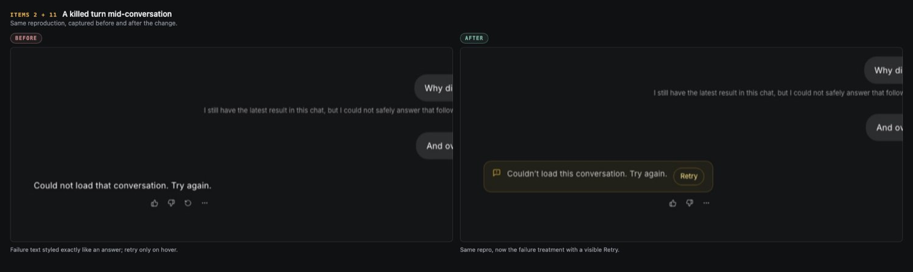

### Item 2 — the same class arriving on the SSE `error` frame

Before this change the `error` frame never set the recovery code, so this
message rendered through the plain-prose branch shown on the left above.

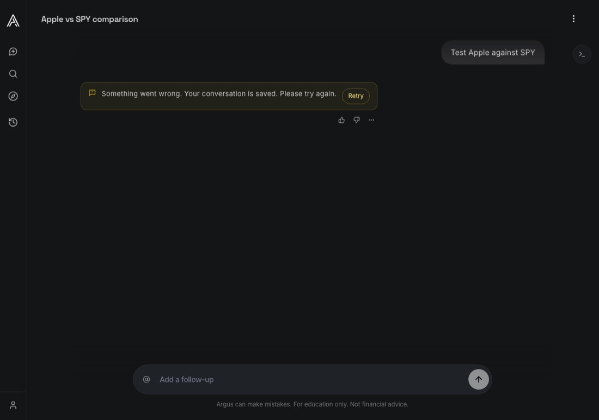

### Item 5 — non-retryable action recoveries

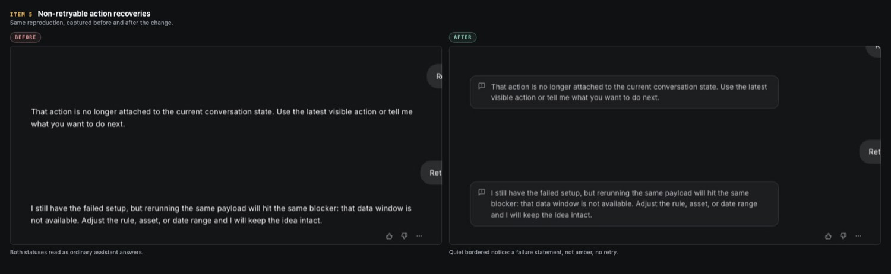

### Item 8 — one failed run

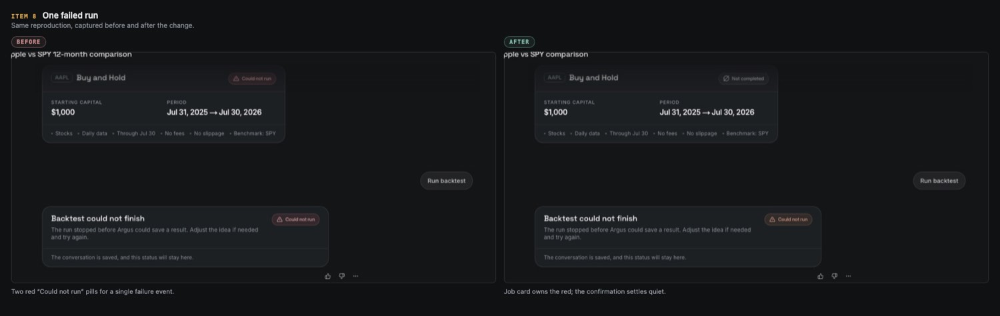

### Item 9 — a result with unavailable metrics

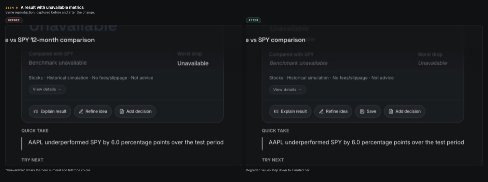

### Item 10 — a losing result, deliberately unchanged

Red-for-loss is an established finance convention, so the failure red moved
away from it instead. This pair is the proof that the value tone did not shift.

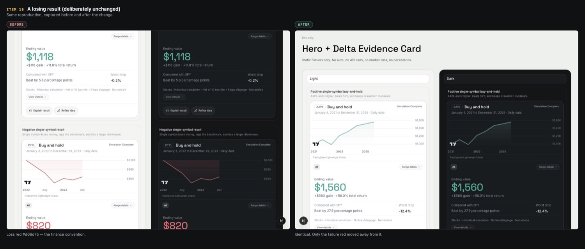

### Item 11 — a conversation that will not open

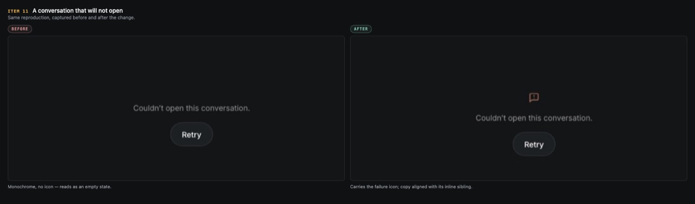

### Item 12 — the service is unreachable

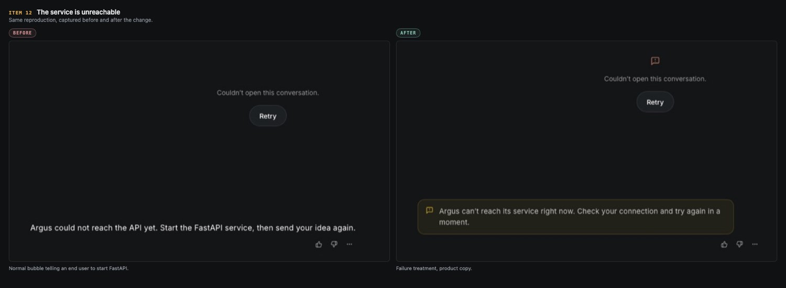

### Item 13 — a toast message

The left panel is the shared pill in its success form; failures arrived in a
visually identical pill.

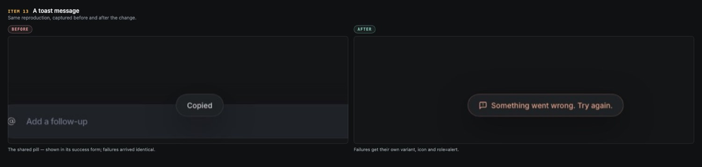

### Item 14 — omnisearch cannot load results

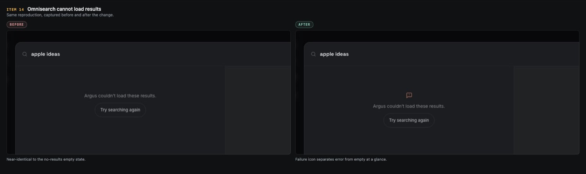

### Item 14 — composer @-mention lookup fails

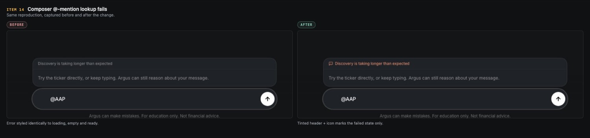

### Item 17 — sign-in rejected

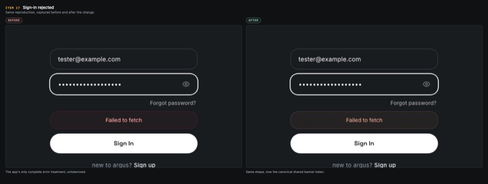

### Item 17 — expired recovery link

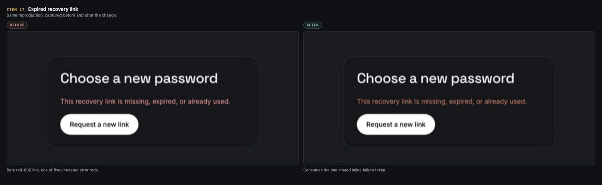

### Item 17 — temporary chat cannot restart

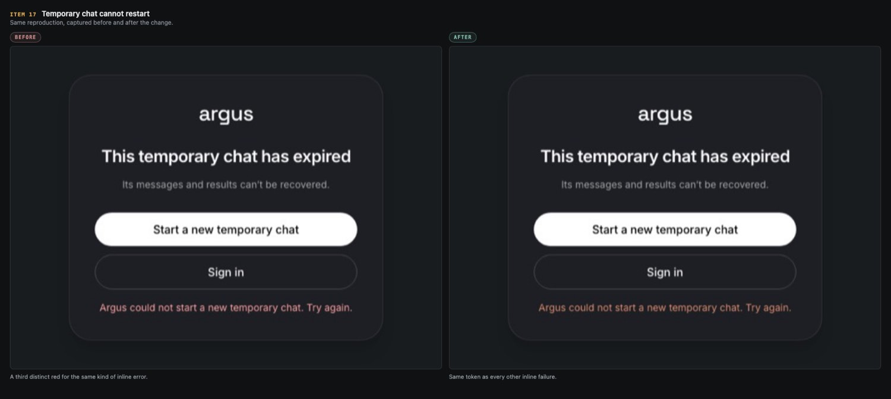

### Localization

Copy changed for two keys (`chat.error_offline`, `chat.error_load`), so both
locales were verified.

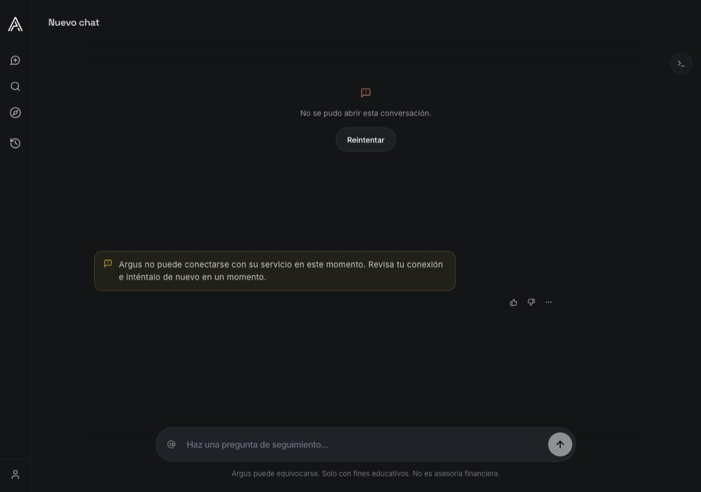

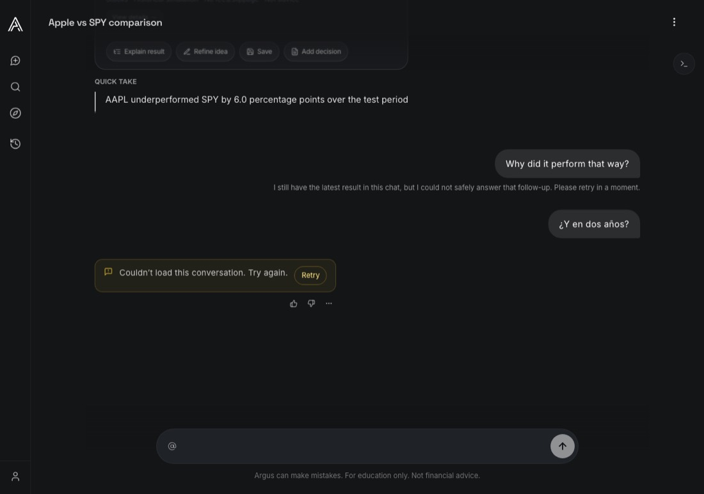

---

## 5. The structural fix

Reconciling pixels one at a time would leave the same drift free to recur, so
the confirmed items consume one shared source rather than hand-synced
duplicates.

`web/lib/failure-treatment.ts` owns the vocabulary:

| Export | Failure class it expresses |
| --- | --- |
| `quietNotice*` | non-retryable: a failure statement, no alarm, no retry |
| `terminalStatusToneClass` | terminal failure on artifact cards |
| `inlineFailureTextClass` | a small failure line under a control |
| `blockingErrorBannerClass` | a blocking error on a form |
| `degradedValueClass` | a value that is missing, not bad |
| `panelFailureIconClass` | a failure inside a panel or page state |

`web/components/chat/FailureNotice.tsx` renders the quiet variant. The amber
retryable family stays defined next to its renderer in `ChatMessage.tsx` on
purpose: the issue #313 lane owns that pair's reconciliation, and this branch
keeps that code byte-identical to the integration tip so its PR lands cleanly.
Folding amber into the shared module is a follow-up once #318 merges.

**Guardrail, unchanged.** Amber's gate is still `recovery.retryable === true`,
now applied uniformly across both SSE frames. Reconciling visual weight never
loosened a gate to cover a case it did not already cover.

---

## 6. Verification

- Hermetic frontend suite: **756 passed, 0 failed** (`cd web && bun test`).
- Application TypeScript clean; lint reports only a pre-existing unused-import
  warning in unchanged code.
- Modularity budget: `ChatInterface.tsx` at 2587 lines against a 2598 limit. The
  wiring initially pushed it to 2614; the overage was resolved by extracting
  cohesive behavior (`useChatToast`, `offlineFallbackMessage`), not by trimming
  unrelated code.
- CI green on `38edd364` — `backend-checks`, `frontend-checks`,
  `guest-release-gates`, `ownership-gate`.

---

## 7. Logged, not fixed here

Surfaced by the sweep, deliberately out of this lane's scope. Each is a
candidate for its own bounded change.

**Unreachable or dead code.** Job statuses `canceled`/`expired` are legal in the
type system, API schema and DB constraint, but no backend writer sets them —
`backtest_jobs.py` maps both to `failed` with a failure code. The
`discovery_limit_reached` recovery code retains fallback copy and locale entries
with no producer. `CollectionsView` has no mount point. The `contentPresentation`
values `conversation_load_failure` and `superseded_runtime_failure`, and the
`archived`/`discarded` artifact lifecycles, have no rendering branch.

**Signal that never reaches the user.** Job `failure_code` and `failure_detail`
carry nine-plus distinct backend codes and are never rendered, so
allowance-exhausted and capacity failures collapse into one generic body. The
result card's backend `status_label` is always overwritten by the
`chat.simulation_complete` default. Chart data-load failures render nothing.

**Copy and localization.** The auth banner renders raw `error.message`, so
backend detail and fetch-layer English ("Failed to fetch") reach users
untranslated. `common.try_again` is called but missing from both locales.
`CHAT_STREAM_INTERRUPTED_MESSAGE` and several Supabase/CAPTCHA `Error()` strings
are hardcoded English. Dead keys: `guest.shell.*`, `auth.recovery.reset_error`,
`auth.login.errors.supabase_not_configured`.

**Silent failures.** `StrategiesView` run-from-strategy has an empty `catch {}`;
Recents first-page load, archived and deleted views swallow rejections, making a
failed load indistinguishable from "you have nothing here". Guest omnisearch is
blocked with no feedback at all.

**Platform.** No error boundary, `error.tsx`, or `not-found.tsx` anywhere, so a
render-time throw produces a blank page. Several error strings lack
`role="alert"`.
