# Current Checkpoint Experience Feedback

Date: 2026-08-01

Status: **LOCKED founder evidence**. This document records founder-observed behavior and explicitly noted product requests. It does not diagnose unproven causes or prescribe implementation from historical PRs and commits. Changes after this lock require a founder-directed addendum.

Audit checkpoint: `2d041e94be7b54d222e7262d451ce407d81d6a59`

Post-checkpoint integration note: after this assessment, `codex/private-alpha-next` advanced to `94476226faad4d6d271e509b3a1eee116b7ea0c1` through PRs #330 and #331. This report remains locked to the audited checkpoint. Every proposed issue must be revalidated against the newer integration head before being classified as current. In particular, PR #331 now contains signed-in Mark as unread UI wiring in both the chat-header and Recents action surfaces, so S-04 and S-06 are checkpoint evidence rather than automatic current-head defects.

## Guest experience

### G-01 — Asset context, date ambiguity, and successful recovery

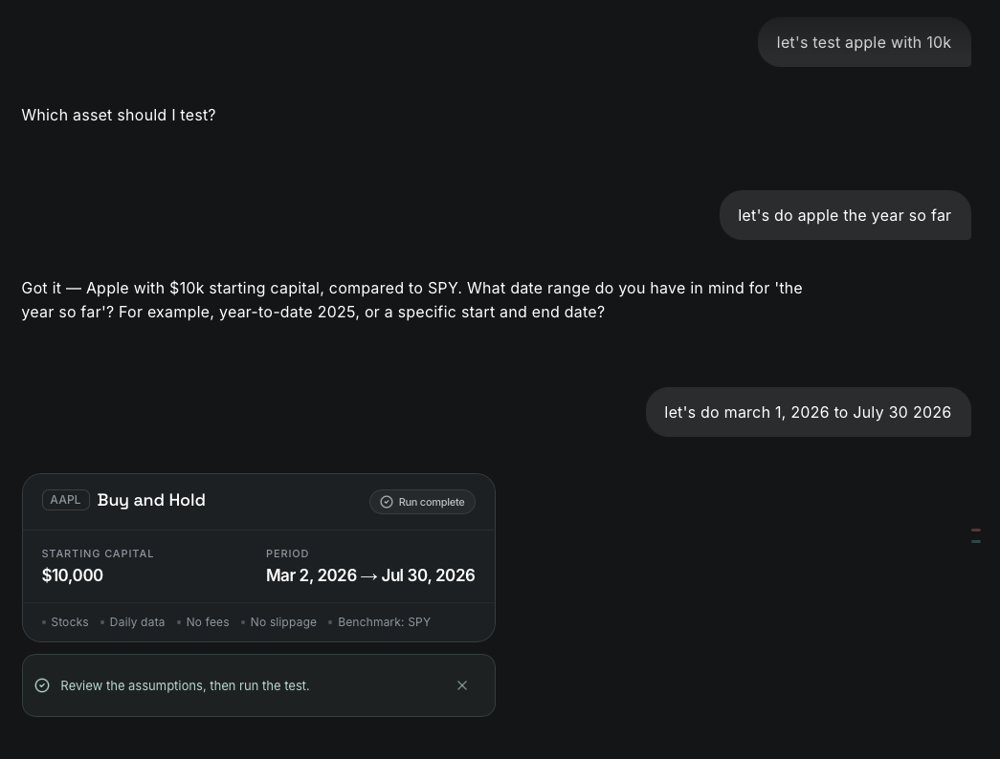

Evidence SHA-256: `c13a30bf392df1af765af720ce056f71660382610b29beac4bd0f94359546213`

#### Observed issues

1. Argus failed to recognize the asset already supplied in the opening turn, “let's test apple with 10K,” and unnecessarily asked, “Which asset should I test?”
2. Argus did not resolve “the year so far” into a date range. It did, however, correctly recognize that actionable date context was missing and asked the user to clarify the intended window.

#### Commendation

1. After the user supplied explicit dates, Argus recovered successfully and produced the expected confirmation card while retaining AAPL and the $10,000 starting capital.

### G-02 — Attention marker remains after the conversation recovers

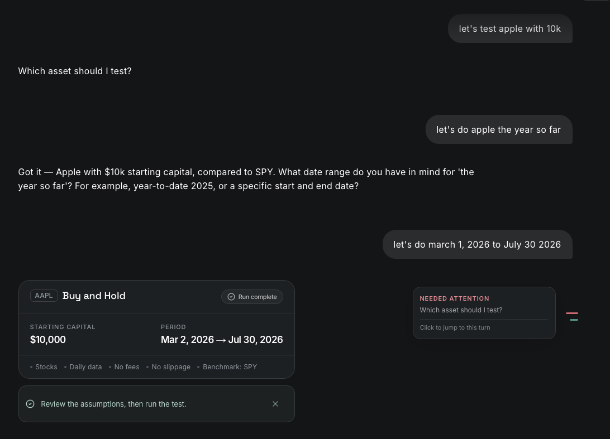

Evidence SHA-256: `fd9195fc57b91710e11eb8bc68a5a0a5cd3d57dbc4f40507b22e2b8d61ea93a9`

Related evidence: G-01 captures the same conversation's asset clarification and successful recovery.

#### Observed issue

1. The conversation minimap reports that an item “NEEDED ATTENTION” and points to the earlier “Which asset should I test?” turn. The later turns appear to resolve that question and reach a successful confirmation, but the marker does not gracefully clear or explain why attention is still required.

#### Observed interaction

1. Clicking the minimap object moves focus to the corresponding section of the conversation.

#### Unknowns to investigate later

1. What exact state transition reproduces the persistent attention marker?
2. Was an earlier confirmation artifact malformed, incomplete, or otherwise unresolved before the successful recovery?
3. Is the marker attached permanently to the historical turn, or is it intended to represent unresolved current state and therefore expected to clear after recovery?

### G-03 — Omnisearch retest action renders as raw user text

#### Action source

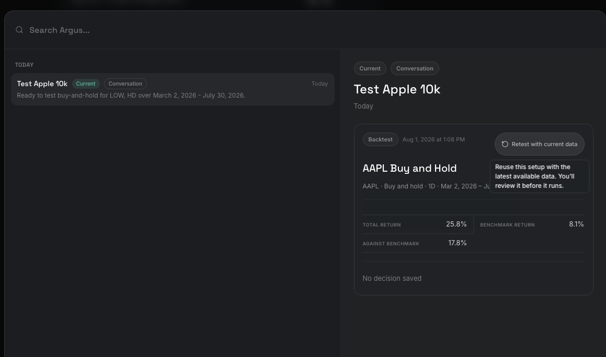

Evidence SHA-256: `cfe209c44c0b1df02e72781f3208b0c8447a0fde3df031786cd595085aa25c48`

#### Resulting conversation turn

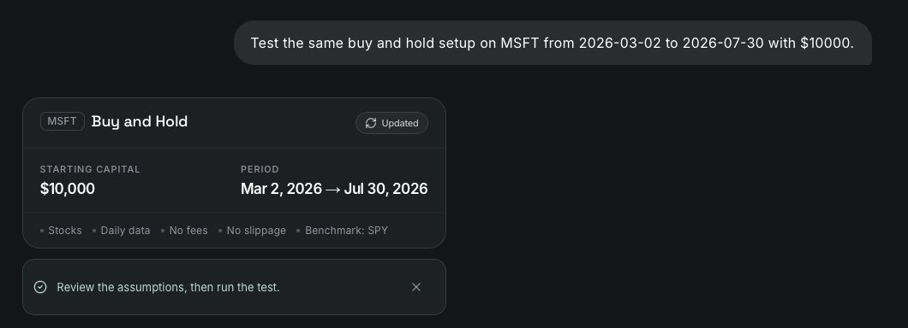

Evidence SHA-256: `64e7bcf3c62af736f4a640938acfab330af8b97d458a07fac3369e08f578ebea`

#### Observed issue

1. Clicking “Retest with current data” from Omnisearch submits and renders a raw user-text turn—“Test the same buy and hold setup on MSFT from 2026-03-02 to 2026-07-30 with $10000.”—instead of the compact Retest action chip introduced in PR #311.

#### Commendation

1. Argus correctly processed the retest request and produced an updated confirmation card with MSFT, $10,000, and the requested date window.

#### Unknowns to investigate later

1. Did PR #311 intentionally expose the compact Retest action only for signed-in users at that time?
2. Why is this runtime path not reconciled with the structured action presentation introduced by PR #311?
3. Does the discrepancy originate at the Omnisearch-to-chat handoff and require Omnisearch reconciliation?

### G-04 — Routine calendar alignment correctly remained quiet

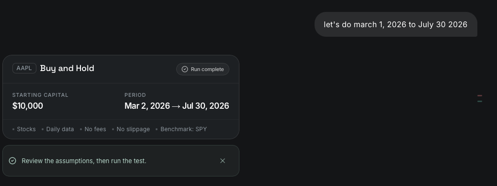

Evidence SHA-256: `acd80a848829a6747f5edb8d2471136f0711bcd14337afa16d465de7dfe89310`

#### Lock-time factual disposition

1. The user requested March 1, 2026 through July 30, 2026. March 1, 2026 was a Sunday, so the resolved confirmation began on the next ordinary trading session, March 2.
2. The current API contract intentionally keeps ordinary `calendar_alignment` quiet and renders a date-adjustment lead-in only for `provider_coverage_adjustment`.
3. The missing disclosure is therefore not retained as a product defect unless later typed evidence proves the adjustment was misclassified as provider coverage rather than routine calendar alignment.

#### Commendation

1. Argus resolved the request successfully, aligned it to an executable session, and displayed a coherent AAPL Buy and Hold confirmation with $10,000, daily data, and SPY as the benchmark.

### G-05 — Compound edit only partially applies, then Guest quota recovery overpromises

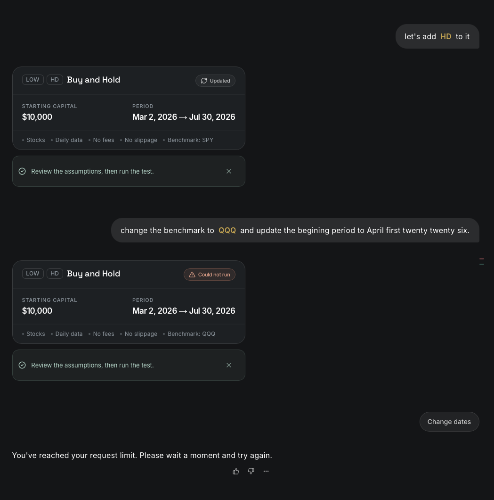

Evidence SHA-256: `60c602644a269a18a8b5c968d9c8a8e5fb3e3788ffafd2ee676bc0d1851f62fa`

#### Context

1. Before the failing turn, Argus had maintained LOW, HD, $10,000, the existing date window, daily data, fee/slippage defaults, and SPY across multiple confirmation-card edits.
2. The user then requested two changes in one turn: change the benchmark to QQQ and change the beginning of the period to April 1, 2026.

#### Observed runtime-continuity issues

1. Argus correctly changed the benchmark to QQQ but left the beginning of the period at March 2, 2026 instead of April 1, 2026.
2. Argus therefore failed to resolve the complete nested edit request atomically: one requested operation applied while the other silently remained unchanged.

#### Observed Guest-quota issues

1. The response “You've reached your request limit. Please wait a moment and try again.” implies that retrying shortly should work, but it does not state when the Guest allowance actually resets.
2. The exhausted Guest state does not offer an immediate account-conversion path, even though conversion is a natural way to continue.

#### Requested product adjustment

1. Allow two Guest backtests and gate the third backtest behind account conversion instead of gating the second.
2. When a Guest allowance is exhausted, state truthfully when the user can return and continue the temporary session.
3. Consider replacing the generic limit turn with a conversion surface that combines the reset-time explanation with a clear sign-up option.

#### Commendations

1. Argus correctly resolved the requested benchmark change to QQQ.
2. The confirmation card changed to a “Could not run” state immediately after the next message exceeded the Guest allowance.
3. Argus honestly disclosed that the request limit had been reached, even though the suggested recovery timing was imprecise.

#### Historical implementation context supplied by the founder

This compound-edit behavior does not trace to one recent narrow PR. The supplied lineage is:

- `bd90016b` — typed edit operations and deterministic application.
- `ea7f113b` — live-path emission and application of edit operations.
- `0e81810b` — planner hardening for plural operations, date-window targets, and conflict boundaries.
- These commits were later included in PR #191, the large `private-alpha-next` promotion to `main`.

This lineage is recorded for later investigation and has not been independently verified in this evidence-gathering pass.

#### Unknowns to investigate later

1. Which exact Guest allowance fired here: chat requests, interpreted turns, or completed backtests?
2. What authoritative reset timestamp can the product safely expose to the Guest?
3. Why did the current live edit path apply only one of the two typed operations expected from the foundational multi-operation contract?

### G-06 — Omnisearch dossier looks incomplete in the Guest experience

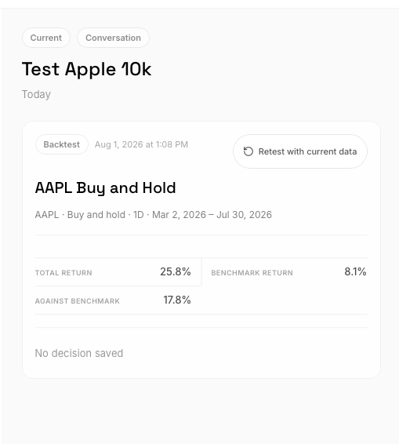

Evidence SHA-256: `d0439e945e4fd8f2b44e25e8f1c3a445c98943e5f2f3b4d9e110c304f2243770`

#### Read-only finding

1. This is not caused by a missing database connection. The dossier successfully loaded the persisted conversation title, run identity, symbols, strategy, timeframe, dates, result metrics, and Retest action.
2. The apparently empty bands come from the current frontend composition: the outcome section reserves spacing around an optional Quick take, and the metrics use a two-column grid. With only three metrics, the fourth grid position is visually empty.
3. “Add decision” or “Edit” is absent because Guest accounts currently expose `can_save_decision=false`. The backend consequently removes the typed decision action before the dossier reaches the frontend. A signed-in account should receive that action.
4. A decision note is rendered only after a decision exists and includes a note. “No decision saved” is therefore the expected empty state for this run.
5. “Open in conversation” and “Decision history” are always rendered below the dossier card in the current component, so they may fall below the visible crop or require scrolling.

#### Product observation

1. Although the behavior follows the current contracts, the Guest panel can look broken or partially unloaded because it shows separators and “No decision saved” without explaining that decision capture requires signing in. This may warrant a clearer compact Guest state or conversion affordance rather than empty-looking structure.

#### Founder-directed product behavior

1. The Guest Omnisearch dossier should look as complete as the signed-in dossier instead of removing decision-related controls.
2. “Add decision,” decision editing, and decision-note authoring should remain visibly available to Guests, matching the result card's existing interaction model.
3. When a Guest activates one of those protected actions, Argus should open the account-conversion gate rather than attempting the mutation or hiding the affordance.
4. After successful conversion, the intended decision action should resume against the same evidence-backed run without making the user find the artifact or re-enter the note.

#### Code evidence

- `RunDossierView.tsx` renders the optional Quick take, two-column metric grid, decision state, and below-card navigation.
- `guest_access.py` sets `can_save_decision=false` for Guests and `true` for registered accounts.
- `search_assembly.py` removes decision actions when the active account lacks that capability.

### G-07 — Successful backtests do not load in dossier Decision history

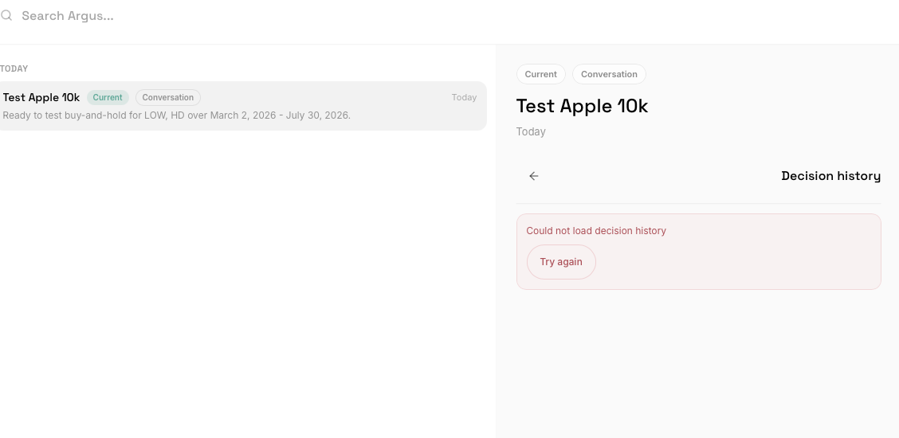

Evidence SHA-256: `7730c6d8fa17fc2205619ac2071aaccdf4c82713b9f3ca972ade600fd711bae1`

#### Observed issue

1. Opening Decision history from the Omnisearch dossier produced “Could not load decision history” instead of rendering the session's successful backtests.
2. The surface exposed a “Try again” action, but this evidence-gathering pass did not activate it or alter the session.

#### Unknowns to investigate later

1. Did the history request fail, or did the Guest ownership/capability projection incorrectly reject otherwise valid completed runs?
2. Should the Guest Decision history show completed runs even though saving a decision requires conversion?
3. Does this share the incomplete Guest dossier boundary recorded in G-06, or is it a separate history endpoint failure?

### Read-only independent pass — access boundary

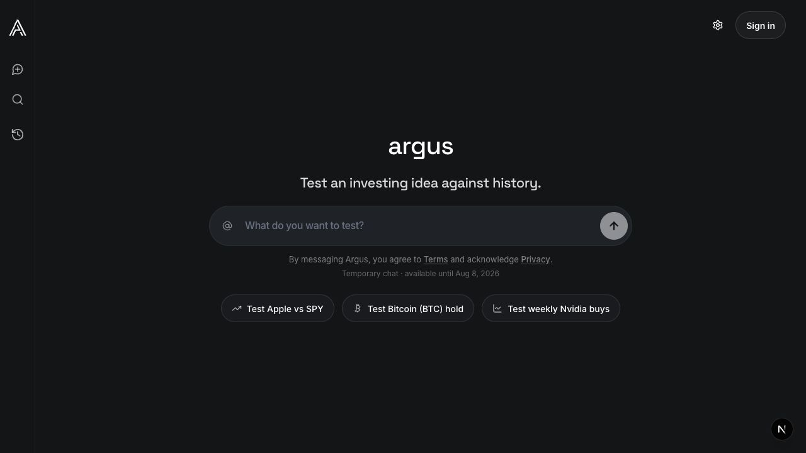
Evidence SHA-256: `3d4fea13f3dd3268c66345ef21623182ed79d6dbed63a8aa14ce35bd4ea5211c`

1. The supplied conversation URL was opened in a separate in-app browser profile to avoid changing the founder's Safari or Chrome sessions.
2. Argus displayed a fresh Guest home instead of the requested conversation because Guest ownership is browser-profile scoped. This is consistent with private Guest-session isolation and is not recorded as a product defect.
3. The exact live conversation could therefore not be independently audited through this separate browser without converting, copying authentication state, or otherwise disturbing the preserved session.
4. No message, action, Retry, Run, conversion, or account mutation was submitted. The founder-provided screenshots remain the accepted evidence for G-01 through G-07.

## Signed-in experience

### S-01 — Durable conversations missing from Recents but accessible through Omnisearch

#### Founder observation

1. After signing back into the local QA account, Data Controls showed prior usage activity.
2. The account's conversations did not appear in Recents.
3. The same conversations remained visible as Omnisearch rows and could be opened successfully from search.
4. No repair, retry, reload experiment, account mutation, or database mutation was attempted so the recoverable conversations remain untouched for continued assessment.

#### Initial classification

1. This is not evidence of chat deletion: Omnisearch can still retrieve and open the durable conversations.
2. The likely failure boundary is Recents-specific projection, filtering, indexing, hydration, or account-reconciliation behavior.
3. The currently safe access path is Omnisearch; no attempt should be made to rebuild or migrate the conversations during this evidence-gathering session.

#### Unknowns to investigate later

1. Does the Recents API omit these conversations, or does the frontend discard rows returned by the API?
2. Did Guest-to-account conversion or later authentication preserve searchable ownership without updating the Recents projection?
3. Does Recents recover after its normal synchronization cycle, or is an explicit reconciliation boundary missing?

### S-02 — Grounded discovery failed and Retry did not recover

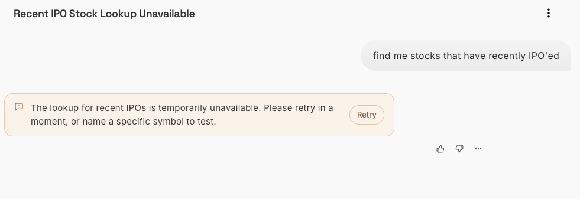

Evidence SHA-256: `84e50afbcd6bb8a3642f834427763cfe01d3dabd9577c053f39a667fbef6f0aa`

#### Intended behavior

1. The request “find me stocks that have recently IPO'ed” was intended to enter grounded discovery so recommendations came from source-backed web search rather than the model's general knowledge.

#### Observed issues

1. Argus returned “Recent IPO Stock Lookup Unavailable” instead of grounded candidates and sources.
2. Activating the visible Retry action did not resolve the failure.

#### Unknowns to investigate later

1. What exact local boundary caused Retry to fail?
2. Did the original turn reach the grounded-search route, or fail before the grounded-versus-general-knowledge boundary could be proven?
3. Would following the disclosed alternative—naming a specific symbol—have returned the user to the supported backtest path?
4. Does Retry recover correctly under a fully configured live environment, making this local configuration-specific, or is the recovery contract itself broken?

#### Commendation

1. The response acknowledged the unavailable lookup honestly and did not invent IPO recommendations or sources.

#### Intended-behavior lineage

1. PR #276 and its grounded-discovery search-adapter work are recorded as evidence of the intended source-backed behavior.
2. The referenced PR and commits are not a prescribed rollback, cherry-pick, or implementation strategy. Any correction must be derived from the current architecture and verified independently.

### S-03 — Usage meter should communicate remaining capacity by urgency

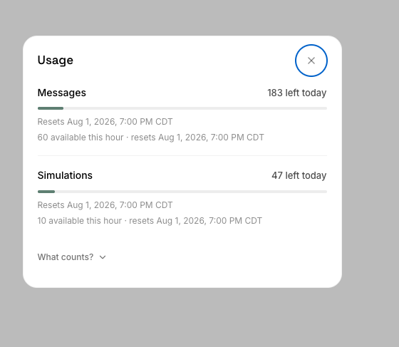

Evidence SHA-256: `42aa75af9337df18921934f39b6ac81d220ceb89b0cba90a84196d8f3e9b7da3`

#### Founder request

1. The usage meter should use a traffic-light color system based on capacity remaining.
2. Green should communicate healthy remaining capacity, amber should communicate that the user is approaching a limit, and red should communicate exhausted or critically low capacity.
3. Thresholds must derive from the authoritative remaining allowance rather than from presentation-only guesses.

#### Unknowns to investigate later

1. Do the displayed hourly and daily limits actually reset at the exact times Argus promises?
2. What does the signed-in experience render when a message or simulation allowance is exhausted?
3. Does the exhausted state provide an accurate, absolute return time and preserve the user's current conversation and work?

#### Product behavior requirement

1. There is no monetization offer to disclose at this checkpoint.
2. When a signed-in user reaches a limit, Argus should state truthfully when the relevant allowance becomes available again.
3. The message should distinguish hourly and daily exhaustion and use the controlling reset boundary rather than vague language such as “try again in a moment.”

### S-04 — Mark as unread is absent and recent conversation behaviors lack visual proof

Evidence SHA-256: `a68150fdecce1367ed0a05b7cfd1474d1f9a1c0cd6a3bf7a50c200c1b7f1953c`

#### Observed issue

1. The signed-in Recents overflow menu exposed Pin, Rename, Archive, and Delete but did not expose “Mark as unread.”
2. This session produced no visual evidence that the other relevant behaviors associated with PR #329 are present in the signed-in experience.
3. This session also produced no visual evidence for the subset of those behaviors that should naturally apply to the Guest experience.

#### Evidence gap

1. The absence of visual evidence is not automatically classified as proof that every associated behavior is broken.
2. Each behavior must later be checked against the current product surface and its applicable account type.
3. Behaviors that inherently require a durable account should not be required in Guest; shared conversation-attention behavior should be assessed for Guest unless the current contract says otherwise.

#### Unknowns to investigate later

1. Which PR #329 behaviors should appear for signed-in users, which should also appear for Guests, and which are account-only by design?
2. Is “Mark as unread” absent because the action is not projected, not rendered, feature-disabled, or unavailable for this conversation state?
3. PR #299 behavior was proven in that PR's local acceptance environment but was not visually observed in this current integration instance. Does the behavior remain present but untriggered, or has current integration regressed it?

#### Intended-behavior lineage

1. PRs #329 and #299 are recorded only as evidence of intended behavior and prior acceptance.
2. Their historical implementations are not prescribed fixes. Current behavior must be audited against current contracts and architecture before any correction is designed.

### S-05 — Trending-crypto discovery failed and Retry did not recover

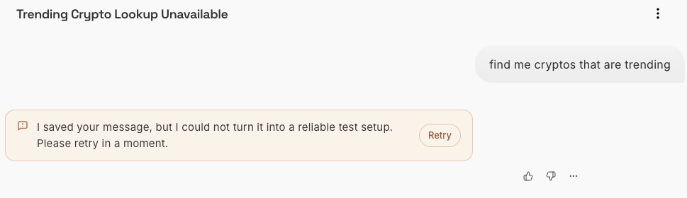

Evidence SHA-256: `2271e481594adc618409361c2fee8fedba04537d6bfe8652ffc1db6ce10ed18c`

#### Intended behavior

1. The request “find me cryptos that are trending” was intended as another grounded-discovery attempt.
2. For this exploratory turn, either source-backed grounded information or a clearly labeled general-knowledge response would have been acceptable as a second chance to observe useful behavior.

#### Observation

1. This request produced a different recovery state from S-02: “I saved your message, but I could not turn it into a reliable test setup.”
2. The distinct response may truthfully reflect a different failure boundary, but the screenshot alone cannot establish which boundary failed.

#### Observed issues

1. Argus could not resolve the request into a useful discovery or educational response.
2. Activating Retry did not recover the turn.

#### Founder hypothesis — not yet proven

1. Argus may have interpreted the discovery request as a request to construct a strategy, formed the wrong active context, and failed before reaching grounded discovery.
2. This is an investigation lead only. It must not be treated as root cause without typed-route, lifecycle, and provider evidence.

#### Unknowns to investigate later

1. Which typed route and response intent were persisted for the original request and its Retry?
2. Did the turn reach grounded search, general conversation, or strategy construction before failing?
3. Did Retry replay the same server-owned request correctly, and if so, why did it settle into the same failure?
4. Is this related to S-02, or are the two visible recovery messages evidence of separate failure classes?

#### Commendation

1. The failure was disclosed using the desired compact recovery presentation rather than being styled as a normal Argus answer or inventing a result.

### S-06 — Chat header menu also omits Mark as unread

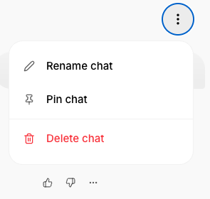

Evidence SHA-256: `efcd3bc54b426245c09ec369667be93d416b0f2989ba42c55425ae2306047a9a`

#### Observed issue

1. The signed-in three-dot menu in the chat header exposed Rename chat, Pin chat, and Delete chat but did not expose “Mark as unread.”
2. Together with S-04, the current session shows the action absent from both the Recents conversation menu and the open-chat header menu.

#### Intended-behavior lineage

1. PR #329 is recorded as evidence that “Mark as unread” is intended behavior.
2. Its historical implementation is not a prescribed fix; the current projection and rendering boundaries must be audited before correction.

### S-07 — Menu hover highlights use inconsistent shapes

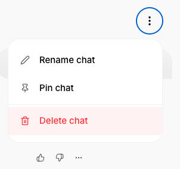

Evidence SHA-256: `50d19572f914e7eb3bdc0620cf48dda285288c76ed1b93ced5075351bb55efd9`

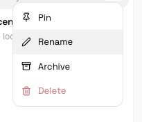

Evidence SHA-256: `e97347b8d1c9ca694ede6ff4221d62ffcdc5956b0b501f5a1ff17d9bf113ee28`

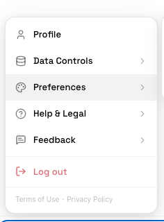

Evidence SHA-256: `71052a8ca931563ba5019bfb5e2629e00d73cfa84e3faeea7f3523a221b8533b`

#### Observed issue

1. Hover and selected-row highlights use inconsistent rectangular shapes in the settings menu and its submenus, Recents conversation overflow menus, and the open-chat header menu.
2. These states do not visually match the rounded pill treatment already used for New chat, Search, and Recents navigation actions.

#### Expected behavior

1. Interactive menu-row highlights should use a consistent rounded pill shape comparable to New chat, Search, and Recents.
2. Highlight colors should remain appropriate to the action and state, while sharing the same shape language across menus.
3. Destructive actions may retain appropriate destructive text or emphasis where required.
4. Log out in the settings menu does not need a red hover highlight.
5. “Delete all conversations” and “Delete account” already use the correct destructive color. Their color must remain untouched; only highlight geometry may be standardized if necessary.

#### Scope note

1. This is a shared visual-system consistency requirement across menu surfaces, not three unrelated component-specific designs.

### S-08 — General-knowledge discovery succeeded, but current-source escalation failed

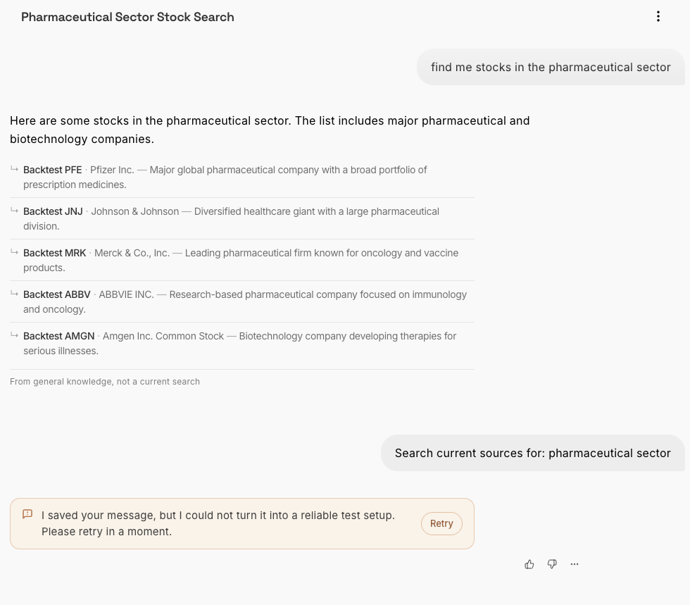

Evidence SHA-256: `f55e103350f893a2a686e0e1d90d42bbc4b8a5411fd7154c422b719460b1d564`

#### Intended journey

1. Argus first supplied a cheap, clearly labeled general-knowledge answer with candidate rows.
2. The separate “Search for current results” affordance was then activated to escalate the same intent into grounded, current-source discovery.
3. The escalation row correctly disappeared after activation. The resulting user turn—“Search current sources for: pharmaceutical sector”—is visible evidence that it was clicked.

#### Observed behavior

1. The initial general-knowledge response rendered successfully and disclosed “From general knowledge, not a current search.”
2. The grounded-search escalation failed with “I saved your message, but I could not turn it into a reliable test setup.”
3. Activating Retry did not recover the failed escalation.

#### Observed issues

1. Argus did not complete the intended grounded search after the user explicitly escalated from the general-knowledge answer.
2. Retry did not resolve the grounded-search failure; root cause remains unknown.

#### Founder requests

1. The synthetic user turn created by the escalation affordance should read like the user's inferred intent, not like a deterministic internal suffix.
2. Example: “Search for current stocks in the pharmaceutical sector” is preferable to “Search current sources for: pharmaceutical sector.”
3. The wording must remain semantic and asset-aware so it generalizes beyond stocks to other supported financial discovery requests.
4. Explore extending grounded discovery to useful current financial information—such as upcoming earnings, corporate events, central-bank actions, and other source-backed market events—where the selected provider and validation contracts can support it truthfully.
5. Use the arrow-row recommendation pattern to turn validated current information into useful, prebuilt, runnable backtest suggestions when the engine supports the resulting setup.

#### Guardrails for later design

1. Current-event facts must be source-backed and dated; general knowledge must remain labeled as such.
2. Search results must not imply that an event is executable as a backtest unless the candidate can be transformed into a supported, validated setup.
3. Provider availability must be verified before treating any named financial-data category as supported.

#### Relationship to earlier evidence

1. S-02 and S-05 show direct discovery requests failing. S-08 adds evidence that even the dedicated general-to-grounded escalation affordance fails in this instance.
2. The shared failure pattern is evidence for a later grouped diagnosis, but it does not yet prove one common root cause.

### S-09 — Result recommendation did not visibly progress into the expected inherited confirmation

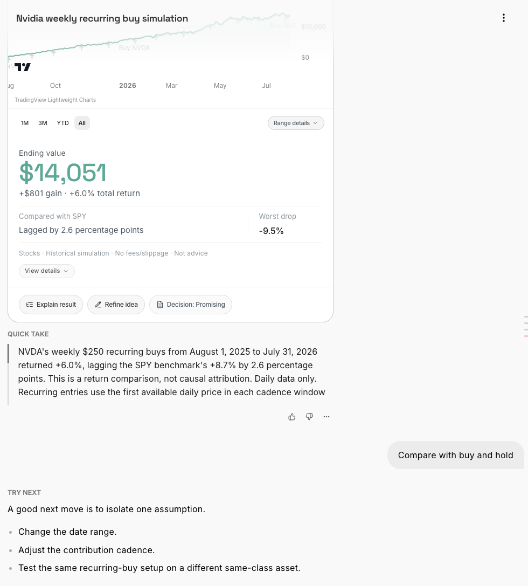

Evidence SHA-256: `ff17d4bc1c66a3341632b13e95c2781d5a2d693a41d25932e8e74dcb8249b5c5`

#### Context

1. Result cards expose arrow-row recommendations that submit a prebuilt, runnable follow-up turn when selected.
2. The recommendation row itself disappears after activation, so its absence from the screenshot is expected.
3. The visible user turn “Compare with buy and hold” is evidence that the recommendation was activated.

#### Expected behavior

1. The follow-up should progress gracefully from the completed DCA result to a new buy-and-hold confirmation.
2. Argus should inherit every still-applicable owned fact from the prior run—asset, capital, date window, timeframe, benchmark, and execution assumptions.
3. Only the intentionally changed strategy semantics should differ: weekly recurring purchases should become buy and hold.
4. The historical DCA result must remain immutable while the new confirmation becomes the active artifact.

#### Observed issue

1. The screenshot shows a generic “TRY NEXT” block after the recommendation turn instead of visible evidence of the expected inherited buy-and-hold confirmation.
2. This appears consistent with the Try Next leakage previously addressed by PR #304, but the exact state and edge-case resolution are unknown from this screenshot alone.

#### Unknowns to investigate later

1. Did the recommendation turn create a typed buy-and-hold draft or confirmation that failed to render, or did interpretation fall into generic result-follow-up behavior?
2. Were the prior run's owned assumptions preserved in canonical state even though the expected card is not visible?
3. Is the visible Try Next content stale projection, generic fallback prose, or the actual final response for this turn?
4. Does this edge case remain reachable after the behavior intended by PR #304, and does it affect both signed-in and Guest result flows?

#### Intended-behavior lineage

1. PR #304 is recorded as evidence that generic Try Next leakage was intended to be removed.
2. Its historical implementation is not a prescribed fix. The current result-follow-up, artifact-ownership, and projection paths must be audited before correction.

### S-10 — Fractional-month date request was rounded to a whole month

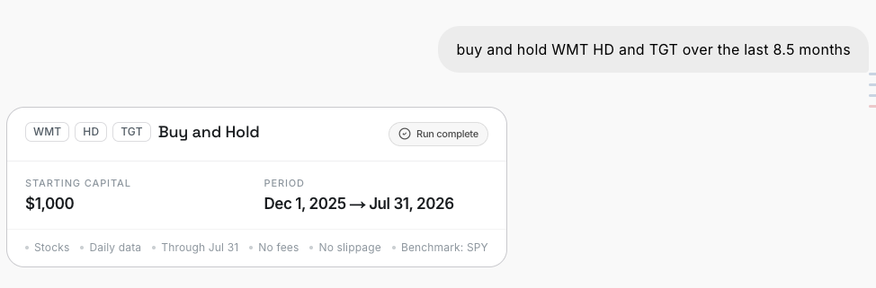

Evidence SHA-256: `8e4a823f4fc734cd0eb5e221105022c291743bafcf9b46637e3467acb2c1c1f4`

#### Intended test

1. The prompt “buy and hold WMT HD and TGT over the last 8.5 months” tested vague fractional-month date interpretation.
2. The request was submitted on August 1, 2026.

#### Observed issue

1. Argus resolved the period to December 1, 2025 through July 31, 2026.
2. December 1 is approximately eight months before August 1, indicating that the additional half-month was dropped or rounded away in the visible result.
3. A proportional 8.5-month interpretation would begin around mid-November 2025 before trading-session normalization, not mid-December.

#### Unknowns to investigate later

1. Did the interpreter, deterministic date resolver, or later coverage normalization remove the fractional-month component?
2. What requested date range and effective date range were persisted in canonical state?
3. August 1, 2026 was a Saturday, so a July 31 effective endpoint is ordinary calendar alignment and should remain quiet under the current contract.
4. Did canonical state preserve the intended fractional-month request separately from that ordinary end-date alignment?

#### Commendation

1. Argus still produced a coherent, executable historical window and preserved all three assets in the confirmation.

### S-11 — Date-range recommendation dropped modeled costs

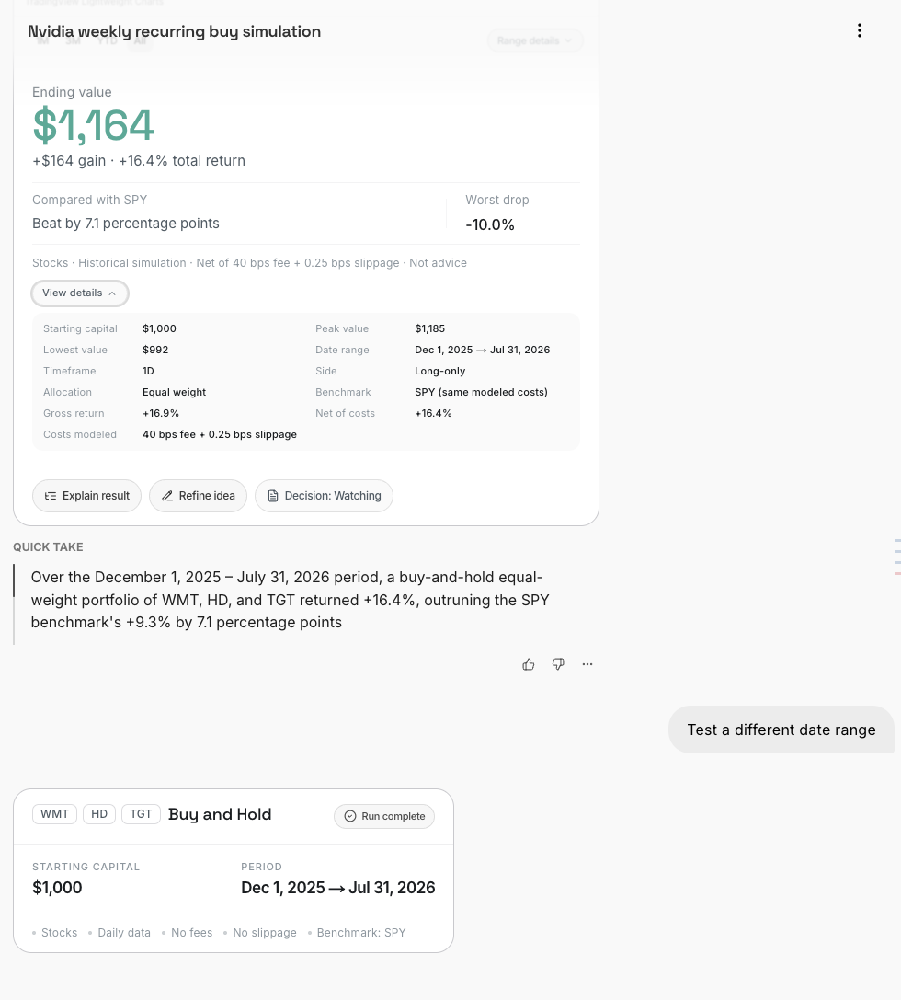

Evidence SHA-256: `8ba2e894c8592207d27e91f6c938d4a73a73b2a5e56e0ea32bd3a31e421a8d5a`

#### Context

1. The completed result visibly owned 40 bps fees and 0.25 bps slippage, and its benchmark used the same modeled costs.
2. The result-card recommendation “Test a different date range” was activated, producing the visible user turn.

#### Observed issue

1. The resulting confirmation preserved WMT, HD, TGT, $1,000, daily data, and SPY but changed the owned execution assumptions to “No fees” and “No slippage.”
2. A date-range refinement should not clear unrelated modeled-cost parameters.
3. This suggests a gap in the prebuilt recommendation payload or in the continuity boundary that applies it.

#### Expected behavior

1. A date-only recommendation should inherit all unrelated canonical facts from the source result.
2. Fee and slippage values, their provenance, and benchmark cost parity should remain unchanged unless the user explicitly edits them.
3. The historical result must remain immutable while the replacement draft or confirmation carries the preserved assumptions.

#### Unknowns to investigate later

1. Does the same cost-loss behavior occur when the user types an equivalent natural-language date-change request rather than activating the recommendation row?
2. Did the recommendation action omit costs, or did the runtime receive them and discard them during interpretation, draft merging, confirmation, or projection?
3. Were the costs absent only from the rendered confirmation, or also from canonical state and the launch payload?

#### Relationship to earlier evidence

1. S-09 and S-11 both concern result-card recommendation continuity, but S-11 proves a specific owned-fact loss rather than only generic Try Next leakage.

### S-12 — Omnisearch Retest reached confirmation but failed at Run recovery

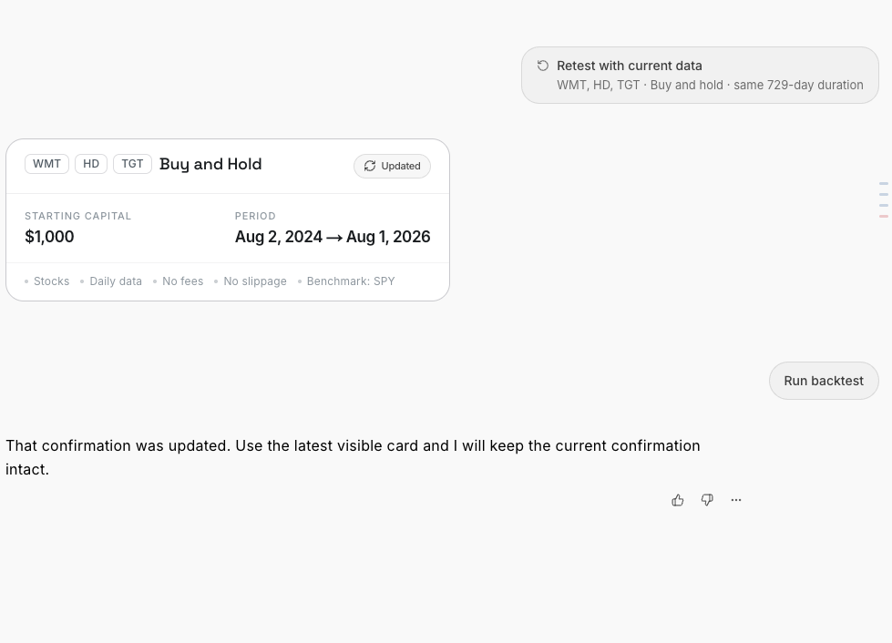

Evidence SHA-256: `094525d3e139c7c95a74f0d28f059d26d0e44696c8104ec016ee6e6700bb599a`

#### Intended journey

1. Activate “Retest with current data” from Omnisearch.
2. Review the inherited setup with its period advanced to current available data.
3. Run the updated backtest and receive a new durable result.

#### Observed issues

1. The updated confirmation rendered, but the subsequent Run request did not produce a backtest result.
2. The recovery did not fulfill or clearly recover the user's explicit Run intent.
3. Argus responded: “That confirmation was updated. Use the latest visible card and I will keep the current confirmation intact.”
4. That response appears unrelated to the submitted Run action and may be stale or incorrectly applied confirmation-recovery behavior.

#### Unknowns to investigate later

1. Is the quoted confirmation-preservation response obsolete behavior that should be retired?
2. Which action, lifecycle, stale-confirmation, or recovery boundary selected that message after an explicit Run request?
3. What is the blast radius: Omnisearch Retest only, all replacement confirmations, stale Run actions, or broader action-message reconciliation?
4. Did the backend reject the Run before creating a job, or did a created job fail to project into the conversation?

#### Commendations

1. The structured Retest token chip rendered successfully rather than exposing raw generated prompt text.
2. The confirmation inherited WMT, HD, TGT, $1,000, daily data, SPY, and buy-and-hold identity.
3. The confirmation visibly advanced the period to August 2, 2024 through August 1, 2026 while retaining the displayed 729-day duration assumption.

#### Founder request — Retest chip wording

1. The Retest token should show the date transformation, for example: `<original period> → Aug 2, 2024 – Aug 1, 2026`.
2. It should also describe duration naturally instead of relying only on a robotic exact-day count.
3. Candidate language includes “roughly two years,” “~2 years,” “almost two years,” or “24 months plus the exact delta.” The final voice remains undecided and should be chosen for clarity rather than false precision.

#### Unresolved product decision — meaning of current data

1. **Shifted window:** preserve the frozen run's duration and move both endpoints forward to the latest available date.
2. **Extended window:** preserve the original beginning date and extend only the end date to the latest available date.
3. **Explicit choice:** support both interpretations and let the user choose when intent is ambiguous.
4. No option is locked by this evidence. The product contract must decide the default and disclosure before implementation.

#### Required truth regardless of the decision

1. The chip and confirmation must disclose the original and updated periods clearly.
2. The selected transformation must preserve every unrelated owned assumption.
3. Run must target the exact reviewed replacement confirmation and produce one durable job/result or one truthful, adjacent recovery state.

### S-13 — Non-backtest Omnisearch previews waste space and shortcut guidance drifts

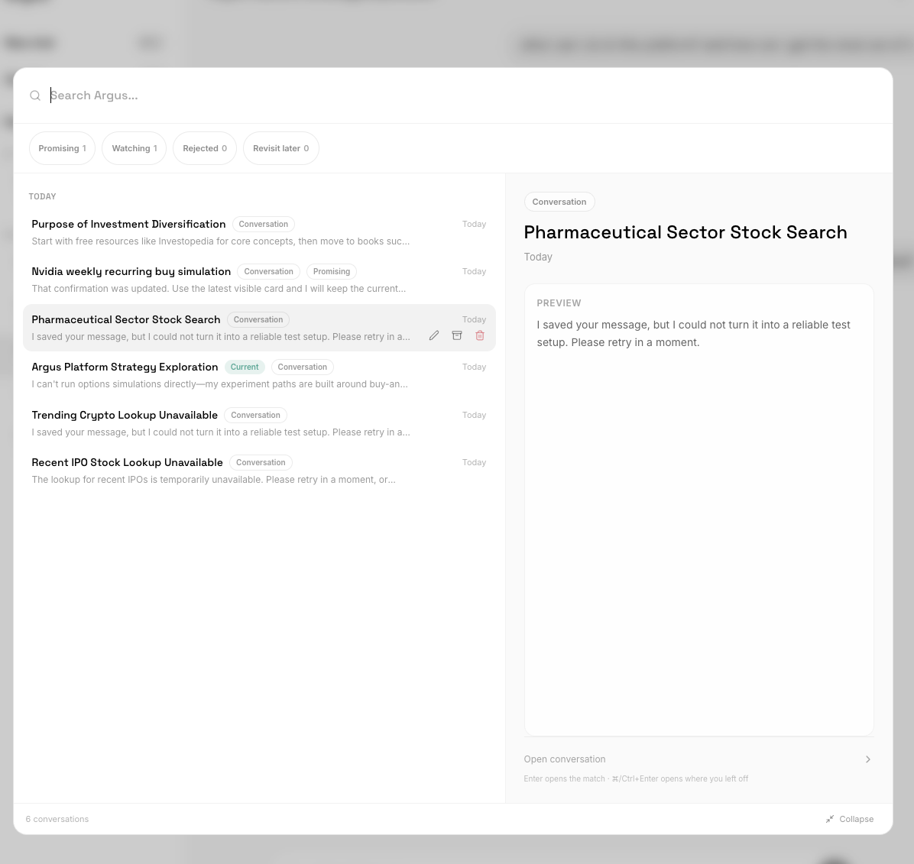

Evidence SHA-256: `135d14e5e3435c526479f117f2d3b9006580e3d68fb4b6f8a4b81b9c9325f8bb`

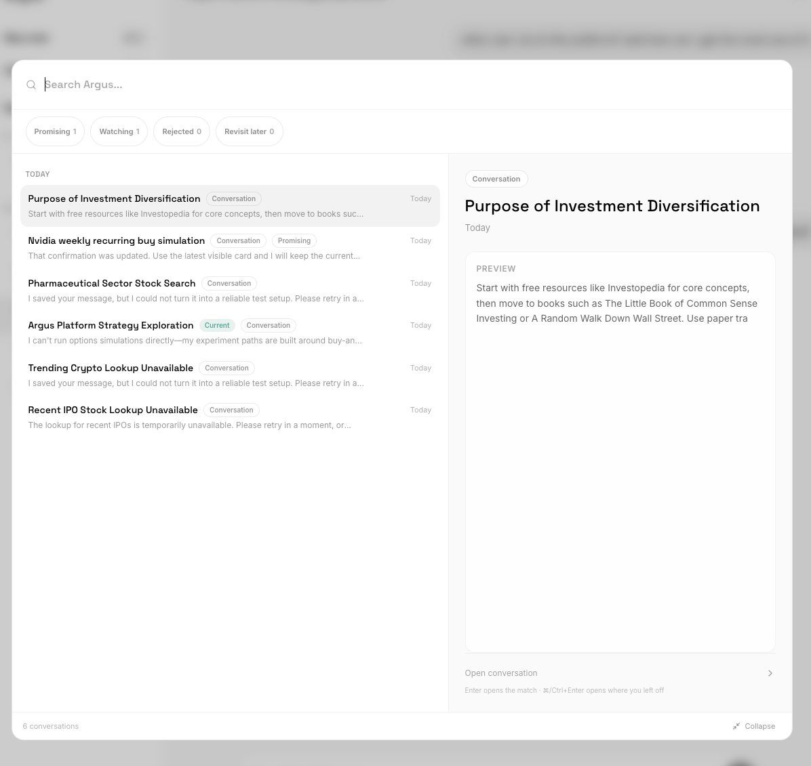

Evidence SHA-256: `acca1b07dc884c2e8e18f0695672aa6d62620a1b611fc3f4305bcc8595216a8d`

Evidence SHA-256: `df54999673254225c289a657716f21fdfa9c97a17c20a5000bdb14c8b9f85603`

#### Observed issues

1. Conversations without backtest artifacts render a disproportionately large preview card and right pane containing mostly blank space.
2. Longer conversational text is cut off even though the pane retains substantial unused vertical space.
3. The footnote “Enter opens the match · ⌘/Ctrl+Enter opens where you left off” is not presented consistently across observed preview types, including non-backtest conversations and conversations containing backtests.

#### Founder requests — preview reconciliation

1. Define a useful non-backtest conversation preview instead of forcing it into a backtest-sized dossier shell.
2. Size the preview coherently for the available content while maintaining a stable overall Omnisearch layout.
3. For longer prose, consider reusing the Omnisearch notes pattern with a “See more / See less” disclosure rather than clipping text or leaving a permanently oversized empty panel.
4. “See more / See less” is a candidate interaction, not yet a locked implementation requirement.

#### Founder requests — shortcut discoverability

1. Add Omnisearch shortcut hints for actions already exposed on hover, including Rename, Archive, and Delete, alongside the existing Enter navigation behavior.
2. Remove and replace the current “Enter opens the match · ⌘/Ctrl+Enter opens where you left off” sentence; do not display both treatments.
3. Place the replacement shortcut legend in the footer region shared with the conversation count and Collapse control.
4. The shortcut group should begin at the left edge of the right-pane footer region and remain visually right-side weighted without colliding with Collapse.
5. Use the existing compact pattern `Action [symbol or shortcut]`, such as `Go [↵]` or `Rename [shortcut]`, and remain consistent with established shortcut visuals.
6. Footer guidance must remain consistent regardless of whether the selected conversation has a backtest artifact.

#### Unresolved product decision — whether a shortcut legend should exist

1. The shortcut legend itself is not approved yet.
2. Challenge it against `docs/PRODUCT.md`: reject it if it adds redundant chrome, distracts from fast conversation retrieval, or advertises actions that are not actually implemented.
3. If the existing controls already make the workflow obvious, removing the sentence without adding a persistent legend remains a valid disposition.

##### Option A — contextual legend

1. Keep the legend hidden by default.
2. Reveal it while the user holds Cmd/Ctrl and when the relevant action region is hovered.
3. Collapse remains persistent and is excluded from hover-triggered hiding because it controls the Omnisearch surface itself.

##### Option B — persistent interactive legend

1. Keep the compact legend visible and make each action clickable as well as keyboard-accessible.
2. Clicked actions apply to the currently selected conversation row; on cold start they apply to the default selected row.
3. Archive and Delete must retain the same recoverable behavior and safety contract as their corresponding row-hover actions.
4. The persistent legend must not compete with Collapse or make the footer feel like a second toolbar.

##### Shared result-number shortcut behavior

1. While Cmd/Ctrl is held, enumerate the visible search results from top to bottom using `1` through `9`.
2. Temporarily replace each row's date with its command-number hint; restore the date when the modifier is released.
3. The normal date remains top-aligned. The temporary command hint should be vertically centered, anchored to the far-right side of the row, and inset enough to preserve breathing room inside the row highlight.
4. Number hints must track the current visible result ordering and must not activate hidden or filtered rows.

##### Decision criteria

1. Every displayed shortcut must work through both its keyboard path and any displayed click target.
2. The chosen approach must reduce time to act without making Omnisearch denser or harder to scan.
3. Keyboard hints must remain discoverable, localized where necessary, and platform-correct on macOS and Windows/Linux.

#### Commendation

1. ⌘/Ctrl+Enter successfully navigated to the focused conversation.

#### Unknowns to investigate later

1. Which preview data is available for artifact-free conversations, and which content is being truncated by projection versus CSS layout?
2. Which keyboard bindings already exist for Rename, Archive, and Delete, and which would require new behavior rather than merely exposing existing shortcuts?
3. How should the legend adapt on Windows/Linux while preserving the same actions and spatial hierarchy?

## Final read-only audit boundary

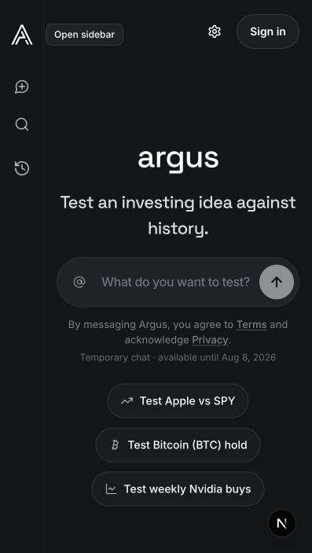

Evidence SHA-256: `74829ed098b91fb5d3fc56c3f342367b047a0783b017a637a7d67bb4a68a70a8`

1. The final read-only audit could not access the founder's signed-in profile. The available in-app browser showed a fresh Guest session, and no connected Chrome profile was available.
2. Authentication state was not copied, inspected, or transferred. Safari and the founder's signed-in browser were not disturbed.
3. No additional product finding was claimed from this boundary screenshot.
4. The browser audit was finalized and the lane-owned frontend, backend, workflow service, and isolated Supabase containers were stopped after evidence capture.

## Lock-time ambiguity register

The findings above are sufficiently concrete for technical diagnosis except for the following product decisions. These decisions should be resolved before a cloud implementation agent is expected to deliver a final PR autonomously.

### Founder decisions still required

1. **S-03 usage colors:** choose the green/amber/red thresholds and how hourly versus daily exhaustion controls the displayed state. Color must not be the only signal.
2. **S-08 discovery expansion:** choose which current financial-event categories belong in the next bounded slice. Upcoming earnings, corporate events, and central-bank actions should not all become one implementation by default.
3. **S-10 fractional months:** decide whether Argus should support fractional-month arithmetic deterministically or ask for clarification. If supported, define the calendar rule instead of relying on model approximation.
4. **S-12 Retest with current data:** choose shifted window, extended window, or an explicit user choice as the default contract.
5. **S-13 shortcut system:** decide whether no legend, a contextual legend, or a persistent interactive legend best fits `docs/PRODUCT.md`; then lock the actual shortcut map.

### No further founder clarification required before diagnosis

1. Asset/fact continuity, stale attention state, structured action presentation, compound edits, modeled-cost preservation, Retry behavior, result-follow-up ownership, Recents visibility, Mark as unread, and menu-highlight consistency have clear expected outcomes in this report.
2. Grounded-search failures require typed-route, provider, lifecycle, and environment diagnosis, but not another taste decision for the existing supported discovery path.
3. Guest quota behavior requires reading the authoritative allowance and reset contracts. The requested product outcome—two Guest backtests and conversion gating on the third—is already clear.
4. G-04 is closed within this report as expected quiet calendar alignment, not an implementation issue.

## Lock declaration

1. This report is the immutable evidence baseline for the August 1, 2026 current-checkpoint assessment.
2. Historical PRs and commits document intent and prior acceptance only. They do not authorize reverting, cherry-picking, or reconstructing historical implementations.
3. Root causes remain unproven unless this report explicitly states otherwise.
4. Future corrections, diagnoses, or product decisions should be recorded in linked GitHub issues or an append-only addendum rather than rewriting the observations above.

## Founder clarification addendum — 2026-08-01

This addendum supersedes only the corresponding entries in the lock-time
ambiguity register. It does not rewrite the evidence or claim new root causes.

### S-03 usage meter is governed by the Argus design system

1. S-03 no longer requires a founder threshold decision.
2. `.agent/designs/argus/DESIGN.md` now owns the deterministic traffic-meter
   contract: the most constrained active hourly/daily window governs; more than
   50% remaining is muted teal, more than 20% through 50% is dusty gold, and
   20% or less is muted rose.
3. Exact remaining counts and truthful reset times remain visible so color is
   never the only signal. The treatment must remain calm and non-gamified.

### S-08 discovery category diagnosis and requested IPO coverage

1. Before changing recovery or provider code, diagnose whether recent-IPO and
   trending-crypto requests reached the typed discovery route, whether the
   category is supported, and whether the configured search provider was
   available.
2. Do not assume the IPO failure was a provider outage or runtime crash if
   recent IPOs are currently outside the allowed discovery category contract.
3. If recent IPO lookup is not supported, add it as an explicit desired
   grounded-discovery category with source freshness and candidate-validation
   acceptance. The existing screenshot is evidence of the requested outcome,
   not proof of the missing boundary.
4. Broader earnings, corporate-event, and central-bank expansion remains
   separate future product slicing. Do not combine all categories into one
   repair merely because they share a search provider.

### G-04 disposition accepted

1. The March 1 to March 2, 2026 shift remains expected quiet Sunday-to-session
   calendar alignment.
2. G-04 stays closed within this report and must not become a GitHub defect.

### Cloud execution disposition

1. Do not introduce a new issue-label taxonomy for this audit.
2. Determine cloud suitability from the task's actual dependencies and stop
   conditions. A task is cloud-runnable end to end when its expected behavior
   is locked, the safe QA environment can exercise its dependencies, and it
   needs no hosted or destructive mutation.
3. The approved all-purpose environment includes an isolated Supabase stack,
   disposable Guest and registered identities, a browser-accessible app,
   synthetic deterministic mode, budget-scoped OpenRouter/Perplexity/market
   data credentials, integration feature flags, and sanitized artifact
   storage. Production credentials and hosted writes remain excluded.
4. Agents own disposable QA wiring. They may correct process flags, CORS,
   ports, local CAPTCHA tokens, database-reset ordering, stale services, and
   fixtures, then rerun provider-free preflights without asking the founder.
5. Stop only for an unresolved product decision, unavailable external
   capability, hosted/destructive authority, or exhausted provider cap. Do not
   present ordinary QA setup as a product blocker.

### Reusable audit workflow

1. The approved reusable workflow is stored at
   `.agent/skills/argus-experience-audit/SKILL.md` so cloud agents can load it
   from the repository.
2. It requires founder intent, exact actions, Guest/signed-in personas, visible
   and typed evidence, screenshot hashes, protected commendations, prohibited
   outcomes, current-head revalidation, cleanup, and provider-budget limits.
3. Historical PR and commit lineage remains reference evidence only.
4. Figma duplication is intentionally skipped; the locked Markdown report is
   the engineering source of truth.

### Founder decisions that remain

1. S-10 fractional-month arithmetic or clarification policy.
2. S-12 default meaning of “Retest with current data.”
3. S-13 Omnisearch shortcut treatment after applying the `docs/PRODUCT.md`
   decision filter.
