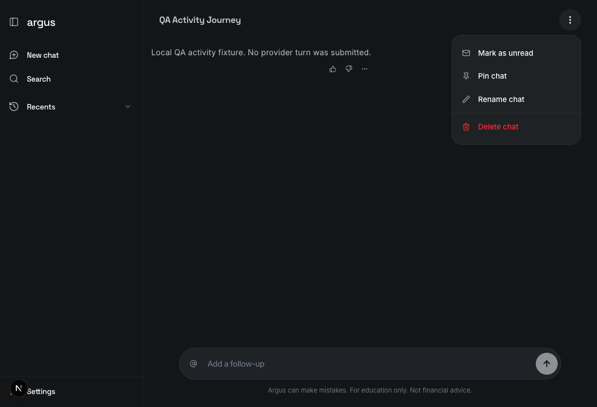
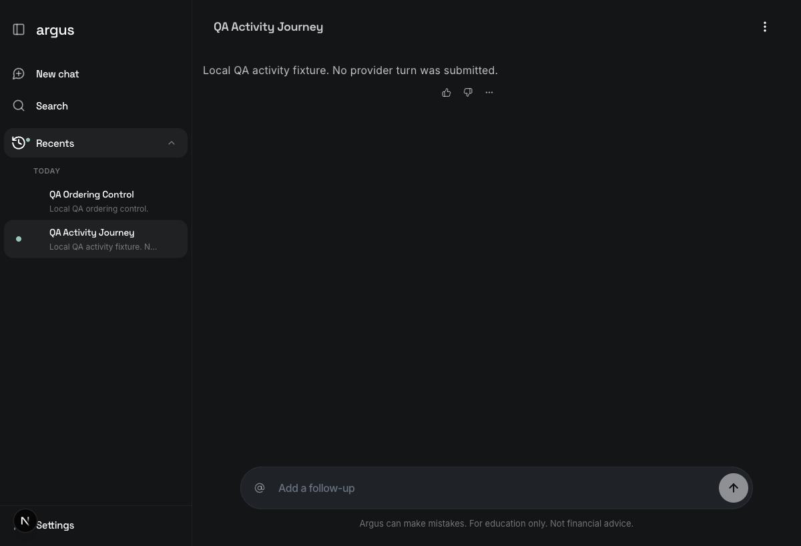
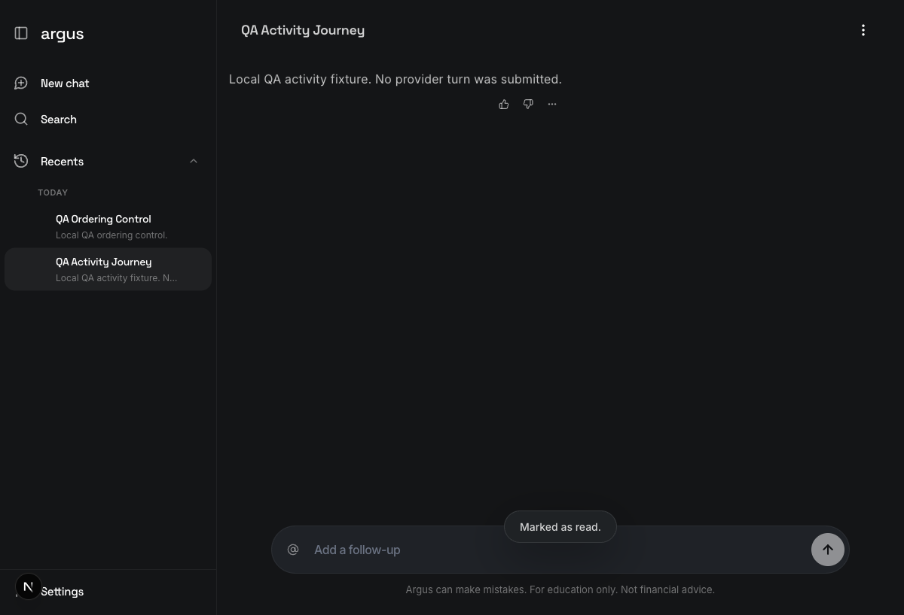
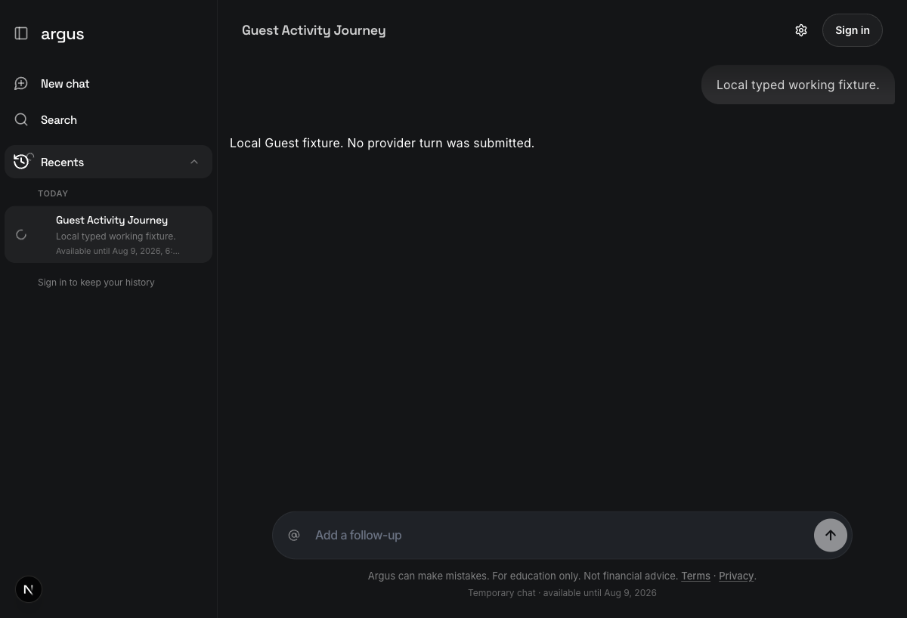

# Issue #349 conversation activity verification

## Audit identity

- Branch: `codex/issue-349-conversation-activity-proof`
- Exact product SHA: `ba6649ea99f36fe7b3b4867cfe31f333e029c4c5`
- Date: 2026-08-02
- Personas: one disposable allowlisted registered account and one disposable
  verified Supabase anonymous Guest
- Environment: local-only Next.js `http://localhost:3001`, FastAPI
  `http://localhost:8001`, and the loopback Supabase CLI stack
- Backend overrides: `ARGUS_PERSISTENCE_MODE=supabase`,
  `ARGUS_DEV_MEMORY_FALLBACK=false`,
  `ARGUS_MARKET_DATA_PROVIDER_MODE=synthetic_unit_fixture`,
  `ARGUS_CHECKPOINTER_MODE=memory`, `ARGUS_MOCK_AUTH=false`,
  `ARGUS_CORS_ALLOW_ORIGINS=http://localhost:3001`, Guest access enabled,
  provider credentials blanked for the launched process
- Frontend overrides: `NEXT_PUBLIC_ARGUS_API_URL=http://localhost:8001/api/v1`,
  `NEXT_PUBLIC_MOCK_AUTH=false`,
  `NEXT_PUBLIC_ARGUS_LOCAL_QA_CAPTCHA_TOKEN=argus-local-browser-qa`, and
  `NEXT_PUBLIC_GUEST_ACCESS_ENABLED=true`
- Provider turn and cost cap: zero turns; zero cost

The checked-in product, API, migration, test, and environment templates were
not changed. Local fixture rows were inserted only into the reset loopback
database so the real UI could render lifecycle states without submitting a
chat turn.

## Verification tuple

| Surface | Request / durable fact | Result |
| --- | --- | --- |
| Migration | Local/applied migration history | `20260801000000` present on both sides |
| Registered auth | Real UI sign-in; `/auth/login`; `/me` | `200`; `200`; `200` |
| Registered create | Real authenticated `/conversations` | `200` |
| Manual unread | UI `PATCH .../activity` | `200`; `manual_unread_at` non-null |
| Reload | Full browser reload | Recents exposed `Marked unread` |
| Manual read | UI `PATCH .../activity` | `200`; `manual_unread_at` null |
| Ordering | Conversation timestamp and source order | both unchanged across read-state writes |
| Guest bootstrap/create | Real `/auth/guest`; real `/conversations` | `200` Guest; `200` |
| Guest working | Typed running lifecycle | Recents `Working`; open-chat working status |
| Guest needs input | `GET .../activity` off-chat | `200`, `needs_input`, cursor present |
| Guest read | Direct owner-scoped `mark_read` with that cursor | `200`, then `none` |
| Guest needs attention | Newer typed recoverable failure; `GET .../activity` | `200`, `needs_attention`, cursor present |
| Guest manual unread | Direct `mark_unread` | `403 account_conversion_required` |
| Guest boundary stability | GET after rejected manual unread | `200`, still `needs_attention` |
| Cost/execution | Rows owned by the two personas | 0 CostLedger entries, 0 jobs, 0 runs |

No UUID, token, cookie, email address, password, provider key, or database URL
is retained in this report or its screenshots.

## Scenario register

| ID | Journey | Persona | Result | Disposition | Evidence |
| --- | --- | --- | --- | --- | --- |
| REG-01 | Mark open conversation unread | Registered | Passed | Proven | UI, activity PATCH, durable row |
| REG-02 | Reload and retain manual reminder | Registered | Passed | Proven | Recents label and screenshot |
| REG-03 | Mark read without reordering | Registered | Passed | Proven | UI, activity PATCH, DB comparison |
| GST-01 | Render typed working state | Guest | Passed | Observed and proven | Recents/open-chat screenshot and DB lifecycle |
| GST-02 | Read typed needs-input activity | Guest | Passed | Proven | GET/PATCH comparison and DB row |
| GST-03 | Reject manual unread | Guest | Passed | Proven | direct 403 plus unchanged projection |

## Registered UI-to-database journey

### Expected

The accepted specification makes manual unread registered-only, durable, and
independent from conversation recency. Reload must retain the reminder, and an
explicit Mark as read must clear it without touching conversation ordering.

### Observed

1. A disposable allowlisted account was created through the real local
   `/auth/signup` endpoint and signed in through the actual UI.
2. The authenticated browser created a conversation through the real API. A
   local assistant fixture made it visible without a user chat submission.
3. The header owner menu exposed **Mark as unread** as its first action.
4. Selecting it produced a `200` activity PATCH and the UI announced
   `Marked as unread.`
5. After a full reload, the Recents row accessible label was
   `QA Activity Journey. Marked unread.`
6. The same owner menu then exposed **Mark as read**. Selecting it produced a
   second `200` PATCH, removed the dot/label, and announced `Marked as read.`

### Proven durable comparison

- Before Mark as unread, the conversation projection was idle/read.
- After Mark as unread, `manual_unread_at` was non-null and all three
  read-through fields remained null.
- After Mark as read, `manual_unread_at` was null and the read-through fields
  remained null, as expected for clearing a manual-only reminder.
- The conversation `updated_at` stayed exactly
  `2026-08-02T11:22:26.736809Z` through both read-state writes.
- The two-row source order stayed `QA Ordering Control`, then
  `QA Activity Journey` before and after the clear.

### Screenshots

Owner menu before the mutation:



SHA-256: `d413b634775e69eb9b97c03ecff6dd5ab10cd9236d31507625e0a9b6e5664db2`

Durable reminder after full reload, with the control row still ahead:



SHA-256: `1beafde802c2cc225f90b3fa46b1b541e1abd05f9385146511b54bfb77a1b55d`

Explicit clear with the order preserved:



SHA-256: `bd48ec2943ec814d34e9afea371cf5672ea80e316119a0649618ec72c1f4f34d`

## Guest applicability

| Issue state | Guest applicability | Current-head evidence | Classification |
| --- | --- | --- | --- |
| `working` | Supported automatically | Typed `running` lifecycle projected `Working` in Recents and an open-chat working status | Observed and proven |
| `needs_attention` | Supported automatically | Off-chat GET returned `200 needs_attention` with a cursor for a typed recoverable failure | Proven |
| `needs_input` | Supported automatically | Off-chat GET returned `200 needs_input` with a cursor for typed `await_user_reply` | Proven |
| `read` | Supported automatically and explicitly | Latest-visible UI auto-cleared the first terminal state; a controlled cursor PATCH also returned `200 none`, and all DB read-through fields became non-null | Proven |
| `manual_unread` | Registered-only | No Guest owner menu or row overflow was rendered; direct PATCH returned `403 account_conversion_required`, and a following GET remained `needs_attention` | Proven boundary |

The first needs-input fixture became read while the Guest was viewing the
latest sentinel. The controlled comparison was therefore repeated off-chat:
the state first returned `needs_input`, then the exact server-issued cursor was
sent to `mark_read`, which returned `200` and `none`. This isolates the read
transition instead of treating the earlier correlated render as causal proof.

### Guest screenshot

The same screenshot shows all three visible Guest facts: a working ring/label,
no Recents overflow target, and no header owner menu.



SHA-256: `944b0d38105cb3d80adb92c7188e0a788d9c0ebfc215ee8e0e4dcc193dfb9906`

## Commands and migration parity

The verification used the following checked-in boundaries:

```bash
bash scripts/qa/write-local-env.sh
bash scripts/qa/assert-nonprod-target.sh
bash .github/setup-worktree-env.sh --check "$PWD"
supabase migration list --local
```

The environment files were regular worktree-local files, every auth/database
target passed the non-production guard, and migration `20260801000000` appeared
in both local and applied history. FastAPI and Next.js were then launched on
lane-owned ports 8001 and 3001 with the flags in Audit identity.

Browser actions used the Playwright CLI against the real UI. Local typed
lifecycle fixtures and boolean-only DB assertions used the repository's
existing Python/psycopg runtime against the loopback `DB_URL` emitted by the
Supabase CLI; the value was never printed or persisted.

The current-head deterministic browser matrix had already passed in Task 1:
`11 passed` across English, Spanish, desktop, mobile, keyboard,
reduced-motion, typed activity, and read/unread menu journeys. Task 2 had
already passed `8` real Postgres/RLS tests plus `56` projection, migration, and
Guest-policy tests after the same local reset.

## Evidence language register

### Observed

- The registered UI exposed the unread/read owner actions and their toasts.
- The reloaded registered Recents row visibly retained the manual reminder.
- The Guest UI visibly rendered working state and omitted owner controls.

### Proven

- The two registered UI mutations each returned `200` and matched the durable
  before/after read row.
- Manual read/unread did not change `conversations.updated_at` or the two-row
  source ordering.
- Guest typed `needs_input` and `needs_attention` came from canonical lifecycle
  metadata/status, not message wording.
- Guest `mark_read` returned `200` and persisted its cursor boundary.
- Guest `mark_unread` returned the required 403 and did not change attention.
- The two personas produced no CostLedger row, backtest job, or run.

### Expected

- Registered manual unread is durable and registered-only.
- Guests share automatic working, needs-input, needs-attention, and read
  behavior, while owner-management controls stay absent.
- Read-state writes do not own conversation recency.

### Inferred

- No implementation conclusion relies on inference. The visible, request, and
  durable-state surfaces were compared directly.

### Unknown

- Hosted deployment behavior, cross-device refresh, and tester exposure were
  not exercised. They are outside this local-only proof.
- This report does not claim a provider-backed conversation turn or hosted
  migration readback.

## Cost and mutation register

- Provider turns: `0`
- Provider cost / CostLedger entries: `0 / 0`
- Jobs / runs: `0 / 0`
- Chat submissions: `0`
- Hosted mutations: `0`
- Local mutations: two disposable identities, three conversations, and typed
  fixture/read-state rows in the reset loopback database only
- Product/API/migration/test/env-template changes: `0`

## Cleanup

The registered and Guest browser sessions were closed, lane-owned frontend and
backend processes were stopped, and the two disposable local Auth identities
were removed after evidence capture. Worktree-local `.env` files remain
untracked local QA topology and are not part of this report commit.

## Lock declaration

This report is the immutable local evidence baseline for product SHA
`ba6649ea99f36fe7b3b4867cfe31f333e029c4c5`. Record later hosted evidence,
decisions, or corrections in an append-only addendum.
