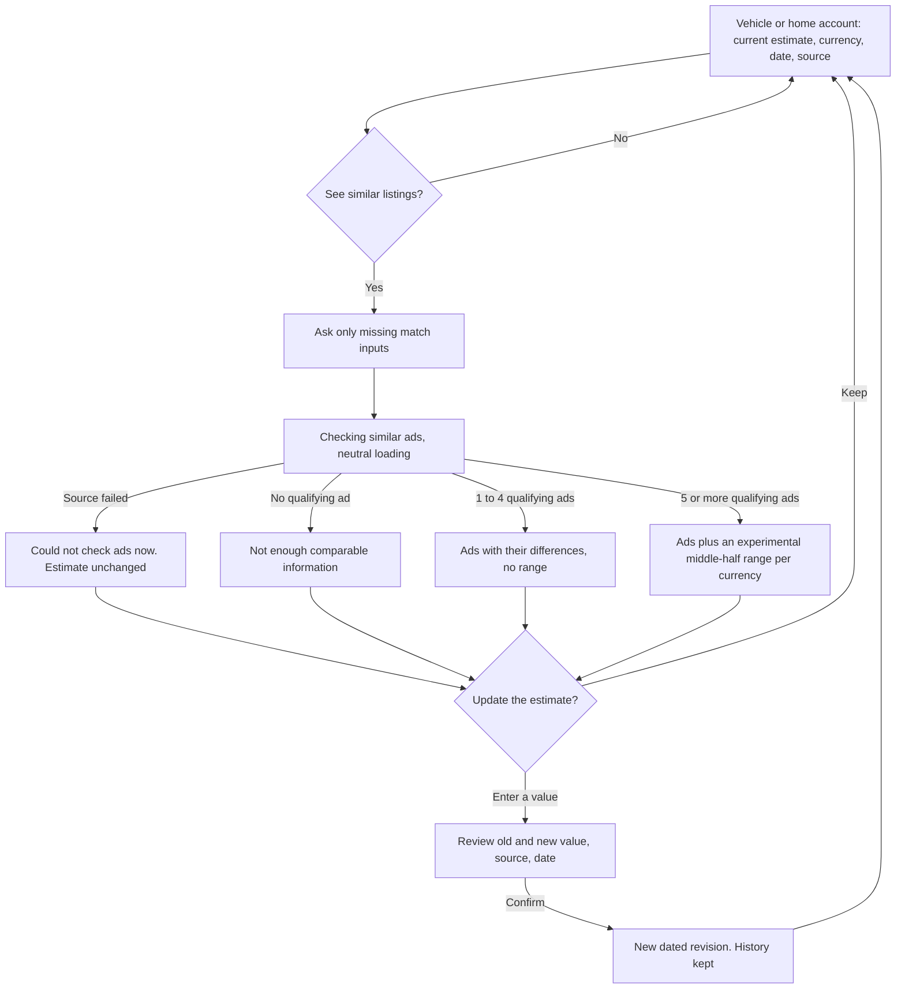
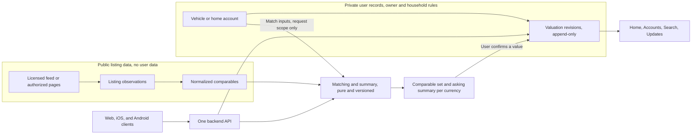

# What Dominican listing sites can support for asset values

This report answers one question. Can SuperCarros and SuperCasas listings help an Argus user review the estimated value of a vehicle or home they own? It covers access, reuse, and open legal questions, a bounded live sample, what the data can honestly support, a recommended journey, code reuse, and a scoped next step. It changes no product decision and no runtime code.

The audit read `origin/codex/private-alpha-next` at `f0a90763b79e5625ac0a4789cdfa171cda023963` on 2026-09-27. The run record, sanitized evidence, synthetic fixtures, and scripts live in [the evidence folder](evidence/asset-listing-enrichment/README.md).

## Recommendation

- **Vehicles.** Prefer partnership or licensed access first. The pages are easy to read, and robots.txt allows the detail pages, but access is not reuse. Clause 4.1 of the operator's published terms reserves commercial reproduction, distribution, and public communication of the content to its authorization. robots.txt also disallows the search pages that would find same-year comparables. Until a written agreement exists, keep the manual estimate and let the user add comparable ads they found.
- **Residential property.** Use the simpler manual path. Record the user's estimate with its source, such as an appraisal, an insured value, or a purchase price. Even under a license, show at most a list of similar home ads, because the sampled ads mixed sale and rent prices, recorded areas as zero, and contradicted their own room counts.
- **Scrapling.** Do not adopt it. The pages are server-rendered HTML. Scrapling's parser produced the same output as BeautifulSoup on every sampled page. After a simulated markup change, its adaptive mode returned the accessories list or the seller contact list in place of the specifications. Its fetchers imitate a browser by default, which this work must not do.
- **Market value.** Argus should never present a market value derived from asking prices. A list of similar ads is supportable with access. An asking-price range is an unvalidated experimental proposal, for vehicles only, and it must meet the requirements in this report before anyone tests it. A value estimate is not supportable from these sources.

Three facts drive that verdict.

1. Both sites belong to Cibermercado S.R.L. Their terms, read on 2026-09-27, require the company's authorization for commercial reproduction or public communication of the content. robots.txt governs crawling, not reuse.
2. The robots.txt files disallow `/buscar/` and `/buscador/` on both sites. The sitemap is the inventory a crawler may read, and its URLs name a model or a sector with no year, price, or size. Finding same-year comparables therefore means fetching every detail page of a model.
3. No sampled page shows a listing date, a sold status, or any damage or title field. Vehicle prices come in both US$ and RD$, even within one model.

### A publication gap, not an open decision

The founder approved vehicle and residential-property records, with optional ownership shares and linked debt, on 2026-09-27. That decision is not yet published at the audited commit. There, the MVEE minimum account list reads "cash, checking, savings, investments, credit cards, and other debts", and the decision log has no entry for the approval. The exact-commit findings in this report and in [the canon map](evidence/asset-listing-enrichment/canon-map.md) describe that commit and stay as recorded. This report does not restate the approval as canon. The delivery lead owns its publication in the MVEE and the decision log.

## What was tested and what was inferred

Tested on 2026-09-27:

- 33 live requests, all HTTP 200. They covered robots.txt, sitemaps, home pages, terms, the search values scripts, one category page, and the detail pages.
- Ten detail pages per site, drawn with a fixed seed from the sitemaps.
- Two parsers on the same cached pages, with timing, output comparison, and a markup-change test.
- Listing density per model and per property type and sector, computed from the sitemaps alone.
- Offline checks of both parsers on two synthetic fixtures, which any reviewer can rerun without the sites.

Inferred and labeled as such below:

- What the sitemap `lastmod` date and a hidden page timestamp mean.
- The dealer share of vehicle inventory, from 10 pages.
- Crawl durations, which are arithmetic on the 4-second spacing.
- Market facts from the web sources the report cites.

Nothing here measures market coverage, long-term reliability, or valuation accuracy.

## Access paths compared

| Path | SuperCarros | SuperCasas | Reuse position | Verdict |
| --- | --- | --- | --- | --- |
| A. Documented API, feed, or license | None published. The site footer offers dealer tools. Web searches found no feed, export, or data license. | Same operator and same finding. A Dominican real estate CRM syncs listings to other portals but not to SuperCasas. | An agreement would set display, attribution, caching, and retention. | First choice for any automated comparables. One conversation covers both sites. |
| B. Plain HTTP and a parser | Technically works. Server-rendered pages, stable labels, 156.5 ms median per page. Search pages are disallowed, so discovery goes through a 5.0 MB sitemap of 29,638 listings. | Technically works. Same template family, 146 ms median. The sitemap lists 19,774 listings with no sale-or-rent marker. | Clause 4.1 reserves commercial reproduction to Cibermercado's authorization, and Argus has none. Whether a given display falls under the clause is a question for counsel. | Only after written authorization. |
| C. Scrapling | Same output as plain parsing. Adds a dependency tree and stealth defaults. | Same. | Same as B. Its stealth features also conflict with the audit rules. | Not recommended. |
| D. Browser automation | Not needed. The data is in the first HTML response. | Not needed. | Same as B. | Not recommended. |
| E. User-supplied comparables | The user types an asking price, currency, year, trim, mileage, and an optional link. Argus fetches nothing. | The user records an appraisal, insured value, purchase price, or ads they found. | Argus copies no third-party content. | Recommended now. |

## Access, reuse, and legal interpretation are separate questions

**Access.** This is what the audit observed on 2026-09-27. The robots.txt files on both brands' hosts allowed a generic crawler to read the detail pages, sitemaps, home pages, and terms pages, and disallowed search. They fully disallow GPTBot, CCBot, ia_archiver, and omgili. Every request succeeded without a challenge. robots.txt states crawl preferences. It grants no license and says nothing about reuse.

**Commercial reuse.** This comes from the terms both sites published, read on 2026-09-27.

- Clause 1.1 says that accessing or using the site makes a person a user who accepts the terms.
- Clause 4.1 claims Cibermercado's rights over the pages and their contents. It prohibits commercial reproduction, distribution, and public communication of all or part of the contents without the company's authorization. It allows viewing, printing, copying, and storing for personal and private use only.
- Clause 2.3 limits a user's access to information while it remains current.

Argus holds no authorization.

**Unresolved legal interpretation.** Web research on 2026-09-27 found no Dominican court decision or regulator guidance on scraping. It read the statutes below. Each summary restates the text, and each question is for counsel.

- Ley 172-13 on personal data, from the official text on presidencia.gob.do. Article 6 defines personal data as information about identified or identifiable people. Article 6(14) defines sources open to public access, and Article 27(1) exempts data from those sources from the consent requirement. Is a private classifieds site such a source for seller names and phone numbers?
- Ley 74-25, the Penal Code, from the official text on the judiciary's site. Article 198 penalizes knowingly collecting, retaining, or selling another person's data by automated procedures without consent. Article 199 extends liability to companies, and prosecution requires the affected person's complaint. Infobae reported the code in force from 2026-08-03. Does Article 198 reach a system that stores listing facts but no seller identity?
- Ley 53-07 on high-technology crimes, from the text hosted by the OAS. Article 6 penalizes access that exceeds an authorization. Do terms of use or robots.txt define that authorization for public pages?
- Ley 65-00 on copyright, from the text hosted by the customs agency. Article 2 protects photographs and databases whose selection or arrangement is creative, but not the underlying data. The research found no separate database right in the text. Does Cibermercado's compilation qualify?

**This audit's risk assessment.** This is not a legal conclusion. Seller data carries the most risk, so any future fetch must drop seller fields before storage. The committed evidence holds none. [The web research record](evidence/asset-listing-enrichment/web-research.md) links each source.

Public reference values exist, but none is a market price. DGII publishes a vehicle value in RD$ per make, model, and year as the base for the transfer tax, with no API or export. The Catastro publishes land values per m² by municipality. Bank appraisals and insured values are private documents the owner holds. Each can become a manual source kind with its own date. Corotos, another large Dominican classifieds site, prohibits scraping and crawling in its legal page.

## Tooling compared

| Measure | `urllib` and BeautifulSoup 4.15.0 with lxml 6.1.3 | Scrapling 0.4.15 core | Browser automation |
| --- | --- | --- | --- |
| Python 3.10.20, the repo pin | Installs and runs | Installs and runs. Requires Python 3.10 or later | Not run |
| Packages added | `beautifulsoup4`, `lxml`, `soupsieve` | `lxml`, `cssselect`, `orjson`, `tld`, `w3lib`. The `fetchers` extra adds `curl_cffi`, `playwright`, `patchright`, `browserforge`, and fingerprint data | A browser download |
| Median parse time per page | About 12 to 13 ms | About 1 ms | Not run |
| Output on the 20 pages | Identical | Identical | Not run |
| After a class rename | 0 of 240 values with class selectors. 230 of 240 with label lookup | 0 of 240. Adaptive mode returned the accessories list or the seller contact list | Not run |
| Needed for these pages | Sufficient | No | No |

Parse time does not matter here. The 4-second spacing costs about 300 times more per page than the slower parser, and timings varied by about 20 percent between two runs on the same laptop. `poetry.lock` already holds `httpx` 0.28.1, but `pyproject.toml` declares it only for development, so a future adapter must declare it for runtime and add one parser dependency. The adapter should look up fields by their visible labels inside the listing block, because a label survived both markup changes that broke class selectors.

Scrapling's plain `Fetcher` defaults to `impersonate="chrome"` and `stealthy_headers=True`, which sends a Google referer. Its README advertises bypassing Cloudflare Turnstile, and its spider's `robots_txt_obey` defaults to `False`. Its adaptive storage writes element text to `elements_storage.db` inside the package directory unless a path is passed. Returning the seller contact list during relocation makes that storage a personal-data risk as well as a correctness one. The project shipped 25 releases in 12 months, and one author holds almost all commits. None of this makes it unusable as a parser. It adds weight and risk that this work does not need.

## What the sample found

### Vehicles

Every page had the same 14 specification labels, including `Precio:`, `Uso:` for mileage, `Condición:`, fuel, transmission, and traction. Year, make, and model parse from the title on all ten. The site's own brand IDs resolve the make.

- Trim is free text after the model name. It was present on 6 of 10 titles. The site's search values script has no trim list to match against.
- Mileage was `N/D` on 5 of 10 pages. The meta description printed `0.00` for those same five, so only the visible field is safe. Units were miles on 7 pages and kilometers on 3.
- Prices were US$ on 8 pages and RD$ on 2. The five recent CR-V ads split four in US$ and one in RD$.
- No page has a damage, accident, title, or ownership-history field. Three pages ticked "Versión americana", an import-spec accessory.
- All ten pages linked to a dealer inventory. That hints at dealer-heavy inventory, which may skew asking prices upward, but ten pages cannot show it.
- The stale CR-V ad had a sitemap date 555 days old, was still live, and showed 1,098 visits.
- Each US$ page carries a peso amount computed by the site. The implied rate was 60.1 on all eight. SuperCasas used 59.8 on the same day. The source and date of either rate are unknown, so Argus must not reuse them.
- The "Fináncialo" block is a site-made payment estimate filled in by script. It is not the advertiser's price.

For a concrete case, the three US$ CR-V ads for model years 2021 and 2022 asked from US$28,500 to US$33,500 across three different trims. The RD$ ad for a 2021 CR-V could not join them without a dated exchange rate.

### Residential property

Every page had the same 10 specification labels, including `Construcción:` for built area, `Terreno:` for land, `Condición:`, `Año Construcción:`, and `Localización:`. Location reads as region and sector, with no street address in the structured fields.

- The sitemap slug does not say sale or rent, but the title does. The six Naco pages split four sale and two rent.
- Three pages carried more than one price, such as sale and furnished sale. One rental carried a "Venta" price of US$2,500 with no monthly marker.
- All 13 prices were in US$ in this sample. The category page showed an RD$ monthly rent, so both currencies occur.
- Built area was recorded as `0 Mt2` on one page. Land area read `0 Mt2` on every apartment.
- Two Naco sale ads asked the same US$520,000. One lists 72 m² and the other lists 0 m². A third lists 69 m² at US$175,000. At face value that is about US$7,200 per m² against about US$2,500.
- Year built was missing on 7 of 10 pages and floor on 7 of 10.
- The free text contradicted the bedroom field on 3 pages. Lost characters, likely emoji, appeared in 3 texts.
- The site's condition list includes "En Planos", two "En Construcción" codes, "Fideicomiso", and "Permuta". The sample showed only "Nueva" and "Segundo Uso", yet one "Nueva" Bávaro unit reads like pre-construction in its text.

### Both sites

- No sampled page shows when the ad was published or last changed. The sitemap `lastmod` and a page variable that decodes as a .NET timestamp agreed on the date for 8 of 10 SuperCasas pages and 3 of 10 SuperCarros pages. Their meaning is undocumented.
- A missing ad proves nothing about a sale. Clause 2.3 of the terms limits access to information while it remains current, so a license would need to say whether removed ads may be kept.
- The home and category pages show featured ads, such as the "SuperPropiedades" list. The sitemap has no featured order, but it keeps stale ads. About 7 percent of SuperCarros listing URLs and 14 percent of SuperCasas listing URLs had a `lastmod` more than a year old.
- Density is uneven. The median make and model has 3 SuperCarros listings, yet the 197 models with at least 30 listings hold 82 percent of inventory. Residential SuperCasas cells have the same shape. The median cell has 3 listings, and 83 cells hold 81 percent. Year and size split these cells further.

## What the data can honestly support

| Output | Vehicles | Residential property |
| --- | --- | --- |
| A list of comparable ads | Yes, with licensed access. Show each ad's differences from the user's car, such as year, trim, mileage, currency, and date seen. | Yes, with licensed access, for the same type, sector, and size band. Label sale and rent explicitly. |
| An indicative asking-price range | An unvalidated experimental proposal. A candidate only when at least 5 ads meet every requirement below. | Not proposed. |
| A market-value estimate | No. There are no sale prices, no damage data, and no measured gap between asking and selling prices. | No. The same gaps apply, and a home's price depends on facts no ad records reliably. |

The 5-ad floor is an experimental proposal with one mechanical basis. With linear interpolation, the NumPy default, the middle half of 5 sorted prices runs from the 2nd to the 4th price, so neither extreme ad sets an endpoint. It is not a sample size, a confidence level, or evidence of reliability. Five ads can still share one dealer's pricing, one trim, or one stale week. The next assignment measures whether any floor holds up. The floor may change, and the range may be dropped.

An ad counts as a vehicle comparable only when all of these hold:

- Make and model match by the site's own IDs, and the model year falls inside a window the study sets.
- Condition matches, so a used car is compared with used cars.
- Mileage is present, converted to kilometers, and inside a band the study sets. An ad with `N/D` mileage is listed but kept out of the range.
- Fuel and drivetrain match, or the ad shows the difference. Trim matches when the user gave one.
- The price is one cash asking price in the range's currency. Monthly prices, down payments, the site's payment estimate, and prices whose text calls them an "inicial" stay out.
- Argus saw the ad within a freshness window the study sets. The site shows no listing date, so this needs licensed dates or Argus's own first-seen date.
- Likely relists of the same car count once, and every outlier exclusion follows a written rule and keeps its reason.

A range is shown only when all of these hold:

- Parsing passed a manual audit with zero errors on price, currency, year, and mileage.
- The display names the count, the currency, the dates seen, the dealer and private mix, and the exclusion counts.
- The label says these are asking prices, not sale prices, an appraisal, or a market value, and that damage and title history are unknown.
- The study has measured how far the range moves when one ad is removed, and the founder has accepted the display rule.

For homes, the same logic would add operation, property type, sector, a positive built area inside a size band, bedrooms, and completion status. Pre-construction, trust, and swap listings would stay out. This report proposes no home range.

Argus should say "not enough comparable information" in two cases:

- No ad matches after exclusions.
- Matches exist only in the other currency. Show them separately, with no combined range.

Two other cases get their own message. If matching inputs are missing, Argus asks for them. If the source failed, Argus says so and keeps the recorded estimate unchanged.

Currency stays separate. A US$ range never informs an RD$ record until an approved rate source exists, and every conversion must show its rate, date, and source (MVEE section 2).

The smallest inputs follow.

- Vehicle: make, model, and year. Trim, mileage with its unit, and fuel are optional and sharpen the match. Argus needs no plate or VIN.
- Home: property type, sector, built area in m², and bedrooms. Bathrooms, parking, land area, and condition are optional. Argus needs no street address.

## Recommended journey

This journey is a recommendation that the founder has not locked. It builds on the vehicle and home records approved on 2026-09-27, whose publication is pending, and on account contracts not yet written.

"Checking similar ads" reads observations Argus already stored under its license. It never calls the site while the person waits. The archived answers board set that rule for two Dominican financial data sources. The loading state is a neutral indicator, never a timed progress bar (DESIGN.md). Argus does not fill in a number for the user. An asking-price midpoint would present an unmeasured bias as a value. The user types the value, and any range sits beside the field as context.

- **Ownership share.** The estimate describes the whole asset. The personal view shows the user's share of it. The household view shows a shared asset once, labeled as shared, and never sums two personal shares.
- **Related loan.** The loan stays a debt account with its own owners, and Home counts it once in debts. The asset card may show the linked loan and the equity for explanation, but totals never subtract the loan a second time.
- **Spendable cash.** Asset estimates appear in Home's "what I have and owe" summary, separated by currency and marked as estimates with a date. They never enter "what remains until your next income".
- **Not income or spending.** A new estimate changes the asset's value and nothing else. It creates no transaction, no income, no expense, and no budget effect (MVEE section 3).
- **History.** Each estimate is an append-only revision with its value, currency, as-of date, source kind, and the person who recorded it. A correction is a new revision that points at the one it corrects. Undo records the previous value again.
- **Stale evidence.** A saved comparison keeps the date Argus saw the ads, and later reads "ads checked on September 12". A dead link says the ad is gone, not that the car sold.
- **Future updates.** A refresh reminder needs no listing data. For example: "Your car's estimate is from March. Do you want to review it?" With licensed data, an update can say that similar ads changed since the last check and link to the comparison. Push and email previews carry no amount (MVEE section 3), and nothing changes the recorded estimate without confirmation.

Accounts owns this flow. Home only displays the result. Updates adds reminders once notification contracts exist. Chat answers "what is my car worth?" by showing the recorded estimate and opening the Accounts flow. Search finds the asset and its saved comparisons. None of this needs a separate discovery product.

## Ownership and architecture

This split is a recommendation for when access and the account contracts exist.

| Record | Owner | Rule |
| --- | --- | --- |
| Listing observation | A new provider adapter for the licensed source | Source, source listing ID, date seen, and public fields only. No seller data, photos, or free text. Retention follows the license. |
| Normalized comparable | The same adapter's normalizer | Typed year, make, model, trim, mileage in km, or type, sector, and areas in m². Currency and amount as a `Decimal`. Every exclusion keeps its reason. |
| Matching and summary | A pure domain function | Deterministic, versioned, and free of model calls. Same-currency only. It returns ads and exclusion counts. A range, if the experiment keeps one, follows the tested rule. |
| Vehicle or home account | The financial-record contract, not yet written | Private. Ownership share, visibility, and edit rights stay distinct (MVEE section 12). |
| Valuation revision | The same contract | Append-only. The current estimate is the latest confirmed revision, so no second copy can drift. |

No user identifier, address, description, or recorded value enters a shared cache key, a log line, or an analytics event. A shared cache may key on public facets such as make, model, and year band, and it holds public listing data only. That follows the rule for the research cache, which holds public-market data only (AGENTS.md runtime principles). Web, Swift, and Kotlin clients call one API and render its result. None of them scrapes or computes a range. The chat interpreter never scrapes. It can call the same capability through a tool, and a proposed write still needs a confirmation card.

## Reuse map

Four things the feature needs do not exist at the audited commit: an HTML fetcher, financial records, a product scheduler, and a notification store. The Render cron was removed in `9513fa37a`, and the runbook keeps maintenance operator-run. The code does hold shapes worth copying, and some traps. [The detailed map](evidence/asset-listing-enrichment/code-reuse-map.md) cites every path it used.

| Need | Code | Verdict |
| --- | --- | --- |
| Cite each comparable and the range | `ToolFactSource` in `src/argus/domain/tool_contracts.py:91`. An ad is a `page` fact with URL and date, and the range is `computed`. | Direct reuse |
| Show citations | `ResearchSourcesList` in `web/components/chat/ResearchSourcesList.tsx:26` and `formatReceiptDay` in `web/lib/receipt-copy.ts:85` | Direct reuse |
| Confirm a proposed revision | `ToolPolicy(confirmation="required")` in `src/argus/domain/tool_declaration.py:92`. Only the backtest tool uses it today. | Reusable pattern |
| Propose beside the recorded value | `refresh_computed_answer` in `src/argus/api/chat/computed_answers.py:315`, where the stored answer never moves | Reusable pattern |
| Adapter shape and hermetic tests | The closed failure reasons and field bounding in `src/argus/domain/research/search/contracts.py`, the fail-closed mode switch `_asset_provider_mode` in `src/argus/domain/market_data/assets.py:96`, and `RecordingTransport` in `tests/research/conftest.py:155` | Reusable pattern |
| Dated observations and freshness | `ContextPacket` in `src/argus/context/packets.py:30` and `FreshnessPolicy` in `src/argus/context/freshness.py:33` | Reusable pattern |
| Private asset and revision tables | The owner policy on `decision_notes` in `supabase/migrations/20260619000001_p1_evidence_decision_spine.sql:53`, with explicit `.eq("user_id", ...)` filters. The backend writes with the service-role key, which bypasses row security. | Reusable pattern |
| Public observation table | The deny-all grants on `visitor_usage_counters` and the append-only grants on `cost_ledger_entries` | Reusable pattern |
| Keep amounts out of analytics and logs | The closed event registry in `src/argus/observability/analytics_events.py:116` and `configure_logging` in `src/argus/log_sink.py:10`. The key denylist in `src/argus/observability/envelope.py:111` has no entry for price, estimate, address, plate, VIN, or mileage. | Direct reuse, and the denylist needs those entries |
| Refuse to mix currencies | `Money` in `src/argus/domain/finance/money.py:13`. It stores a float and has no production caller. | Reusable pattern |
| Shared research cache | `src/argus/domain/research/cache.py` holds public-market discovery only, per worker. A key built from a user's make, model, and year would leak one user's asset to another through a cache hit. | Merely similar. Do not use |
| Research source drawer | `select_public_sources` in `src/argus/domain/research/source_selection.py:59` keeps one page per publisher, so every SuperCarros comparable would collapse into one citation. | Merely similar. Do not use |
| Money display | `format_result_money` prints `$`, and the web `formatCurrency` renders DOP as `$` in both supported locales | Merely similar. A peso would read as a dollar |
| Job table | `backtest_jobs` requires a user and counts against backtest capacity | Merely similar. A refresh job needs its own owner |

Nothing in the codebase parses `RD$` or `US$`, stores a dated DOP exchange rate, or keeps a revision history for a user's record.

## Decisions still open

Two founder decisions remain.

1. Should Argus ask Cibermercado for licensed access, and on what display, attribution, caching, and retention terms? Only the founder can open that conversation.
2. Should Argus show asking-price ranges at all, given that people may read them as values?

The approval of vehicle and home records is settled. Its publication belongs to the delivery lead, as described above.

[Documentation authority](../DOCUMENTATION_AUTHORITY.md) already lists the technical contracts this work needs as open. They include the financial-record schema, household ownership and permissions, chat-to-record integration, and scheduling and notifications. Wave 1 leaves the exchange-rate source to the founder. The chat path also needs decision 8 reconciled. That archived 2026-09-08 decision treats stated personal figures as ephemeral, while MVEE section 4 makes confirmed records durable.

## Proposed next assignment

This is a proposal for the founder to assign or discard. It does not assign work by itself.

**Goal.** Measure whether licensed or authorized SuperCarros data can support a list of comparable ads, and test the experimental asking-price range for common vehicles.

**Precondition.** A written authorization from Cibermercado that covers the fetch or an export, the fields, and the rate. Without it, stop before any request.

**Scope.** The three mass-market models with the most listings in the 2026-09-27 sitemap: `honda-crv` (1,284 listings), `toyota-rav4` (669), and `kia-sorento` (664). The work adds no application code, no schema, no prompt change, and no dependency to Argus. Everything runs from a scratch directory, and only aggregates are committed.

**Method.**

1. Collect each detail page once, or read the export, at the agreed rate. At 4 seconds per page, the 2,617 pages take about 2.9 hours.
2. Parse with label lookup inside the listing block, reusing the committed scripts. Drop seller fields before storage.
3. Apply the comparability requirements above. Record every exclusion with its reason: missing price, unit conflict, likely monthly or down-payment price, stale ad, and duplicate candidate.
4. Report per model year and currency the count, mileage completeness, the dealer share, the `lastmod` age spread, and the 25th, 50th, and 75th percentile prices.
5. For cells with at least 5 qualifying ads, remove each ad in turn and record how far the median and the middle half move.

**Acceptance.**

- Every model year present for the three models has a count per currency, and its exclusion counts add up to the collected total.
- A manual check of 30 random ads, 10 per model, finds every parsed price, currency, year, and mileage equal to the page. These are structured fields, so the bar is zero errors. If the true error rate were 10 percent, 30 clean checks would happen by chance only about 4 percent of the time.
- The report publishes, for every cell with at least 5 qualifying ads, how far each range endpoint moves when one ad is removed. Display rounding is a design choice, and these shifts are its input.
- The report recommends a prototype only if, for each model, the model years that hold at least half of its ads each keep 5 or more qualifying same-currency ads. Otherwise it recommends stopping. The 5 is the experimental floor under test.

**Stop conditions.** Stop on any 401, 403, 429, bot check, or login wall. Stop if robots.txt or the terms change against the authorization. Stop if pages fail to parse because the template changed. Stop and delete the output if any seller name, phone, or email reaches a file.

**Dependencies.** The measurement is independent of the financial contracts. It needs only the authorization. A product prototype would depend on the two founder decisions above, on publication of the 2026-09-27 account decision, and on the account, revision, household, and notification contracts. Residential property gets no experiment until vehicles show that the range survives this test.

## Verification and limits

- The live sample ran on 2026-09-27 within the assignment limits: 16 and 17 requests, 4-second spacing, and a robots gate. No request was blocked or rate-limited.
- Before deleting the raw page cache, the audit replayed the committed scripts on it. That replay regenerated the ledger, sitemap profile, field summary, and parser outputs byte for byte. Only parse timings varied.
- A reviewer cannot repeat that replay. The raw pages held seller data and were deleted, and a new fetch needs a new authorization and would sample a different day. A reviewer can run `scripts/check_fixtures.py` on the two synthetic fixtures. It checks both parsers, normalization, the seller-data exclusion, and the markup-change results, and it fails on injected defects.
- The fixtures reproduce the class-rename and label-lookup results and Scrapling's relocation to the accessories list. They do not reproduce the relocation to the seller contact list, which appeared only on real pages.
- Twenty pages cannot show market coverage, the meaning of the hidden dates, or valuation accuracy. The density figures count listings by model or sector, not by model year.
- The legal notes restate statutes and terms read on 2026-09-27. They are not legal advice.
- A public GitHub scraper fetches SuperCasas search pages every day, which robots.txt disallows. Its logs show no blocking. That shows technical reach, not permission.
