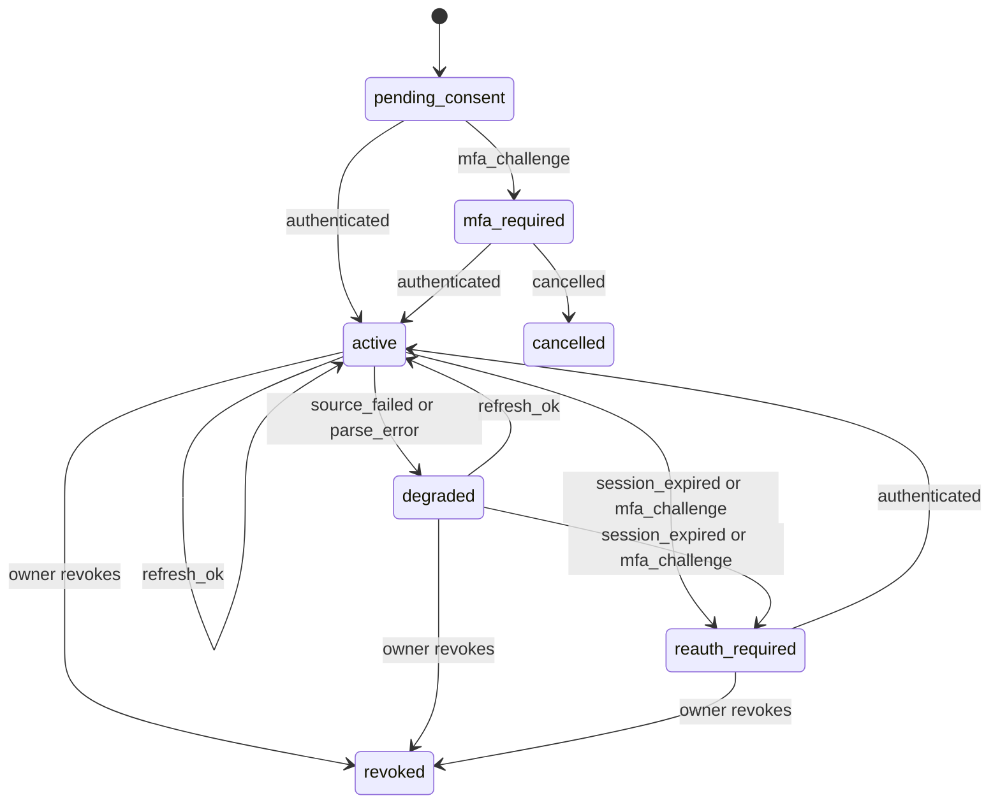

# Connector lifecycle experiment

This file reports the synthetic experiment for the Dominican bank-connectivity feasibility lane. The script is [`connector_lifecycle.py`](connector_lifecycle.py). Its committed output is [`connector-lifecycle-report.json`](connector-lifecycle-report.json). Everything in both files is fictional. The script makes no network call, reads no credential, contacts no bank, and imports nothing from `src/argus`.

The experiment answers one question. If a future retrieval method delivers bank observations, what must sit between those observations and the person's confirmed records so that repeated refreshes, failures, corrections, and a later change of retrieval method never duplicate, erase, or invent money?

## Rerun it

Run these commands from the repository root with the Poetry development environment. The script needs Faker from the dev dependencies because it reuses the synthetic ingestion kit's corpus.

```bash
poetry run python docs/reports/dominican-bank-connectivity/connector_lifecycle.py --report temp/connector-lifecycle-report.json
```

```bash
cmp temp/connector-lifecycle-report.json docs/reports/dominican-bank-connectivity/connector-lifecycle-report.json
```

The script prints `23/23 checks passed` and exits with code 0. It exits with code 1 and names each failed case otherwise. The report is deterministic. Two runs on the inspected base produced identical bytes. A Faker or Python version change can change incidental merchant names in the workload section, so regenerate and inspect before treating a byte difference as a regression.

The run used Python 3.10.20 and Faker 30.10.0, which match `poetry.lock`. The kit's own 46 checks passed in the same environment before the experiment reused them.

## What it reuses from the synthetic ingestion kit

The experiment builds on the kit merged in pull request 709 instead of inventing a second corpus.

- `build_corpus(71)` in [`factories.py`](/tests/synthetic_ingestion/factories.py) supplies the four statement rows that become checking observations `T-0001` to `T-0004`, the two same-day purchases from the Faker merchant, the USD 40.00 purchase, the three manual cash records, and the malformed `1.234,56` row used to break a batch.
- `field_issues` in [`harness.py`](/tests/synthetic_ingestion/harness.py) validates every connector proposal and every confirmed record. A connector record therefore meets the same eight-field contract as a manual, CSV, or PDF record from the kit.
- The kit's `Harness` acts as an independent oracle. After the second refresh, the script writes every confirmed record to a kit JSON file, ingests it into a fresh `Harness`, confirms it, and compares the kit's totals with the connector's totals. They match.

## The data shape

The retrieval method is the only replaceable part. Everything after it belongs to Argus and stays the same when a file import becomes an aggregator or a bank API.

| Layer | What it holds | Identity | Who can change it |
| --- | --- | --- | --- |
| Connection | Owner, method, consent scope, declined accounts, state, vault handle, coverage, last attempt, last success | Argus connection id | The owner only |
| Source account | Institution account id, display name, currency, mapped Argus account | Connection plus source account id. A display name is never identity. | The source renames it. The owner maps or declines it. |
| Observation | One transaction as the source reported it, including pending status and references | Institution transaction id when present, otherwise a derived fingerprint with an occurrence index | The source, on each refresh |
| Balance snapshot | Amount, currency, and the source's own as-of time | Connection, account, as-of time | Append only |
| Proposal | The kit's eight fields plus counterpart, keys, notes, and issues | Argus proposal id | The owner resolves, links, or confirms it |
| Record | Confirmed fields, provenance list, owner-edited field names, revision history, flags | Argus record id | The owner. A source revision needs the owner's acceptance. |

The connection state machine has seven states: `pending_consent`, `mfa_required`, `active`, `degraded`, `reauth_required`, `cancelled`, and `revoked`. The `TRANSITIONS` table in the script lists every legal move. Any other move raises `IllegalTransition`. The owner can revoke from any state except `cancelled` and `revoked`. The diagram shows the common revocation paths.



## Results

All 23 checks passed. Each row names the assignment's failure case and the behavior the script asserts.

| Check | Assignment case | Asserted behavior |
| --- | --- | --- |
| `mfa_cancelled` | MFA required and cancellation | A cancelled MFA challenge leaves no secret, no observation, and no refresh path. |
| `initial_connection_and_selection` | Initial connection and account selection | The owner maps checking to an existing manual account, creates savings, and reuses the card account. The declined business account stores nothing. |
| `repeated_import` | Repeated imports | Re-importing the same card export adds 0 proposals. An overlapping export adds exactly its 1 new row. |
| `missing_institution_ids` | Missing institution transaction ids | File rows get derived identities. The two same-day DOP 125.50 purchases stay two records. |
| `manual_cash_overlap` | Manual cash entry overlapping a bank import | The bank's DOP 300.00 deposit links to the manual cash-to-account transfer. No income appears. |
| `balance_check_overlap` | Recorded balance check overlapping imported activity | The DOP 1,500.00 check on 2026-09-05 differs from the balance implied by imported activity by DOP 10.00. The script reports the gap and creates no transaction. A check dated before the available history returns `history_unavailable`. |
| `own_account_transfers` | Transfers between the owner's accounts | A card payment with a shared bank reference becomes one transfer. A look-alike DOP 95.00 purchase and refund without a reference is held as `transfer_pair_inferred`, then split by the owner. A DOP to USD move is flagged and never converted. |
| `retrieval_method_migration` | Future bank API replacing the retrieval method | Aggregator observations link to the 4 records first imported from a CSV file. The ambiguous twin purchases show 2 candidates, then 1. No duplicate record appears. |
| `pending_to_posted` | Pending becoming posted | A pending DOP 60.00 hold cannot be confirmed. The posted DOP 66.00 row supersedes it. |
| `source_revision` | Revised transactions | A source change from DOP 45.00 to DOP 54.00 becomes a reviewable revision. The owner's own description edit survives. |
| `reversal` | Reversed transactions | The reversal links to the original purchase and nets it to zero. The original record stays. |
| `source_stops_reporting` | Revised transactions | A posted row that disappears from the source stays recorded with a `source_no_longer_reports` flag. |
| `account_rename` | Account renaming and stable identity | The source renames checking. The source account id, the Argus account, and its records do not change. |
| `reissued_card` | Stable account identity | A new source account after consent becomes an owner decision. The script creates no account and stores none of its rows. |
| `partial_history_and_stale_balance` | Partial history and stale balances | The source returned history from 2026-09-01 only, and the connection records that start date. A stale balance keeps its old as-of time. |
| `expired_session` | Expired sessions | An expired session moves to `reauth_required`. Cancelling reconnection keeps it there. Records do not change. |
| `source_failure_keeps_last_good` | Source failure without erasing data | A source outage and a malformed batch leave records, observations, the last success time, and balance freshness unchanged. The malformed batch applies none of its rows, including a valid one. |
| `unreadable_balance_rejected` | Source failure without erasing data | A balance of N/A rejects the whole batch with `parse_error`, like a malformed row. Records and observations do not change. An automated review found that this case escaped as an exception before the fix. |
| `idempotent_refresh` | Repeated imports | After recovery, 16 known rows are seen again and only the 1 new row becomes a proposal. |
| `revocation_and_deletion` | Revocation, disconnect, and deletion | Revoking drops the vault entry, stops refresh, withdraws open proposals, and purges observations. Deleting imported data removes records whose only source is the connection. Manual records and records that also came from the CSV file stay. |
| `kit_contract_and_totals` | Observations to proposals to records | Every confirmed connector record passes the kit's `field_issues` and the kit's `Harness` reproduces the connector's totals. |
| `currencies_stay_separate` | Multiple accounts and currencies | DOP and USD totals never combine. No conversion runs. |
| `privacy_boundaries` | Private data boundaries | Events carry codes and counts only. The synthetic secret appears nowhere outside the vault. The partner account cannot refresh the owner's connection. |

## Review workload for recurring sync

The workload section runs 60 days of routine synthetic activity for one person with a checking account and a card. The routine feed contains salary credits on the 15th and 30th, a monthly card payment with a shared bank reference, card purchases, some of which start as pending holds, and occasional checking purchases. Each refresh returns a rolling 30-day window, so most rows arrive many times.

| Refresh | Review | Refreshes | Rows seen again | Pending holds that never reached review | Owner actions if every row is confirmed alone | Owner actions with batch review | Owner actions if clean rows were accepted automatically |
| --- | --- | --- | --- | --- | --- | --- | --- |
| Daily | Daily | 60 | 1,930 | 13 | 88 | 55 | 3 |
| Daily | Weekly | 60 | 1,930 | 13 | 88 | 12 | 3 |
| Weekly | Weekly | 9 | 240 | 0 | 88 | 12 | 3 |

Every mode ends with the same 88 records. The 3 remaining actions are the salary credits. A bank credit does not say whether it is income, a refund, or a transfer, so the script leaves the kind blank and the kit's `field_issues` blocks confirmation until the owner classifies it.

Three findings follow from the table.

1. Re-observation costs the owner nothing. Stable identity absorbs 1,930 repeated rows in daily mode.
2. Refresh frequency and review frequency are separate choices. Daily refresh with weekly review keeps balances fresh and costs the same 12 actions as weekly refresh.
3. The column for automatic acceptance is a measurement, not a policy. MVEE section 4.7 requires an explicit policy before any trusted feed skips review. The script does not adopt one.

## Why the kit's file identity cannot run recurring sync

The kit keys a row by the SHA-256 of the file and the row number. That identity is right for one upload. It is wrong for a feed that sends the same transactions again. The script exported the same routine data as eight weekly CSV files in the kit's format and ingested them into the kit's `Harness`.

| Export day | Rows in export | Rows flagged `possible_overlap` |
| --- | --- | --- |
| 7 | 6 | 0 |
| 14 | 13 | 6 |
| 21 | 26 | 13 |
| 28 | 37 | 26 |
| 35 | 44 | 33 |
| 42 | 49 | 37 |
| 49 | 51 | 39 |
| 56 | 52 | 40 |

The kit asks the owner to acknowledge 194 overlaps across eight exports. The observation layer asks for none. Recurring sync needs its own identity layer before rows reach the kit's review contract.

## Decisions the experiment exposes

The script makes each choice below so that it can run. None of these choices is a decided Argus contract.

1. **Pending holds.** The script shows pending holds and never lets the owner confirm them. Whether a hold reduces "what remains until your next income" is a product decision.
2. **Credit meaning.** Bank feeds report direction, not meaning. The script blocks unclassified credits. A saved classification rule or a model suggestion would reduce the 3 actions, but either one is a policy decision.
3. **Transfer pairing.** The script pairs automatically only with a shared bank reference. It holds amount-and-date look-alikes for review. The threshold for inferred pairs is open.
4. **Field ownership.** Source revisions change only source-owned fields and never overwrite owner edits. The split between source-owned and owner-owned fields needs a contract.
5. **Deletion scope.** Deleting imported data removes records whose only provenance is the connection, including owner corrections on those records. Records with manual or other provenance stay. Product and privacy owners must confirm that rule.
6. **Batch rejection.** A connector refresh applies all rows or none. The kit keeps row-level issues for file uploads. The right unit depends on the retrieval method and needs a stated rule.
7. **Cross-currency transfers.** The script keeps two linked records in their own currencies and applies no rate. Any later conversion must show its rate, date, and source per MVEE section 2.
8. **Household scope.** Every proposal lands in the owner's personal context. Sharing an account with a household shares records, not the connection. Cross-person account identity for a joint account imported by both partners is untested.

## What the experiment does not show

- It does not show that any Dominican bank, aggregator, or file format supplies these fields. The bank access matrix owns that evidence.
- It does not show secure credential handling. The vault is a Python dictionary that stands for a secret manager.
- It does not model Postgres, row-level security, concurrency, or retention timers.
- It does not test parsing of real bank files. The kit's README lists the consented-document evaluation that must come first.
