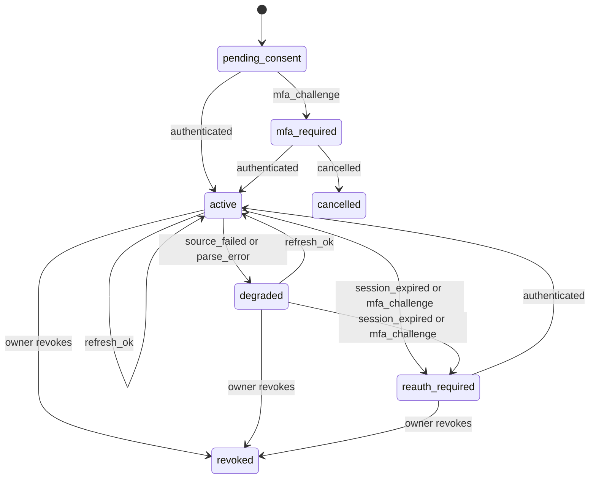

# Connector lifecycle findings

This page keeps what a synthetic connector experiment found for the Dominican bank-connectivity feasibility lane. The executable experiment is not part of this delivery, and nothing on this page is an acceptance gate.

The experiment was added in `41cea419783b7dbf10288a2152374c7c7803fb7a` and last changed in `9587b9f5c8f2b70fe77b2e2d9450166ebc7d266c`. Its code and output are unchanged at `66eb4e21496db9653bb936f2196c19a645a2835f`, the last head of this pull request that contains them, where the [script](https://github.com/lagarcess/argus/blob/66eb4e21496db9653bb936f2196c19a645a2835f/docs/reports/dominican-bank-connectivity/connector_lifecycle.py) and its [report](https://github.com/lagarcess/argus/blob/66eb4e21496db9653bb936f2196c19a645a2835f/docs/reports/dominican-bank-connectivity/connector-lifecycle-report.json) can still be read. Everything in it was fictional. It made no network call, read no credential, contacted no bank, and imported nothing from `src/argus`.

The experiment explored one question. If a future retrieval method delivers bank observations, what must sit between those observations and the person's confirmed records so that repeated refreshes, failures, corrections, and a later change of retrieval method never duplicate, erase, or invent money?

## Why it was removed

The founder stopped the experiment's expansion on 2026-09-28 and asked that this delivery keep only the bank research and the selected-file import proof. No new connector is built here.

Its last automated review, of `66eb4e214`, found three more gaps in its synthetic code. An unhashable value in a provider field could escape the input check as an exception. A one-sided source change to a paired transfer revised the shared record. Classifying a transfer to the owner's own account in another currency skipped cross-currency review. They were not fixed because the code left this delivery, so they stay open for any future connector lane and are not accepted as limits.

## What it reused from the synthetic ingestion kit

The experiment built on the kit merged in pull request 709 instead of inventing a second corpus.

- `build_corpus(71)` in [`factories.py`](/tests/synthetic_ingestion/factories.py) supplied the four statement rows that became checking observations `T-0001` to `T-0004`, the two same-day purchases from the Faker merchant, the USD 40.00 purchase, the three manual cash records, and the malformed `1.234,56` row used to break a batch.
- `field_issues` in [`harness.py`](/tests/synthetic_ingestion/harness.py) validated every connector proposal and every confirmed record, so a connector record met the same eight-field contract as a manual, CSV, or PDF record from the kit.
- The kit's `Harness` acted as an independent oracle. After the second refresh, the script wrote every confirmed record to a kit JSON file, ingested it into a fresh `Harness`, confirmed it, and compared the kit's totals with the connector's totals. They matched.

## The data shape

The retrieval method is the only replaceable part. Everything after it belongs to Argus and stays the same when a file import becomes an aggregator or a bank API.

| Layer | What it holds | Identity | Who can change it |
| --- | --- | --- | --- |
| Connection | Owner, method, consent scope, declined accounts, state, vault handle, coverage, last attempt, last success | Argus connection id | The owner only |
| Source account | Institution account id, display name, currency, mapped Argus account | Connection plus source account id. A display name is never identity. | The source renames it. The owner maps or declines it. |
| Observation | One transaction as the source reported it, including pending status and references | Institution transaction id when present, otherwise a derived fingerprint, matched to a stored observation before a new occurrence index is assigned | The source, on each refresh |
| Balance snapshot | Amount, currency, and the source's own as-of time | Connection, account, currency, as-of time. A card that carries pesos and dollars reports one balance per currency. | One per identity. A later report for the same identity replaces it. |
| Proposal | The kit's eight fields plus counterpart, keys, notes, and issues | Argus proposal id | The owner resolves, links, or confirms it |
| Record | Confirmed fields, provenance list, owner-edited field names, revision history, flags | Argus record id | The owner. A source revision needs the owner's acceptance. |

The connection had seven states: `pending_consent`, `mfa_required`, `active`, `degraded`, `reauth_required`, `cancelled`, and `revoked`. The `TRANSITIONS` table in the script listed every legal move, and any other move raised `IllegalTransition`. The owner could revoke from any state except `cancelled` and `revoked`. The diagram shows the common revocation paths.

## Findings

Each row is a behavior the historical script asserted at `66eb4e214`, named by its check in that report. They are research findings for a future contract, not tests this delivery runs. The historical report at that head lists every check as passed, from a run on Python 3.10.20 and Faker 30.10.0, which match `poetry.lock`. Two runs wrote identical bytes, and the kit's own 46 checks passed in the same environment before the experiment reused them.

| Historical check | Assignment case | What it established |
| --- | --- | --- |
| `mfa_cancelled` | MFA required and cancellation | A cancelled MFA challenge leaves no secret, no observation, and no refresh path. |
| `initial_connection_and_selection` | Initial connection and account selection | The owner maps checking to an existing manual account, creates savings, and reuses the card account. The declined business account stores nothing. |
| `repeated_import` | Repeated imports | Re-importing the same card export adds 0 proposals. An overlapping export adds exactly its 1 new row. |
| `missing_institution_ids` | Missing institution transaction ids | File rows get derived identities. The two same-day DOP 125.50 purchases stay two records. |
| `manual_cash_overlap` | Manual cash entry overlapping a bank import | The bank's DOP 300.00 deposit links to the manual cash-to-account transfer. No income appears. |
| `balance_check_overlap` | Recorded balance check overlapping imported activity | The DOP 1,500.00 check on 2026-09-05 differs from the balance implied by imported activity by DOP 10.00. The script reports the gap and creates no transaction. A check dated before the available history returns `history_unavailable`. |
| `own_account_transfers` | Transfers between the owner's accounts | A card payment with a shared bank reference becomes one transfer. A look-alike DOP 95.00 purchase and refund without a reference is held as `transfer_pair_inferred`, then split by the owner. A DOP to USD move is flagged and never converted. |
| `retrieval_method_migration` | Future bank API replacing the retrieval method | Aggregator observations link to the 4 records first imported from a CSV file. The ambiguous twin purchases show 2 candidates, then 1. No duplicate record appears. |
| `pending_to_posted` | Pending becoming posted | A pending DOP 60.00 hold cannot be confirmed. The posted DOP 66.00 row supersedes it. |
| `source_revision` | Revised transactions | A source change from DOP 45.00 to DOP 54.00 becomes a reviewable revision. The owner's own description edit survives. |
| `reversal` | Reversed transactions | The reversal links to the original purchase and nets it to zero. The original record stays. |
| `source_stops_reporting` | Revised transactions | A posted row that disappears from the source stays recorded with a `source_no_longer_reports` flag. |
| `account_rename` | Account renaming and stable identity | The source renames checking. The source account id, the Argus account, and its records do not change. |
| `reissued_card` | Stable account identity | A new source account after consent becomes an owner decision. The script creates no account and stores none of its rows. |
| `partial_history_and_stale_balance` | Partial history and stale balances | The source returned history from 2026-09-01 only, and the connection records that start date. A stale balance keeps its old as-of time. |
| `expired_session` | Expired sessions | An expired session moves to `reauth_required`. Cancelling reconnection keeps it there. Records do not change. |
| `source_failure_keeps_last_good` | Source failure without erasing data | A source outage and a malformed batch leave records, observations, the last success time, and balance freshness unchanged. The malformed batch applies none of its rows, including a valid one. |
| `unreadable_balance_rejected` | Source failure without erasing data | A balance of N/A rejects the whole batch with `parse_error`, like a malformed row. Records and observations do not change. |
| `idempotent_refresh` | Repeated imports | After recovery, 16 known rows are seen again and only the 1 new row becomes a proposal. |
| `revocation_and_deletion` | Revocation, disconnect, and deletion | Revoking drops the vault entry, stops refresh, withdraws open proposals, and purges observations. Deleting imported data removes records whose only source is the connection and every proposal the connection created, so no row that only the connection supplied survives anywhere in the store. Manual records and records that also came from the CSV file stay. |
| `kit_contract_and_totals` | Observations to proposals to records | Every confirmed connector record passes the kit's `field_issues` and the kit's `Harness` reproduces the connector's totals. |
| `currencies_stay_separate` | Multiple accounts and currencies | DOP and USD totals never combine. No conversion runs. |
| `privacy_boundaries` | Private data boundaries | Events carry codes and counts only. The synthetic secret appears nowhere outside the vault. The partner account cannot refresh the owner's connection. |
| `stale_revision_superseded` | Revised transactions | Three source changes before review leave one pending revision, built from the latest observation. Accepting it gives DOP 60.00 with the newer description. Accepting a superseded revision is refused, so a stale value cannot return. |
| `currency_mismatch_held` | Multiple accounts and currencies | A USD source account chosen for a DOP account is not mapped and becomes an owner decision. A USD balance reported for a DOP account is not stored. A USD row on a DOP account waits with `currency_mismatch`. The DOP row and balance proceed. |
| `provider_input_boundary` | Source failure without erasing data | Every field of a provider batch is checked in one place before anything is written, covering the attempt time, the failure code, source accounts, balances, transactions, and coverage dates. Each malformed field rejects the whole batch by name and writes only the connection's error state and one event. A baseline batch, and one with a negative balance, a zero balance, an empty description, and no institution id, still apply. A batch that reports two different facts for one identity, such as two balances for the same account, currency, and time, is rejected the same way. |
| `chosen_account_must_be_eligible` | Initial connection and account selection | A source account maps only to an account its owner holds in the same currency. A choice naming another person's account or an unknown one becomes an owner decision, and no row or balance lands on it. |
| `owner_decisions_per_connection` | Stable account identity | Two connections that each report a new source account with the same id each ask their own owner. |
| `pending_row_posts_in_place` | Pending becoming posted | A held row that posts under the same institution id takes every source value from the latest observation, including its posted status and reference, and becomes confirmable. |
| `derived_identity_stable` | Missing institution transaction ids | Rows without an institution id keep their identity when a later window drops or reorders them. The row that left is flagged, and a dropped copy of an identical row is flagged as ambiguous instead of guessed. |
| `snapshot_identity` | Partial history and stale balances | A balance reported again for the same connection, account, currency, and as-of time replaces the stored one. A retry adds nothing, and reconciliation reads the corrected amount instead of the first of two tied snapshots. |
| `account_references_must_be_owned` | Private data boundaries | Every account id a caller supplies, as a transfer counterpart, a manual entry, or a correction, must be one of the owner's accounts. Someone else's account and an unknown one are refused before anything changes, and an own account in another currency is accepted. |

## Review workload for recurring sync

The historical script ran 60 days of routine synthetic activity for one person with a checking account and a card. The routine feed held salary credits on the 15th and 30th, a monthly card payment with a shared bank reference, card purchases, some of which started as pending holds, and occasional checking purchases. Each refresh returned a rolling 30-day window, so most rows arrived many times. These are its measurements at `66eb4e214`.

| Refresh | Review | Refreshes | Rows seen again | Pending holds that never reached review | Owner actions if every row is confirmed alone | Owner actions with batch review | Owner actions if clean rows were accepted automatically |
| --- | --- | --- | --- | --- | --- | --- | --- |
| Daily | Daily | 60 | 1,930 | 13 | 88 | 55 | 3 |
| Daily | Weekly | 60 | 1,930 | 13 | 88 | 12 | 3 |
| Weekly | Weekly | 9 | 240 | 0 | 88 | 12 | 3 |

Every mode ended with the same 88 records. The 3 remaining actions were the salary credits. A bank credit does not say whether it is income, a refund, or a transfer, so the script left the kind blank and the kit's `field_issues` blocked confirmation until the owner classified it.

Three findings follow from the table.

1. Re-observation costs the owner nothing. Stable identity absorbed 1,930 repeated rows in daily mode.
2. Refresh frequency and review frequency are separate choices. Daily refresh with weekly review kept balances fresh and cost the same 12 actions as weekly refresh.
3. The column for automatic acceptance is a measurement, not a policy. MVEE section 4.7 requires an explicit policy before any trusted feed skips review. The script did not adopt one.

## Why the kit's file identity cannot run recurring sync

The kit keys a row by the SHA-256 of the file and the row number. That identity is right for one upload. It is wrong for a feed that sends the same transactions again. The historical script exported the same routine data as eight weekly CSV files in the kit's format and ingested them into the kit's `Harness`.

| Export day | Rows in export | Rows flagged `possible_overlap` |
| --- | --- | --- |
| 7 | 6 | 0 |
| 14 | 13 | 6 |
| 21 | 26 | 13 |
| 28 | 37 | 26 |
| 35 | 44 | 33 |
| 42 | 49 | 37 |
| 49 | 51 | 39 |
| 56 | 52 | 40 |

The kit asked the owner to acknowledge 194 overlaps across eight exports. The observation layer asked for none. Recurring sync needs its own identity layer before rows reach the kit's review contract.

## Decisions the experiment exposed

The script made each choice below so that it could run. None of these choices is a decided Argus contract.

1. **Pending holds.** The script showed pending holds and never let the owner confirm them. Whether a hold reduces "what remains until your next income" is a product decision.
2. **Credit meaning.** Bank feeds report direction, not meaning. The script blocked unclassified credits. A saved classification rule or a model suggestion would reduce the 3 actions, but either one is a policy decision.
3. **Transfer pairing.** The script paired automatically only with a shared bank reference and held amount-and-date look-alikes for review. The threshold for inferred pairs is open.
4. **Field ownership.** Source revisions changed only source-owned fields and never overwrote owner edits. A newer source change replaced an unreviewed one. Every source-owned value, including pending status and reference, came from one derivation of the latest observation. The split between source-owned and owner-owned fields needs a contract.
5. **Deletion scope.** Deleting imported data removed records whose only provenance was the connection, including owner corrections on those records, and every proposal the connection created. Records with manual or other provenance stayed. Product and privacy owners must confirm that rule.
6. **Batch rejection.** A connector refresh applied all rows or none. Every provider field was checked in one place before anything was written. A rejected batch wrote only the connection's error state and one event, and not even its attempt time, which came from the batch. A batch that reported two different facts for one identity was rejected, while a later batch that reported a new fact for the same identity was a correction. The kit keeps row-level issues for file uploads. The right unit depends on the retrieval method and needs a stated rule.
7. **Cross-currency transfers.** The script kept two linked records in their own currencies and applied no rate. Any later conversion must show its rate, date, and source per MVEE section 2. A source account, balance, or row in another currency than the chosen Argus account waited for the owner. A card that carries both pesos and dollars needs a rule the script did not make.
8. **Household scope.** Every proposal landed in the owner's personal context. Sharing an account with a household shares records, not the connection. Cross-person account identity for a joint account imported by both partners was untested.

## What the experiment did not show

- It did not show that any Dominican bank, aggregator, or file format supplies these fields. The bank access matrix owns that evidence.
- It did not show secure credential handling. The vault was a Python dictionary that stood for a secret manager.
- It did not model Postgres, row-level security, concurrency, or retention timers.
- It did not test parsing of real bank files. The kit's README lists the consented-document evaluation that must come first.
