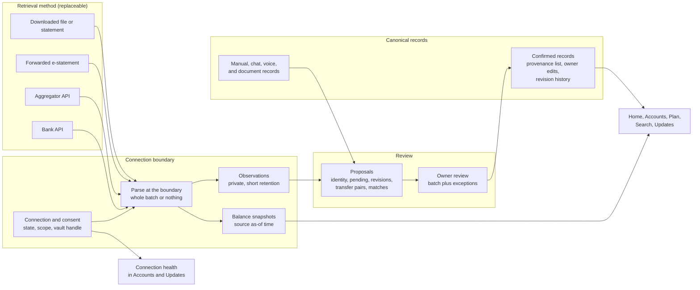

# Integration map

This file explains how bank data could enter Argus without creating a second bookkeeping system. It serves MVEE sections 4, 5, and 12. It proposes boundaries for a future technical contract. It does not approve a schema, an API route, a migration, or a provider.

## One journey, several retrieval methods

Every method ends in the flow MVEE section 4 already approved: capture, interpret or extract, review and resolve, confirm, save the canonical record, and update dependent surfaces. Only the first step changes between methods.

**Now: a statement or file the person downloads.** The person opens their bank's app or website, downloads a PDF statement or a transaction export, and shares it to Argus. On iOS and Android that is the system share sheet. On the web it is an upload. Argus identifies the institution, account, currency, and statement period, extracts candidate rows, and shows one review batch with exceptions first. After confirmation, Accounts shows the balance as of the statement date, not as today's balance.

**Optional later: a forwarded or selected e-statement.** A person who receives e-statements by email forwards one statement, or picks one attachment, into the same review. Argus never asks for mailbox access. A transaction alert email is a hint for a draft, not a ledger.

**Later, only after legal and institutional conditions hold: a connection.** The person reads a consent screen that names the data, the accounts, the purpose, and how to revoke. Authentication and MFA happen in the bank's or the provider's own interface, never in Argus chat. The person selects and maps accounts. The first refresh arrives as one review batch. Later refreshes add proposals that wait for the person's next review. Accounts and Updates show the connection state, the last successful refresh, and any reconnection the person must do.

**Always: control.** Profile data controls list every connection, what it can read, and when it last refreshed. Revoking stops refresh at once. Deleting imported data removes what came only from that connection and keeps what the person entered or confirmed from other sources.

## The diagram

Manual, chat, voice, and document records feed the matcher so that a bank row can link to an entry the person already made. Confirmed records are the only thing the product surfaces read for money totals.

## Proposed boundaries

The [connector lifecycle experiment](connector-lifecycle-experiment.md) exercises each boundary below with synthetic data.

| Boundary | Owns | Must never |
| --- | --- | --- |
| Connection and consent | Owner, method, selected and declined accounts, purpose, state, last attempt, last success, error class | Serve any person other than the owner. Continue after revocation. |
| Credentials or tokens | An opaque vault handle on the connection. The secret lives in a secret manager, or with the provider when the provider holds it. | Reach chat, prompts, analytics, ordinary logs, screenshots, or support tools. Outlive revocation. |
| Source account identity | The source's own account id and the mapping to an Argus account | Use a display name or a masked number as identity. Create an Argus account without the owner's decision. |
| Raw observations | What the source said, per refresh, for dedupe and dispute | Enter the shared research cache, logs, analytics, or model prompts by default. Stay longer than the retention rule allows. |
| Normalized proposals | The eight fields the kit already validates, plus counterpart, keys, and issues | Affect balances, budgets, goals, or alerts before confirmation (MVEE section 5). |
| Review and reconciliation | Batch confirmation, exceptions, matches, transfer pairs, balance comparisons | Invent a transaction to close a balance gap. Merge look-alikes without the owner. |
| Confirmed records | Fields, provenance list, owner-edited fields, revisions, flags | Lose an owner edit to a source revision. Disappear because a source stopped reporting a row. |
| Refresh health | State, last successful refresh, source as-of times, reconnection prompts | Overwrite the last good data or its timestamp on a failed refresh (MVEE section 4.7). |

## Keep private banking data out of shared paths

Banking observations and records are private to the person who owns them. By default they stay out of five places.

1. The shared research cache. Since pull requests 711 and 715, only discovery searches whose anchor symbols the provider catalog validated can enter it, and a test puts private account text into a request and asserts that nothing reaches shared storage. A record store must never feed that cache.
2. Ordinary logs. Pull request 706 removed private request and provider content from known log calls, and a test checks them case by case. Pull request 721 extended that test to debug catchers. No filter at the log sink scrubs content, so every new connection log call needs its own case. Connection events should carry codes and counts only, as the experiment's `privacy_boundaries` check does.
3. Analytics. The closed event registry from pull request 702 types every property as a literal, a boolean, or a bounded integer, so an amount or free text cannot be represented. Merchants, descriptions, balances, and account numbers stay out.
4. Screenshots and support tools. Evidence for reviews uses synthetic data, as this lane does.
5. Model prompts. Chat may answer questions about a person's records only after a separate decision on what record context the model may see. That decision is outside this lane.

## Household sharing is not bank access

One partner's consent authorizes access to that partner's accounts only. A connection belongs to one person. Sharing an Argus account with a household shares confirmed records under MVEE section 12. It never shares the connection, the credentials, or the right to refresh. The experiment's partner check refuses a refresh by the other partner.

A joint bank account raises a separate question. If both partners connect the same joint account, Argus must recognize one account, not two. MVEE section 12 requires that outcome. The experiment does not test cross-person account identity, and the contract for it is open.

## How manual, document, and API inputs coexist

Every input produces a proposal. The matcher compares each proposal with confirmed records of the same owner, account, currency, and amount within a few days, and surfaces candidates instead of merging silently. A confirmed record keeps a provenance list, so one purchase can carry a manual entry, a statement row, and a later API row without being counted three times. Owner edits mark fields as owner-owned, and source revisions skip those fields.

The experiment demonstrates each rule: `manual_cash_overlap`, `retrieval_method_migration`, `source_revision`, and `kit_contract_and_totals`.

## A bank API can replace the retrieval method without replacing records

Records never key on the retrieval method. They key on Argus ids and keep a provenance list. When a better method arrives, its observations link to existing records through the same review, and the old method's provenance stays for audit. The experiment's `retrieval_method_migration` check moves a card account from CSV files to an aggregator feed and ends with the same 4 records, each carrying both sources.

## Separation that is justified now

Justified now:

- A separate domain module and separate tables for connections, observations, snapshots, and proposals, each owned by the person and protected by row-level security. Records stay in the financial-record contract that MVEE work will define.
- A separate secret store for any future token, reachable only by the refresh job.
- A distinct job type for refreshes, with its own idempotency key per connection and refresh window.

Not justified now:

- A separate company, a microservice, or a general-purpose connectivity platform. Argus has no connector, no bank agreement, and no measured demand.

Evidence that would justify more separation later: several institutions with live connectors, a secret-custody requirement from a bank or regulator, compliance duties that need their own audit boundary, or refresh volume that competes with chat and backtest workers.

## Code reuse map

Every reference below resolves at the inspected commit `f0a90763b79e5625ac0a4789cdfa171cda023963`. The cited lines are unchanged at `3b9313f3dcf80e3ff9eddfcce8818a829a081225`, the integration tip when this report was committed. Pull request 721 changed only the log-privacy test among the cited files. "As-is" means the mechanism fits a single owner's records without change. "Adapt" means the pattern carries over but its current fields or scope do not. "Absent" means no owner exists.

No production owner stores financial accounts, transactions, balances, statements, households, or uploaded files today. The 43 tables in `supabase/migrations/` hold identity, conversations, jobs, evidence, metering, memory, and sharing. [`DATA_MODEL.md`](/docs/DATA_MODEL.md) says the MVEE's financial records still need schema and access-control design. The storage bucket block in [`supabase/config.toml`](/supabase/config.toml) is commented out, and no route accepts an uploaded file.

| Concern | Existing owner | Fit | What a bank import needs from it |
| --- | --- | --- | --- |
| Draft liveness and consume-once | [`pending_artifacts.py`](/src/argus/domain/pending_artifacts.py) lines 17 to 230, content-agnostic states `active`, `consumed`, `cancelled`, `superseded` | As-is, as a new adapter | A second duplicate guard for record saves, because an unexpected stamp failure proceeds unstamped (lines 149 to 155) |
| Chat proposal stage | [`confirm.py`](/src/argus/agent_runtime/stages/confirm.py) lines 51 to 188 | Adapt. Every field it builds is a strategy field. | A record-draft stage and a batch shape |
| Card write under concurrency | [`20260810150000_serialize_message_artifact_update.sql`](/supabase/migrations/20260810150000_serialize_message_artifact_update.sql) lines 20 to 47 | As-is | A decision on whether drafts live in message metadata or their own table |
| Applied-or-disclosed edits | [`edit_contract.py`](/src/argus/domain/edit_contract.py) lines 13 to 44 | As-is | Record edit targets |
| Import identity, overlap, correction | [`harness.py`](/tests/synthetic_ingestion/harness.py) lines 15 to 232, test-only | Adapt as reference rules, not imports | Recurring-sync identity, as the connector experiment shows |
| Session validation and revocation | [`dependencies.py`](/src/argus/api/dependencies.py) lines 393 to 533 and [`auth_sessions.py`](/src/argus/api/auth_sessions.py) lines 27 to 80 | As-is | A step-up re-authentication check before a bank connection |
| Capability gate | [`dependencies.py`](/src/argus/api/dependencies.py) lines 289 to 324 and [`guest_access.py`](/src/argus/api/guest_access.py) lines 91 to 116 | Adapt. It is a guest-or-registered switch, not a resource permission model. | An import capability and a decision on guest imports |
| Owner filters under the service role | [`supabase_gateway.py`](/src/argus/domain/supabase_gateway.py) lines 163 to 187 | As-is for one owner | Filters for shared records |
| Single-owner RLS | [`DATA_MODEL.md`](/docs/DATA_MODEL.md) lines 2291 to 2334 | As-is for one owner | Household RLS, which does not exist |
| Frozen sharing snapshots | [`public_excerpt_turns.py`](/src/argus/domain/public_excerpt_turns.py) lines 369 to 373 | Adapt | A refusal rule for turns that quote a private record. Shares publish stated inputs today. |
| Fact provenance | [`tool_contracts.py`](/src/argus/domain/tool_contracts.py) lines 31 to 108, kinds `user`, `page`, `market_data`, `assumption`, `computed`, `not_found` | Adapt | Extracted and connected kinds, and separate activity, statement, and refresh dates |
| Immutable source evidence | [`20260619000001_p1_evidence_decision_spine.sql`](/supabase/migrations/20260619000001_p1_evidence_decision_spine.sql) lines 36 to 51 | Adapt. `artifact_type` admits `backtest` only. | A source-document type with an owner and a retention period |
| Shared research cache eligibility | [`research_find.py`](/src/argus/agent_runtime/research_find.py) lines 32 to 64, [`cache.py`](/src/argus/domain/research/cache.py) lines 160 to 227, [`test_research_cache_isolation.py`](/tests/research/test_research_cache_isolation.py) | As-is | A written rule that record stores are per-owner and never shared |
| Durable jobs and scopes | [`backtest_job_scopes.py`](/src/argus/domain/backtest_job_scopes.py) lines 21 to 52 | Adapt. The table carries backtest columns. | Import and refresh scopes |
| `Idempotency-Key` | [`API_CONTRACT.md`](/docs/API_CONTRACT.md) lines 193 to 264 and [`backtest_admission.py`](/src/argus/domain/backtest_admission.py) lines 98 to 131 | As-is | The canonical identity of an import or refresh window |
| Provider retry | [`contracts.py`](/src/argus/domain/research/contracts.py) lines 201 to 222 | Adapt | Refresh failure and re-authentication states |
| Log privacy | [`log_sink.py`](/src/argus/log_sink.py) lines 10 to 26 and [`test_private_log_content.py`](/tests/agent_runtime/test_private_log_content.py) | Adapt. Protection is per call, not at the sink. | Sink-level redaction of record fields, or a test per new call |
| Product analytics | [`analytics_events.py`](/src/argus/observability/analytics_events.py) lines 1 to 12 and 351 to 389 | As-is | Which import events exist, if any |
| Model prompt context | [`runtime.py`](/src/argus/agent_runtime/runtime.py) line 39, the last 6 thread messages | Adapt | Which record facts a prompt may see |
| Money arithmetic | [`money.py`](/src/argus/domain/finance/money.py) lines 12 to 43, a float amount that refuses to add two currencies | Absent for records | Integer minor units or `Decimal`, and per-currency fraction digits |
| Money display | [`result_money.py`](/src/argus/domain/result_money.py) lines 21 to 69, writes `$` only | Adapt | Display per currency, and parsing of `RD$`, `US$`, and `1.234,56` |
| Stated currency | [`answer_calculation.py`](/src/argus/agent_runtime/answer_calculation.py) lines 762 to 823 | Adapt. It defaults to `USD` with a disclosure. | The MVEE rule that an unqualified amount is never read as dollars or pesos |
| Country currency | [`home_country.py`](/src/argus/domain/home_country.py) lines 1 to 11 | As-is | None |
| Data export | [`personalization_memory.py`](/src/argus/api/routers/personalization_memory.py) line 261, memory only, admin or developer role | Adapt | A record export format |
| Account deletion | [`schemas.py`](/src/argus/api/schemas.py) line 954, a feedback request an operator acts on | Adapt | Self-service deletion and source-file purge |
| Retention job | [`scheduled_maintenance.py`](/scripts/ops/scheduled_maintenance.py) lines 36 to 60, run by hand | Adapt | A scheduler and a retention rule for imported data |
| Updates inbox and notifications | None | Absent | Channels, preferences, and scheduling |
| Households and joint accounts | None | Absent | Membership lifecycle, permissions, and cross-person account identity |

The remote branch `origin/codex/money-placement-pilot` is not part of the inspected base. It holds a separate `money-view/` tree with SQLite account, transaction, import, household, and membership tables for a local single-owner workspace. Nothing in it uses Supabase or RLS, and no document promotes any of it.

## Unresolved contracts

These contracts must exist before a statement import or a connection ships. The documentation authority already lists most of them as undecided.

1. **Storage of typed figures.** Archived decision 8, approved 2026-09-08, keeps a salary, expense, or debt the person types in the conversation only, with no new storage ([archived roadmap](/docs/archive/2026-09-17-argus-grounded-finance-roadmap.md) lines 1791 to 1797). MVEE section 4, approved 2026-09-26, makes the confirmed record the durable fact. No document reconciles the two. Three other documents reuse the label "decision 8" for a different rule about stated country and currency.
2. **Financial-record schema and money arithmetic.** Accounts, transactions, balances, import batches, draft and confirmed states, revision history, and an amount type in minor units or `Decimal`.
3. **Import identity.** Observation identity with and without institution ids, cross-file overlap, transfer pairing, pending holds, reversals, and source revisions. The experiment in this lane proposes one design.
4. **Source documents.** Where files live, who can see them, how long they stay, and how deletion purges them.
5. **Permissions.** An import capability, guest imports, per-record ownership, visibility, and edit rights, and household RLS.
6. **Connections.** Consent records, connection states, secret custody, refresh jobs, and re-authentication prompts. None exists.
7. **Privacy of record content.** A sink-level log rule, the record facts a model prompt may see, whether imported text may ever reach a research provider, and a sharing refusal for record-derived turns.
8. **Automatic acceptance.** Whether any trusted feed may skip review, per MVEE section 4.7. The experiment measures the effect and decides nothing.
