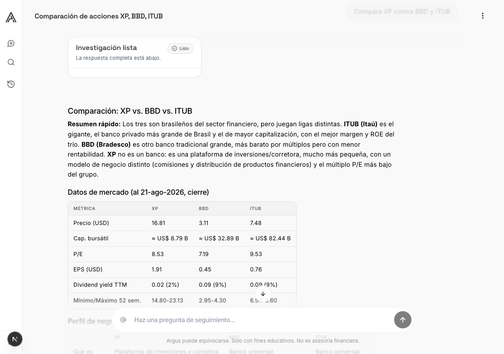
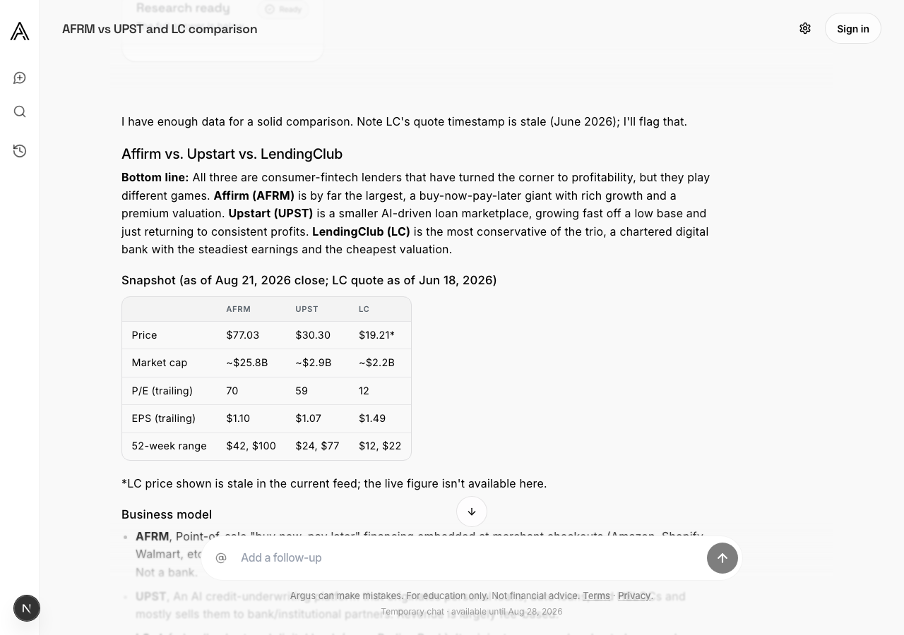
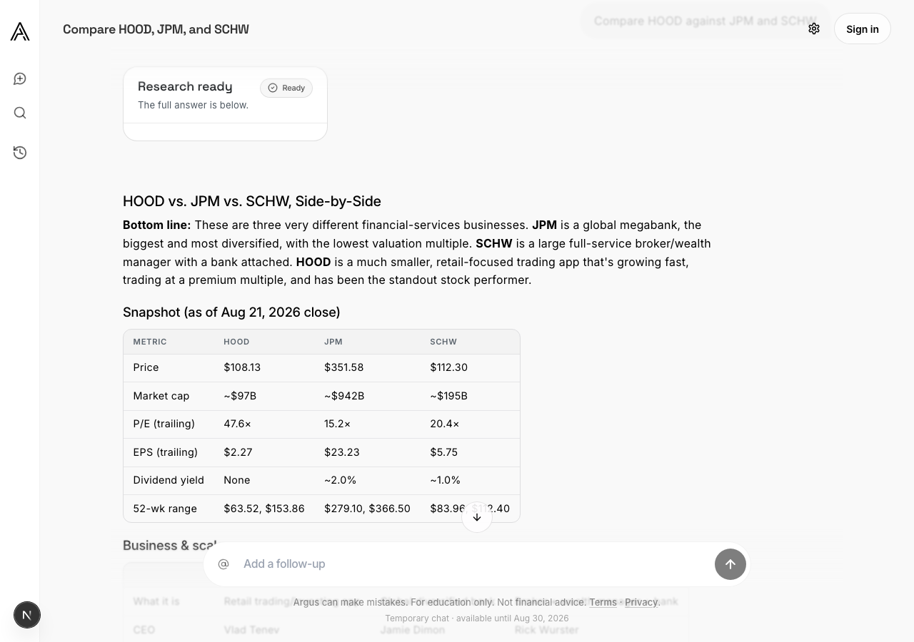

# A completed research answer never appears until reload, 2026-08-21

Lane: a thorough research job finishes, the card flips to "Research ready.
The full answer is below.", and nothing paints below it until the user
reloads. Reproduced by the founder on production `25105bfe` as a signed-out
guest (conversation `cb7b326d`, "Compare HOOD against JPM and SCHW").

This report holds the production facts, the local reproduction (before), the
root cause, the fix, the at-head browser proof (after), and the guards.

## Production facts

Read from production Postgres on 2026-08-21 through the activity projection
the client actually consumes, `read_conversation_activity_sources`, for the
founder's conversation:

```text
chat_turn     completed  hydrateable=false
backtest_job  succeeded  hydrateable=false   <- the research job, finished 01:25:58
```

`project_conversation_activity` turns that into `operation.status = "checking"`
(`kind = backtest_job`), and it still does, a day later. The job row:
`operation_scope = chat.research`, `result_run_id = null`,
`execution_metadata.research_result_message_id = 657930b4…` (the 3,816-char
answer, persisted at 01:25:58 before the job was marked succeeded).

## Before: local reproduction at base `d27425b3`

Local stack: `argus-qa` Supabase, real OpenRouter + Perplexity keys, guest
access on, research rail on. Same prompt, signed-out guest.

| Step | What the user saw / what the client did |
|---|---|
| send | "Researching… Argus is reading financial data and sources for this one." card, `Running` pill |
| +40s, job succeeded | card flips to **"Research ready — The full answer is below."** with **nothing below it**; the 2,820-char answer is row 3 in `messages` |
| network | one `GET …/messages` (the pre-send snapshot), ~12 job polls, **no transcript refetch after completion** |
| activity | `GET /conversations` reports `operation: {status: "checking", kind: "backtest_job"}` for this conversation, identical to production |
| composer | `aria-disabled="true"`, `contenteditable="false"`; a typed follow-up is discarded |
| reload | answer renders; composer **still disabled**, because the projection still says `checking` |

So the lane's symptom is one face of a larger defect: every conversation that
ever completed a thorough research job was locked for good.

## Root cause

The fact "this succeeded job's result is readable in its conversation" was
stated inline four times in `20260801000000_add_conversation_activity_read_states.sql`
(source projection twice, read-state mutation, baseline), every copy as "a
completed run with its evidence artifact", and once more in the memory store
(`_memory_result_hydrateable`). A `chat.research` job has no run by design
(`src/argus/api/chat/research_jobs.py`), so:

1. the domain rule `succeeded and not result_hydrateable -> "checking"`
   (`src/argus/domain/conversation_activity.py:166`) held forever;
2. the client treats `checking` as a working lock
   (`web/lib/conversation-activity-state.ts:165`), so the conversation never
   unlocked and the composer refused every follow-up;
3. #524's fix reloaded the transcript only when the conversation was **not**
   locked (`reloadActiveTranscriptRef`), so on this path it was unreachable by
   construction. #524's browser QA drove the synchronous research fallback
   (memory persistence has no job), which never takes this path. Its review
   also claimed `hydrateMessagesFromApi` never yields `kind: "backtest_job"`;
   it does (`chat-message-projection.ts:359`), which is how a reload re-polls
   the persisted `queued` card;
4. marking the answer read through the job cursor returned
   `409 attention_cursor_conflict` (the mutation revalidated with the same
   run-only predicate), so the conversation would also have stayed "unread".

The pending-job tracking keyed on `kind === "backtest_job"` was not the
cause: the research job does enter that set from the final frame, which is
why the card flipped.

## Fix (this branch)

Backend, job-completion path:

- One owner of the settle rule, `src/argus/domain/job_settlement.py`: an
  expression over four facts (`job_succeeded`, `run_result_readable`,
  `research_scope`, `research_result_message_present`). The memory store
  evaluates it; the SQL function `argus_private.backtest_job_result_hydrateable`
  in `supabase/migrations/20260822000000_research_job_activity_settles.sql` is
  rendered from it, and the migration test pins the checked-in text to the
  rendering. The three activity functions call it (the batch read evaluates
  it once per job row in one CTE); identity columns only, never message
  prose; private to `service_role`, so PostgREST never exposes it as a
  computed column.
- `GET /backtest-jobs/{id}` carries a terminal research job's message as
  `result_message` (the answer, or the failure note), projected like a
  transcript message, read outside the response path so a transient read
  failure never 500s the poll (`src/argus/api/routers/backtest.py`).
- The research job lifecycle (`src/argus/api/chat/research_jobs.py`): a
  re-adopted request message returns the existing job with no second
  provider run or poller; the failure note is persisted before the row
  flips so the failed row names it; the completion mark is retried and, if
  it still fails, the row fails with the answer linked rather than sitting
  at `running` forever.

Web:

- the poller projects `result_message` after the job card through the same
  hydration a reloaded transcript uses (`applyResearchJobAnswer`), so the open
  view paints the answer with no refetch and nothing can blank;
- a succeeded research job keeps polling, bounded, until its message has
  arrived, and its card stays pending until the message is in the view, so
  one empty response never strands the card and reopening the conversation
  polls again (`backtestJobResponseAwaitsPolling`, `backtestJobCardAwaitsPolling`);
- the lock-gated reload from #524 is deleted; research completions take the
  same invalidate-and-promote path as run completions.

With the projection fixed, the activity poll sees `idle` + `new_activity`
(cursor = the job) and the client retires its request record, which is what
re-enables the composer.

## After: browser proof at this head

Driver: headless Playwright against the local stack, real interpreter and
real Perplexity background runs, one distinct finance-sector comparison per
cell (an identical question answers from the shared research cache inline,
with no job; several non-finance ticker sets routed to an inline backtest
instead, which is interpreter routing, not this lane). Runtime files are
byte-identical from `2679dd83` through the merge head `dfc06382` to the PR
head (the intervening integration commits touch `tests/evals/` and issue-516
evidence only; later lane commits are evidence and the regenerated OpenAPI
artifact), so the cells captured on either side of the merge vouch for the
same code.

Per cell, the driver records the transcript `GET …/messages` count before
and after the card flips (1 = only the pre-send snapshot, so no reload and
no cold-retrieval blank), whether job polling stopped after success, the
composer's `aria-disabled` after the activity poll settled, and the answer
text below the card. Raw numbers in `<cell>.json`.

| Cell | Prompt | Card after | Answer below card, no reload | `/messages` GETs before → after | Polls stopped | Composer | Console |
|---|---|---|---|---|---|---|---|
| guest, EN | Compare AFRM against UPST and LC | 87 s | ✅ 3,330 chars | 1 → 1 | ✅ | enabled | clean¹ |
| guest, ES | Compara NU contra STNE y PAGS | 88 s | ✅ 3,064 chars | 1 → 1 | ✅ | enabled | clean¹ |
| signed in, EN | Compare ALLY against SYF and DFS | 80 s | ✅ 3,892 chars | 1 → 1 | ✅ | enabled | clean |
| signed in, ES | Compara XP contra BBD y ITUB | 85 s | ✅ 3,061 chars | 1 → 1 | ✅ | enabled | clean |

¹ guest cells log the anonymous `/me` 401s that precede guest-session
minting on every visit; nothing after the send.

What the user sees (signed in, ES), the moment the card flips, before any
navigation:



Guest EN, same moment:



Guest ES and signed-in EN: `guest-es-2-ready-no-reload.png`,
`user-en-2-ready-no-reload.png` (in those two frames the card sits under the
sticky header; the answer and pill are the same). The `*-1-researching.png`
frames show the working card before completion.

The founder's exact prompt was also driven by hand in the preview browser as
a guest in both languages on the fixed tree before the scripted matrix: card
"Research ready" / "Investigación lista" with the full comparison beneath,
only the pre-send `/messages` fetch in the backend log, polling stopped at
success, composer enabled.

## Re-drive at the reconciled head `162b3f61`

Integration moved to `e911704f` (#525 eval judge, #526 backtest math, #527
confirm surface; only `docs/API_CONTRACT.md` overlapped, in disjoint
sections). After the one-way merge, one cell was re-driven end to end on a
freshly reset local database (every migration replayed, including this
lane's): guest, English, the founder's exact prompt.

| Cell | Prompt | Card after | Answer below card, no reload | `/messages` GETs before → after | Polls stopped | Composer | Console |
|---|---|---|---|---|---|---|---|
| guest, EN | Compare HOOD against JPM and SCHW | 112 s | ✅ 2,893 chars | 1 → 1 | ✅ | enabled | clean |



Raw numbers in `reconciled-guest-en.json`. The other three cells cover a
path nothing since has moved.

The same head also tightens the owner predicate: only a `succeeded` row can
be hydrateable, in SQL and in the memory twin, because `_finalize_success`
persists the answer before the row flips, so a running job whose message
already exists projects `running`, never settled. Both twins now parametrize
over one scenario table (`tests/conversation_activity_job_scenarios.py`);
weakening the SQL owner alone failed exactly the Postgres
`research_running_with_early_answer_stays_running` case while the memory
side passed.

## Review round (head `099656f0` → this head)

Ten findings plus two unfiled items, all verified at head. What changed:

- **One owner, not two twins.** The rule now lives once in
  `argus.domain.job_settlement`; the SQL is rendered from it and pinned to
  the rendering. Before this, the memory twin returned early on research
  scope (its run branch unreachable for a research job) while the SQL `OR`ed
  the branches, and the two checked different owners; the scenario table,
  with `result_run_id=None` in every row, could not see either.
- **A null `result_message` no longer dead-ends the paint**: the poll
  continues until the message arrives and the card stays pending.
- **The idempotency replay is closed** before provider spend: the existing
  row is returned, no second poller finalizes an unlinked answer.
- **The failed research note paints in place** through the same projection.
- `result_message` is projected like a transcript message (no
  `canonical_launch_payload_hash`), and read outside the response `try`.
- The completion mark is retried, then fails the row with the answer linked,
  closing the running-side lock.
- The SQL owner is `parallel safe`, compares uuid to uuid behind a validity
  guard, and is evaluated once per job row; it lives in `argus_private`.
- `docs/DATA_MODEL.md` no longer states the run-only settle rule.

**Negative result, kept on record.** The reviewer diffed all three replaced
functions against every migration defining them and found no silent revert,
then noticed `test_replaced_functions_keep_their_original_signatures` split
on `" as $$"` while the DDL reads `\nas $$`, so the "head" it compared was
the whole text on both sides and it validated nothing body-level by
construction. The drift it could not see is absent. The guard is replaced:
the mutation and baseline bodies must equal the original bodies with the
inline predicate substituted by the owner call, and the batch read must
evaluate the owner exactly once in one CTE with both branch filters intact;
swapping mutate's owner call for `(select true)` fails it.

**Declined as filed, with the reason:** splicing the in-place message at its
`created_at` position. Live-streamed messages carry no timestamp on the
client, and the persisted order is "right after the card" by construction:
the conversation is locked from the card's persistence until the job
settles, settling requires the message to exist, and the failure note is
persisted before the row flips. Nothing can land between card and message.

## Guards (all fail on base, pass at head)

Run with the base versions of `src/`, `web/lib`, `web/components` and the
migration removed / the base SQL functions restored, tests at head:

| Guard | On base |
|---|---|
| `tests/test_conversation_activity.py::test_memory_job_settlement_follows_the_shared_scenario_table` | `research_succeeded_with_answer_settles`: `assert 'checking' == 'idle'` |
| `tests/test_conversation_activity_postgres.py::test_sql_job_settlement_follows_the_shared_scenario_table` (CI's required real-PostgreSQL gate) | `result_hydrateable` stays `False`; mark-read conflicts |
| `tests/research/test_research_jobs.py::test_job_status_endpoint_carries_the_research_answer_message` | `KeyError: 'result_message'` |
| `tests/test_research_job_activity_migration.py` (4) | migration absent |
| `web/__tests__/chat-research-job-answer.test.ts` (5) | pending set includes the settled research job (`+ "job-1"`); projection helpers absent; poller/handler pins |

The #524 source pin that asserted the reload branch
(`a completed research job reloads the active transcript`) is replaced; its
polling pin now asserts the shared predicate.

## Suites at head

- backend focused: `tests/test_conversation_activity*.py`,
  `tests/test_research_job_activity_migration.py`, `tests/research`,
  `tests/test_backtest_jobs_async.py`, `tests/test_backtest_job_by_action.py`,
  `tests/test_alpha_api_supabase.py`, contract/doc-sync suites: 470 + 114 passed;
  Postgres activity suite against the local DB with the migration applied: 9 passed.
- web: `bun test __tests__`: 1510 passed (base count) + 5 new; eslint clean on
  the diff set; `tsc` clean for app code.
- `scripts/check_modularity_budget.py` on the merged tree: no violations.

`tests/evals/` is untouched and no interpreter-facing text changed; no live
eval is owed.
