# Issue #481 guest New chat empty-state evidence

## Candidate under test

- Integration base: `f9acfa61311786803721268854685fd94f3f1899`
- Branch: `codex/issue-481-guest-new-chat-empty-state`
- Surface: local Next.js frontend with deterministic guest API responses
- Frontend flags: guest access on, research rail on, Spanish on, mock auth on
- Browser: Chromium through the Codex in-app browser
- Viewports: desktop `1440x1000`, phone `390x844`

The deterministic API fixture is local and uncommitted. It models the existing
guest contracts only: anonymous bootstrap, one ordinary chat turn, and
`POST /api/v1/conversations/guest/replace` returning a new empty conversation.
No `.env` file or `web/.env.local` was created or changed.

## Reproduction

For each locale and viewport:

1. Open `/` as a fresh guest.
2. Wait for `/chat` to render.
3. Read the visible landing text and capture the viewport.
4. Send one ordinary text turn.
5. Press **New chat**, then **Start over**.
6. Read the visible replacement-conversation text and capture the viewport.

## Pre-fix finding

The same guest account kind receives two different empty surfaces.

| Locale | Viewport | Landing surface | Replacement conversation |
| --- | --- | --- | --- |
| `en` | `1440x1000` | `argus`, “Test an investing idea against history.”, and three starter chips | `New chat`, composer, legal notice, and expiry only |
| `en` | `390x844` | `argus`, “Test an investing idea against history.”, and three starter chips | `New chat`, composer, legal notice, and expiry only |
| `es-419` | `1440x1000` | `argus`, “Prueba una idea de inversión con datos históricos.”, and three starter chips | `Nuevo chat`, composer, legal notice, and expiry only |
| `es-419` | `390x844` | `argus`, “Prueba una idea de inversión con datos históricos.”, and three starter chips | `Nuevo chat`, composer, legal notice, and expiry only |

Every frame was checked against its rendered DOM text before capture. All four
flows had page title `Argus`, meaningful app content, no framework error
overlay, and no browser console warnings or errors.

## Root cause

`resetToEmptyChatSurface(replacementConversationId)` correctly keeps the new
server-owned guest conversation ID and clears its messages. The render branch
then requires both `conversationId === null` and `messages.length === 0` before
it shows `EmptyChatSurface`. The valid replacement ID therefore selects the
conversation transcript shell even though the conversation is empty.

Conversation identity is not empty-state truth. Message and load state must own
the surface decision so every route into an empty conversation derives the same
result.

## Invariant fix

One shared selector now derives the empty surface from message and load state.
It deliberately has no conversation ID, account-kind, or entry-route input. A
settled conversation with zero messages renders `EmptyChatSurface`; hydration
and load-failure states continue to render their existing transcript feedback.

`ChatInterface` uses that same decision for both the body and the conversation
title. A valid replacement conversation ID therefore cannot select a second
empty shell or leave a `New chat` title above the landing composition.

## Post-fix finding

The guest landing route and replacement-conversation route now render the same
core empty surface in every requested locale and viewport.

| Locale | Viewport | Landing and replacement surface |
| --- | --- | --- |
| `en` | `1440x1000` | `argus`, “Test an investing idea against history.”, composer, and all three starter chips |
| `en` | `390x844` | `argus`, “Test an investing idea against history.”, composer, and all three starter chips |
| `es-419` | `1440x1000` | `argus`, “Prueba una idea de inversión con datos históricos.”, composer, and all three starter chips |
| `es-419` | `390x844` | `argus`, “Prueba una idea de inversión con datos históricos.”, composer, and all three starter chips |

The replacement frame also retains the temporary-chat expiry once the guest
session has been established. That is account metadata, not a separate empty
surface. The focused browser regression starts with an established guest and
asserts the rendered heading group, placeholder, starter labels, and empty
header title are exactly equal before and after **Start over**.

Every post-fix frame was checked against its rendered DOM text before capture.
All four replacement frames had the localized heading and invitation, localized
composer and legal text, all three localized starter chips, an empty transcript
title, meaningful app content, and no framework error overlay.

## Pre-fix captures

### English desktop

Landing:

After New chat:

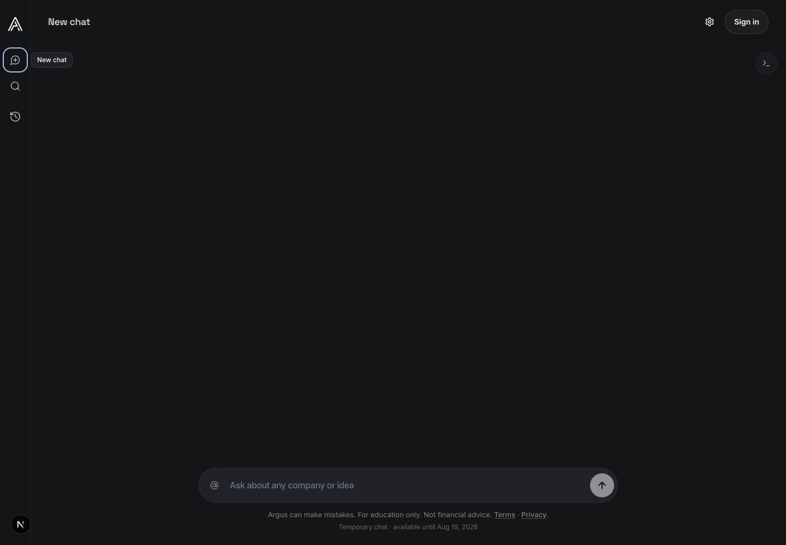

### English phone

Landing:

After New chat:

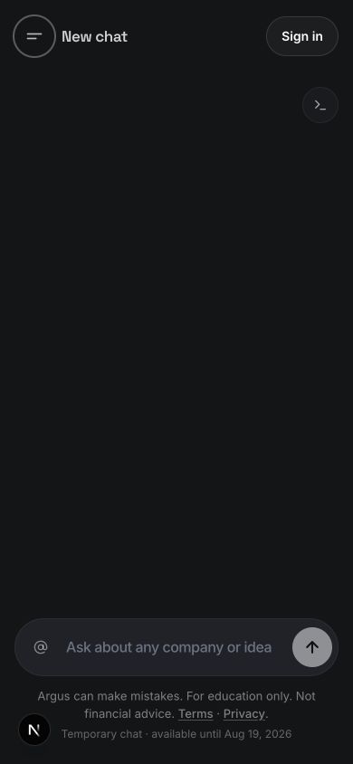

### Spanish desktop

Landing:

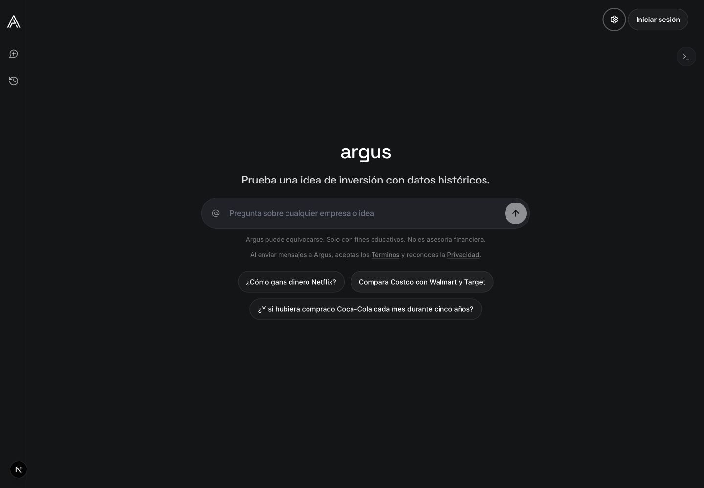

After New chat:

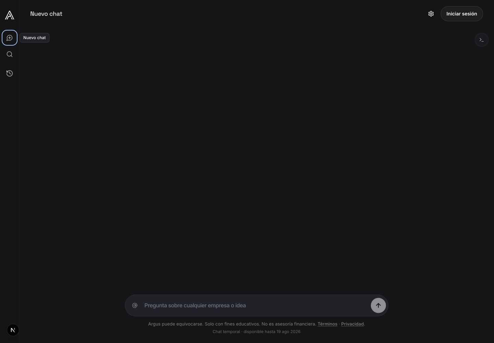

### Spanish phone

Landing:

After New chat:

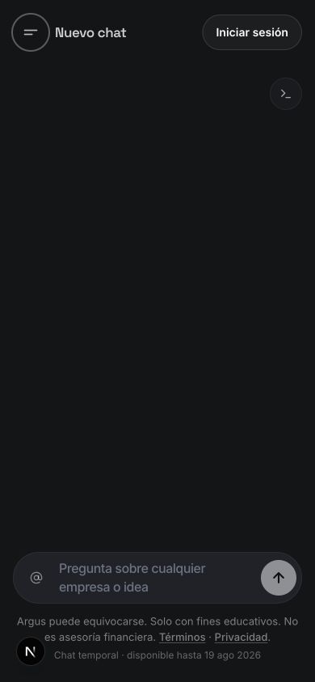

## Post-fix captures

### English desktop

Landing:

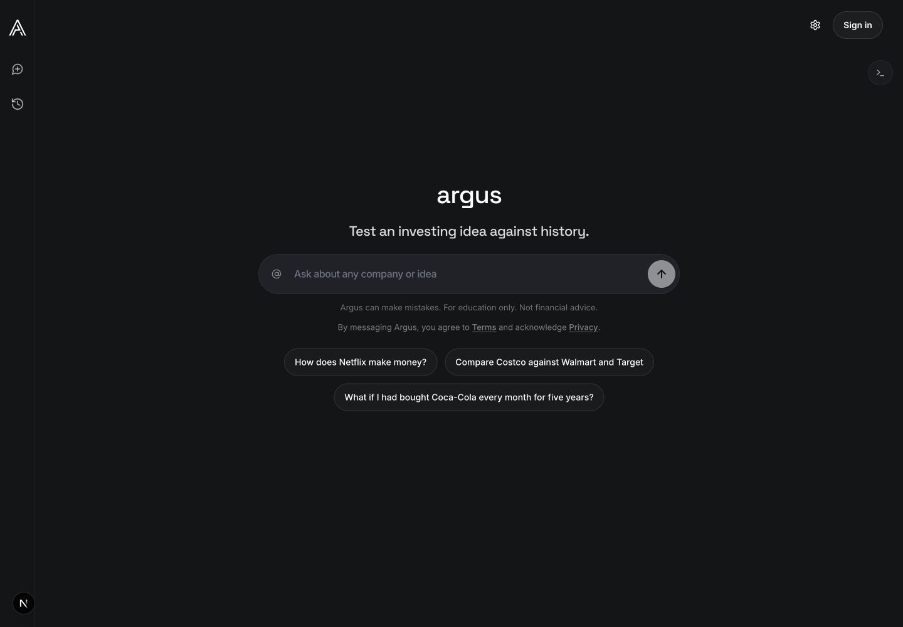

After New chat:

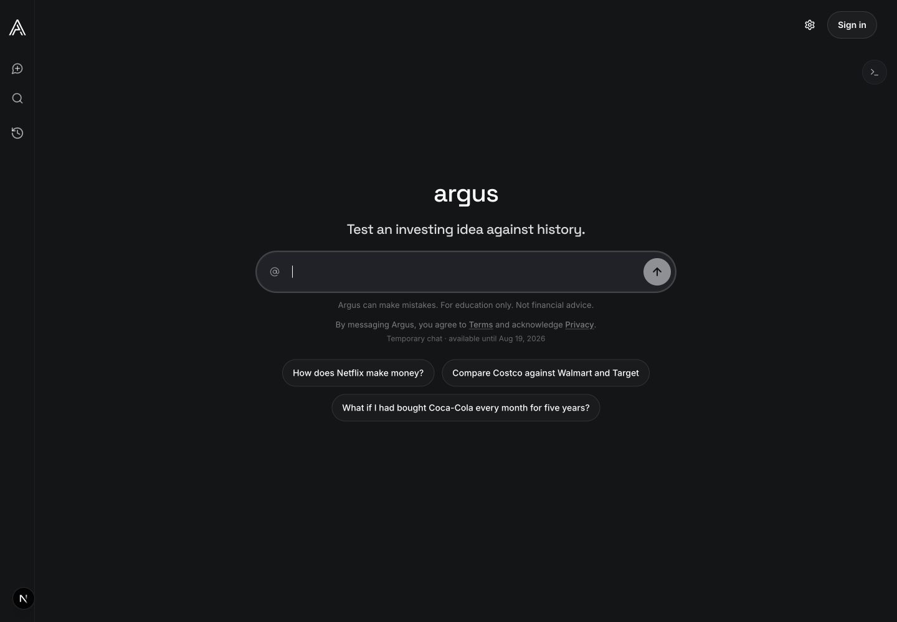

### English phone

Landing:

After New chat:

### Spanish desktop

Landing:

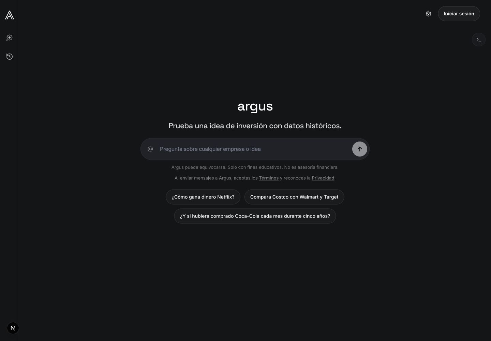

After New chat:

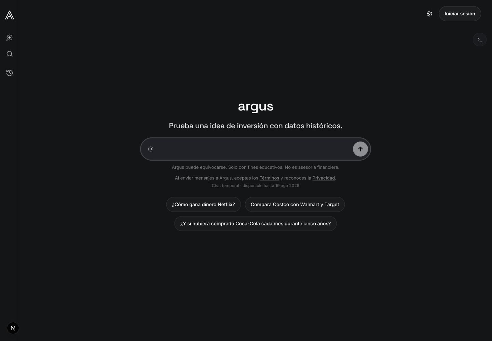

### Spanish phone

Landing:

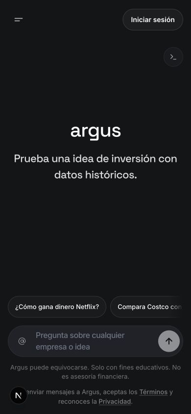

After New chat:

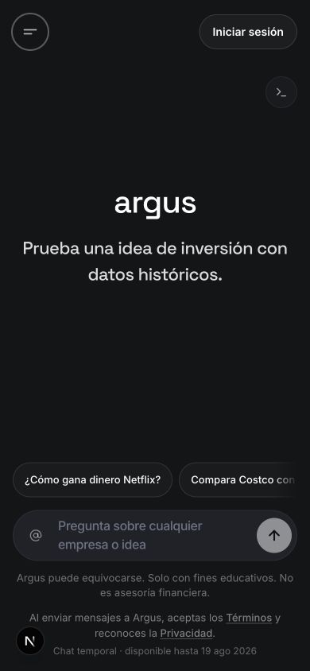
