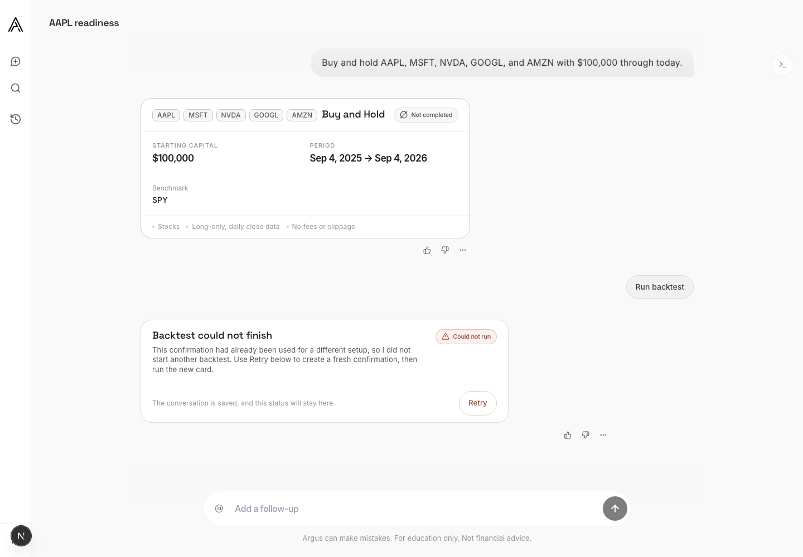
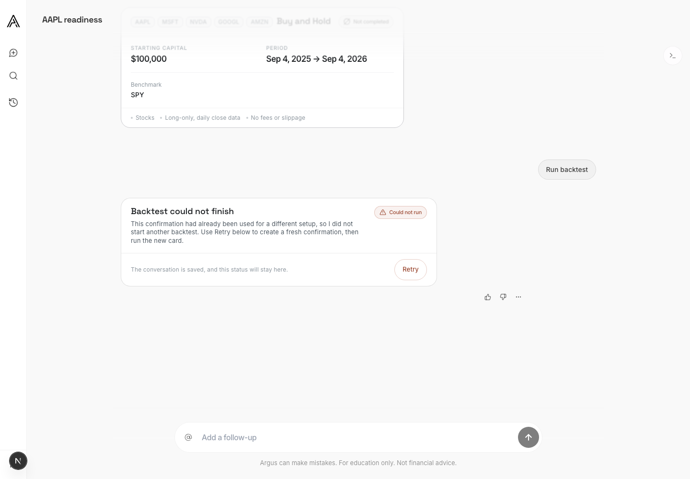
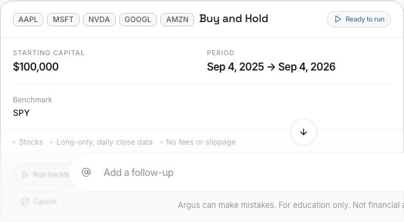

# Issue #542 — Durable Pre-Start Backtest Failure Evidence

Date: 2026-09-03 (America/Chicago)

## Production incident

The source is [issue #542](https://github.com/lagarcess/argus/issues/542),
including its production message, API-log, job, and run readback.

- Conversation `91931579-0cc8-4fa0-bedd-726abb0afa9c` retained one succeeded
  job and one completed run. Both belong to the earlier three-symbol
  NVDA/MSFT/PLTR test.
- The later card kept confirmation identity
  `confirmation-17470c6c-83e9-4305-bf6d-645ec3a40be9` while changing the
  launch to NVDA/MSFT/PLTR/GOOGL/AMZN, buy and hold, `$100,000`, with the
  requested end set to the current day.
- The reservation read returned the earlier job, and the atomic admission RPC
  returned `decision = conflict`. No workflow dispatch followed.
- The API then stored only the generic assistant sentence. It inserted neither
  a job receipt nor a run for the refused attempt, so the sentence had no
  durable failure code or detail behind it.

## Reproduced trigger

`tests/test_issue_542_durable_backtest_failures.py` reconstructs the five-symbol,
`$100,000`, current-day launch against the spent confirmation identity. Before
the fix, the test failed because there was no spent-identity guard and a
conflict returned no failed job. The trigger is therefore **confirmation
identity reuse after that identity already reserved the earlier run**.

The current day is part of the changed launch identity, but it is not the
failing coverage trigger on this base. The prior #475 byte-hash failure was
checked rather than assumed:

- Commit `716221f0` / PR #477 is already in base `5d408acf`.
- Its shared daily-coverage rule clamps an end-today equity request to the
  latest completed session before both preflight and worker hashing.
- The focused #475 tests still prove the effective windows and byte hashes
  agree while today's forming bar changes.

## Repaired invariants

1. The durable job reservation is the owner of whether a confirmation identity
   is spent. Before appending a new card, the API replaces any already-reserved
   identity across the confirmation payload and artifact reference.
2. If admission still refuses a chat launch, the API inserts a separate
   terminal `backtest_jobs` receipt. It has a stable, derived
   `rejection:<hash>` identity distinct from the rejected confirmation key, the
   attempted identity and launch payload, `status = failed`, and stable
   `failure_code`, `failure_detail`, and `retryable` values. A replay returns
   that same receipt, and the earlier reservation is not changed.
3. The runtime links that failed job as the attempt's artifact and chooses the
   user-safe assistant message from the stored `failure_code`. An identity
   conflict keeps the failed job terminal while exposing the existing Retry
   action, which rebuilds the setup as a fresh confirmation before another run.

## Browser acceptance

The Chromium acceptance flow uses the reproduced five-symbol, `$100,000`,
end-today setup and drives the stream contract through the admission-conflict
decision. It proves the failed card renders the recorded reason and a visible
Retry action, reloads the conversation and proves both survive hydration, then
clicks Retry and verifies the structured failed-action identity produces a new
active confirmation.







```text
cd web
ARGUS_EVIDENCE_DIR=../docs/reports/evidence/542 \
PLAYWRIGHT_PORT=3142 \
bunx playwright test e2e/chat-action-recovery.spec.ts \
  --project=chromium --grep 'admission conflict stays specific'

1 passed
```

## Deterministic verification

The regression was exercised without another paid/provider backtest because
the production readback already proves the admission decision and the failure
is entirely before workflow dispatch.

```text
poetry run pytest tests/test_issue_542_durable_backtest_failures.py \
  tests/test_backtest_jobs_shadow.py \
  tests/agent_runtime/test_capacity_refusal_copy.py -q -o addopts=''
31 passed

poetry run pytest tests/test_supabase_gateway.py -q -o addopts=''
58 passed

poetry run pytest \
  tests/domain/test_market_data_coverage.py::test_equity_window_ending_today_mid_session_clamps_to_last_completed_session \
  tests/domain/test_market_data_coverage.py::test_preflight_and_worker_resolve_identical_windows_while_todays_bar_moves \
  tests/domain/test_market_data_coverage.py::test_worker_reclamp_is_a_noop_across_the_completion_boundary \
  -q -o addopts=''
3 passed

ARGUS_RUNTIME_EVENT_TIMEOUT_SECONDS= \
ARGUS_RUNTIME_EVENT_KEEPALIVE_SECONDS= \
poetry run pytest tests/test_chat_stream_contract.py \
  tests/test_allowance_accounting.py tests/test_chat_runtime_cutover.py \
  tests/test_alpha_api_supabase.py -q -o addopts='' -x
195 passed, 1 warning

poetry run pytest tests/test_issue_542_durable_backtest_failures.py \
  tests/test_backtest_jobs_shadow.py \
  tests/agent_runtime/test_capacity_refusal_copy.py \
  tests/agent_runtime/test_execute_launch_payload.py \
  tests/agent_runtime/test_execute_recovery.py \
  tests/test_backtest_job_write_invariant.py \
  tests/test_supabase_gateway.py -q -o addopts=''
168 passed

poetry run pytest tests/agent_runtime/test_interpret_stage.py \
  tests/test_chat_runtime_reload_guardrails.py -q -o addopts='' \
  -k retry_failed_action
1 passed, 274 deselected

poetry run ruff check src tests workflows scripts
All checks passed

poetry run python scripts/check_modularity_budget.py
Budget violations: none
```

The two runtime timing variables are blanked only to keep the test module's
monkeypatched timeout values from being overridden by this worktree's ignored
`.env`. The production defaults and source are unchanged.

## Review closure

The first exact-head Codex review identified two valid gaps in the initial
repair. The follow-up delta now proves both:

- An identity-conflict job remains terminal and non-retryable, while its
  failed-action artifact exposes Retry. That established action rebuilds a
  fresh confirmation instead of resubmitting the spent confirmation ID.
- Refusal receipts use a stable derived key over the attempted action. The
  existing database uniqueness boundary makes a concurrent or transport replay
  converge on the first receipt; the gateway reads and validates that receipt
  after a unique violation instead of inserting a duplicate.

Integration reconciliation and exact-head CI are recorded in the pull request
once the candidate head is published.

## Full local sweep

`poetry run pytest tests -q --no-cov` completed with 5,793 passed, 533 skipped,
and 20 unrelated failures. Fourteen require loopback socket binding or process
inspection denied by the local sandbox. Five are controlled by ignored local
`.env` feature flags or timeout overrides and pass when rerun in the clean base
archive. The remaining OpenRouter failure-origin assertion also fails on the
untouched `5d408acf` base. The clean-host GitHub suite remains the terminal
full-suite gate.

The fetched `origin/codex/private-alpha-next` head was still exactly
`5d408acf6b1ed9608dfe8b757ff41372f9b9daeb`, so no reconciliation merge or
evidence invalidation was required.
