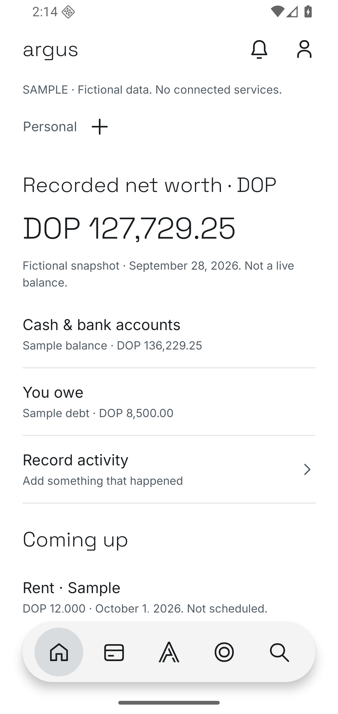
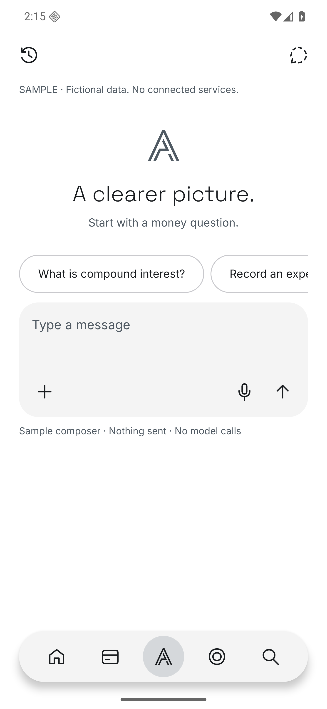
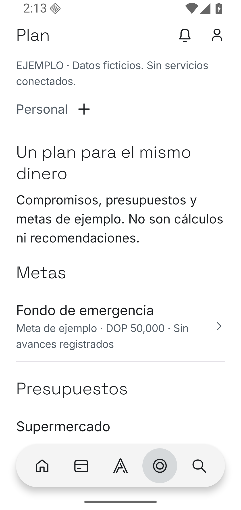
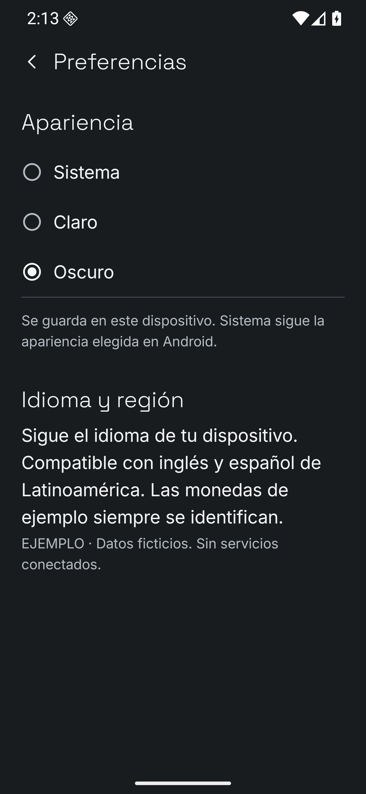
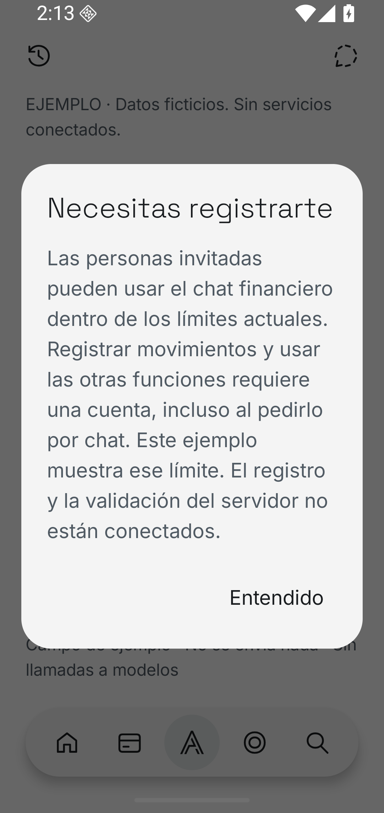
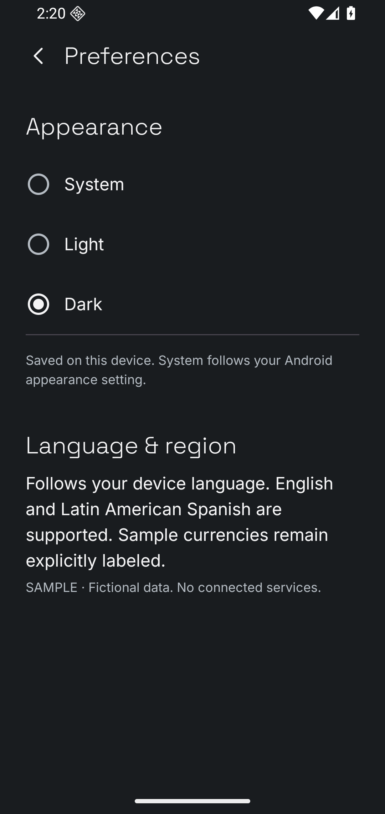
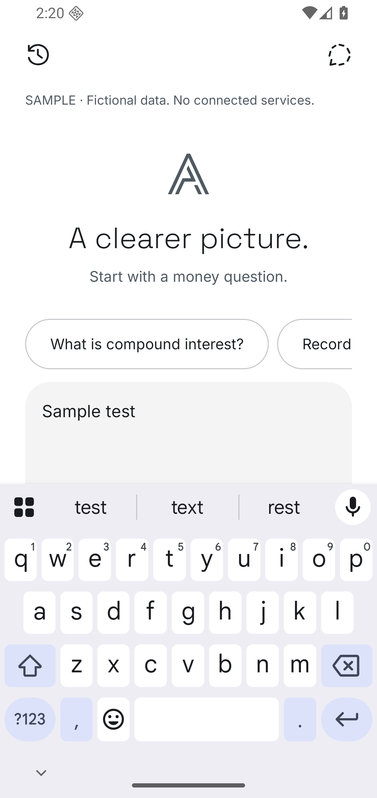

# Android foundation device evidence

Source commit: `8fe35fd32abf0c27ffbc08312db082a4478ba964`.
App main tree: `a5618ee4b264947e4d0f27741dee1e5354522d8e`.
All captures are direct unedited emulator screenshots of the disconnected sample.
Only fictional fixtures and a synthetic draft are present.

| Folder | Phone | Locale | Font scale | Coverage |
| --- | --- | --- | --- | --- |
| `en-small` | Pixel 4 / 360dp | en-US | 1.0 | All five destinations |
| `en-large` | Pixel 7 Pro / 411dp | en-US | 1.0 | All five destinations |
| `es-small` | Pixel 4 / 360dp | es-419 | 1.3 | Home, Argus, Plan, Dark, chat registration |
| `es-large` | Pixel 7 Pro / 411dp | es-419 | 1.3 | Home, Argus, Plan, Dark, chat registration |
| `manual-small` | Pixel 4 / 360dp | en-US | 1.0 | Dark cold restart, keyboard/Back |

Each `*-instrumentation.txt` records 9 passing tests; `verification.json`
records the matrix. `manual-small/checks.json` records manual assertions and
`appearance-after-restart.xml` is the sample app's sole preference.

## Representative captures

## Limits

API 36 ARM64 emulators only. No physical-device, TalkBack, older-API,
production-auth or finance-runtime claim. See the [acceptance report](../../android-phone-foundation.md).
