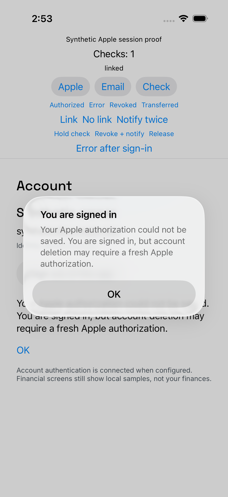
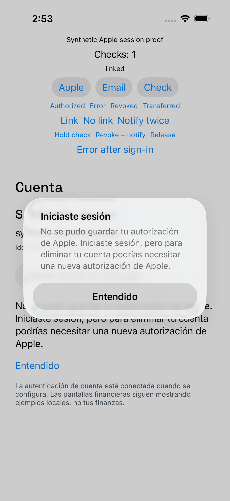
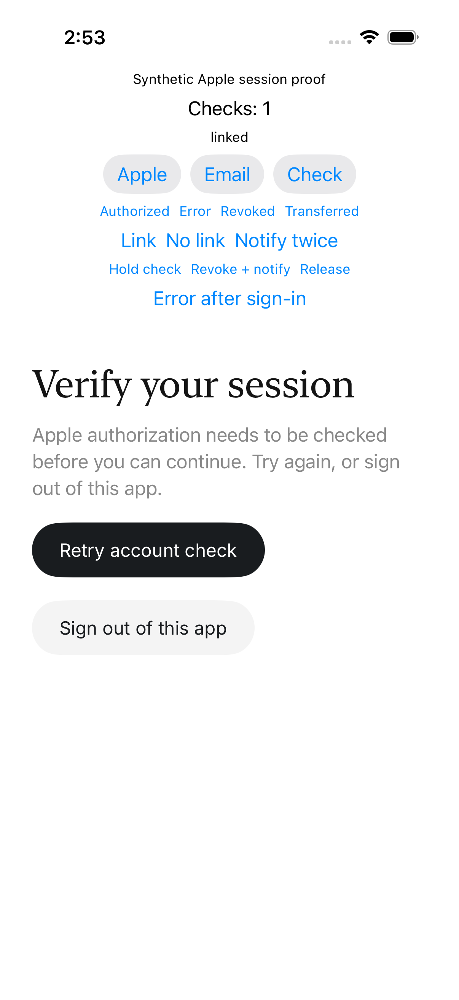
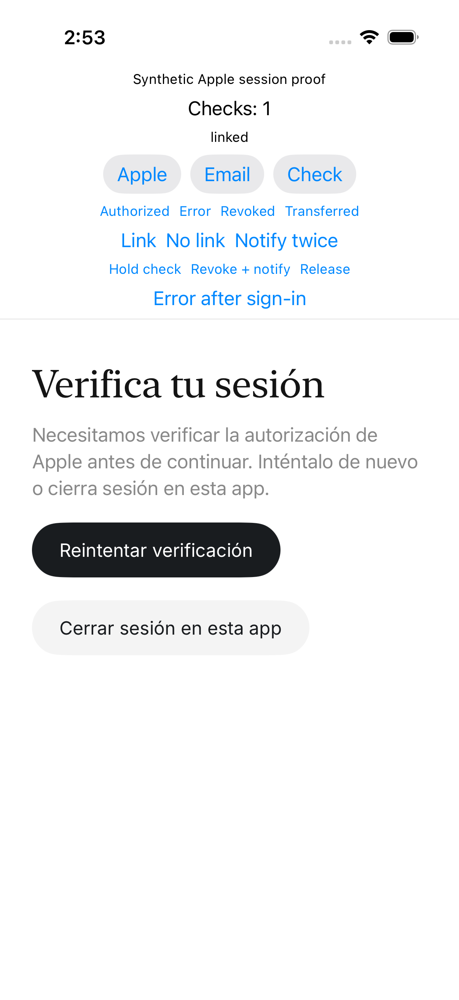
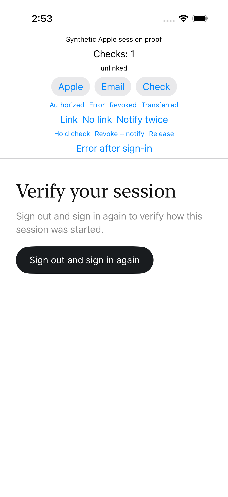
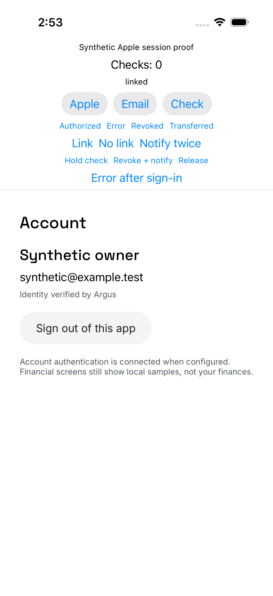
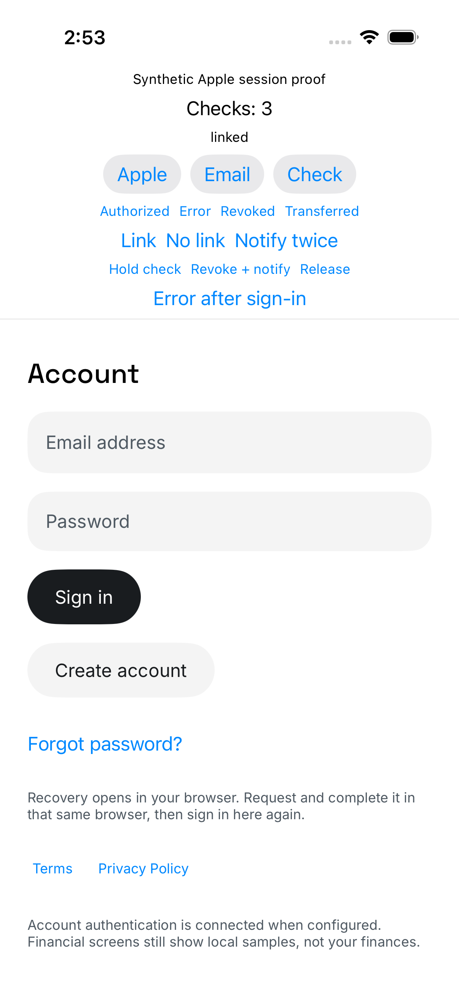

# Apple session validation evidence — 2026-10-05

Candidate source: `caa7e702705a78ae925f2e06d749d3e524d22f6f`.
Original integration base: `f5c83cd88a0af56dc8154a89c6ea4f75d9c518ce`.
Branch: `codex/cuadrao-apple-session-20261005`.
Fetched integration: `7018e0edebbc370b999005a857230bf3c3a1ad8b`.
Normal reconciliation merge: `b07670139d4cf89c1ca7da02692ae70523893e14`.

The appearance change in #857 overlaps the provider button view and connected
auth file. The merge retains adaptive Apple/Google button styling, system
background and primary foreground, alongside the checker adapter and recovery
branch. It changes no SDK/session/API contract. The final build and UI proof were
rerun after reconciliation. API/core/SQL evidence remains valid. #853 was not in
the fetched integration reference at this checkpoint.

This slice adds owner-only `/me.apple_identity`, journaled successful sign-in
method, Apple credential validation, and visible capture/recovery outcomes.
Known email/Google sessions stay usable despite a linked Apple identity.
Unknown mixed sessions require explicit sign-out and sign-in. Provider activation
and physical Apple authorization remain separate gates.

The candidate was committed before the final simulator run. The later evidence
commit changes only this directory. Candidate tree hashes:

- `ios`: `a4e7ba0644e59421067a193e20876f8d2fd4f390`
- `src`: `33fc11bd35d0a0d99c11a969aec22f787b853f16`
- `tests`: `4e56653201b6747beff980f0328af322960def69`

## Verification

Final simulator build and four UI tests passed in 80.176 seconds, zero failures.
Screenshots capture English/Spanish capture failure, held validation with both
recovery actions, revocation, known email access, explicit sign-in again, and
notification coalescing. Focused backend: **79 passed, 70 deselected**.

- ArgusSession: **136 executed, 132 passed, four skipped, zero failures**.
  This includes pending-journal priority, unreadable Keychain reads, canonical
  subject/owner validation, grant method refresh/epoch ownership, rollback-compatible
  SDK decoding, old SDK metadata removal, capture bounds and one-attempt semantics.
  It also covers immediate signal admission, stale checker answers, capture during
  a notification, adoption, and failed Keychain reads.
- Financial message mappings: **one passed**, testing both affected mappers at
  422 and 503. Household models: **50 passed**, including its 503 fallback.
- Mocked eval README's ten-file command: **272 passed** on the reconciled tree;
  no provider calls. Modularity budget: **zero violations**, rerun on the final
  reconciled source. Backend and eval source files did not change in the final
  native admission fix; their evidence is retained.
- Native provider configuration: **22 passed**, 11 each in Debug and Release,
  preserving release force-off and Google dependence on Apple.
- Real PostgreSQL projection: **four passed** using an explicit synthetic
  `current_user` override. These prove owner-scoped SQL and HTTP projection,
  confirmed absence, malformed identity, and conflicting identities.
- Signed local GoTrue/current_user proof: **one passed**. Two local password-issued
  JWTs returned only their own linked subjects even with another owner's query id;
  no bearer returned 401 without identity. This uses the actual API auth dependency,
  local GoTrue and PostgreSQL, with no Apple network request. Owned users and
  allowlist entries were deleted; read-only verification found zero remaining.

The four skipped tests require an explicitly enabled different local stack:

- `LiveFinancialAccountTests.testLocalDurableAccountsThroughProductionClient`
- `LiveSessionTests.testLiveConcurrentRefreshAfterExpiryMargin`
- `LiveSessionTests.testLiveInvalidLoginAndConfirmationRequiredSignup`
- `LiveSessionTests.testLiveRegisteredRelaunchRevocationAndAccountSwitch`

The DEBUG journey uses the actual SessionController, pinned Supabase SDK,
ProfileAuthModel, recovery/profile views and shared SessionLifecycle modifier.
Foregrounding while the capture alert is visible proves held validation dismisses
that stale modal; retry preserves the inline capture outcome. Identity mutations
wait for a server receipt, and held validation waits for the actual checker
continuation to be installed before notification and release. All synthetic
checker setup and release controls are synchronous on the main actor, so no
later button action can overtake its setup.
Only Auth/API HTTP and Apple credential state are synthetic. A held checker
proves a revocation notification arriving while the actual model is busy is
retained and causes a second check followed by retirement. The UI test observes
that final state. A separate [direct actor probe](notification-admission/README.md)
pauses the queued restore and proves the protected request count changes from one
before the fix to zero after it. A positive control dispatches once in both runs.
The harness resets only its dedicated Keychain service when the explicit test launch argument is present.
It is excluded from release builds.

## Reproduction

Package:

```sh
CLANG_MODULE_CACHE_PATH=/private/tmp/cuadrao-session-clang-cache \
SWIFTPM_MODULECACHE_OVERRIDE=/private/tmp/cuadrao-session-swift-cache \
swift test --package-path ios/Packages/ArgusSession \
  --scratch-path /private/tmp/cuadrao-apple-session-swift \
  --cache-path /private/tmp/cuadrao-session-spm-cache \
  --disable-sandbox --disable-automatic-resolution
```

The ordinary model runners are `ios/FinancialModelTests/run.py` (filter
`testServerFailuresStayConnectionErrorsWhileValidationKeepsItsMessage`) and
`run_household.py`. Separate scratch paths were
`/private/tmp/cuadrao-apple-financial-models` and
`/private/tmp/cuadrao-apple-household-models`; dependencies were copied from an
existing local cache, never modified in that cache.

Final simulator build and test, with the loopback fake started by
`python3 ios/scripts/auth/apple-session-server.py`:

```sh
xcodebuild test -project ios/ArgusFoundation.xcodeproj \
  -scheme ArgusFoundation -configuration Debug \
  -destination 'platform=iOS Simulator,id=1F378304-B575-47B3-AD39-5A1DFE87047D' \
  -derivedDataPath /private/tmp/cuadrao-apple-session-xcode \
  -clonedSourcePackagesDirPath /private/tmp/cuadrao-apple-session-xcode-packages \
  -disableAutomaticPackageResolution -parallel-testing-enabled NO \
  -only-testing:ArgusFoundationUITests/AppleSessionJourneyUITests \
  -resultBundlePath /private/tmp/cuadrao-apple-session-admission-journeys.xcresult \
  CODE_SIGNING_REQUIRED=NO ARGUS_LOCAL_BUNDLE_IDENTIFIER=local.argus.apple-session-proof
```

Device: owned iPhone 17 Pro simulator, iOS 26.5. No physical device, Apple SDK
network, paid/model/provider call, hosted mutation, distribution, or activation.
The platform adapter is covered through its injected typed boundary; physical
Apple credential-state behavior still needs the separately authorized device gate.

Focused backend command:

```sh
PYTHONPATH=web:src:. /private/tmp/cuadrao-scipy-env-20261005/bin/python -m pytest \
  tests/test_profile_apple_identity.py tests/test_profile_theme_retired.py \
  tests/test_openapi_compatibility.py tests/test_alpha_api_supabase.py \
  -k 'profile or me or openapi' -q --no-cov
```

Python checks use `/private/tmp/cuadrao-scipy-env-20261005/bin/python` with
`PYTHONPATH=web:src:.`. PostgreSQL tests need the reserved disposable stack and
`ARGUS_DISPOSABLE_DATABASE_URL`; signed proof additionally requires
`ARGUS_APPLE_LOCAL_AUTH_PROOF=1` and synthetic local Auth configuration.
Do not run them against a hosted database or reset a shared stack.

## Diagnostic history

- Capture TDD first failed on 503 classification and invalid code dispatch;
  bounded parsing and one-attempt transport fixed those failures.
- Compatibility TDD first failed when the pinned SDK decoded the proposed nested
  envelope. The final same-key root Session JSON with namespaced provenance fixes
  rollback compatibility. Recognized malformed provenance still fails closed.
- The initial signed local Auth fixture omitted identity timestamps: GoTrue
  returned 401 and admin cleanup 500. Only the two owned leftovers were removed.
  The corrected timestamp fixture then hit private-alpha admission 403; adding
  scoped admission fixtures produced the successful signed proof and clean teardown.
- WIP UI run one: three failures from harness checker lifetime and selectors.
  The checker now shares SwiftUI state lifetime with its actual model.
- WIP UI run two: four setup failures from the unshipped nested Keychain record;
  the test reset explicitly clears only its own synthetic service. Inspection also
  found a container accessibility id masking recovery buttons; it was removed.
- WIP UI run three: all four passed. Inspection found repeated capture alerts on
  foreground validation; the candidate tracks undelivered notice state and asserts
  that ordinary validation does not reshow an already presented capture alert.
- Review identified two synthetic control races (identity HTTP completion and
  release before checker suspension), then the same asynchronous setter pattern
  in the new modal test. The final harness uses explicit HTTP receipts, installed
  continuation readiness, and synchronous MainActor checker controls.
- A superseded four-test run passed its assertions but xcodebuild stalled while
  collecting the result bundle. That owned collector was stopped; its incomplete
  artifact is not acceptance evidence.
- First mapper test compile used the wrong model type; its next run assumed both
  existing 422 messages were identical. The corrected test preserves each mapper's
  real 422 copy and proves both retain connection copy for 503.

## Review and boundaries

Independent core and storage/pending delta reviews returned clean after the
pending-priority correction. The stale README public surface was corrected, and
one redundant test comment removed. The independent app review and final harness-only delta review returned clean
on the final source after the stale-modal fix, truthful copy changes, and shared
control ordering fix. No unresolved findings, MUST KILL flags, or comment
removals remain.
The later notification admission delta `371fffc961..caa7e7027` also received a
clean independent review. It added and removed zero source comments; no MUST KILL
or deslop finding remained. The confirmed race, red test and zero-dispatch proof
are recorded in the linked admission report.
This report is acceptance evidence, not a merge, deployment or release approval.
API timeout wording is documentation truth only; it does not claim a hard total
wall-clock deadline or cancel an already requested Apple revocation.

Local logs use the prefix `/private/tmp/cuadrao-apple-session-`: `swift-compatible.log`,
`pending-priority.log`, `compatible-red.log`, `financial-models3.log`,
`household-models.log`, `mocked-evals.log`, `real-auth.log`, `backend-final.log`,
`controls-final.log`, `build-controls.log`, `provider-configuration.log`, `mocked-merged.log`, `modularity.log`.
Final admission logs: `admission-journeys.log`, `interval-before4.log`,
`interval-after.log`, `admission-modularity.log`. Package logs use
`/private/tmp/cuadrao-apple-admission-{red,green,suite}.log`. Screenshots below are committed durable artifacts from the final run.


## Screenshots









Revoked signed-out screens are also saved as `apple-revoked-signed-out-en.png`
and `apple-revoked-signed-out-es-419.png`. Attachment timestamps and owning test
identifiers are in `attachments.json`.


## Cleanup and handoff

The synthetic server was stopped and port 59920 was verified closed. The final
owned simulator `1F378304-B575-47B3-AD39-5A1DFE87047D` was shut down and deleted;
its absence was verified. The earlier owned simulator
`E027949A-2B75-4679-8D82-8F04FD08E735` was also removed at its checkpoint. All owned build/test processes completed or were explicitly stopped.
PostgreSQL was released after scoped teardown, and the Mac slot was released
after final evidence export. Existing external caches and unrelated fixtures were
not modified. No source edits remain after the final source candidate; only this
evidence directory changes in the final commit.

The parent owns PR publication, terminal CI, and any later #853 reconciliation.
The implementation workers did not push or merge. Publication is handled by the
parent. Integration review, merge and activation remain separate actions.
