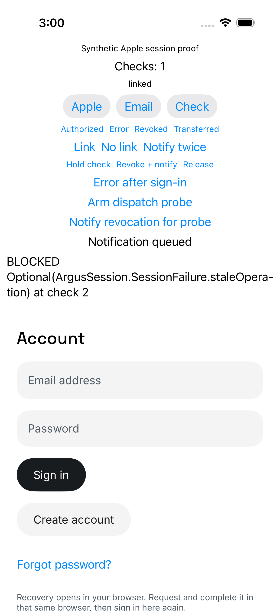

# Independent notification admission proof

PR864 head `9419001712dc9f070741909312982f19d1e08e72`, source `caa7e702705a78ae925f2e06d749d3e524d22f6f`, integration `7018e0edebbc370b999005a857230bf3c3a1ad8b`.

The independent reviewer ran the committed diagnostic patch only in a temporary archive. The probe used the actual ProfileAuthModel and a direct SessionController request with synthetic local services. It held the queued model restore after an earlier checker completed, then attempted the protected request. The request was blocked with staleOperation at check2. The local HTTP counter moved from0 to1, covering one positive control and zero forbidden requests. The xcresult collector exited0.

This proves the tested admission interval. It does not prove real Apple authorization or hosted behavior. The remaining full independent review and exact-head CI are separate gates.
