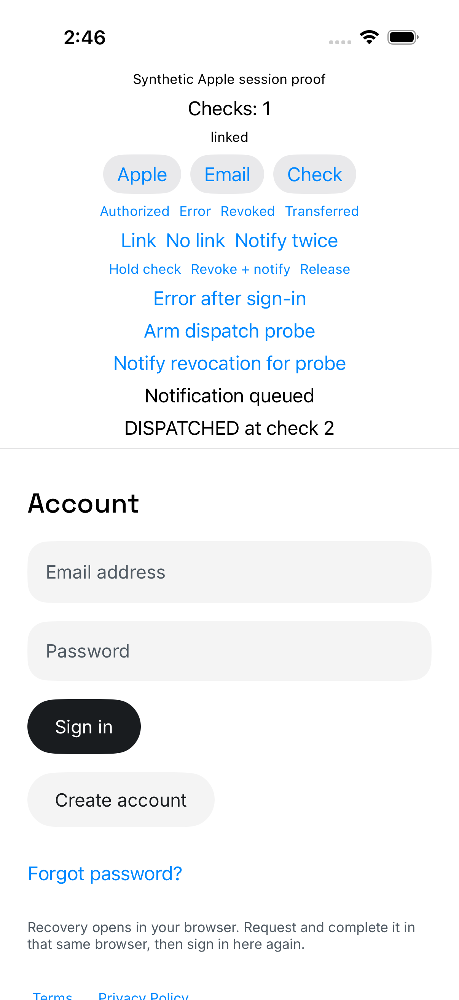
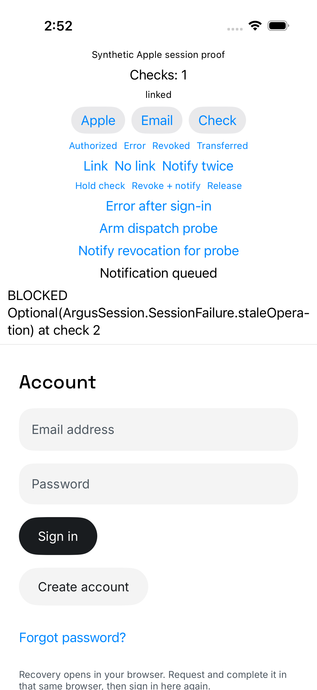

# Notification admission proof

A revocation notification could reach the busy profile model without closing
access in the session actor. When the older check returned “authorized,” a
protected request could run before the model started its queued check.

The fix admits the signal in `SessionController` before the model queues work.
It also invalidates older checker answers. Known email and Google sessions keep
access. The existing pending-sign-out journal still owns retirement.

| Proof | Source commit | Positive control | Request during held queue | Result |
| --- | --- | ---: | ---: | --- |
| Before | `371fffc961bac086b5a12b5b4646ac5790d5cdcb` | 1 | 1 | 1 test, 1 expected failure |
| After | `caa7e702705a78ae925f2e06d749d3e524d22f6f` | 1 | 0 | 1 test, 0 failures |

## Test order

1. Sign in with synthetic Apple credentials. Checker 1 returns authorized.
2. Read through the actual model's `SessionController` to prove the protected
   route can dispatch. The fake server returns its distinct 404 code.
3. Start a foreground check. Hold checker 2 with an authorized answer.
4. Post the real Apple credential-revoked notification through `SessionLifecycle`.
5. Wait until the actual model acknowledges its queued revalidation.
6. Release checker 2. Pause the main actor at its next state publication, before
   the queued restore can start checker 3.
7. Call the protected route directly through the session actor.
8. Release the main actor and allow the queued check to finish.

The same diagnostic patch runs before and after the fix. It changes only the
DEBUG harness, one UI test, and the loopback fake server. It does not change
`SessionController`, `ProfileAuthModel`, or the notification bridge. Reflection
retrieves the actual private controller and queue flag for this diagnostic only.
A bounded semaphore holds the queued work while a detached task calls the actor.
This deliberate test barrier causes an expected Xcode priority-inversion warning.

The before counter changed 2 to 4. The after counter changed 4 to 5. Each run
includes one positive control. The displayed result was `DISPATCHED at check 2`
before and `BLOCKED ... staleOperation ... at check 2` after. The before test ran
in 12.892 seconds; the after test ran in 12.981 seconds. Both result collectors
finished. Structured counts and source commits are in `before.json` and `after.json`.

## Reproduction

Apply `interval-probe.patch` to a separate checkout of either source commit.
Start `ios/scripts/auth/apple-session-server.py` with the approved local Python.
Build and run only
`AppleSessionJourneyUITests/testIndependentQueuedNotificationDispatchProbe`
on an owned iOS simulator. Read `/synthetic/probe-count` on port 59920 before
and after the test. No database or Apple network call is needed.

The patch SHA-256 is
`b444c50ecf3a3dbbb48842850a400006dc86c8b08c416a0fd8636bf0cbfb7d7e`.
Its bytes were identical for both runs. The patch and screenshots are committed.

## Related checks and review

Five new package tests cover stale authorized/revoked answers, non-Apple access,
capture without replay, a signal during adoption, and failed Keychain reads.
Pending-journal priority coverage also includes signal admission. The focused
suite passed 17 tests. The full package passed 132 tests, skipped the four existing
live-stack tests, and had zero failures. The red package run used a no-op admission
method so the tests could exercise old behavior instead of failing to compile.

Independent review of `371fffc961..caa7e7027` returned clean. It checked the actor,
model, tests, and owner README. There were no new source comments, removed source
comments, MUST KILL flags, or deslop findings. The broader source review remains
in the parent report. This proof does not establish physical Apple behavior.

Two early probe attempts were invalid diagnostics. The fake route compared a
lowercase UUID with Swift's uppercase UUID. The first missed all requests; the
second added a positive control and failed before probing. Case-normalizing the
fake route fixed the instrumentation. Two later before-fix runs then proved the
same forbidden dispatch. Only the complete before4/after pair is used above.
