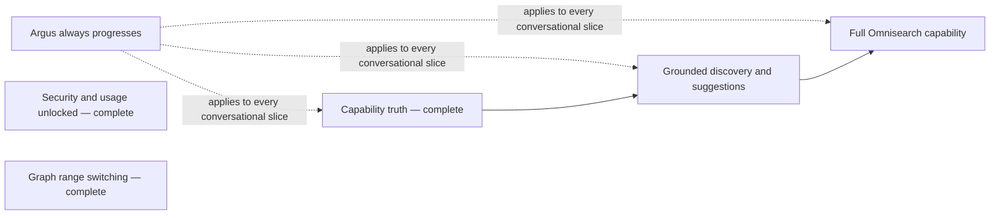

# Private Alpha Interim Roadmap

Status: **ACTIVE — founder-outcome and live-QA execution source**

Original roadmap date: 2026-07-16

Last reconciled: 2026-07-23

Current stable integration checkpoint: `codex/private-alpha-next` at
`bbd1d2bb44a298de2f048e361c92d5851e4c38d1`.

That checkpoint contains four founder-accepted, independently revertible
vertical slices:

- adaptive result-chart range switching from PR #264 at `0c0d481`;
- account recovery and session controls from PR #261 at `a639566`; and
- truthful Usage allowances and accounting from PR #259 at `2eb6874`; and
- executable capability truth from PR #266, with final candidate `e10bdd2` and
  integration merge `bbd1d2b`.

Read-only audit donor: `claude/argus-alpha-audit-c2d919` at
`f1d03a1d847628e6a8d681b22337ad5fc6c5ebfd`.

Last promoted `main` checkpoint: functional promotion merge `5d1eec11`, with
the [production-promotion record](https://github.com/lagarcess/argus/blob/main/docs/release-manifests/2026-07-14-main-production-promotion.md)
completed on `main` at `217ead12`.

This is the bounded pivot between the latest `main` promotion and the remaining
P2 compounding loop in
[`private-alpha-next-roadmap.md`](private-alpha-next-roadmap.md). Existing
issues #228 through #253 are supporting evidence and possible implementation
material, not the roadmap itself. #213 remains excluded.

The roadmap does not authorize implementation by itself. The founder selects a
user outcome. A fresh vertical slice then proves that outcome against the
latest integration checkpoint.

## Authoritative Founder Outcomes

These six outcomes are the interim roadmap:

1. **Argus always progresses.** A conversation never becomes trapped in a
   semantic loop, repeated recovery, unexplained terminal state, or
   deterministic cul-de-sac. Every accepted turn makes meaningful progress or
   gives the user a clear, actionable stopping point.
2. **Security and usage are unlocked for users.** Users can reach account
   security and session controls and can see truthful usage, remaining
   allowance, what counts, and when it resets.
3. **Graphs have range switching.** Users can change the visible result range
   without changing the approved backtest, corrupting the effective data
   window, or seeing frontend-invented facts.
4. **Argus knows what it can and cannot do.** It distinguishes supported,
   unsupported, and not-yet-supported requests without overpromising and helps
   the user reach a supported next step.
5. **Discovery is grounded and Argus can suggest.** Search and suggestions are
   source-backed, provider-validated where required, and limited to actions
   Argus can actually support.
6. **Omnisearch lives up to its full capability.** Omnisearch provides useful
   unified retrieval and navigation across the user's Argus artifacts, with
   truthful previews and actionable results.

### Current Completion Ledger

This ledger records accepted user-visible behavior, not issue activity or a
deterministic test result by itself.

| Founder outcome | State | Completion evidence |
| --- | --- | --- |
| 1. Argus always progresses | Not yet accepted complete | No founder-accepted slice yet proves representative conversational journeys against the current integration checkpoint. |
| 2. Security and usage are unlocked | **Complete** | #248/PR #261 delivered reachable recovery, password, and current/other/all-session controls with real Supabase Auth QA. #247/PR #259 delivered reachable Settings -> Usage, backend-owned hourly/daily message and simulation truth, exact reset instants, durable exactly-once accounting, EN/ES desktop/mobile behavior, and exact-head real-auth/local-persistence QA. |
| 3. Graphs have range switching | **Complete** | #250/PR #264 delivered adaptive presets, Custom/Reset, daily/intraday presentation, EN/ES desktop/mobile browser proof, reload-to-ALL, immutable full-run truth, and zero range-interaction network calls. |
| 4. Argus knows what it can and cannot do | **Complete** | #241/PR #266 proved supported golden-cross execution, fail-closed momentum-breakout and news-sentiment recovery, the general future-performance boundary, compatible fact preservation, explicit supported-alternative selection, localized Quick take, and exact-head founder-visible browser QA. Candidate `e10bdd2` landed as `bbd1d2b`. |
| 5. Discovery is grounded and Argus can suggest | Not yet accepted complete | No founder-accepted slice yet proves grounded suggestions end to end on the current checkpoint. |
| 6. Omnisearch lives up to its full capability | Not yet accepted complete | No founder-accepted slice yet proves the full Omnisearch journey end to end on the current checkpoint. |

Outcomes 2, 3, and 4 must not be redispatched unless a new regression is
reproduced. Their evidence remains useful as a regression baseline for later
slices.

## Product Relationships, Not An Issue Order

Capability truth is a product prerequisite for grounded suggestions. Grounded
discovery is a product prerequisite for complete Omnisearch. Progress behavior
applies across all conversational work. This relationship does not prescribe
an issue order or require one giant implementation lane.

## Vertical-Slice Delivery Contract

For each founder-selected outcome:

1. name one complete user-visible journey and its expected behavior;
2. reproduce that journey on the latest stable integration checkpoint;
3. branch from that checkpoint and change only what the journey requires;
4. salvage donor code only when a specific hunk remains correct and useful;
5. run focused deterministic checks and production-parity local browser QA,
   including persistence and reload where the journey uses them;
6. compare the candidate with the integration baseline and reject regressions;
7. present the working behavior to the founder or private-alpha users before
   promotion;
8. record the exact candidate and merge SHAs, rollback boundary, and any later
   tester-exposure gates.

An issue can provide evidence or requirements. It is not the unit of completion
unless the selected slice explicitly makes it so.

### Live QA Is Required Before Merge

Deterministic tests prove contracts; they do not prove the product experience.
Every vertical slice requires live QA proportional to its surface:

- auth, history, and UI work uses real auth and verifies interaction,
  persistence, navigation, and reload where applicable;
- conversational runtime work uses real prompts and inspects the visible
  response, hidden typed state, recovery, and reload;
- backtest work completes the relevant approval, execution, result, and reload
  journey with real provider data;
- contract work starts the production-parity API and compares the generated
  contract before browser smoke.

An exact deployed canary is a later tester-exposure gate when the founder is
preparing a candidate for users. It does not replace slice-local QA.

### Guardrail Ratchet

Keep the minimum guardrails required for security, privacy, correct accounting,
durable state, grounded evidence, and duplicate-execution prevention. Do not
add speculative strictness that blocks the Golden Path. Tighten further in
response to observed user or operational evidence.

## Source Order

Every implementation owner reads, in order:

1. `AGENTS.md`
2. `docs/PRODUCT.md`
3. `docs/ARCHITECTURE.md`
4. `docs/API_CONTRACT.md`
5. `docs/DATA_MODEL.md`
6. `.agent/designs/argus/DESIGN.md`
7. this roadmap
8. the founder-selected vertical-slice brief
9. related issues as supporting evidence
10. relevant sections of `docs/specs/private-alpha-next-decision-memo.md`
11. release references only when the slice touches release evidence

Canon wins if sources conflict. The selected slice owns its journey, allowed
surfaces, no-touch areas, and acceptance evidence.

## Checkpoint And Salvage Discipline

The integration branch is the stable working checkpoint. Known corner cases do
not invalidate it or authorize unrelated scope expansion.

The audit donor records useful experiments and failure evidence, but it is not
an integration candidate. Never merge it wholesale. For each selected slice:

1. create a fresh branch from the latest integration SHA;
2. map donor code to the selected user journey;
3. reuse only dependency-clean commits or the smallest justified hunks;
4. prove the complete journey and relevant regressions;
5. merge one reviewed, revertible slice into integration;
6. update this checkpoint before selecting another slice.

Parallel investigation is allowed on genuinely independent surfaces. Shared
runtime, API, database, and web-shell changes integrate one owner at a time.

## Current Remaining Outcomes

The founder chooses among the remaining outcomes; this table is not an
implementation queue.

| Outcome | Product proof still required |
| --- | --- |
| Argus always progresses | Representative messy-language journeys make progress, recover, and reload without loops or deterministic cul-de-sacs. |
| Grounded discovery and suggestions | Search-backed suggestions carry source and provider truth and lead only to supported next actions. |
| Full Omnisearch | Owner-scoped conversations, results, decisions, and evidence are retrievable with truthful previews and useful navigation. |

Do not select the next slice from the archived issue dependency graph. Select
it by user value, regression risk, and the smallest complete live journey.

### Completed slice: Capability truth

Status: **COMPLETE — PR #266 merged as `bbd1d2b`; issue #241 closed**

The completed vertical-slice contract is archived at
[`2026-07-22-capability-truth-executable-boundary-design.md`](../archive/2026-07-22-capability-truth-executable-boundary-design.md).
The original path remains as a compatibility pointer for existing issue and PR
links. [Issue #241](https://github.com/lagarcess/argus/issues/241) and
[PR #266](https://github.com/lagarcess/argus/pull/266) contain the detailed
implementation and review evidence.

This is acceptance and narrow gap-closing for the founder outcome, not a rebuild
of the completed P2.1 registry work.

The slice proves four end-to-end classes: a supported golden-cross control, a
recognized but non-executable momentum-breakout request, an unsupported external
news-sentiment rule, and the general future-performance boundary. The last class
applies to any asset, strategy, amount, language, or future horizon. Argus says
it cannot predict future performance and separately offers a supported
historical test. Only an explicit user choice creates the historical draft;
compatible asset and capital facts carry forward, while a future horizon never
silently becomes a historical date range.

This slice adds no forecasting engine, Search/discovery behavior, strategy,
indicator, provider, or second capability registry. If exact-head reproduction
is already correct, align tests and evidence only rather than manufacturing a
runtime change.

Completion evidence:

- deterministic runtime, registry, mocked-eval, frontend, modularity, and CI
  gates passed on the candidate family;
- the sanctioned interpreter suite passed 27/27 at `497e2b8`;
- the final bounded correction passed independent review and exact-head
  founder-visible browser QA at `e10bdd2`;
- supported golden cross reached the ordinary confirmation/result path;
- momentum breakout, news sentiment, and future-performance requests remained
  non-executable and useful, with compatible facts preserved;
- an explicit supported alternative plus historical period produced the correct
  confirmation without carrying stale unsupported identity; and
- the founder approved merge, PR #266 landed as `bbd1d2b`, and issue #241
  closed as completed.

### Next selected pillar: Argus always progresses

Status: **READY TO SPEC — implementation not authorized**

This pillar is next because it protects every later conversational surface.
The first spec must choose one representative user journey on the latest
integration checkpoint and prove that every accepted turn either advances
typed state or reaches a clear, actionable stopping point. It must cover
reload when the journey is durable and compare the candidate against the
current Golden Path.

This is not permission for a generic loop engine, broad runtime refactor, new
intent taxonomy, phrase-based routing, or a sweep of historical issue debt.
Related issues and the audit donor are evidence only. Implementation begins
only after a founder-approved vertical-slice contract names the exact journey,
allowed surfaces, no-touch areas, live-browser acceptance, rollback, and stop
conditions.

## Retained Product Decisions

### Usage allowance (#247 — complete)

- Alpha uses backend-owned UTC calendar windows: messages are limited to 60
  per hour and 200 per day; simulations are limited to 10 per hour and 50 per
  day. These are operating limits, not pricing.
- The authenticated read contract returns both windows, exact `period_end`,
  and backend-derived `available_now` and limiting-window truth.
- Count one message only when an accepted turn reaches a durable substantive
  terminal product outcome. Malformed, unauthenticated, duplicate-replay,
  abandoned, and infrastructure-failed turns count zero.
- Count one simulation at first successful unique durable admission. Replays
  and pre-admission rejections count zero. A later execution failure does not
  erase the admitted unit.
- Chat and direct launches share the accounting rule.
- The frontend localizes backend reset instants and never derives quota truth.
- Billing, plans, credits, provider/model tokens, and internal CostLedger data
  remain out of scope.

Before tester exposure, the target environment must receive migrations through
`20260722000004`, enable `ARGUS_BACKTEST_JOBS_SHADOW_ENABLED=true`, and pass an
exact-SHA canary. Those are exposure gates, not reasons to reopen #247 or block
its integration completion.

The pre-existing stale direct-job GET reconciliation gap remains tracked by
#231; #230 owns any atomic database primitive it requires. It is not part of
the completed user-visible Usage slice.

### Incomplete data windows (#251)

- Fit to provider-supported data only when a viable common window remains; a
  material fit must not be silent.
- Ordinary weekend or holiday session normalization inside available coverage
  shows no warning.
- A material head or tail correction is explained in provider-neutral language
  immediately before the confirmation card. Preserve the LLM-authored voice
  through stream and reload; deterministic localized copy is degraded fallback.
- The card shows effective dates while requested dates remain durable
  provenance.
- Preflight consumes no simulation unit.
- If no viable common window exists, return typed recovery and no runnable card.
- The approved effective window remains identical across result facts, chart,
  prose, evidence, reload, replay, and Omnisearch.

## Historical Planning Archive

The former eight-pillar taxonomy, issue dependency map, Wave 0 sequencing,
shared-surface matrix, quick-win analysis, and per-issue cards are preserved in
[`docs/archive/private-alpha-interim-issue-roadmap-2026-07-21.md`](../archive/private-alpha-interim-issue-roadmap-2026-07-21.md).
They are evidence only and must not drive dispatch or completion.

Issue-specific completion evidence remains in `docs/reports/`; canon and active
release-discipline documents are never archived merely because a slice lands.

### Legacy issue-link compatibility

Existing GitHub issue bodies link to the former roadmap's issue anchors. Keep
those links resolvable while directing readers to the archived cards:

- [#228 archived card](../archive/private-alpha-interim-issue-roadmap-2026-07-21.md#issue-228)
- [#229 archived card](../archive/private-alpha-interim-issue-roadmap-2026-07-21.md#issue-229)
- [#230 archived card](../archive/private-alpha-interim-issue-roadmap-2026-07-21.md#issue-230)
- [#231 archived card](../archive/private-alpha-interim-issue-roadmap-2026-07-21.md#issue-231)
- [#232 archived card](../archive/private-alpha-interim-issue-roadmap-2026-07-21.md#issue-232)
- [#233 archived card](../archive/private-alpha-interim-issue-roadmap-2026-07-21.md#issue-233)
- [#234 archived card](../archive/private-alpha-interim-issue-roadmap-2026-07-21.md#issue-234)
- [#235 archived card](../archive/private-alpha-interim-issue-roadmap-2026-07-21.md#issue-235)
- [#236 archived card](../archive/private-alpha-interim-issue-roadmap-2026-07-21.md#issue-236)
- [#237 archived card](../archive/private-alpha-interim-issue-roadmap-2026-07-21.md#issue-237)
- [#238 archived card](../archive/private-alpha-interim-issue-roadmap-2026-07-21.md#issue-238)
- [#239 archived card](../archive/private-alpha-interim-issue-roadmap-2026-07-21.md#issue-239)
- [#240 archived card](../archive/private-alpha-interim-issue-roadmap-2026-07-21.md#issue-240)
- [#241 archived card](../archive/private-alpha-interim-issue-roadmap-2026-07-21.md#issue-241)
- [#242 archived card](../archive/private-alpha-interim-issue-roadmap-2026-07-21.md#issue-242)
- [#243 archived card](../archive/private-alpha-interim-issue-roadmap-2026-07-21.md#issue-243)
- [#244 archived card](../archive/private-alpha-interim-issue-roadmap-2026-07-21.md#issue-244)
- [#245 archived card](../archive/private-alpha-interim-issue-roadmap-2026-07-21.md#issue-245)
- [#246 archived card](../archive/private-alpha-interim-issue-roadmap-2026-07-21.md#issue-246)
- [#247 archived card](../archive/private-alpha-interim-issue-roadmap-2026-07-21.md#issue-247)
- [#248 archived card](../archive/private-alpha-interim-issue-roadmap-2026-07-21.md#issue-248)
- [#249 archived card](../archive/private-alpha-interim-issue-roadmap-2026-07-21.md#issue-249)
- [#250 archived card](../archive/private-alpha-interim-issue-roadmap-2026-07-21.md#issue-250)
- [#251 archived card](../archive/private-alpha-interim-issue-roadmap-2026-07-21.md#issue-251)
- [#252 archived card](../archive/private-alpha-interim-issue-roadmap-2026-07-21.md#issue-252)
- [#253 archived card](../archive/private-alpha-interim-issue-roadmap-2026-07-21.md#issue-253)

## Program Boundary

The interim ends when the founder and the small private-alpha circle approve
all six live outcomes. It does not require closing every historical issue.

Out of scope for this pivot:

- A1b, A2, and A4 implementation;
- generic memory/RAG, embeddings, pgvector, or public excerpts;
- broker/export execution, voice-provider integration, native mobile, or a new
  engine platform;
- broad refactors not required by a selected user journey;
- production deployment or tester invitation without a separate founder
  decision.

## Global Stop Conditions

Stop and rescope when a lane:

- does not materially advance a remaining founder outcome;
- needs a canon/API/data-model decision the slice does not own;
- introduces an unapproved schema, public field, provider, or dependency;
- creates two owners for a protected runtime surface;
- restores phrasebook routing, a second chat brain, frontend-invented facts,
  generic RAG, or provider disclosure;
- spends real tokens or provider calls outside documented live gates;
- cannot roll back independently without discarding durable evidence;
- broadens into architectural refactoring;
- treats the audit donor as a merge source or acceptance evidence;
- reaches deterministic green without required live QA; or
- claims completion from a partial PR, scaffold, or checklist.

## Program Exit Criteria

- Representative conversations progress without loops or repeated recovery.
- Security, session, and Usage controls remain reachable and truthful.
- Result graphs continue switching ranges without changing canonical truth.
- Supported and unsupported requests receive honest, useful behavior.
- Search and suggestions are grounded.
- Omnisearch provides useful owner-scoped retrieval and navigation.
- Every promoted slice records exact SHAs, deterministic and live evidence,
  rollback, and remaining exposure gates.
- Tester exposure and production deployment remain separate founder decisions.
