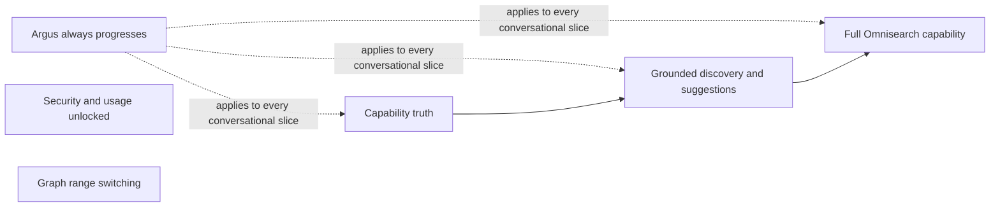
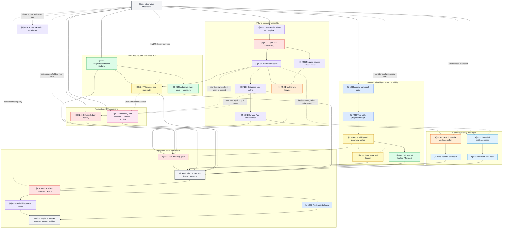

# Private Alpha Interim Roadmap

Status: **ACTIVE — founder-outcome and live-QA execution source**

Original roadmap date: 2026-07-16

Last reconciled: 2026-07-21

Original planning baseline: `codex/private-alpha-next` at
`2642b514225b61a852e7c6786de4d84d2ea96456`

Current stable integration product-code checkpoint: `codex/private-alpha-next`
at `a6395669472eb1d6f9b855feecef06abee54cf0c`. It contains two
founder-accepted, independently revertible vertical slices: adaptive
result-chart range switching from PR #264 at
`0c0d4812a1082354b4461a3c5f05d28dc2f53068`, and account recovery/session
controls from PR #261 at `a6395669472eb1d6f9b855feecef06abee54cf0c`.
Each later repair PR must record the exact current integration base it actually
uses; this document does not attempt to self-reference its own future commit
SHA.

Read-only audit donor: `claude/argus-alpha-audit-c2d919` at
`f1d03a1d847628e6a8d681b22337ad5fc6c5ebfd`

Last promoted `main` checkpoint: functional promotion merge `5d1eec11`, with
the [production-promotion record](https://github.com/lagarcess/argus/blob/main/docs/release-manifests/2026-07-14-main-production-promotion.md)
completed on `main` at `217ead12`

Active scope: the six founder outcomes below. Existing interim issues #228
through #253 are retained only as evidence, prior analysis, and possible
implementation material; #213 remains excluded.

This is the bounded pivot between the latest `main` promotion checkpoint and
the remaining P2 compounding loop in
`docs/specs/private-alpha-next-roadmap.md`. It makes the existing private-alpha
chat/backtest/evidence product dependable enough for serious alpha use before
Argus resumes linked IdeaVersions (A1b), comparison (A2), and freshness on
return (A4).

It does not authorize any implementation by itself. The founder dispatches the
work. This document defines the user outcomes, live-proof standard, and product
relationships that govern each vertical slice. An issue number, issue
dependency, old wave, or previously written acceptance checklist cannot decide
what Argus builds next or prove that a user outcome is complete.

## Authoritative Founder Outcomes

These six outcomes are the interim roadmap. They replace the previous
eight-pillar issue taxonomy and issue dependency graph as the execution
authority. Work that does not materially advance one of them is deferred for
this small private-alpha circle.

1. **Argus always progresses.** A conversation must not become trapped in a
   semantic loop, repeated recovery, unexplained terminal state, or
   deterministic cul-de-sac. Every accepted turn either makes meaningful
   progress or gives the user a clear, actionable stopping point.
2. **Security and usage are unlocked for users.** Users can access the account
   security and session controls they need, and can see truthful usage,
   remaining allowance, what counts, and when it resets.
3. **Graphs have range switching.** Users can change the visible result range
   without changing the approved backtest, corrupting the effective data
   window, or seeing frontend-invented facts. The active vertical-slice design
   is `docs/superpowers/specs/2026-07-19-adaptive-result-chart-range-design.md`.
4. **Argus knows what it can and cannot do.** It distinguishes supported,
   unsupported, and not-yet-supported requests without overpromising, while
   still helping the user reach a supported next step.
5. **Discovery is grounded and Argus can suggest.** Search and suggestions are
   source-backed, provider-validated where required, and limited to actions
   Argus can actually support.
6. **Omnisearch lives up to its full capability.** Omnisearch provides useful
   unified retrieval and navigation across the Argus artifacts the user owns,
   with truthful previews and actionable results rather than a shallow search
   box.

### Current Completion Ledger

This ledger records complete user-visible slices, not issue activity or a
deterministic green signal by itself.

| Founder outcome | Current state | Exact completion evidence |
| --- | --- | --- |
| 1. Argus always progresses | Not yet accepted complete | No founder-accepted vertical slice yet proves the representative conversational journeys against the current integration checkpoint. |
| 2. Security and usage are unlocked | **Partial — account security complete; Usage remains open** | #248 is closed. PR #261 landed at `a639566` with Settings -> Security navigation, recovery, password change, current/other/all-session controls, stale-cookie rejection, EN/ES coverage, and real Supabase Auth browser proof. #247 remains open and the Usage row remains disabled. |
| 3. Graphs have range switching | **Complete** | #250 is closed. PR #264 landed at `0c0d481` with adaptive presets, Custom/Reset, daily/intraday presentation, EN/ES desktop/mobile browser proof, reload-to-ALL, immutable full-run truth, and zero range-interaction network calls. |
| 4. Argus knows what it can and cannot do | Not yet accepted complete | No founder-accepted vertical slice yet proves the supported/unsupported journey end to end on the current checkpoint. |
| 5. Discovery is grounded and Argus can suggest | Not yet accepted complete | No founder-accepted vertical slice yet proves grounded suggestions end to end on the current checkpoint. |
| 6. Omnisearch lives up to its full capability | Not yet accepted complete | No founder-accepted vertical slice yet proves the full Omnisearch journey end to end on the current checkpoint. |

Completing #248 closes the account-security half of outcome 2; it does not make
the combined Security-and-Usage outcome complete while #247 is open. Completing
#250 does satisfy outcome 3 and that slice must not be redispatched.

### Product Relationships, Not An Issue Order



Capability truth is a product prerequisite for grounded suggestions, and
grounded discovery is a product prerequisite for the complete Omnisearch
experience. Security/usage and graph range switching are independent product
outcomes and may be chosen earlier when they offer the best user value. This
diagram does not recreate an issue-level implementation graph. As of
2026-07-21, graph range switching is complete and the account-security half of
Security/usage is complete; truthful Usage remains open.

### Vertical-Slice Delivery Contract

For each founder-selected outcome:

1. name one complete user-visible journey and its expected behavior;
2. reproduce that journey on the latest stable integration checkpoint;
3. branch from that checkpoint and change only what the journey requires;
4. salvage donor code only when a specific hunk is still correct and useful;
5. run focused deterministic checks and then production-parity local browser
   QA, including persistence and reload when the journey uses them;
6. compare the candidate with the integration baseline and reject regressions;
7. present the working behavior to the founder or private-alpha users before
   promotion.

An issue may provide evidence or reusable requirements, but it is never the
unit of completion by default. A slice is complete only when the visible
journey works end to end. No accumulation of partial issue checklists can
substitute for that proof.

### Guardrail Ratchet

The current pass keeps the minimum guardrails required for security, privacy,
correct accounting, durable state, grounded evidence, and prevention of
duplicate execution. Do not add speculative strictness that blocks the normal
happy path or creates deterministic cul-de-sacs. After the small user circle
approves the implemented behavior, tighten additional guardrails in response
to observed risk and evidence.

## Source Order

Every dispatched owner reads, in order:

1. `AGENTS.md`
2. `docs/PRODUCT.md`
3. `docs/ARCHITECTURE.md`
4. `docs/API_CONTRACT.md`
5. `docs/DATA_MODEL.md`
6. `.agent/designs/argus/DESIGN.md`
7. this interim roadmap
8. the founder-selected vertical-slice brief
9. any related issue body as supporting evidence, not execution authority
10. the relevant sections and addenda in
   `docs/specs/private-alpha-next-decision-memo.md`
11. release references only when the slice touches release evidence:
    `docs/specs/private-alpha-ci-cd-sota.md`,
    `docs/PRIVATE_LAUNCH_RUNBOOK.md`, and
    `docs/release-manifests/TEMPLATE.md`

This roadmap owns the active product outcomes, vertical-slice proof standard,
guardrail ratchet, and retained product decisions. A slice brief owns its
bounded journey, allowed surfaces, no-touch areas, and acceptance evidence.
Related issues may inform that brief but cannot broaden it or block it merely
because the historical issue graph says so. Canon docs win if any source
conflicts with canon.

## Current Execution Checkpoint And Salvage Discipline

The integration branch is the stable working checkpoint. Known corner-case
bugs do not make the checkpoint an invalid base or authorize unrelated scope
expansion. Their issue status does not determine product priority.

The audit donor records useful experiments and failure evidence, but it is not
an integration candidate. Never merge it wholesale. For each founder-selected
vertical slice:

1. create a fresh repair branch from the latest stable integration SHA;
2. map the donor diff to the selected user-visible journey;
3. reuse only dependency-clean commits or the smallest justified hunks;
4. prove the complete journey and relevant regressions before merge;
5. after founder/release-captain approval, merge the reviewed repair branch into
   integration, update the checkpoint, and then start the next integration
   step.

Parallel branches may investigate genuinely independent surfaces, but each
selected vertical slice has one integration owner. Shared runtime, API,
database, and web-shell changes integrate one reviewed slice at a time. A
merged scaffold, partial PR, deterministic green suite, or clean donor
worktree is not product completion.

### Live QA Is Required Before Merge

Deterministic tests prove contracts; they do not prove the product experience.
Every repair branch requires live QA proportional to the changed surface:

- contract/CI work: start the production-parity API, fetch and compare its
  generated contract, and complete a browser smoke without creating an
  unnecessary paid backtest;
- auth, history, and UI work: use real auth and verify interaction,
  persistence, navigation, and reload where applicable;
- conversational runtime work: use real prompts and inspect the visible
  response, hidden typed state, recovery, and reload;
- backtest work: complete the relevant approval, execution, result, and reload
  path with real provider data.

Record the integration behavior before the change, candidate behavior after the
change, vertical-slice acceptance evidence, regression journeys, and remaining
external gates on the PR. An exact-deployed-candidate canary remains useful
when the founder prepares tester exposure, but it does not replace slice-local
production-parity browser QA and is not required merely because an old issue
graph named it.

## Program Outcome And Boundary

The interim is complete when the founder and small private-alpha circle approve
the six user outcomes above through the relevant live journeys. Completion does
not require closing every historical interim issue.

Out of scope for this pivot:

- A1b, A2, and A4 implementation;
- generic memory/RAG, embeddings, pgvector, or public excerpts;
- broker/export execution, voice-provider integration, native mobile, or a new
  engine platform;
- broad refactors that are not necessary to complete a selected user journey;
- production deployment or tester invitation without a separate founder
  decision.

## Historical Eight-Pillar Issue Crosswalk — Reference Only

The table and issue material below preserve the earlier planning analysis so
useful findings are not lost. They are superseded by the six founder outcomes
above and must not be used as an execution board, dispatch order, completeness
checklist, or definition of interim success.

The crosswalk explains what the old issues were trying to protect. It does
**not** imply implementation order, a blocker, a parent/child relationship,
issue status, permission to merge, or a requirement to implement every issue.

| Pillar | Aim | Primary issues |
| --- | --- | --- |
| 1. Reliable conversations | Submit, refine, approve, cancel, and replace ideas without loops, lost state, or magic wording. | #237, #238, #239 |
| 2. Safe backtest execution | Admit, retry, poll, and reconcile work without duplication, invented outcomes, or unbounded requests. | #228, #229, #230, #231, #235, #236, #242 |
| 3. Truthful data and results | Keep effective periods, charts, metrics, summaries, and result actions honest and aligned. | #249, #250 (complete), #251 |
| 4. Durable continuity | Preserve terminal turn truth, recovery state, transcripts, reload, and navigation behavior. | #240, #252 |
| 5. Clear capabilities and limits | Explain supported actions, grounded discovery, allowance usage, and reset truth. | #241, #244, #247 |
| 6. Useful history and recall | Keep history, Recents, pagination, decisions, and evidence bounded, ordered, and retrievable. | #232, #245, #253 |
| 7. Secure account controls | Provide enumeration-safe recovery and explicit session management. | #248 (complete) |
| 8. Real end-to-end proof | Verify API compatibility, trajectory behavior, QA evidence, and the exact-candidate browser journey. | #233, #234, #243, #246 |

## Historical Issue Dependency Vocabulary — Reference Only

- **Blocker**: the downstream issue cannot be correct until the upstream
  contract or behavior exists. Use the GitHub blocked-by relation only for
  these.
- **Serialization**: issues are logically independent but touch the same
  ownership surface. They may be planned and tested in parallel, but their
  final integration must follow the order in this roadmap. Do not add a false
  blocked-by edge.
- **Closure gate**: implementation may start earlier, but the issue cannot
  close until named evidence exists.
- **Parent**: a coordination issue. It owns program closure, not a giant code
  branch.

## Historical Issue Dependency Map — Reference Only

This is the retired issue-led map. It records the relationships previously
assigned to #228 through #253, including standalone work outside the
conversational runtime spine. It may help identify shared surfaces or reusable
evidence, but it does not select or block a founder-chosen vertical slice.

- A solid arrow is a full-scope completion dependency or closure flow.
- A dashed arrow is early scaffolding, shared-surface serialization, or a
  conditional repair handoff; it is not a GitHub blocker.
- `All required acceptance + live QA complete` was the old issue-led program
  gate. It is not the current interim completion rule.
- #236 is explicitly deferred and does not feed the interim closure gate.

The pillar number is classification only. It adds no edge or execution order.



The diagram shows the former issue completion model, not the current product
roadmap. The recorded native hard-blocker state was:

- #229 is complete, so its blocker edges to #230, #234, #235, and #240 are
  satisfied.
- #230 blocks #242.
- #233 blocks #237 closure.

#228 currently coordinates #229-#235 and #252. #237 coordinates #238-#243.
In the former model, the remaining solid arrows were roadmap completion
dependencies rather than automatic GitHub `blocked-by` relationships. Dashed
arrows recorded serialization, conditional handoff, or permitted early work.

## Historical Issue Dispatch Waves — Retired

These waves are preserved only to explain earlier branch activity. Do not
dispatch from them. Current work begins with a founder-selected user journey
under the vertical-slice delivery contract above. #248 and #250 were later
completed as full vertical slices and must not be redispatched from this
historical plan.

### Wave 0 — contracts, probes, and test scaffolding

These may run at the same time because they produce decisions or isolated test
scaffolding rather than overlapping runtime changes:

- #229 contract decisions are complete; #234's compatibility baseline is the
  dependency-next contract/CI lane;
- #243 harness scaffolding and privacy-safe expected-fail fixtures;
- #233 canary authoring, without running the former exact-candidate journey;
- #244 provider/citation evaluation only;
- #246 QA migration/schema diagnosis only;
- #247 authenticated allowance contract and presentation spec;
- #248 recovery/session security contract;
- #251 effective-window contract and preflight design;
- #252 cache/race adapter design and delayed-response tests outside the shared
  `ChatInterface.tsx` integration point.

### Wave 1 — independent foundations

Run these lanes in parallel with one owner per lane:

1. **Admission/API lane:** after #229 and the #234 baseline, #230 and #235 may
   run in parallel on separate surfaces.
2. **Interpreter spine:** #238, then #239, then #241. Only one issue owns the
   interpret/edit spine at a time.
3. **Result-data truth:** #251 may run independently.
4. **Bounded reads:** #232 may build its query contract independently; serialize
   final gateway/migration integration after #230.
5. **Account/allowance:** the old plan allowed #247 and #248 backend work to
   proceed independently. #248 has now landed first. Any later #247 work must
   rebase on `a639566` and preserve the working Security entry point.
6. **QA observability:** #246 may diagnose in parallel. Any database repair
   waits until #230/#240 release migration ownership.

### Wave 2 — dependent behavior

- Admission lane: #230 -> #231 -> #242.
- Durable-turn lane: #235 -> #240, with database integration after #230.
- Typed discovery lane: #241 -> #244 runtime integration and the runtime part
  of #249. Provider evaluation from Wave 0 may already be complete; #244 runtime
  activation still requires the founder to accept the provider, grounding,
  cost, latency, and failure-policy result.
- Result UX lane (former order): #251 -> #250. #250 is now complete.
- Recall lane: #232 -> #253.
- The visible Quick take heading and Explain-result cleanup in #249 may land
  before #241 because those slices do not touch interpreter routing.

### Wave 3 — shared web-shell integration

Serialize final `ChatInterface.tsx`/sidebar ownership in this order:

1. #242 makes Run recovery truthful.
2. #252 adds conversation cache and navigation race protection.
3. #245 adds explicit Recents expansion and older-chat paging.

#250 is complete; #249 should use its narrower result components and rebase if
it touches transcript mounting. #248 is complete; #247 owns the remaining Usage
work and must preserve the landed Profile-menu Security behavior.

### Wave 4 — former closure evidence

The retired plan required all issue checklists, #243 trajectories, an exact-SHA
#233 canary, and parent closure before tester exposure. Those mechanics remain
available as evidence tools, but they no longer define interim completion or
the next slice.

## Historical Shared-Surface Collision Notes — Reference Only

| Surface | Integration order | Why |
| --- | --- | --- |
| `src/argus/api/routers/agent.py` | #235 -> #240; #239 rebases if needed | request boundary before durable lifecycle; runtime budget remains separately owned |
| Interpreter/edit spine | #238 -> #239 -> #241 -> #249 runtime | one canonical artifact and one typed route owner at a time |
| Backtest admission/read path | #230 -> #231 -> #242 | admission identity before polling and client reconciliation |
| Supabase gateway/migrations | #230 -> #232 slices -> #240 -> proven #246 repair | keep database changes reviewable and forward-safe |
| Chat shell | #242 -> #252 -> #245 | recovery truth before cache, cache before disclosure integration |
| Result surface | #250 complete; #249/#251 remaining work rebases as needed | preserve the completed viewport-only range contract; presentation ownership is separate |
| Profile menu/auth | #248 landed first; #247 rebases later | preserve the working Security route while enabling Usage |
| Search/Omnisearch | #232 -> #253 | bounded query truth before richer preview projection |
| Public API/OpenAPI | #229 -> #234 -> later API issues | contract decisions and drift gate first |

### Historical Runtime Spine — Reference Only

This short diagram represented the former issue-led convergence spine. It is
not the current interim roadmap and does not define program closure:

```text
Runtime convergence:
#242 + #240 + #241 + #251 -> #243

Full interim convergence:
#243 + #244 + #245 + #246 + #247 + #248 + #249 + #250 + #253
-> all required acceptance + live QA complete
-> #233 -> close #228/#237
```

The former map used #234 as an early guardrail and #243/#233 as late closure
proof. Those roles remain historical context only.

### Historical Pillar-Level Order — Retired

This was the earlier issue-led operating order. Do not use it to choose the
next slice.

1. **Pillar 8 early guardrails:** land #234 and complete only the bounded,
   proven #246 diagnosis or repair that does not conflict with database owners.
2. **Pillar 2 execution foundations:** establish atomic admission, request
   boundaries, polling, and durable Run reconciliation.
3. **Pillars 1 and 3 core truth in parallel:** advance the serialized
   interpreter chain and effective-window truth on separate owners. Pillar 7
   may proceed independently, and Pillar 6 query-contract work may proceed
   where database ownership permits.
4. **Pillars 4, 5, and 6 dependent behavior:** integrate durable continuity,
   capability/allowance surfaces, transcript/history disclosure, and recall
   only after their named prerequisites and shared owners release the surface.
5. **Pillar 8 closure proof:** after all required non-deferred issue acceptance
   and live QA are complete, including the required #243 trajectories, run
   #233 against the exact integrated candidate.

### Historical Quick-Win Assessment — Reference Only

"Quick win" means a narrower behavioral blast radius, not lighter acceptance.
Every salvaged slice still requires issue-specific deterministic evidence and
live QA appropriate to the changed surface before merge or closure.

| Pillar | Potential | Safe salvage boundary |
| --- | --- | --- |
| 8. Real end-to-end proof | High for early work | #234 is the first contract/CI salvage candidate. #246 may remain bounded diagnosis or a proven isolated repair; #243 and #233 stay last. |
| 7. Secure account controls | Complete | #248 landed at `a639566` with real Supabase auth, recovery, revocation, localization, a working Settings -> Security entry point, and browser QA. Do not redispatch it; #247 must preserve it. |
| 6. Useful history and recall | Medium | #232 -> #253 can form an independent bounded lane when database ownership permits. #245 waits for #252. Do not assume an issue-complete donor slice without revalidating its diff. |
| 5. Clear capabilities and limits | Low to medium | #241 and #244 are runtime/provider work. #247's read/UI slice is narrower, but truthful simulation counts require #230 and zero-cost preflight proof remains with #251. |
| 4. Durable continuity | Low | #240 owns central runtime/database lifecycle truth and #252 owns the shared chat shell. Treat both as regression-sensitive integration work, not quick wins. |

## Locked Product Decisions

### Simulation allowance (#247)

- Count exactly one simulation when a unique execution is successfully and
  durably admitted.
- Replaying the same idempotency identity counts zero additional simulations.
- Requests rejected before admission count zero.
- Chat and direct API launches use the same rule.
- The reset timestamp comes from the backend quota period (`period_end`), not a
  client timer or the current generic `Retry-After` value.

### Incomplete data windows (#251)

- Fitting to the provider-supported data is allowed when the requested window
  materially exceeds available coverage; a material fit must not be silent.
- Before approval, derive one viable common effective window for the strategy
  symbols and benchmark. Do not use edge backfill to invent earlier coverage.
- Ordinary exchange-calendar normalization inside otherwise available coverage,
  such as moving a weekend or market holiday to the next or previous trading
  session, is not a material data-availability correction and shows no warning.
- If the requested head or tail exceeds available provider coverage but a
  viable common window remains, repair to the earliest or latest available
  session and explain the material correction in provider-neutral language.
- If no material data-availability correction occurred, render no correction
  notice above the confirmation card.
- For a material fit, the same assistant turn renders Argus's short natural
  explanation immediately followed by the confirmation card. Preserve that
  explanation through stream and reload; deterministic localized correction
  copy is the degraded fallback, not the normal happy-path voice.
- The confirmation card shows the effective dates the user is approving. The
  requested dates remain durable provenance.
- Confirmation preflight does not consume a simulation allowance.
- If no viable common window exists, return typed recovery and no runnable
  card.
- The approved effective window must remain identical across metrics, chart,
  result prose, evidence, reload, replay, and Omnisearch.

## Historical Issue Cards — Reference Only

The cards below preserve the previous issue index. They are not active dispatch
specifications. Revalidate any useful claim against the stable integration
baseline and copy only the relevant evidence into a founder-selected vertical
slice brief.

<a id="issue-228"></a>
### #228 — Reliability hardening parent

- Outcome: coordinate bounded, retry-safe, browser-proven execution.
- Start: active now as a parent; it owns no combined implementation branch.
- Closure: required child evidence, #243 where applicable, and #233 exact-SHA
  proof. #236 is not a closure requirement.

<a id="issue-229"></a>
### #229 — Contract decision gate

- Outcome: approve exact retry, idempotency, overload, size, identity, and
  durable-lifecycle semantics before consumers implement them.
- Status: complete; its approved contract is the input to dependent lanes.
- Handoff: #234, then #230/#235/#240 and the identity contract used by #242.

<a id="issue-230"></a>
### #230 — Atomic admission and idempotency

- Outcome: one database-owned admission result for capacity, identity, and
  payload collision handling.
- Blocker: #229; integrate after the #234 baseline.
- Handoff: #231 and #242.

<a id="issue-231"></a>
### #231 — Polling reconciliation

- Outcome: fresh job reads are database-only; stale recovery is bounded and has
  one owner.
- Start: after #230 releases shared files.
- Handoff: #242 and final #233 latency/recovery evidence.

<a id="issue-232"></a>
### #232 — Bounded database reads

- Outcome: keyset-bounded conversation, History, Search, and ledger reads with
  truthful ordering/count semantics.
- Start: contract/test design in parallel; serialize gateway/migration merges
  after #230.
- Handoff: #253; #252 is a separate browser-cache concern.

<a id="issue-233"></a>
### #233 — Rendered deployed canary

- Outcome: prove the Golden Path in a real browser on one exact deployed
  candidate and one charged backtest.
- Start: author early; execute last after #243 and candidate integration.
- Closure: Playwright creates the run; API/Supabase checks inspect those same
  captured artifacts.

<a id="issue-234"></a>
### #234 — OpenAPI compatibility gate

- Outcome: structurally compare generated and checked API truth with a narrow
  approved exclusion list.
- Blocker: #229.
- Handoff: land the baseline before runtime API consumers where practical.

<a id="issue-235"></a>
### #235 — Request bounds and failure correlation

- Outcome: reject oversized/deep chat inputs before expensive work and preserve
  one request ID through response, logs, and unexpected errors.
- Blocker: #229; integrate after #234.
- Handoff: #240.

<a id="issue-236"></a>
### #236 — Chat-turn service extraction

- Outcome: a behavior-preserving router extraction only after the runtime is
  stable.
- Status: deferred and not an interim release gate.
- Start: after #228, #237, and all active `agent.py` owners are finished.

<a id="issue-237"></a>
### #237 — Conversational trust parent

- Outcome: coordinate canonical edits, bounded progress, durable turns,
  truthful capabilities, recoverable Run actions, and full trajectories.
- Start: active as a parent; no combined implementation branch.
- Closure: children #238-#243, then blocking #233 proof.

<a id="issue-238"></a>
### #238 — Atomic canonical edits

- Outcome: apply a typed edit once over the latest canonical artifact and fail
  closed on stale/missing confirmation identity.
- Start: first interpreter-spine issue.
- Handoff: #239.

<a id="issue-239"></a>
### #239 — Turn-wide execution budget

- Outcome: one monotonic deadline/call budget with typed terminal outcomes and
  no semantic loops.
- Start: after #238 on the one-owner spine.
- Handoff: #241 and #243.

<a id="issue-240"></a>
### #240 — Durable accepted-turn lifecycle

- Outcome: reconcile generic orphaned `started` turns while preserving the
  existing terminal-failure and late-success guards.
- Blocker: #229.
- Serialization: #235 first for `agent.py`; #230 first for database ownership.

<a id="issue-241"></a>
### #241 — Capability and discovery routing

- Outcome: one typed route distinguishes executable capability, draft/future
  work, generic primitives, and asset discovery without a second registry.
- Start: after #239 on the interpreter spine.
- Handoff: #244 runtime integration and #249 typed follow-up preservation.

<a id="issue-242"></a>
### #242 — Ambiguous Run reconciliation

- Outcome: transport ambiguity becomes durable status lookup, never invented
  terminal failure or duplicate execution.
- Blocker: #230; merge after #231 releases shared read paths.
- Handoff: #252.

<a id="issue-243"></a>
### #243 — Full-trajectory evaluation gate

- Outcome: execute all steps of the seven privacy-safe trajectories through
  SSE, persistence, disconnect, recovery, reload, and visible output.
- Start: scaffolding now; relevant scenarios may remain tagged expected-fail.
- Closure: applicable issues fixed and all required trajectories green before
  #233 executes.

<a id="issue-244"></a>
### #244 — Source-backed executable asset Search

- Outcome: bounded cited candidates, provider validation, and supported
  runnable actions without model-memory recommendations.
- Start: provider/citation evaluation now; runtime integration after #241 and
  explicit founder acceptance of the evaluated provider boundary.
- Stop: do not activate until grounding, cost, latency, and failure policy meet
  the issue thresholds.

<a id="issue-245"></a>
### #245 — Recents progressive disclosure

- Outcome: deliberately bounded visible chat groups with explicit older-page
  loading and preserved owner actions.
- Start: after #252 integrates the shared chat shell.
- Boundary: no server fetch-all workaround; coordinate with #232's contracts.

<a id="issue-246"></a>
### #246 — QA cost-ledger visibility

- Outcome: diagnose and restore QA visibility while telemetry remains fail-open
  and append-only evidence is preserved.
- Start: diagnosis now.
- Serialization: no migration until the missing layer is proven; any repair
  integrates after #230/#240 release database ownership.

<a id="issue-247"></a>
### #247 — Allowance and reset truth

- Outcome: authenticated users see real limits, remaining unique admissions,
  what counts, and the backend-owned reset time.
- Status: **open**. PR #259 contains partial prior work but is not the accepted
  completion boundary; the Usage row remains disabled on integration.
- Start: from the current `a639566` checkpoint after revalidating the locked
  accounting decision and the exact PR #259 salvage boundary.
- Serialization: #248 landed first. Rebase any Profile-menu work on the current
  checkpoint and do not regress the working Settings -> Security entry point.

<a id="issue-248"></a>
### #248 — Account recovery and session controls

- Outcome: enumeration-safe password recovery plus explicit current/other/all
  session actions that keep Argus cookies and Supabase sessions aligned.
- Status: **complete and closed**. PR #261 landed at `a639566`.
- Closure evidence: generic recovery responses; one-use, expired, malformed,
  and reused-link handling; native current-password verification under the
  enabled hosted policy; current/other/all-session revocation; stale-cookie
  rejection; English/Spanish behavior; Settings -> Security navigation; and
  real Supabase Auth browser QA all passed at the accepted head.
- Remaining implementation: none for #248. Later #247 work must preserve this
  behavior.

<a id="issue-249"></a>
### #249 — Quick take, Explain result, and Try next ownership

- Outcome: localized visible Quick take chrome, explanation-only Explain, and
  typed next experiments as the only Try next source.
- Start: frontend chrome/Explain cleanup now; runtime portion after #241 and
  coordinated with #244.
- Boundary: do not restore a duplicate result-card Try next button.

<a id="issue-250"></a>
### #250 — Adaptive chart range

- Outcome: viewport-only adaptive `1D`/`1W`/`1M`/`3M`/YTD/`1Y`/ALL presets,
  Custom/Reset controls, and a bounded accessible event summary.
- Status: **complete and closed**. PR #264 landed at `0c0d481`.
- Closure evidence: adaptive short and long presets, Custom validation and
  session clamping, pan/zoom and Reset, daily/intraday date presentation,
  English/Spanish desktop/mobile QA, reload-to-ALL, zero range-interaction
  network calls, and unchanged full-run metrics all passed on a real persisted
  result.
- Boundary retained: the controls change only the viewport; they do not
  resample, refetch, rerun, persist, spend usage, or alter the canonical result.
  The backend marker payload remains capped unless a separate contract is
  approved.

<a id="issue-251"></a>
### #251 — Requested versus effective data window

- Outcome: transparently correct to one viable common window before approval,
  then use it everywhere.
- Start: independent high-priority trust lane.
- Handoff: #250 is already complete. Any later #251 change must preserve the
  viewport-only chart contract and rerun the applicable range and #243
  trajectory evidence.

<a id="issue-252"></a>
### #252 — Transcript cache and race safety

- Outcome: bounded in-session transcript reuse with latest-navigation wins,
  honest loading, invalidation, and no durable browser transcript storage.
- Start: adapter/tests may begin early; integrate `ChatInterface.tsx` after
  #242.
- Handoff: #245.

<a id="issue-253"></a>
### #253 — Decision-first Omnisearch recall

- Outcome: deterministic type-aware projection of the exact decision note and
  existing canonical evidence facts, with no hover-time LLM work.
- Start: UI/contract spec now; backend integration after #232.
- Boundary: do not create a new digest model until the existing evidence digest
  projection is proven insufficient and separately approved.

## Global Stop Conditions

Stop a dispatched lane and return it for re-scoping if:

- it does not materially advance one of the six founder outcomes;
- it needs a canon/API/data-model decision that the selected slice does not
  already own;
- it introduces a new schema, public field, provider, or dependency without the
  named approval gate;
- it requires two owners to edit the same protected runtime surface at once;
- it restores regex/phrasebook routing, a second chat brain, frontend-invented
  facts, generic RAG, or provider disclosure;
- its verification would spend real tokens/data-provider calls outside the
  documented live gates;
- it cannot be reverted independently without discarding durable user or
  operational evidence;
- it broadens into architectural refactoring instead of completing the selected
  user journey;
- it attempts to merge the audit donor wholesale or treats donor commits as
  acceptance evidence without slice-local revalidation;
- it reaches deterministic green without the scope-appropriate live QA required
  above; or
- it claims product completion from a partial PR, scaffold, issue checklist, or
  deterministic suite.

## Program Exit Criteria

- The founder and small private-alpha circle approve the live behavior for all
  six outcomes.
- Representative conversations progress without loops, repeated recovery, or
  deterministic cul-de-sacs, including after reload where state is durable.
- Account security/session controls and usage/allowance truth are available to
  authenticated users and verified with real auth.
- Result graphs switch ranges without changing canonical backtest truth.
- Argus demonstrates capability honesty on both supported and unsupported
  requests and offers a supported next step without overpromising.
- Search and suggestions are grounded, and Omnisearch provides useful,
  owner-scoped retrieval with truthful previews and navigation.
- Each promoted slice records its exact SHA, integration baseline, focused
  deterministic evidence, production-parity local browser evidence, rollback,
  and remaining external gates.
- Tester exposure and production deployment remain separate founder decisions.
