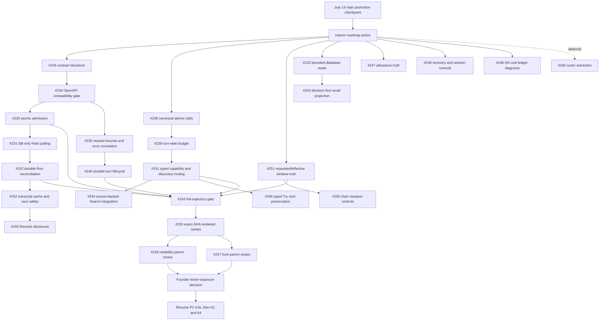

# Private Alpha Interim Roadmap

Status: **ACTIVE — planning and dispatch source**

Date: 2026-07-16

Planning baseline: `codex/private-alpha-next` at `2642b514225b61a852e7c6786de4d84d2ea96456`

Last promoted `main` checkpoint: functional promotion merge `5d1eec11`, with
the [production-promotion record](https://github.com/lagarcess/argus/blob/main/docs/release-manifests/2026-07-14-main-production-promotion.md)
completed on `main` at `217ead12`

Scope: every open issue from #228 through #253; #213 is explicitly excluded

This is the bounded pivot between the latest `main` promotion checkpoint and
the remaining P2 compounding loop in
`docs/specs/private-alpha-next-roadmap.md`. It makes the existing private-alpha
chat/backtest/evidence product dependable enough for serious alpha use before
Argus resumes linked IdeaVersions (A1b), comparison (A2), and freshness on
return (A4).

It does not authorize any implementation by itself. The founder dispatches the
work. This document tells each owner what may run in parallel, what must be
serialized, and what evidence hands the lane to the next owner.

## Source Order

Every dispatched owner reads, in order:

1. `AGENTS.md`
2. `docs/PRODUCT.md`
3. `docs/ARCHITECTURE.md`
4. `docs/API_CONTRACT.md`
5. `docs/DATA_MODEL.md`
6. `.agent/designs/argus/DESIGN.md`
7. this interim roadmap
8. the assigned issue body
9. the relevant sections and addenda in
   `docs/specs/private-alpha-next-decision-memo.md`
10. release references only when the issue touches release evidence:
    `docs/specs/private-alpha-ci-cd-sota.md`,
    `docs/PRIVATE_LAUNCH_RUNBOOK.md`, and
    `docs/release-manifests/TEMPLATE.md`

The issue body is the implementation sub-spec. This roadmap owns ordering and
lane boundaries. Canon docs win if either document drifts.

## Program Outcome And Boundary

The interim is complete when a private-alpha user can:

- submit, edit, approve, and run an idea without state loss, duplicate work, or
  an unexplained terminal state;
- understand the data window, result summary, allowance, and supported next
  actions before trusting the evidence;
- recover account access and move among recent conversations and recalled
  decisions without stale or misleading UI;
- complete the rendered Golden Path on one exact deployed candidate with one
  charged real backtest and durable reload/search proof.

Out of scope for this pivot:

- A1b, A2, and A4 implementation;
- generic memory/RAG, embeddings, pgvector, or public excerpts;
- broker/export execution, voice-provider integration, native mobile, or a new
  engine platform;
- broad refactors that are not necessary to close an issue;
- production deployment or tester invitation without a separate founder
  decision.

## Dependency Vocabulary

- **Blocker**: the downstream issue cannot be correct until the upstream
  contract or behavior exists. Use the GitHub blocked-by relation only for
  these.
- **Serialization**: issues are logically independent but touch the same
  ownership surface. They may be planned and tested in parallel, but their
  final integration must follow the order in this roadmap. Do not add a false
  blocked-by edge.
- **Closure gate**: implementation may start earlier, but the issue cannot
  close until named evidence exists.
- **Parent**: a coordination issue. It owns program closure, not a giant code
  branch.

## Authoritative Dependency Map

The diagram shows program order, not all GitHub-native relationships. The
current native hard blockers remain:

- #229 blocks #230, #234, #235, and #240.
- #230 blocks #242.
- #233 blocks #237 closure.

#228 currently coordinates #229-#235 and #252. #237 coordinates #238-#243.
The other issues remain standalone unless a real hard dependency is proven.

## Parallel Dispatch Plan

### Wave 0 — contracts, probes, and test scaffolding

These may run at the same time because they produce decisions or isolated test
scaffolding rather than overlapping runtime changes:

- #229 contract decisions, followed immediately by #234's compatibility
  baseline;
- #243 harness scaffolding and privacy-safe expected-fail fixtures;
- #233 canary authoring, without running the authoritative live journey yet;
- #244 provider/citation evaluation only;
- #246 QA migration/schema diagnosis only;
- #247 authenticated allowance contract and presentation spec;
- #248 recovery/session security contract;
- #251 effective-window contract and preflight design;
- #252 cache/race adapter design and delayed-response tests outside the shared
  `ChatInterface.tsx` integration point.

### Wave 1 — independent foundations

Run these lanes in parallel with one owner per lane:

1. **Admission/API lane:** after #229 and the #234 baseline, #230 and #235 may
   run in parallel on separate surfaces.
2. **Interpreter spine:** #238, then #239, then #241. Only one issue owns the
   interpret/edit spine at a time.
3. **Result-data truth:** #251 may run independently.
4. **Bounded reads:** #232 may build its query contract independently; serialize
   final gateway/migration integration after #230.
5. **Account/allowance:** #247 and #248 backend work may proceed independently;
   serialize shared Profile-menu integration as #247 then #248.
6. **QA observability:** #246 may diagnose in parallel. Any database repair
   waits until #230/#240 release migration ownership.

### Wave 2 — dependent behavior

- Admission lane: #230 -> #231 -> #242.
- Durable-turn lane: #235 -> #240, with database integration after #230.
- Typed discovery lane: #241 -> #244 runtime integration and the runtime part
  of #249. Provider evaluation from Wave 0 may already be complete; #244 runtime
  activation still requires the founder to accept the provider, grounding,
  cost, latency, and failure-policy result.
- Result UX lane: #251 -> #250.
- Recall lane: #232 -> #253.
- The visible Quick take heading and Explain-result cleanup in #249 may land
  before #241 because those slices do not touch interpreter routing.

### Wave 3 — shared web-shell integration

Serialize final `ChatInterface.tsx`/sidebar ownership in this order:

1. #242 makes Run recovery truthful.
2. #252 adds conversation cache and navigation race protection.
3. #245 adds explicit Recents expansion and older-chat paging.

#249 and #250 should use their narrower result components and rebase if they
touch transcript mounting. #247 and #248 likewise serialize only their shared
Profile-menu portion.

### Wave 4 — closure evidence

1. Turn all applicable #243 trajectories green on the integrated candidate.
2. Run #233 once on the exact API/web/workflow candidate. Playwright owns the
   one real user journey and one real backtest, then exports privacy-safe
   captured identities for API/Supabase postcondition checks. The shell canary
   must not create a second backtest.
3. Close #228 and #237 only when their required children and evidence are
   complete.
4. Ask the founder separately whether to expose the candidate to testers.
5. Resume the long-term P2 order: A1b -> A2, with A4 phase-last.

## Shared-Surface Serialization Matrix

| Surface | Integration order | Why |
| --- | --- | --- |
| `src/argus/api/routers/agent.py` | #235 -> #240; #239 rebases if needed | request boundary before durable lifecycle; runtime budget remains separately owned |
| Interpreter/edit spine | #238 -> #239 -> #241 -> #249 runtime | one canonical artifact and one typed route owner at a time |
| Backtest admission/read path | #230 -> #231 -> #242 | admission identity before polling and client reconciliation |
| Supabase gateway/migrations | #230 -> #232 slices -> #240 -> proven #246 repair | keep database changes reviewable and forward-safe |
| Chat shell | #242 -> #252 -> #245 | recovery truth before cache, cache before disclosure integration |
| Result surface | #251 -> #250; #249 narrow UI may run beside them | canonical effective period before ALL; presentation ownership is separate |
| Profile menu/auth | #247 -> #248 | avoid two owners changing the same menu and session controls |
| Search/Omnisearch | #232 -> #253 | bounded query truth before richer preview projection |
| Public API/OpenAPI | #229 -> #234 -> later API issues | contract decisions and drift gate first |

## Locked Product Decisions

### Simulation allowance (#247)

- Count exactly one simulation when a unique execution is successfully and
  durably admitted.
- Replaying the same idempotency identity counts zero additional simulations.
- Requests rejected before admission count zero.
- Chat and direct API launches use the same rule.
- The reset timestamp comes from the backend quota period (`period_end`), not a
  client timer or the current generic `Retry-After` value.

### Incomplete data windows (#251)

- Fitting to the provider-supported data is allowed; silent fitting is not.
- Before approval, derive one viable common effective window for the strategy
  symbols and benchmark. Do not use edge backfill to invent earlier coverage.
- In the same assistant turn, Argus gives a short provider-neutral explanation
  of the correction immediately above the confirmation card.
- The confirmation card shows the effective dates the user is approving. The
  requested dates remain durable provenance.
- Confirmation preflight does not consume a simulation allowance.
- If no viable common window exists, return typed recovery and no runnable
  card.
- The approved effective window must remain identical across metrics, chart,
  result prose, evidence, reload, replay, and Omnisearch.

## Issue Dispatch Cards

The cards below are a compact index. Each linked issue body is the complete
agent-ready sub-spec.

### #228 — Reliability hardening parent

- Outcome: coordinate bounded, retry-safe, browser-proven execution.
- Start: active now as a parent; it owns no combined implementation branch.
- Closure: required child evidence, #243 where applicable, and #233 exact-SHA
  proof. #236 is not a closure requirement.

### #229 — Contract decision gate

- Outcome: approve exact retry, idempotency, overload, size, identity, and
  durable-lifecycle semantics before consumers implement them.
- Start: first.
- Handoff: #234, then #230/#235/#240 and the identity contract used by #242.

### #230 — Atomic admission and idempotency

- Outcome: one database-owned admission result for capacity, identity, and
  payload collision handling.
- Blocker: #229; integrate after the #234 baseline.
- Handoff: #231 and #242.

### #231 — Polling reconciliation

- Outcome: fresh job reads are database-only; stale recovery is bounded and has
  one owner.
- Start: after #230 releases shared files.
- Handoff: #242 and final #233 latency/recovery evidence.

### #232 — Bounded database reads

- Outcome: keyset-bounded conversation, History, Search, and ledger reads with
  truthful ordering/count semantics.
- Start: contract/test design in parallel; serialize gateway/migration merges
  after #230.
- Handoff: #253; #252 is a separate browser-cache concern.

### #233 — Rendered deployed canary

- Outcome: prove the Golden Path in a real browser on one exact deployed
  candidate and one charged backtest.
- Start: author early; execute last after #243 and candidate integration.
- Closure: Playwright creates the run; API/Supabase checks inspect those same
  captured artifacts.

### #234 — OpenAPI compatibility gate

- Outcome: structurally compare generated and checked API truth with a narrow
  approved exclusion list.
- Blocker: #229.
- Handoff: land the baseline before runtime API consumers where practical.

### #235 — Request bounds and failure correlation

- Outcome: reject oversized/deep chat inputs before expensive work and preserve
  one request ID through response, logs, and unexpected errors.
- Blocker: #229; integrate after #234.
- Handoff: #240.

### #236 — Chat-turn service extraction

- Outcome: a behavior-preserving router extraction only after the runtime is
  stable.
- Status: deferred and not an interim release gate.
- Start: after #228, #237, and all active `agent.py` owners are finished.

### #237 — Conversational trust parent

- Outcome: coordinate canonical edits, bounded progress, durable turns,
  truthful capabilities, recoverable Run actions, and full trajectories.
- Start: active as a parent; no combined implementation branch.
- Closure: children #238-#243, then blocking #233 proof.

### #238 — Atomic canonical edits

- Outcome: apply a typed edit once over the latest canonical artifact and fail
  closed on stale/missing confirmation identity.
- Start: first interpreter-spine issue.
- Handoff: #239.

### #239 — Turn-wide execution budget

- Outcome: one monotonic deadline/call budget with typed terminal outcomes and
  no semantic loops.
- Start: after #238 on the one-owner spine.
- Handoff: #241 and #243.

### #240 — Durable accepted-turn lifecycle

- Outcome: reconcile generic orphaned `started` turns while preserving the
  existing terminal-failure and late-success guards.
- Blocker: #229.
- Serialization: #235 first for `agent.py`; #230 first for database ownership.

### #241 — Capability and discovery routing

- Outcome: one typed route distinguishes executable capability, draft/future
  work, generic primitives, and asset discovery without a second registry.
- Start: after #239 on the interpreter spine.
- Handoff: #244 runtime integration and #249 typed follow-up preservation.

### #242 — Ambiguous Run reconciliation

- Outcome: transport ambiguity becomes durable status lookup, never invented
  terminal failure or duplicate execution.
- Blocker: #230; merge after #231 releases shared read paths.
- Handoff: #252.

### #243 — Full-trajectory evaluation gate

- Outcome: execute all steps of the seven privacy-safe trajectories through
  SSE, persistence, disconnect, recovery, reload, and visible output.
- Start: scaffolding now; relevant scenarios may remain tagged expected-fail.
- Closure: applicable issues fixed and all required trajectories green before
  #233 executes.

### #244 — Source-backed executable asset Search

- Outcome: bounded cited candidates, provider validation, and supported
  runnable actions without model-memory recommendations.
- Start: provider/citation evaluation now; runtime integration after #241 and
  explicit founder acceptance of the evaluated provider boundary.
- Stop: do not activate until grounding, cost, latency, and failure policy meet
  the issue thresholds.

### #245 — Recents progressive disclosure

- Outcome: deliberately bounded visible chat groups with explicit older-page
  loading and preserved owner actions.
- Start: after #252 integrates the shared chat shell.
- Boundary: no server fetch-all workaround; coordinate with #232's contracts.

### #246 — QA cost-ledger visibility

- Outcome: diagnose and restore QA visibility while telemetry remains fail-open
  and append-only evidence is preserved.
- Start: diagnosis now.
- Serialization: no migration until the missing layer is proven; any repair
  integrates after #230/#240 release database ownership.

### #247 — Allowance and reset truth

- Outcome: authenticated users see real limits, remaining unique admissions,
  what counts, and the backend-owned reset time.
- Start: contract/backend work in parallel after applying the locked decision.
- Serialization: Profile-menu integration before #248.

### #248 — Account recovery and session controls

- Outcome: enumeration-safe password recovery plus explicit current/other/all
  session actions that keep Argus cookies and Supabase sessions aligned.
- Start: security contract first; backend may run beside #247.
- Serialization: shared Profile-menu integration after #247.

### #249 — Quick take, Explain result, and Try next ownership

- Outcome: localized visible Quick take chrome, explanation-only Explain, and
  typed next experiments as the only Try next source.
- Start: frontend chrome/Explain cleanup now; runtime portion after #241 and
  coordinated with #244.
- Boundary: do not restore a duplicate result-card Try next button.

### #250 — Adaptive chart range

- Outcome: viewport-only 3M/1Y/ALL, conditional YTD, custom/reset controls, and
  a bounded accessible event summary.
- Start: after #251 makes ALL mean the full effective canonical series.
- Boundary: backend marker payload remains capped unless a separate contract is
  approved.

### #251 — Requested versus effective data window

- Outcome: transparently correct to one viable common window before approval,
  then use it everywhere.
- Start: independent high-priority trust lane.
- Handoff: #250 and the applicable #243 trajectory.

### #252 — Transcript cache and race safety

- Outcome: bounded in-session transcript reuse with latest-navigation wins,
  honest loading, invalidation, and no durable browser transcript storage.
- Start: adapter/tests may begin early; integrate `ChatInterface.tsx` after
  #242.
- Handoff: #245.

### #253 — Decision-first Omnisearch recall

- Outcome: deterministic type-aware projection of the exact decision note and
  existing canonical evidence facts, with no hover-time LLM work.
- Start: UI/contract spec now; backend integration after #232.
- Boundary: do not create a new digest model until the existing evidence digest
  projection is proven insufficient and separately approved.

## Global Stop Conditions

Stop a dispatched lane and return it for re-scoping if:

- it needs a canon/API/data-model decision that its issue does not already own;
- it introduces a new schema, public field, provider, or dependency without the
  named approval gate;
- it requires two owners to edit the same protected runtime surface at once;
- it restores regex/phrasebook routing, a second chat brain, frontend-invented
  facts, generic RAG, or provider disclosure;
- its verification would spend real tokens/data-provider calls outside the
  documented live gates;
- it cannot be reverted independently without discarding durable user or
  operational evidence;
- it broadens into #236-style refactoring instead of closing the user outcome.

## Program Exit Criteria

- Every required issue has focused deterministic evidence at its exact
  candidate SHA.
- #243's applicable full trajectories are green through visible and hidden turn
  state.
- #233 proves one English/Spanish rendered journey, one charged real backtest,
  durable decision/reload/Omnisearch continuity, typed recovery, and no console
  or framework errors on one exact deployed API/web/workflow candidate.
- #228 and #237 have closure records that link the evidence rather than restate
  it.
- The release manifest names exact SHAs, configuration fingerprints, rollback,
  and privacy-safe evidence.
- Tester exposure and production deployment remain separate founder decisions.
