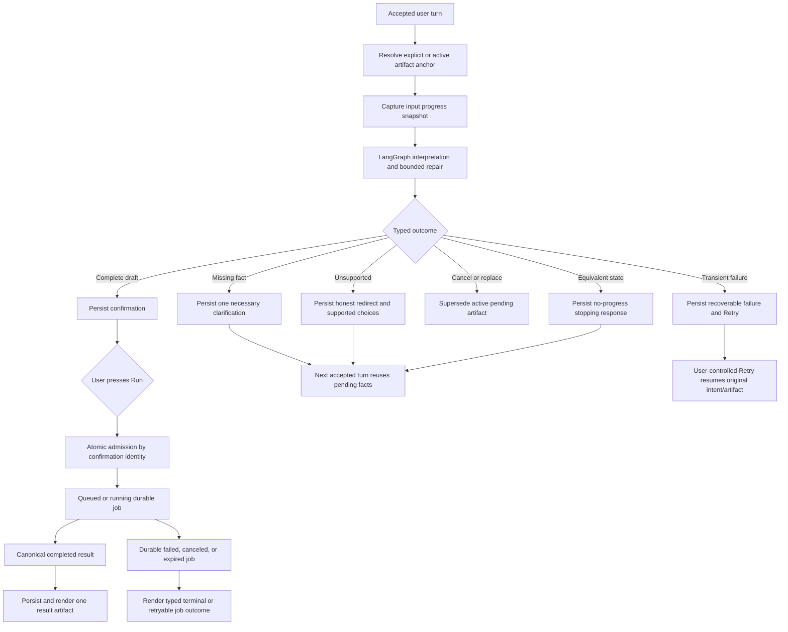

# Argus Always Progresses: End-to-End Conversation Continuity Design

Status: **FOUNDER-APPROVED DESIGN — implementation handoff authorized**

Date: 2026-07-23

Authoritative roadmap outcome: **Argus always progresses**

Design baseline: `codex/private-alpha-next` at
`9bcdb8ee06b61381b6915f6e68a89ba5073a609d`

Primary coordination issue:
[#237](https://github.com/lagarcess/argus/issues/237)

Supporting evidence:
[#230](https://github.com/lagarcess/argus/issues/230),
[#231](https://github.com/lagarcess/argus/issues/231),
[#233](https://github.com/lagarcess/argus/issues/233),
[#238](https://github.com/lagarcess/argus/issues/238),
[#239](https://github.com/lagarcess/argus/issues/239),
[#240](https://github.com/lagarcess/argus/issues/240),
[#242](https://github.com/lagarcess/argus/issues/242), and
[#243](https://github.com/lagarcess/argus/issues/243)

This is a product and architecture design, not a deployment claim. Existing
issue bodies are evidence and possible implementation material; they do not
override this design or define completion by themselves.

## Outcome

An Argus conversation never becomes trapped in a semantic loop, repeated
recovery, unexplained terminal state, or deterministic cul-de-sac.

Every accepted user turn reaches exactly one meaningful outcome:

1. **Advance** — create or update the active conversational artifact,
   confirmation, run, or result.
2. **Clarify** — ask one new, necessary question without discarding facts the
   user already supplied.
3. **Redirect** — explain an unsupported request and offer supported next
   actions without creating a runnable-looking artifact.
4. **Recover** — preserve the user's work and offer one durable Retry action
   after bounded internal recovery is exhausted.
5. **Finish intentionally** — honor cancellation or another explicit end to the
   current flow.

The same typed state may not repeatedly count as success. If the runtime cannot
prove material progress, it stops the loop and gives the user a concrete next
action.

The contract covers the complete current-conversation journey:

```text
message
  -> interpretation
  -> clarification or redirect when needed
  -> confirmation
  -> Run admission
  -> queued/running
  -> completed result
  -> result follow-up or refinement
```

Interruption, transport loss, process loss, retry, cancellation, stale actions,
and reload are part of that journey rather than separate edge projects.

## Founder-Approved Product Decisions

1. Progress is defined by the five outcomes above, not by whether a handler
   returned successfully.
2. A repeated equivalent typed state is not progress.
3. Argus may use bounded internal model fallbacks and repair attempts before the
   user sees a failure.
4. Once Argus displays a recoverable failure, automatic retry stops. The user
   receives one durable, user-controlled Retry action.
5. Retry resumes the same user intent and active artifact. It does not make the
   user re-enter compatible assets, capital, dates, or rules.
6. Retry must not duplicate a message allowance charge, confirmation,
   backtest job, run, or result.
7. Argus must not suggest starting a new conversation for ordinary provider,
   model, network, process, persistence, or stream failures.
8. A new conversation is offered only when the owner-scoped conversation itself
   cannot be safely reconstructed from canonical durable state.
9. The design uses one shared progress contract enforced by existing owners. It
   does not introduce a central progress orchestrator or second chat brain.
10. A conversation has at most one active pending conversational artifact.
    Completed confirmation and result artifacts remain immutable.
11. An explicit action on a completed result may use that result as the basis
    for new work. This slice does not create or compare linked `IdeaVersion`
    records.
12. P2 A1b linked versions, A2 comparison, and A4 freshness remain separate,
    paused roadmap work.

## Why This Is One Pillar

The visible symptom "Argus is stuck" can originate in different owners:

- interpretation repeats the same missing need;
- a sparse edit drops canonical facts and recreates an old question;
- a turn is accepted but never gains a durable terminal outcome;
- a transport response is lost after Run admission;
- the frontend marks ambiguity as failure;
- reload reconstructs a different artifact or retry target;
- a stale action executes against an artifact the user can no longer see.

Fixing these independently without one contract produces local green tests but
does not protect the user journey. Conversely, replacing them with one large
state machine would duplicate LangGraph, backtest jobs, and persistence
ownership.

The design therefore establishes one end-to-end contract and keeps each
existing owner responsible for its part.

## Current Baseline

The integration checkpoint is not starting from zero.

Already present or canonically specified:

- LangGraph is the only conversational runtime and owns semantic thread state
  through its checkpointer.
- `ArtifactAnchor` resolution can target an explicit confirmation or result,
  the active confirmation, the latest result, a saved strategy, or a failed
  action.
- Typed artifact patches preserve omitted canonical fields and reject unsafe
  asset edits.
- Stable Run identity is defined as `confirmation_id`; the Run
  `Idempotency-Key` must equal it.
- Atomic backtest admission and direct-success serialization migrations exist
  on the integration checkpoint.
- Backtest jobs and completed runs provide durable execution truth.
- Backend and frontend retry shapes exist for failed actions, failed turns, and
  conversation loading.
- API and data-model canon already define the ordinary-turn lifecycle:
  `accepted`, `running`, `completed`, `recoverable_failed`, `abandoned`, and
  `reconciled`.
- Seven privacy-safe session fixtures and a typed trajectory runner exist.

Known incomplete or unproven boundaries at the design baseline:

- No integration implementation of `chat_turn_lifecycles` appears in runtime
  source or migrations, despite the approved API/data contract.
- No one turn-wide semantic fingerprint, deadline, provider-call allowance, or
  single internal terminal owner spans interpretation and repair.
- Some frontend paths can still map transport or action failure directly to
  `could_not_run` rather than first reconciling durable Run truth.
- The trajectory harness uses recording/fake adapters; concrete
  runtime/SSE/persistence/reload adapters are not present.
- Existing issue evidence was recorded against older SHAs and cannot determine
  the exact implementation delta by itself.

Every implementation lane begins with exact-head reproduction. If current code
already satisfies a requirement, preserve it and add only missing evidence.

## Scope

### In scope

- One internal progress vocabulary and typed-state progress assessment.
- One monotonic deadline and one bounded model-call allowance per accepted
  runtime attempt.
- Canonical active-artifact selection and fact preservation through
  clarification, editing, retry, and replacement.
- Durable ordinary-turn terminal ownership and orphan reconciliation using the
  already approved contract.
- Stable Retry behavior for ordinary turns and structured actions.
- Stable Run identity and reconciliation from admission through result.
- Correct reload projection at every durable stage.
- Typed stale-action and no-progress outcomes.
- English and Spanish user-visible behavior.
- Privacy-safe observability and session-level acceptance evidence.
- One exact-candidate local production-parity browser gate before integration.

### Out of scope

- Linked `IdeaVersion` emission, version history, comparison, or freshness.
- Multi-document or multi-draft workspace behavior.
- Generic loop engines, a second orchestrator, or a new intent taxonomy.
- Prose similarity, regex intent repair, phrasebooks, display-label parsing, or
  language-specific routing.
- New strategy, indicator, forecasting, Search, discovery, or Omnisearch
  capability.
- Generic RAG or cross-conversation personalization memory.
- A second job system for ordinary chat turns.
- Frontend-invented artifact, progress, or terminal truth.
- Realtime/WebSocket redesign, queue-provider replacement, or broad polling
  redesign.
- A result-card redesign or unrelated UI polish.
- Production deployment or tester exposure without separate founder direction.

## Definitions

### Accepted conversational operation

An authenticated, validated, owner-scoped chat operation whose durable
acceptance identity has been stored. Rejected requests do not enter this
contract.

There are two execution owners:

- an accepted ordinary turn stores the user message and enters the durable
  chat-turn lifecycle;
- an accepted Run action enters the durable `backtest_jobs` lifecycle under its
  confirmation identity.

Both must satisfy the user-facing progression invariant, but they do not share
one persistence state machine.

### Active conversational artifact

The one pending artifact the current conversation is operating on:

- a draft or clarification state;
- an active confirmation;
- an explicitly targeted completed result;
- or a retryable failed action.

This is runtime conversation continuity, not the durable P2 `Idea` object and
not an `IdeaVersion` lineage.

### Material semantic state

Typed state that changes what Argus must do next or what it could execute:

- semantic turn act and response-intent kind;
- pending needs and requested fields;
- canonical strategy execution fields;
- active artifact kind, identity, and lifecycle;
- confirmation identity and status;
- admitted job identity and durable job status;
- completed run/result identity;
- explicit cancellation or supported-alternative selection.

### Presentation-only state

Copy and evidence that must never prove progress:

- assistant prose;
- localization or display labels;
- raw user wording and evidence spans;
- provider/model names;
- route-receipt ordering;
- transient spinner state;
- timestamps that do not change durable lifecycle.

### Progress snapshot

A deterministic projection of material semantic state at a defined runtime
boundary. Equivalent model and dictionary representations must normalize to the
same snapshot.

### Progress transition

The comparison between the snapshot entering a boundary and the snapshot
leaving it, plus any typed terminal outcome.

### Retry

A typed product action that resumes the same user intent and artifact basis
after a recoverable failure. A terminal failed lifecycle record remains
historical evidence; the retry may create a new execution attempt while still
being the same user-visible operation.

### Transport ambiguity

The client did not receive a conclusive response, but durable backend state may
have advanced. Ambiguity is never proof of business failure.

## Architecture

### Selected approach: one contract through existing owners

| Owner | Responsibility |
| --- | --- |
| LangGraph runtime | Interpret the turn, advance semantic state, and remain the only chat brain. |
| Progress assessment | Project typed snapshots, compare transitions, enforce the turn-wide deadline/call allowance, and choose one internal terminal reason. |
| Artifact continuity | Resolve the explicit/current artifact anchor and preserve untouched canonical fields. |
| Durable chat lifecycle | Record whether an accepted ordinary turn is accepted, running, completed, recoverably failed, abandoned, or reconciled. |
| Backtest admission/jobs | Own Run idempotency, queued/running/terminal execution, and canonical result linkage. |
| Message persistence | Store visible assistant outcomes and typed metadata before reporting SSE completion. |
| Frontend | Render backend-provided artifacts, checking/recovery state, and actions without inferring hidden truth. |
| Trajectory adapters | Exercise the real stream/action/disconnect/reload/retry/persistence boundaries without implementing product behavior. |

The progress assessment is a small internal contract, not an orchestrator. It
does not route LangGraph, persist transcripts, launch jobs, or produce normal
assistant prose.

### Ownership boundaries

- LangGraph checkpointer state answers: **What does the current conversation
  mean?**
- `chat_turn_lifecycles` answers: **Did this accepted ordinary turn reach a
  durable terminal outcome?**
- `backtest_jobs` answers: **What happened to this admitted Run action?**
- messages answer: **What durable user-visible response or artifact exists?**
- completed `backtest_runs` answer: **What historical simulation result is
  canonical?**
- the frontend answers none of those questions; it presents their results.

## Internal Progress Contract

### Progress outcomes

The internal contract uses these outcomes:

| Outcome | Meaning | Durable ordinary-turn mapping |
| --- | --- | --- |
| `advanced` | Material typed state or artifact identity changed and the turn produced a durable response/artifact. | `completed` |
| `clarification` | A new necessary need was surfaced while existing compatible facts were preserved. | `completed` |
| `redirected` | An unsupported or incompatible path ended with typed supported choices and no runnable artifact. | `completed` |
| `finished` | The user intentionally canceled or ended the active flow. | `completed` |
| `no_progress` | Equivalent typed state would otherwise recur; Argus stops with a concrete choice or explanation. | `completed` |
| `recoverable_failed` | Infrastructure/runtime failure exhausted bounded internal recovery; Retry is safe. | `recoverable_failed` |
| `terminal_failed` | Continuing or retrying cannot be made safe without a repaired durable state. | existing `recoverable_failed` projection with `retryable = false`; any different public mapping requires a contract gate |

`no_progress` is not an infrastructure failure. It is a successful, actionable
assistant response that prevents another semantic loop.

### Snapshot contents

The canonical snapshot includes only typed fields needed to distinguish
material progress:

1. normalized response-intent kind and semantic turn act;
2. sorted pending needs and requested fields;
3. canonical execution fields from the working strategy;
4. typed supported/unsupported constraint identities;
5. active artifact kind, stable identity, and lifecycle;
6. confirmation identity and status;
7. job identity and durable status;
8. result/run identity;
9. typed cancellation, replacement, or retry target.

Nested strategy values use an explicit allowlist of executable fields. Unknown
metadata, prose, evidence, localization, provider context, and diagnostic
extras do not participate.

### Advancement rules

A turn demonstrates progress when at least one condition is true:

- a material snapshot field changes;
- a new durable artifact identity is created;
- an existing artifact reaches a later valid lifecycle state;
- a previously missing field is filled with valid typed evidence;
- a pending clarification is replaced by a different necessary need;
- an explicit user action cancels, replaces, or redirects the active artifact;
- one of the typed terminal outcomes is persisted.

These do not demonstrate progress:

- rewording the same clarification;
- changing assistant language or prose;
- consuming another model call;
- restarting a timeout;
- repeating the same pending need without new actionable choices;
- emitting a spinner or SSE event;
- reconstructing an identical executable-looking draft from defaults after the
  user's intent was lost.

### Turn-wide execution bound

Every accepted runtime attempt receives:

- one monotonic absolute deadline;
- one shared provider/model-call allowance;
- one first-wins internal terminal owner;
- one correlation identity for receipts.

Task-local provider timeouts remain and may be tighter. They cannot extend the
turn deadline. Nested audits, repairs, fallbacks, or response generators reserve
from the same allowance before calling a provider. An event, retry helper, or
fallback cannot reset the allowance.

Background work scheduled after the visible turn—such as title
finalization—must detach from the turn context and cannot consume its budget or
change its terminal outcome.

## End-to-End Flow



## Active Artifact Contract

Artifact resolution follows the existing architecture order:

1. explicit structured action identity;
2. matching active confirmation;
3. explicitly referenced or latest completed result;
4. retryable failed-action identity when retrying;
5. no anchor, meaning a new conversational request.

### One pending artifact

Only one draft/clarification/confirmation may be active and executable at a
time in a conversation.

- Beginning an edit supersedes the executable authority of the previous
  confirmation.
- A completed result remains immutable.
- Starting a clearly new request supersedes an unfinished pending artifact
  instead of leaving both executable.
- An explicit card action can target a historical confirmation or result by
  identity.
- A stale or missing identity fails closed and changes nothing.
- Reload reconstructs the same active artifact and expired/superseded actions.

### Fact conservation

Clarification, edit, retry, and replacement preserve compatible canonical
fields unless the user explicitly changes or clears them. Current-turn typed
values win over carried state. Defaults fill only genuinely absent fields.

At minimum, the contract protects:

- asset universe and asset class;
- starting capital and contribution meaning;
- requested/effective date window;
- benchmark;
- strategy type and executable rule specification;
- cadence/timeframe;
- modeled fees and slippage;
- confirmation, action, job, and result identity.

An inapplicable or empty edit cannot silently become executable.

## Clarification And Loop Prevention

A clarification must satisfy all of these rules:

1. It names one current necessary decision or a small typed option set.
2. It retains already supplied compatible facts.
3. Its pending need is durable enough to survive reload.
4. A valid answer clears or changes that pending need.
5. An invalid or ambiguous answer may produce one more actionable explanation,
   but cannot repeatedly emit the identical typed state as success.
6. If the state remains equivalent after bounded interpretation/repair, Argus
   emits `no_progress` with concrete choices such as:
   - provide the missing value;
   - select a supported alternative;
   - keep the current artifact unchanged;
   - cancel the current flow.

Normal clarification voice remains LLM-authored. Deterministic localized copy
is the degraded fallback only when model-authored response generation is
unavailable.

## Durable Ordinary-Turn Contract

The already approved API/data lifecycle remains authoritative:

```text
accepted -> running
accepted|running -> completed
accepted|running -> recoverable_failed
accepted|running -> abandoned
accepted|running -> reconciled(completed|recoverable_failed)
```

Implementation must compose that contract rather than invent new lifecycle
states.

Required behavior:

- the user message and `accepted` lifecycle identity are one database-owned
  acceptance operation;
- runtime start owns `running`;
- terminal assistant persistence happens before lifecycle completion is
  reported;
- disconnect alone does not mark failure;
- the next POST and conversation-message read reconcile stale work using
  database time and owner-scoped durable evidence;
- no-proof stale work becomes `abandoned` with typed Retry;
- late success cannot overwrite an earlier durable recoverable failure;
- frontend projection is attached to the owning persisted message and does not
  create a fake assistant transcript row.

No new lifecycle state or public field is permitted without an explicit
API/data contract gate.

## Retry Contract

### Internal recovery before visible Retry

The runtime may perform only the bounded attempts allowed by the shared turn
context. Provider fallback is internal and does not create another accepted
turn, user message, artifact, or usage charge.

### Visible Retry

After durable `recoverable_failed` or `abandoned` state:

- show one Retry action adjacent to the owning user message or failed artifact;
- bind it to the persisted request message and structured action identity;
- replay persisted content, not mutable frontend text;
- preserve the original artifact anchor and compatible typed state;
- expire the Retry when later work supersedes its artifact;
- do not offer Retry for unsupported capability or ordinary missing
  information.

The retry attempt may have a new lifecycle identity because the original
terminal record remains immutable. Product semantics still resume the same
operation. The new attempt must not cause a second allowance charge for the
failed attempt; only the eventual successfully completed response follows the
approved Usage accounting contract.

### Starting a new conversation

Do not recommend a new conversation for:

- provider or model timeout;
- malformed model response;
- stream disconnect;
- process restart;
- persistence finalization retry;
- abandoned accepted turn;
- lost Run response;
- conversation-load network error.

A new conversation may be offered only after owner-scoped durable messages,
artifact metadata, and checkpointer recovery cannot reconstruct a safe current
state. That outcome requires a typed internal reason, correlated operational
evidence, and no claim that user content was repaired.

## Run-To-Result Contract

### Admission

- The active `confirmation_id` is the Run action identity.
- `Idempotency-Key` equals `confirmation_id`.
- Atomic admission owns capacity, identity collision, and job creation.
- One intentional experiment creates at most one durable job and one canonical
  run.
- Missing, malformed, stale, or conflicting identity rejects before usage,
  persistence, provider access, or compute.

### Ambiguous response

A timeout, disconnect, fetch exception, empty response, or lost SSE frame is
transport ambiguity.

The frontend:

1. enters a presentation-only checking state;
2. queries owner-scoped durable truth by action identity;
3. preserves the confirmation as non-terminal while the job is queued/running;
4. hydrates exactly one canonical result on success;
5. shows unsuccessful terminal state only when durable job truth is failed,
   canceled, or expired.

It must never derive `could_not_run` from transport failure alone.

### Reload and reconciliation

- Reload returns the same confirmation/action identity.
- Existing queued/running jobs continue polling from durable state.
- Lost admission responses reuse the same identity rather than creating a new
  confirmation or key.
- Normal job reads use the approved database-owned truth. Render/control-plane
  reconciliation remains outside the fresh browser polling path.
- Completed job, run, evidence, and result-card identity remain consistent.

## Failure And Recovery Matrix

| Failure class | Canonical behavior | Retry? | Must not happen |
| --- | --- | --- | --- |
| Missing required fact | Targeted clarification with preserved facts | No | Re-ask answered fields |
| Unsupported capability | Honest redirect with supported choices | No | Runnable substitute without consent |
| Equivalent semantic state | `no_progress` response with concrete options | No automatic retry | Reword and repeat indefinitely |
| Provider/model timeout after internal budget | Durable recoverable failure | Yes | Suggest new chat |
| Invalid model repair after budget | Durable recoverable failure | Yes | Restart the budget |
| Stream disconnect while backend continues | Reload/reconcile durable outcome | Only if durable state proves failure/abandonment | Mark failure from disconnect |
| Accepted turn loses process before terminal | Reconcile terminal evidence or mark abandoned | Yes when abandoned/recoverable | Leave indefinite spinner |
| Stale confirmation action | Typed stale-action recovery, preserve latest artifact | No blind replay | Execute stale card |
| Lost Run response | Lookup existing job by action identity | Same-key replay only when contract permits | Create duplicate job/run |
| Durable job failure | Typed terminal job outcome | Only when job says retryable | Frontend invent retryability |
| Conversation-load network failure | Retry loading the same conversation | Yes | Tell user content is gone |
| Irrecoverable owner-scoped state corruption | Safe terminal explanation with correlation | New chat may be offered | Pretend recovery succeeded |

## User Experience

- Chat remains the primary surface.
- Progress and recovery language is calm, plain, and product-level.
- Users see what Argus preserved and what they need to do next.
- Retry is a typed control, not an instruction hidden in prose.
- Waiting/checking state is visually distinct from terminal failure.
- Recovery remains adjacent to its owning message or artifact after reload.
- English and Spanish convey the same state and available action.
- Provider, model, route, stack, and database details remain internal.
- Deterministic fallback copy is used only when the normal LLM voice cannot be
  produced safely.

## IdeaVersion Boundary

This slice does not implement durable experiment lineage.

Users still retain:

- conversation messages;
- confirmation cards;
- completed results;
- explicit result actions;
- current active artifact continuity;
- owner-scoped reload and retry.

What remains deferred:

- recognizing multiple runs as versions of one durable `Idea`;
- showing version history;
- comparing assumptions or metrics across versions;
- reactivating a saved idea through durable lineage;
- freshness and "what changed since last time."

The implementation must remain compatible with future A1b/A2/A4:

- retries and abandoned edits do not create versions;
- completed runs remain immutable;
- existing artifact and run identifiers are preserved;
- this slice does not introduce a competing durable idea concept.

## Observability

Use the existing privacy-safe observability envelope and route receipts.

Required operational evidence:

- accepted turn identity and correlation id;
- typed progress outcome and terminal reason;
- input/output fingerprint hashes, never raw state;
- provider-call count, elapsed time, and budget exhaustion;
- retry offered, retry attempted, and retry outcome;
- lifecycle reconciliation outcome;
- Run ambiguity lookup/replay outcome;
- stale-action rejection;
- latency and cost where already supported.

Never send raw user text, credentials, private artifact payloads, conversation
ids, provider secrets, or retry payloads to product analytics.

Useful completion measures:

- repeated fingerprints without typed terminal: zero;
- accepted orphan turns after the reconciliation window: zero;
- stale action executions: zero;
- transport-only `could_not_run` outcomes: zero;
- duplicate jobs/runs for one action identity: zero;
- lost compatible facts across clarification/edit/retry: zero;
- reload projection mismatches: zero.

## Required Journey Matrix

### Journey 1: clarification to result

One messy but supported request:

1. begins with enough information to identify the strategy but leaves one
   required field genuinely missing;
2. receives one targeted clarification;
3. supplies the missing field;
4. reaches the correct confirmation with all prior facts preserved;
5. applies one typed edit and invalidates the old confirmation;
6. runs the latest confirmation exactly once;
7. reaches one canonical result and Quick take;
8. reloads with the same confirmation/result identity and no duplicate.

This is the primary Golden Path and the only browser journey that needs to
execute a real backtest.

### Journey 2: clarification loop break

A user gives an ambiguous or insufficient answer to a pending need.

Required:

- no answered field is lost;
- bounded interpretation does not repeat indefinitely;
- equivalent typed state ends in `no_progress`;
- the response gives concrete choices or a clear stopping point;
- no confirmation or Run action appears.

### Journey 3: ordinary-turn interruption and Retry

Inject a failure after durable acceptance and before a durable normal terminal.

Required:

- reload reconciles the accepted turn;
- the recovery remains attached to its owning user message;
- Retry uses persisted content and the correct active artifact;
- later successful completion appears once;
- failed/interrupted work is not double-counted;
- no "start a new chat" instruction appears.

### Journey 4: ambiguous Run response

Disconnect or hide the transport response after Run admission.

Required:

- the confirmation remains checking/non-terminal;
- the client looks up the same action identity;
- queued/running/succeeded truth comes from the backend;
- success hydrates one result;
- the run executes at most once;
- no transport-only `could_not_run` state appears.

### Journey 5: stale action and replacement

Create a confirmation, begin an edit or replacement, then attempt the old Run
action.

Required:

- old authority is superseded;
- the stale action fails before compute;
- the latest active artifact stays intact;
- cancellation or clearly new work gives the conversation an intentional
  terminal/next state.

### Journey 6: result-based continuation without IdeaVersion

From a completed result, invoke an explicit Refine action or ask for a supported
change.

Required:

- the result identity anchors the new active work;
- canonical facts carry forward unless changed;
- the previous result remains immutable;
- a new confirmation may be created;
- no linked-version or comparison claim is made.

At least one founder-visible journey runs in Spanish. Static UI and typed
meaning must remain equivalent across English and Spanish.

## Verification Strategy

### Phase 0: exact-head gap audit

Before implementation:

1. verify the worktree, branch, clean state, and ancestry from the latest
   integration checkpoint;
2. inspect current runtime, API, migration, frontend, and test truth;
3. reproduce each claimed gap at that exact head;
4. classify already-built behavior, missing implementation, stale issue claim,
   and evidence-only gap;
5. write the smallest implementation plan that closes the reproduced gaps.

The quarantined/audit branch
`claude/argus-alpha-audit-c2d919` may be read as code leverage and anti-pattern
evidence. It is not acceptance evidence or a source for broad cherry-picks.

### Deterministic gates

- focused progress-snapshot and terminal-ownership tests;
- artifact anchor/edit/stale-action tests;
- ordinary-turn lifecycle tests in memory and disposable Postgres;
- Run admission/idempotency/reconciliation tests;
- disconnect/reload/retry frontend tests;
- hermetic agent-runtime and spine guardrail suite;
- mocked eval harness;
- frontend unit, accessibility, lint, and production build;
- migration-schema compatibility and `git diff --check`;
- modularity guardrail.

### Session trajectory gate

Implement concrete adapters behind the existing `TrajectoryAdapters` contract
for:

- stream;
- structured action;
- disconnect;
- reload;
- retry;
- persistence observation.

The adapters observe product behavior; they do not repair it. Expected failures
must name one current owning gap and may be removed only when the exact
integrated candidate proves the behavior.

### Interpreter-facing live gate

If implementation changes interpreter-facing runtime behavior, run the one
sanctioned exact-head live eval defined by `tests/evals/README.md`. Do not run
paid scorecards during ordinary iteration or review loops.

### Founder-visible browser gate

Before integration promotion:

- run from the exact candidate SHA;
- use the established normal-user production-parity QA path;
- use real interpretation and persistence;
- submit each prescribed prompt once unless a Retry action is the behavior
  under test;
- execute at most one real backtest for the combined journey set;
- inspect visible UI, canonical API state, durable database state, reload, and
  console/network health;
- preserve sanitized evidence;
- report any blocked environment separately from product failure;
- stop on a real product failure, diagnose it narrowly, and do not start an
  unbounded review/eval loop.

A branch-deployed Render canary is required before tester exposure, not as a
prerequisite for local integration unless the founder explicitly activates
that release gate.

## Delivery Structure

This is one product contract delivered through bounded, serialized slices.
Completion is end to end; implementation ownership remains narrow.

### Slice A: semantic progress boundary

- typed progress snapshot and transition assessment;
- one turn-wide deadline/call allowance;
- one internal terminal owner;
- clarification/no-progress behavior;
- privacy-safe receipts.

Primary risk: interpreter/runtime spine. One owner only.

### Slice B: artifact continuity and stale authority

- align every active edit/clarification corridor with the canonical artifact
  anchor and typed patch;
- preserve untouched fields;
- invalidate old confirmation authority;
- fail closed on stale/missing identity.

Serialize with Slice A on shared interpreter/edit surfaces.

### Slice C: durable ordinary-turn recovery

- implement the already approved lifecycle contract;
- atomic accepted-message/lifecycle creation;
- terminal persistence and compare-and-set transitions;
- bounded read/next-POST reconciliation;
- durable Retry projection and supersession.

This slice must not become a second queue or semantic store.

### Slice D: Run-to-result ambiguity

- close any remaining server lookup/replay gap;
- replace transport-derived failure with durable checking/reconciliation;
- prove reload and exact-once result hydration.

Reuse current admission and job contracts. Do not redesign execution.

### Slice E: session proof and closure

- concrete trajectory adapters;
- applicable journeys green;
- one exact-head live interpreter gate if required;
- founder-visible browser matrix;
- completion documentation and issue reconciliation.

Adapter authoring may begin independently, but final expected outcomes wait for
the integrated runtime candidate.

### Serialization

- Read-only audit and test-fixture work may run in parallel.
- Slices A and B serialize on the interpreter/edit spine.
- Slices C and D serialize wherever router, migration, message, or chat-shell
  ownership overlaps.
- One release captain integrates the candidate and owns final evidence.
- No slice closes the pillar independently.

## Acceptance Criteria

The pillar is complete only when all of these are proven on one integrated
candidate:

- [ ] Every accepted conversational operation has exactly one durable owner:
      ordinary-turn lifecycle or backtest-job lifecycle.
- [ ] Every accepted ordinary turn reaches one approved progress outcome.
- [ ] Equivalent typed state cannot recur as successful progress.
- [ ] One monotonic deadline and call allowance bound all model-backed work in
      a turn attempt.
- [ ] Clarifications preserve compatible facts and clear or change their
      pending need.
- [ ] Atomic edits preserve untouched canonical fields.
- [ ] Only one pending artifact retains executable authority.
- [ ] Stale actions execute zero provider or compute work.
- [ ] Recoverable failures preserve the owning intent/artifact and expose one
      durable Retry.
- [ ] Retry survives reload and does not create duplicate allowance charges or
      artifacts.
- [ ] No ordinary recoverable failure tells the user to start a new
      conversation.
- [ ] One Run action identity creates at most one job, run, and result.
- [ ] Transport ambiguity never becomes terminal failure without durable proof.
- [ ] Queued/running jobs remain non-terminal and succeeded jobs hydrate one
      canonical result.
- [ ] Completed results remain immutable through refinement and retry.
- [ ] Reload reproduces the correct active artifact, terminal outcome, actions,
      and result.
- [ ] Concrete trajectory adapters exercise the real supported boundaries.
- [ ] English and Spanish journeys preserve equivalent typed meaning.
- [ ] Deterministic, mocked-eval, exact-head live, and founder-visible browser
      gates required by this design pass.
- [ ] Graph range, Security, Usage, and capability-truth regression paths remain
      green.
- [ ] A1b/A2/A4 linked-version, comparison, and freshness work remains
      untouched.

## Stop Conditions

Stop and rescope if implementation:

- requires a second chat brain, orchestration graph, or intent taxonomy;
- detects loops from prose similarity;
- introduces phrase-based or language-specific routing;
- makes the frontend infer durable or semantic truth;
- adds a new public lifecycle state or schema without an approved contract;
- creates a second job or queue for ordinary turns;
- broadens into IdeaVersion lineage, comparison, freshness, discovery, or
  Omnisearch;
- broad cherry-picks the audit branch;
- spends live tokens outside the documented gates;
- treats deterministic green as founder-visible acceptance;
- fixes an unverified theoretical edge case with disproportionate machinery;
- cannot roll back a bounded slice without deleting durable evidence.

## Rollback

- Progress assessment remains an internal removable boundary; removing it must
  restore the previous runtime path without rewriting durable artifacts.
- Artifact, lifecycle, and Run fixes are separately revertable at their owner
  boundaries.
- Migrations are forward-repaired; historical lifecycle/job/run evidence is not
  deleted.
- Frontend presentation can roll back independently while server idempotency and
  durable truth remain intact.
- A failed final journey rejects the candidate. It does not justify weakening
  the contract.

## Completion Evidence

Closure records:

- exact integration candidate SHA;
- focused and full deterministic results;
- disposable-Postgres lifecycle/admission proof where applicable;
- concrete trajectory scorecard with no hidden expected-fail success;
- sanctioned live-eval reference if interpreter-facing behavior changed;
- sanitized founder-visible browser evidence for all six journey classes;
- one real backtest maximum for the browser matrix;
- resulting issue dispositions based on current evidence;
- rollback target and any tester-exposure gates still pending.

Merging partial infrastructure or checking issue boxes is not pillar
completion. The user-visible end-to-end contract is the unit of acceptance.
