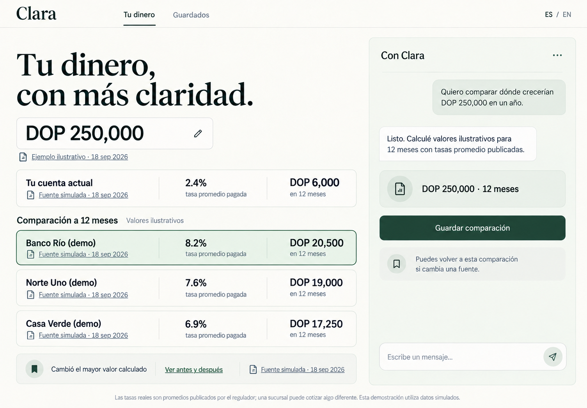

# Clara money view

## Product frame

Clara opens on the user's money view for the Dominican Republic pilot. The comparison is the primary surface, while conversation stays visible as an integrated right rail. The screen should feel like an editorial financial worksheet: calm, sourced, and easy to scan. It must never imply advice or present a synthetic institution as making an offer.

Target viewport: `1440 x 1000`. The concept image is `1505 x 1045`, generated at the same 1.44:1 desktop ratio, so it can be scaled directly as the implementation reference.

## Design tokens

| Token | Value | Use |
| --- | --- | --- |
| `--color-canvas` | `#FAF8F1` | Warm ivory app background |
| `--color-surface` | `#FFFEFA` | Inputs and open content surfaces |
| `--color-sage-50` | `#F3F6F0` | Chat rail and quiet notices |
| `--color-sage-100` | `#E8EFE6` | Selected comparison row |
| `--color-forest-900` | `#082F26` | Headlines, primary text, wordmark |
| `--color-forest-700` | `#205840` | Primary button and active rules |
| `--color-moss-300` | `#CBD7CA` | Dividers and input borders |
| `--color-ink-700` | `#25312E` | Body text |
| `--color-ink-500` | `#697772` | Captions, dates, secondary labels |
| `--color-clay-100` | `#F2ECE4` | Optional quiet acknowledgement state |
| `--radius-panel` | `14px` | Chat rail and grouped rows |
| `--radius-control` | `10px` | Inputs and buttons |
| `--border` | `1px solid #CBD7CA` | Structural outline |
| `--shadow-panel` | `0 8px 28px rgba(8,47,38,.04)` | Chat rail only |

Typography:

- Display: `Cormorant Garamond`, `Fraunces`, or a comparable high-contrast serif. Headline `64px / 0.98`, weight 500, letter spacing `-0.025em`.
- UI: `Inter`, `Suisse Intl`, or system sans. Body `16px / 1.45`; labels `14px / 1.35`; captions `13px / 1.35`.
- Money and rates use tabular numerals. Starting amount is `52px / 1`, weight 600. Row figures are `24px / 1.1`, weight 650.
- Wordmark is text set in the display serif at `38px / 1`; no separate symbol.

Spacing uses an 8px base. Preferred steps are `4, 8, 12, 16, 24, 32, 48, 64`. Keep a 40px outer gutter and 28px gaps between major regions.

## Desktop layout

The app shell has a 68px header with a fine bottom rule. Use a 12-column grid below it. The money area spans 7 columns, one column acts as breathing room, and the conversation rail spans 4 columns. The rail stays visually attached to the page through shared alignment and a pale sage surface rather than behaving like a floating widget.

Money column order:

1. Display headline.
2. Editable starting amount with its source line.
3. Explicit current-account baseline.
4. Three institution rows under `Comparación a 12 meses`.
5. One quiet saved-comparison notice.
6. Shared disclosure at the bottom of the viewport.

Comparison rows use a three-part grid: institution and source, annual rate and label, calculated gain and horizon. Fine vertical rules separate the fields. The highest calculated result may receive a pale sage fill and forest outline for scanability, but must not carry words such as `mejor`, `recomendado`, or `elige`.

The shown chat rail is the post-confirmation result state. It contains the thread, one compact confirmed summary, then the `Guardar comparación` action. Keep the composer visible at the bottom. Chat bubbles are modest and should not dominate the comparison.

At narrower desktop widths, reduce the headline to 52px before changing the grid. At tablet width, stack chat below the comparison while preserving the same content order. On mobile, keep the amount and baseline first, then rows, notice, chat, and disclosure.

## Visible copy

Header:

- `Clara`
- `Tu dinero`
- `Guardados`
- `ES / EN`

Money view:

- `Tu dinero, con más claridad.`
- `DOP 250,000`
- `Ejemplo ilustrativo · 18 sep 2026`
- `Tu cuenta actual`
- `2.4% tasa promedio pagada`
- `DOP 6,000 en 12 meses`
- `Fuente simulada · 18 sep 2026`
- `Comparación a 12 meses`
- `Valores ilustrativos`
- `Banco Río (demo)` / `8.2% tasa promedio pagada` / `DOP 20,500 en 12 meses`
- `Norte Uno (demo)` / `7.6% tasa promedio pagada` / `DOP 19,000 en 12 meses`
- `Casa Verde (demo)` / `6.9% tasa promedio pagada` / `DOP 17,250 en 12 meses`
- Every institution row has a clickable document-style link: `Fuente simulada · 18 sep 2026`

Saved notice:

- `Cambió el mayor valor calculado`
- `Ver antes y después`
- Clickable document-style link: `Fuente simulada · 18 sep 2026`

Conversation:

- `Con Clara`
- `Quiero comparar dónde crecerían DOP 250,000 en un año.`
- `Listo. Calculé valores ilustrativos para 12 meses con tasas promedio publicadas.`
- `DOP 250,000 · 12 meses`
- `Guardar comparación`
- `Puedes volver a esta comparación si cambia una fuente.`
- `Escribe un mensaje...`

Disclosure:

`Las tasas reales son promedios publicados por el regulador; una sucursal puede cotizar algo diferente. Esta demostración utiliza datos simulados.`

## Interaction notes

- `ES / EN` changes interface language without changing the saved comparison.
- Before this shown state, the user confirms the amount and horizon. The result state then reveals the sourced calculated rows and the `Guardar comparación` action.
- Saving preserves the amount, horizon, baseline, comparison rows, source, and publication date as one snapshot.
- A change notice opens the saved comparison in a before-and-after view. The notice names the changed calculated value and carries its dated source link, with no free-standing rate.
- Source and publication date stay attached to every financial figure in loading, saved, and changed states.
- Seeded demo data must always display `Valores ilustrativos`, the `(demo)` institution marker, and clickable `Fuente simulada · 18 sep 2026` links. No API keys or provider calls are required for this concept.

## Language constraints

Use factual comparison language. Do not use advice, ranking, promise, or recommendation language. Do not say that an institution `ofrece` or `paga` a rate. The exact rate label is `tasa promedio pagada`. Do not use em dash punctuation.

## Image generation record

The concept was produced and revised with the built-in image generation tool as a high-fidelity `ui-mockup`. The revision preserves the accepted complete 1440x1000 app layout while correcting the Dominican Republic currency, result-state flow, clickable dated sources, demo institution markers, illustrative figures, change notice, and language constraints in this document.
